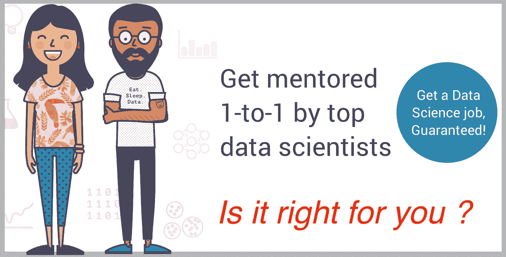
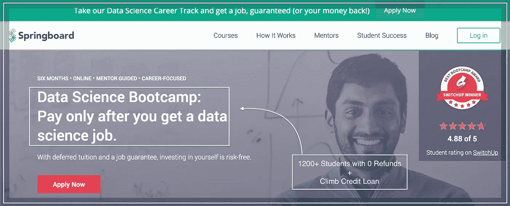

# 通过这个导师指导的训练营，保证你自己有一份数据科学的工作…

> 原文：<https://medium.datadriveninvestor.com/guarantee-yourself-a-data-science-job-with-this-mentor-led-bootcamp-cfc305e31724?source=collection_archive---------24----------------------->

[Data Science with Mentor-Led BootCamp](https://sinxloud.com/mentor-led-data-science-bootcamp-job-guarantee/)

数据科学家的职业道路正在上升，跳板的数据科学职业轨道将帮助您了解在数据科学领域开始新的职业生涯所需的一切。

# [数据科学职业发展轨迹和](https://sinxloud.com/fly/data-science-bootcamp-springboard/)工作保障

通过 Springboard 的导师指导的在线训练营，你可以得到一份工作或退款。

有了工作保证，如果你在毕业后的六个月内没有找到工作，你的学费将被**退还**。

**跳板的**数据科学职业轨迹**接受新工作的毕业生**报告平均年薪增长**23000 美元**。

通过延期学费计划，学生可以缴纳少量的押金，在开始工作后完成支付。

## 适合你吗？

数据科学职业跟踪是为在统计和编程方面有一些经验的人设计的。

对于软件开发人员、分析师和金融专业人士来说，这是一个完美的数据科学职业发展方向。

然而，所有专业和学术背景都是受欢迎的。

在中途，你可以选择与你的职业目标一致的专业:高级机器学习、自然语言处理或深度学习。

在整个项目和你的**求职**过程中，你会得到你的一对一导师(**一位工作数据科学家**)以及跳板职业服务团队的支持。

## 你首先会学到什么？

*   Python 数据科学概述[堆栈使用 API、](https://sourceforge.net/projects/stackcollect/) [Pandas](https://pandas.pydata.org/) 、 [SQL](https://en.wikipedia.org/wiki/SQL) 和 [NoSQL](https://en.wikipedia.org/wiki/NoSQL) 收集并转换数据
*   使用机器学习进行预测
*   使用 [Spark](https://spark.apache.org/) 和大型数据集来扩展您的分析
*   通过有效的数据讲述创造真实的业务影响
*   通过你的 GitHub 作品集向未来的雇主展示你的作品

# 转到[课程](https://sinxloud.com/fly/data-science-bootcamp-springboard/)

## 在你走之前

我们希望你能学到所有重要的技能，并获得你想要的工作所需的个性化指导。

您可能也有兴趣阅读[每个数据科学家必备的 5 项 Python 技能](https://sinxloud.com/skills-in-python-for-data-scientist/)，或者可以考虑从[最好的(也是负担得起的……)数据科学课程](https://sinxloud.com/best-data-science-courses-specialization-certificate/)开始学习并提升您的技能。

如果你喜欢这篇文章，请与你的朋友分享，并注册我们的时事通讯，每两周更新一次类似的内容。

***祝你事业有成！***

*原载于 2018 年 12 月 30 日*[*sinxloud.com*](https://sinxloud.com/mentor-led-data-science-bootcamp-job-guarantee/)*。*