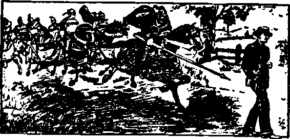

# 警惕这些…

> 原文：<https://medium.datadriveninvestor.com/guard-against-these-13010919f0ef?source=collection_archive---------42----------------------->

你最大的敌人，走进你自己的头脑。如果你能从外部看到自己，你就会看到隐藏在你个性中的敌人。然后你就有能力消除那些阻碍你朝着你渴望的生活前进的因素。

这些是阻碍我们成功的最常见的感觉。该列表由以下部分组成:

不宽容，报复，贪婪，自私，怀疑，嫉妒，拖延。这些似乎阻碍了我们许多人实现梦想的道路。

不宽容是不能倾听他人的意见、想法、信仰或看待事物的方式，也不能尊重他们的不同之处。。

报复，是试图报复感知或真实的不满。这剥夺了我们的精力，转移了我们的注意力。

贪婪，想不劳而获。我想要更多，因为我是最棒的。我怎么才能打败这个混蛋？萦绕在贪婪的头脑中的问题。这导致了贪婪。非常丑的二人组。

自负。相信你是饼干罐里的最后一块饼干。或者沙漠中最后一杯可口可乐。只有我和我。试试这个，人们会开始回避你的无能。

怀疑，意味着认为每个人都在试图得到你。在另一个人做的任何事情中看到不可告人的动机。一个偏执狂，你的真实目的是什么。不要这样揣摩人。你晚上会睡不着的。

嫉妒。愤怒是因为你觉得有人在偷属于你的东西。嫉妒的攻击方式很多，但总是让你没有安全感。或者我应该说源于我们的不安全感。也是想要别人拥有的东西。人各有志。放轻松，该你的就是你的。对别人拥有的东西发狂是没有意义的。或者认为别人会偷你的东西。

拖延症。终极杀手。把一切都留到最后一刻。直到玛娜娜。明天可能会更好。你猜怎么着，不是的。现在是时候了！做你现在必须做的，然后把它做完。不要等到更好的时机。它永远不会到来。

所以现在你知道了。当心这些敌人控制你的思想。你已经被预先警告过了。