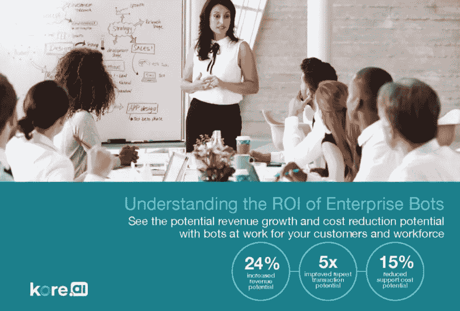

# 构建企业聊天机器人策略指南

> 原文：<https://medium.datadriveninvestor.com/guide-to-building-your-enterprise-chatbot-strategy-1eabf8ab043c?source=collection_archive---------1----------------------->

合适的聊天机器人策略有助于确定投资和预期收益，统一整个企业的方法，并获得利益相关者的支持。

智能虚拟助手或聊天机器人已经出现，并成为各地企业的现实。通过提供更好的客户参与的闭环方法，机器人为希望在竞争中领先的企业提供了新的优势，以获得新的、重复的和推荐的业务，甚至减少这样做的运营支出。机器人将您的客户习惯的传统、令人沮丧的数字体验转变为对话式、个性化和即时令人满意的互动，从而实现更智能、更高价值的购买和服务互动。人工智能(AI)驱动的企业聊天机器人解决方案是未来！

聊天机器人已经存在了一段时间，但是组织现在已经开始从商业的角度来适应聊天机器人技术。将聊天机器人用于商业的原因很简单，因为越来越多的人越来越多地使用聊天服务，而不是任何通信媒介。

**利用人工智能机器人的力量**

客户体验焦虑对业务有可衡量的影响，而且不是正面的影响。87%的客户表示他们的客户服务体验会影响他们与供应商做生意的决定。82%的人可能会因为糟糕的服务体验而停止在某家公司的消费。

通过结合使用[自然语言处理](https://kore.ai/bots-platform/natural-language-processing/) (NLP)、机器学习和人工智能，机器人已经准备好改变数字客户体验。客户不再需要决定哪种介质最符合他们的要求。

**也读:** [**什么是企业聊天机器人平台？提升聊天机器人策略和能力的指南和清单**](https://blog.kore.ai/enterprise-chatbot-platform-checklist)

**为企业创建聊天机器人策略**

如果你是首席信息官(CIO)、创新负责人或负责组织的技术路线图，并且了解人工智能和聊天机器人在 ITSM、销售、银行、金融、ERP、零售、人力资源和客户服务等领域带来的巨大生产力提升。拥有一个合适的聊天机器人策略有助于确定投资和预测收益，统一整个企业的方法，并获得利益相关者的支持。

Kore.ai 的发现表明，企业聊天机器人平台的好处远远超出了获取技术的简单成本，还包括如何构建、实施和随着时间的推移修改平台。为了了解企业聊天机器人部署的真实成本和回报，购买者必须仔细评估获取和维护该技术的短期和长期成本。

访问完整的 CIO 工具包，获取有价值的资源，帮助您定义、开发和执行聊天机器人战略，并为任何行业或企业功能带来可量化的结果。该套件提供实用的、以经验为导向的资源，帮助高管和企业技术团队规划、定义和执行对话式计算策略，这对您的客户、员工和企业来说是一个双赢的局面。 [**获取 CIO 工具包**](https://info.kore.ai/cio-toolkit?hsCtaTracking=65cb5591-f3b9-4568-8613-8334d4813dd4%7C7c97973d-9d5f-4fe9-872f-510f47463b97)

*原载于*[*blog . Kore . ai*](https://blog.kore.ai/guide-to-build-your-first-enterprise-chatbot-strategy)*。*