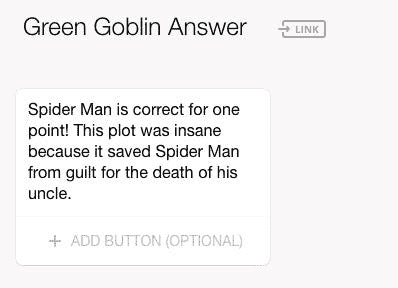
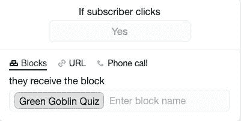
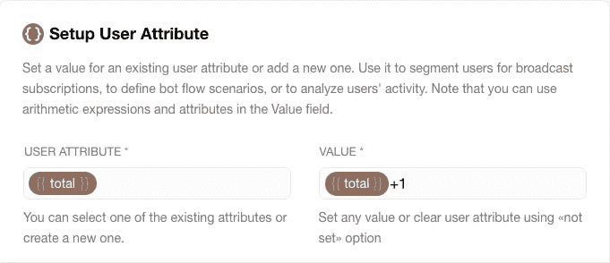
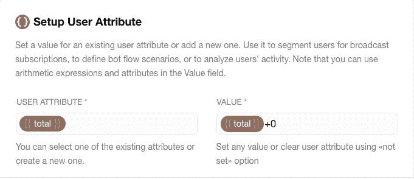
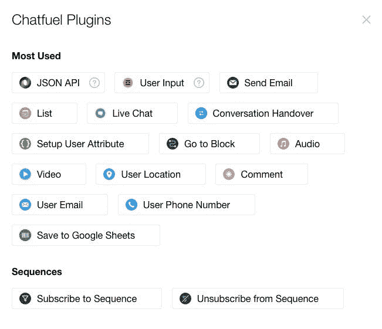
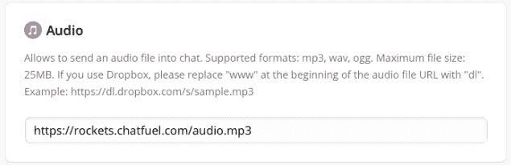
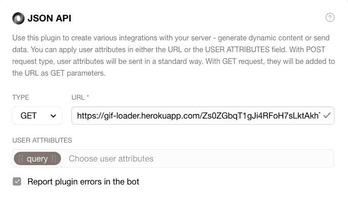

# 10 分钟内编写完整栈聊天机器人的指南

> 原文：<https://medium.datadriveninvestor.com/guide-to-coding-a-full-stack-chatbot-in-10-minutes-7b0008197f1a?source=collection_archive---------3----------------------->

X-Men Magneto

演说家拿破仑·希尔曾经说过:***如果你做不了大事，就用伟大的方式去做小事***

**比如这个聊天机器人大[超级反派](https://chatfuel.com/bot/SuperVillainQuiz)的小测验。你那犯罪般疯狂的头脑能战胜这些漫画中恶棍的疯狂吗？**

**Chatfuel 为您的开发提供模板。然而，这个演示将不包括任何模板，因为可用的机器人不符合我的规格。我对这个项目的描述是，**

*   **正确和错误的答案必须辅以适合游戏节目的音效(铃声)。**
*   **必须对用户回复进行评分。正确答案各得一分，错误答案得零分。**
*   **必须根据分数计算 GIF 显示的最终分数。**
*   **游戏必须支持 GIF 输出。**

**⚠️:chat fuel 中的数学函数有问题。为了获得最佳结果，您应该利用数学函数复制块，而不是将函数插入到现有的块中。**

**我们现在可以开始了。**

**登录 [Chatfuel](https://chatfuel.com/) 并创建一个账户。如果您有脸书帐户，您可以使用该帐户登录。**

**选择从模板创建。然后点击➕创建一个空白机器人。**

**现在，您可以为机器人编写欢迎消息了。这也是为应用程序编写任何数学函数脚本的理想时机，因为变量需要根据您的应用程序进行初始化或设置为零。由于这个机器人是一个测验，只接受二进制答案，我已经删除了默认的答案块。该块通常用于用户的文本输入。**

****

**Chatfuel - Setup User Attributes**

****用块管理对话框****

**您的下一个任务是为序列创建一个块。为了达到最佳实践，我会提前在电子表格中写下序列，以正确跟踪所有的[问题](https://docs.google.com/spreadsheets/d/1PQaE_CcegE84n8Bx3oec9meArRJ4feas3YSURCcdhZ4/edit?usp=sharing)和[答案](https://docs.google.com/spreadsheets/d/1_4KsTpd9qauxGeogNy0GAr7T8FKG-atTobx0oga1dk4/edit?usp=sharing)。创建块后，可以自由地将文本复制并粘贴到块中。块下面是一个➕按钮，用于向块中添加响应键。此功能是可选的。Chatfuel 能够进行自然语言处理(NLP)。然而，即使是最好的机器人，这一功能有时仍会出现故障。由于这是一个有明确答案的问答机器人，我会添加一些精选的回答。**

****

**Chatfuel - Block**

**你现在可以点击➕按钮来创建一个新的区块。在本例中，下一个模块是答案模块。不要忘记确定新的模块，我们在这里为错误答案创建一个模块。**

****

**Chatfuel - Block Button**

**现在，您可以返回到最初的测验模块，并如上所示链接这些模块。**

**然而，这个聊天机器人仍然是基本的，我承诺了一个完整的堆栈。别担心。让我们回到答案区。点击块中的➕按钮，并选择设置用户属性。以前，该变量被设置为(总计=0)。您的下一个任务是创建一个规则。**

****

**Chatfuel - Setup User Attribute**

**使用该规则，每次执行单元时，变量 **total** 增加 1。您还可以对变量进行减法、乘法和除法运算。该系统还支持创建简单的方程式，就像您可能在 Excel 中使用的那样。您可以为您的 bot 创建多个设置用户属性和堆栈功能。完成后，您接下来可以转到错误答案块并输入静态规则。**

****

**Chatfuel - Setup User Attribute**

**Chatfuel 支持添加多个属性。在同一个工具栏中，您还可以插入图像，甚至完整的图库。工具栏上➕的后面是另一组插件。**

****

**Chatfuel Plugins**

**JSON API 是一个简单的 webhook 应用程序，允许您从服务器的 URL 获取或发布属性。我打算在本指南的末尾进一步研究这个特性。**

**用户输入插件允许你给用户输入分配变量。**

**使用 LIST，您可以轻松地向潜在客户发送菜单和目录。**

**通过用户定位，您可以使用 Facebook Messenger 自动定位客户。**

**用户电子邮件和用户电话号码提示客户输入联系信息。这可以在 Messenger 中自动完成，也可以手动完成。**

**保存到 GOOGLE SHEETS 是一个非常重要的功能，因为 Chatfuel 不支持永久收集客户信息。使用工作表，您可以将客户信息分配给属性，然后将数据推送到 Google。这是任何营销机器人的一个关键特征。**

****音频插件****

**尽管如此，这是一个游戏机器人，智力竞赛需要音效。之前我从 Orange Free Sounds 中选择了两个铃声。在 Chatfuel 中，所有声音都需要存储在云中。你可以选择集成 DropBox、谷歌、iCloud 等。通过实验，我发现使用 iCloud 可以很容易地将. MP3 名称添加到文件中。然后，你只需要在 iCloud 中与任何人分享文件，并将其连接到音频插件。**

****

**Chatfuel Audio**

**安装完所有属性后，项目的数学计算就完成了。您可以通过复制模块并自定义其内容来轻松扩展测验。**

****用 JSON API 应用 GIFs】****

**但是没有一个酷的结局的游戏是不完整的。就我个人而言，我是 gif 的粉丝。您可以通过创建另一个块并使用工具栏中的发送块功能来轻松创建此详细信息。然后为 GIF 特性创建两个或更多的块，稍后会详细介绍。每个发送块内部都有一个订阅功能；创建订阅并编写总计规则。**

**然后使用这段代码插入 gif。**

****

**Chatfuel JSON API plugin**

**用户属性查询在单独的插件用户属性中设置。我使用了疯狂和恶棍，但是您也可以从用户输入中定义属性。**

****质量保证****

**在 bot 开发过程中的任何时候，您都可以单击 Messenger 图标来启动 bot 进行测试。还建议您在部署之前，在您的个人脸书页面和网站上验证聊天机器人的性能。根据我的经验，Chatfuel 的开发仪表板非常可靠，但他们的云功能可能不稳定。您应该真正测试它的特性，并决定它是否适合您的组织。**

**你能建造什么？**