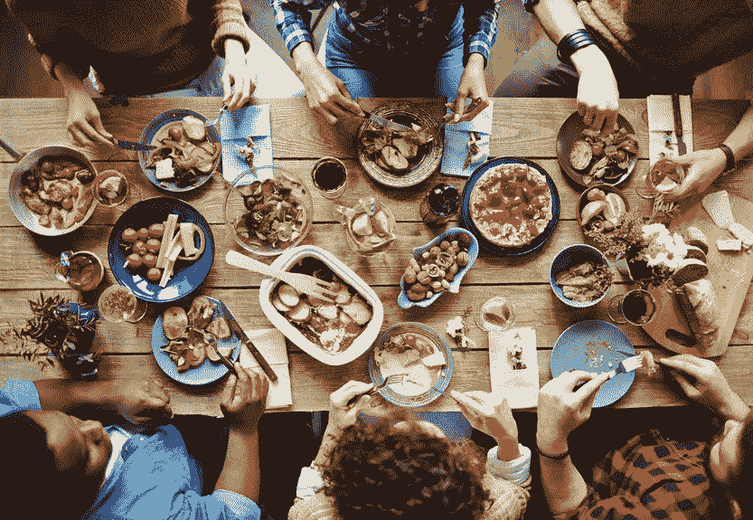
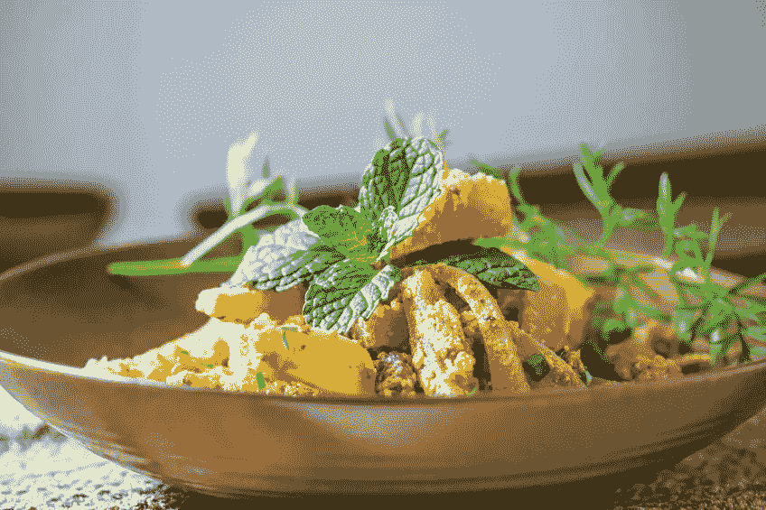

# 引导你的餐厅走向甜蜜的成功

> 原文：<https://medium.datadriveninvestor.com/guiding-your-restaurant-into-sweet-success-4d2b10801205?source=collection_archive---------30----------------------->

在一个混乱的行业中，今天的餐馆经营者必须如何适应才能成功？

Your guest experience should always start with courteous service and great food.

> "事物越是变化，就越是保持不变。"

不难想象，当服务员惊慌失措地匆匆走过时，吉田(创造了上述短语)正懒洋洋地躺在一家现代咖啡馆里。随着科技和现代便利设施重新定义了我们就餐的地点和方式，餐饮业一直处于不断变化的状态。*然而，事情越是变化…*

最近，我一直在研究亚马逊重新定义当今购物实践的方式。尽管互联网巨头[的觉醒](https://medium.com/@madison_17100/https-medium-com-madison-17100-amazon-big-friendly-giant-9a145df4769a)留下了剧变，我们看到小型专业书店以惊人的活力再次涌现，*他们正在成功*！商业景观有一种迷人的方式来揭示对消费者来说什么是最重要的；这些经典的实体店只是有趣的例子。

这和餐饮业到底有什么关系？当餐馆老板疯狂采用最新的移动应用和社交媒体营销实践时，**他们往往忽略了决定每个食品中心成功(或失败)的重要因素。这些食材是让顾客回到我们快节奏的快餐世界的原因。然而，只要有一点点聪明才智，餐馆老板可以利用现代工具来支持他们的业务，同时追求最重要的东西。**

People respond to visual stimuli. Take those beautiful dishes and start a simple Instagram account!

# 一切都从食物开始

虽然你的企业起源是张贴在餐馆墙上的一个伟大的故事，但这并不是人们来你餐馆的原因。当你看到一个人被一盘波托菲诺海鲜感动得流泪，你会记得食物是一切的开始。没有任何聪明的标语或慷慨的 Groupon 可以取代这一点。

**美食为你生意的其他重要方面让路。得克萨斯州北部一家名为 *West Side Cafe* 的小餐馆没有手机应用程序或网站(尽管他们现在有一个小小的脸书页面)。然而，他们美味的煎饼和出色的炸鸡牛排确保他们总是挤得满满的。扎加特和猫途鹰对这家咖啡馆的评价一直很高。大多数商家的在线简介都是由热爱它的粉丝们创建的。**

假设你已经精心制作了一份美味的菜单。接下来你能做什么？

展示你美味的食物！ *拍照并发布在公司脸书页面和 Instagram 账户上。*人们会对视觉刺激做出反应，尤其是在饥饿的时候。如果他们只看到你的企业的名字和地址，他们更有可能选择他们已经熟悉的地方。给他们的胃养眼，他们需要做出改变！ ***看看这些*** [***Instagram 美食冠军***](https://www.foodandwine.com/news/best-food-instagram-accounts) ***来点有味道的图片创意吧。***

如果你想支持一个新的菜单条目，拍些照片并上传吧！然后拿出你最好的作品制作餐桌装饰。你甚至可以制作一份简单的外卖菜单，上面有大众喜爱的图片，鼓励人们把它们带回家。这只是让顾客更容易接触到你的业务的一部分，这引出了另一个重要的问题…

How can you make your food more accessible to your customers?

# 让您的业务更易访问

不，我们不是在谈论停车或入口坡道(尽管这些都很重要)。你的企业是否对那些疲于奔命的潜在客户开放？你有适合忙碌的工作人员的简化的外卖菜单吗？如果是这样，你需要确保 [*你的网站*](https://www.addpositions.com/industries/restaurant-marketing/) 反映了这一点！

即使没有网站的餐馆也可以让自己更容易上网。你可以利用 Google My Business 来扩展你的网上简介，让你的餐馆在搜索结果和当地地图上更显眼。如果你的生意刚刚起步，通过对猫途鹰和脸书的评论，争取你最好的客户来宣传你！这些平台是衡量你的企业与客户共鸣程度的绝佳工具。

Your guest experience is one of the most important factors in determining whether guests return.

# 精心打造、重新审视和完善您的顾客体验

美食是一种方式，杰出的氛围也是一种方式。想到你最喜欢的静坐餐厅(不是你自己的)。在环境中呼吸，注意那些让你最放松的事情。然后检查最让你兴奋的气氛方面，无论是你友好的服务员的熟悉面孔，还是你最喜欢的菜令人垂涎的味道。**现在是时候开始打造自己的游客体验了！**

愉快的服务团队是您诱人的顾客体验的基础。维持一个训练有素、彬彬有礼的服务器团队可能是最大的挑战，但是鼓励和奖励你最好的服务器将会给你的企业带来巨大的回报。你真的想卖你的时令菜吗？和你的服务员坐下来，让他们尝尝你的新菜。**没有什么比一个有亲身经历的热情服务员更能让一道菜变得诱人了。**

说到新的菜单项目，用季节性的(*或者甚至每月一次的*)花样来增加菜单的味道是鼓励你的老顾客继续回头客的好方法。

*它也是你的网站和社交媒体档案的完美燃料！*

需要帮助制作一份漂亮的菜单吗？Foodable Network 提供了一些不可思议的小技巧，帮助你设计菜单，还有一些实用的风格指南，方便浏览。**你不需要每年春夏秋冬都彻底改造菜单。**偶尔推出限时优惠，保持新鲜感。一家提供早餐和早午餐的餐馆是第一观察，这是一家位于德克萨斯州的日间咖啡馆。每个季节都有一些美味的主菜和丰富多彩的新饮料可供选择。

## 一点精神食粮

一如既往，餐饮业的成功依赖于*优质的食物、顾客的接触和诱人的顾客体验*。成功的餐厅从这些核心支柱开始，并在此基础上建立在线档案。所以拍照吧！展示那些美味的菜肴！**向每个人展示是什么让你的餐厅如此与众不同，并提供让他们欲罢不能的非凡用餐体验。*玩得开心！***