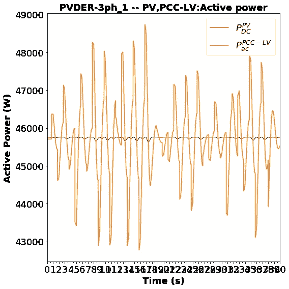
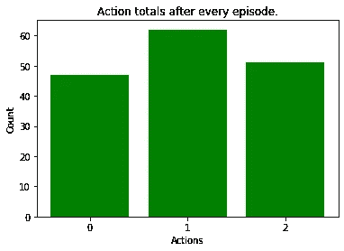
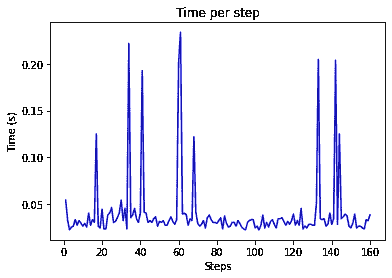
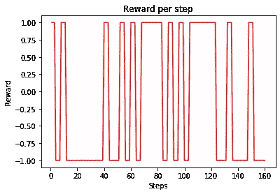

# Gym-DER:训练 RL 智能体执行太阳能光伏分布式能源监控的环境

> 原文：<https://medium.datadriveninvestor.com/gym-der-an-environment-for-training-rl-agents-to-perform-supervisory-control-of-solar-pv-a3569d297ff3?source=collection_archive---------7----------------------->

[](http://www.track.datadriveninvestor.com/1B9E)

有数百种环境可用于训练强化学习代理(RL)。然而，它们中只有有限数量的模拟物理系统。据我所知, [pypownet](https://github.com/MarvinLer/pypownet) 是唯一可以用来训练 RL 代理解决电力系统问题的环境

因此，我怀着激动的心情介绍 Gym-DER，这是一个模拟太阳能光伏分布式能源连接到硬电压源的环境。它可以作为 Python 包安装，并且基于 OpenAI Gym API。可以在[这里](https://github.com/sibyjackgrove/gym-SolarPVDER-environment)找到资源库以及安装说明。注意，Gym-DER 有[太阳能光伏发电模拟实用程序](https://github.com/sibyjackgrove/SolarPV-DER-simulation-utility) y(一个用于模拟并网光伏发电动态的开源 Python 包)作为依赖项。

[](https://www.datadriveninvestor.com/2019/03/03/editors-pick-5-machine-learning-books/) [## DDI 编辑推荐:5 本让你从新手变成专家的机器学习书籍|数据驱动…

### 机器学习行业的蓬勃发展重新引起了人们对人工智能的兴趣

www.datadriveninvestor.com](https://www.datadriveninvestor.com/2019/03/03/editors-pick-5-machine-learning-books/) 

## 环境基础

**模拟时间步骤:** 在引擎盖下，gym-DER 运行动态模拟，即在每个环境步骤中求解 ODE 系统。每个步骤对应于用户可指定数量的模拟时间步骤。默认值为:

每个环境步骤的模拟时间:(1/60)*5 s

**观察值:** DER 动态模拟由 23 个状态(三相 DER)和几个其他导出量组成。目前，从环境中返回的观测值中有 11 个。

**动作:** 当前，环境有 3 个动作:

0:减少 Q 参考或 Vdc 参考
1:增加 Q 参考或 Vdc 参考
2:什么都不做

q 参考值是给 DER 无功功率控制器的设定值。
Vdc 参考值是给德 dc 链路电压控制器的设定值。

## 快速入门

Gym-DER 包含所有 Gym 环境共有的所有属性和方法。要创建一个 gym-DER 环境实例，导入 **gym_PVDER** 包并使用 **gym.make()** 。

```
import gym
import gym_PVDERenv = gym.make(‘PVDER-v0’)
```

方法 **env.show_env_config()** 将打印关于环境的基本信息，如下所示。

```
Environment name:GymDER_1
Goal type: voltage_regulation
Reward type:[‘voltage_error’],Discrete:True
Action type: [‘Q_control’]
time step:0.2500,del Qref:375.00,del Vdcref:0.30
Voltage events:True,Insolation events:False
```

像大多数其他健身房环境一样，gym-DER 环境实例在使用之前需要重置。

```
observation = env.reset()
```

我们可以从环境的动作空间中随机抽取一个样本，并将其传递给 **step()** 方法，该方法将像其他健身房环境一样返回观察(状态)、奖励和完成标志。

```
action = env.action_space.sample() #Sample actions 
observation, reward, done, _ = env.step(action)
```

## 播放完整的一集

要运行完整的一集，我们可以将 **step()** 方法放在 **While** 循环中，并检查 **done** 标志。

```
observation = self.env.reset()
done = False
while not done:
    action = self.agent_action(observation)
    print(‘Step:{},Action:{}’.format(self.env.steps,action))
    observation, reward, done, _ = self.env.step(action)
    self.env.render(mode=’vector’)
```

**env . render(mode = ' vector ')**将打印环境状态的快照，如下所示。

```
ma:0.89+0.03j, ia:124.24+3.59j, Vdc:550.00, vta:245.28+8.25j, va:245.06+7.08j, Ppv:45754.90, S_inverter:45754.91+218.64j, S_PCC:45708.56+0.23j, Q_ref:0.00, Vdc_ref:550.00, tStart:0.25, 
Reward:1.00000
Time for step:0.054
```

也可以使用**env . render(mode = ' human ')**将电量可视化为环境持续时间的曲线图。



**Plot showing the effect of agent actions on DER power output.**

此外，我们还可以分别使用 **show_action_stats()、show_time_stats()、show_reward_stats()** 可视化关于动作、每步所用时间和奖励的信息。



**Distribution of actions for an episode**



**Solution time per step for an episode.**



**Reward per step for an episode**

## 后续步骤

在下一篇文章中，我将描述如何使用 gym-DER 训练一个简单的 Q 学习代理。
目前，该软件包处于测试阶段。我希望在接下来的几个月里继续开发它。欢迎评论和功能请求。我的希望是将这个环境开发成一个工具，加速 RL 算法在电力系统中解决操作和控制问题的应用。