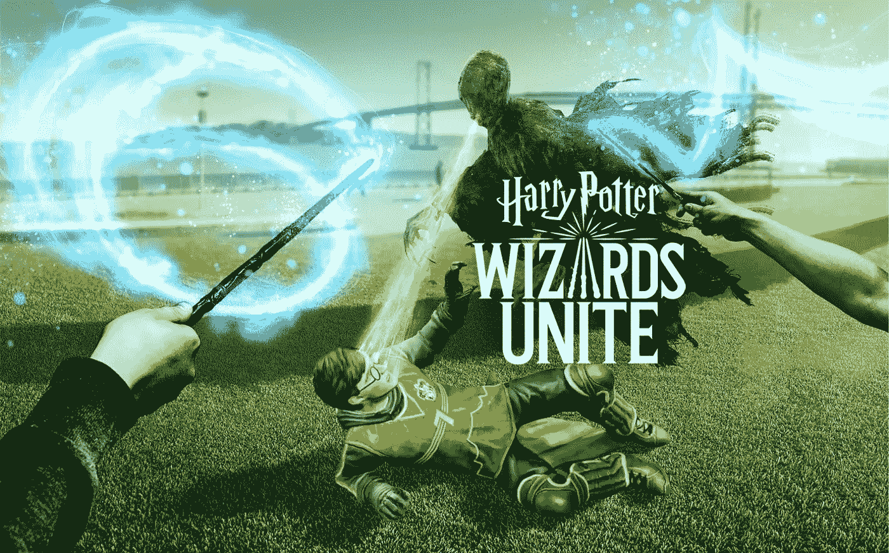
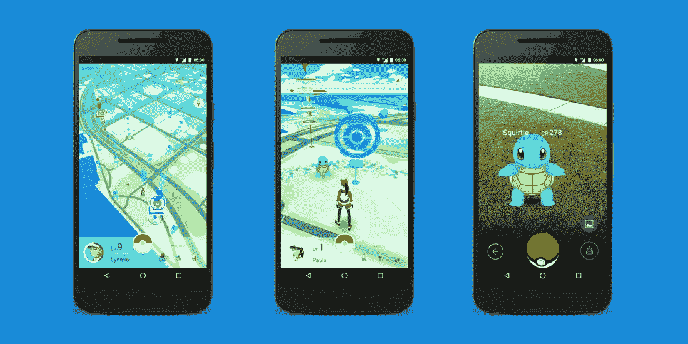

# 黑客哈利·波特:巫师联合起来

> 原文：<https://medium.datadriveninvestor.com/hacking-harry-potter-wizards-unite-c8878b1790fb?source=collection_archive---------5----------------------->

最后，《哈利·波特:巫师联盟》在这里，许多绿色巫师正在各种地方寻找“混淆物”和其他类似的东西。惠普是现实世界和游戏世界在一种被称为增强现实游戏的类型中的碰撞。在这些游戏中，玩家需要亲自去各个地方，游戏通过使用设备的 GPS 来验证这一点。正如你所料，使用 GPS 欺骗器作弊应该很容易。一个欺骗器只是一个运行在你手机上的程序，它注入你所说的你所在的 GPS 坐标。这里有一个例子，我用 GPS 欺骗器欺骗惠普游戏，让它以为我在旧金山的一个公园里。

Harry Potter: Wizards Unite

如果你玩过惠普，你可能已经发现游戏中没有任何物体，尤其是在像旧金山这样人口密集的地区。原因。好吧，Niantic 已经开发了一些方法，至少可以在一个真正工作的非根电话上发现欺骗。我的理解是，Niantic 在检测到有根设备时也会屏蔽游戏内容。那么，这对那些试图通过欺骗达到顶峰的穷人来说意味着什么呢？或许我们应该从头开始。

Pokenon Go, Circa 2016

# 开始的时候，差不多吧

2016 年 5 月/6 月，Niantic Labs 发布了 Pokemon Go，全世界都被它第一次体验增强现实游戏的味道迷住了。这款游戏一夜之间红极一时，Niantic 没有为玩家的大规模冲击做好准备，经常努力保持服务器在线。通过所有这些混乱，饥饿的企业家聚集起来，从那些渴望在游戏中达到更高水平的人身上赚快钱。

 [## 人工智能和虚拟现实的融合-你能期待什么|数据驱动的投资者

### 在技术领域，融合是合乎逻辑的一步。就在几十年前，你可能需要一个专门的…

www.datadriveninvestor.com](https://www.datadriveninvestor.com/2018/08/30/the-convergence-of-ai-rv-what-you-can-expect/) 

虽然大部分被雇佣来作弊的白人是无辜的，就像走鸡蛋或口袋妖怪驾驶一样，但还有更深更黑暗的一面。一方想要制造农具。帐户耕作是一种实践，通过这种实践，你可以让计算机为你演奏。早在 2016 年，许多开发人员/黑客就想通过开发这些工具来获利。

# 账户农业

事实证明，在 Niantic 风格的游戏中欺骗 GPS 的唯一成功方法是使用虚拟操作系统。想象一个在你的电脑上运行并完全受你控制的 Android 操作系统。这允许你对 Android 操作系统进行根操作，但不是真正的根操作。以这种方式愚弄操作系统可以让你虚拟地玩游戏，并准确地告诉它你想去哪里。2016 年的黑客已经建立了如此复杂的工具，不仅欺骗了 GPS，还实际上为你玩了游戏，包括访问地点和捕捉口袋妖怪。现在，我之所以知道这么多是因为我是那些试图入侵和获得等级的混蛋之一。当然，我就是我，我把它发挥到了极致，实际上有 10 个帐户同时运行。我英勇的努力得到了什么？我的账户被封了，很明显，你不能就这样出现在威尼斯海滩，还有一个写书的机会。

Packt Publishing, 2016

# 面向游戏开发者的增强现实

我破解 Pokemon Go 的经历也让我了解到用 Unity 来构建这样一个游戏是多么容易。因此，我写了一本书，讲述如何打造你自己版本的围棋游戏 Foody Go。首先，这不是那本书的广告。事实上恰恰相反。那本书现在已经很过时了，虽然代码适用于 Unity 5，但现在已经很过时了。虽然我仍然相信这本书对那些想开发这类游戏的人来说有很好的内容，但它可能不适合新手。那本书也已经出版几年了，可能会有二手或免费的版本。

# 黑客入侵

如果你真的想尝试破解 HP 或其他游戏，你最好的选择是从 GitHub 开始。据我所知，这个中心已经在为波特游戏托管农具了。我一度考虑过教授一门如何运行这些工具的课程，但最终，在我的账户被封禁后，我意识到我的做法是愚蠢的。

Harry Potter: Wizards Unite

# 结果

最后因为账号活动可疑被封禁了 Pokemon Go。你看，这又回到了我另一个最喜欢的活动数据科学。Niantic 现在使用广泛的数据科学工具来发现可疑的账户活动。这和你的信用卡提供商做欺诈保护没什么区别。因此，即使你成功地欺骗了一段时间，在我的情况下，几天后我就升到了 29 级，你总是冒着被发现可疑账户活动的风险。如果你的唯一目的是在你感兴趣的游戏中获得更高的等级，这些都是很高的赌注。底线是，如果你真的喜欢玩这些游戏，那么就公平地玩它们，享受它们，就像它们本来应该的那样。