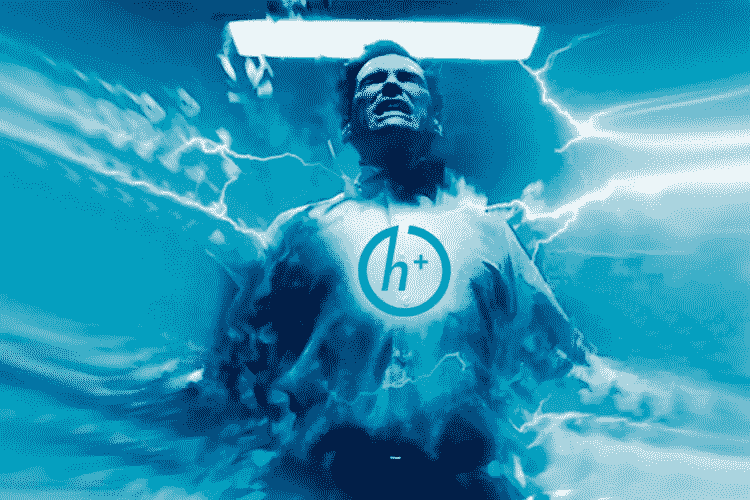

# 黑客人类 101:超人类主义的利弊

> 原文：<https://medium.datadriveninvestor.com/hacking-human-101-pros-and-cons-of-transhumanism-193224ad546?source=collection_archive---------3----------------------->

在我的[上一篇文章](https://bitnewstoday.com/news/artificial-intelligence-to-eliminate-the-doctors-as-class/)中，我提出了一个关于医疗和保健行业人工智能实施的压倒性趋势的问题，关于医生和其他医务人员可能产生的全球影响。另一个在故事中被略微提及的话题，也绝对是同样重要的，就是超人类主义运动。这个概念的重要性，它将改变人类的方式，以及它在不久的将来将要面临的伦理、道德和法律障碍。我想到一个主意，这些问题需要仔细研究。

**当前对超人类主义的立场是什么**

总的来说，超人类主义是关于人类通过与技术相结合而变得更好的方式。然而，这是一个非常紧张的话题。这是一场学术斗争:超人类主义者认为人类进化应该包括采用技术，但另一方面，也有人认为这永远不应该发生。我是民主超人类主义运动的一员，但还有更激进的超人类主义者，他们认为我们今天就应该这样做，我们应该做实验。那么，冲突到底在哪里？

今天最大的问题是同意——允许某人升级身体的方式和机会，就像人们被允许纹身、穿孔等一样。当你谈论人体内的数据接收设备时，目前的障碍是没有人知道如何整合人工智能、数据收集和区块链。而且，在我看来，我们离真正的移植和类似的超人类机制变得规范还有很长很长的路要走。如果数据应该锁定在植入人体的人身上，立法者目前的担忧就和克隆人一样。试着回答一些简单的问题。谁拥有知识产权？谁拥有这些数据？这就像现在 GAFA 的情况一样——没有人对脸书和谷歌说*“你持有人们的数据，这些数据属于人们，不应该属于一个公司。”与此同时，活动人士表示，如果他们能够找到一种方法，让这些数据的实际价值属于一个有植入物的人，那将是超人类主义运动向前迈出的一大步。*

为了更好的未来，理性的方法

在 20 世纪 50 年代，该领域的两位著名学者 J.B.S .霍尔丹和 T2 提出了一个论点，即人们必须允许采用这些技术的自然进程。但从那以后，这句话根本没有成为指导方针。在主题超人类主义网站上，有一些例子，狂热分子觉得在合法和非法之间可能有一座桥梁，这个运动被称为生物黑客。然而，如果你在美国说“生物黑客”这个词，又是“没门”。现在它更多的是在一个“生物朋克”的水平上——由那些不是医疗从业者的人在不受监管的环境下自己在“他们的卧室”做一些事情。在公共部门层面上，没有什么是合法的——这是立法者目前的论点。这个领域是灰色的，仅仅基于纯粹的热情。超人类学家说，如果你干预人体，生物保守主义者认为不应该干扰人体:*“好吧，听着。这是未来，如果我们能让人们更健康。”*

这里有一个合理的观点。让我们以糖尿病治疗为例。在西方，糖尿病是一个大问题，特别是当人们从低热量饮食转向其他饮食时——比如来自非洲、南亚等地，糖尿病的发病率会非常高。他们必须不断监测他们的血液，目前 99.9 %的治疗是刺破手指取血，用袖珍仪器分析，以便采取行动并注射胰岛素。Fitbits 和类似的设备有一个接触皮肤顶部的传感器，它只能获得信息，如心率、出汗程度等。它没有给出足够详细的信息。但是可以有皮下植入物，这是一个放置在皮肤下的 LED 电路板，有持续的血流在下面流动，它可以不断地监测——开始寻找化学成分、血液成分等。所获得的数据可以被实时提供给人的家、亲戚、当地医院。因此，如果有人高血糖症发作，警报会在大约 4-5 个系统中响起。目前，它还没有在大规模的高容量场景中使用，它还处于早期测试阶段。

从普通的糖尿病控制和治疗工具到最先进的人体器官人造替代品:角膜、胰腺、肺、心脏，技术工具的可用性正在急剧增加。意大利政府区块链协会(Government block chain Association Italy)和 TEDxSpeaker 的主席 Mirko De Maldè 表示，越来越多的健康应用程序和可穿戴设备可以更好地跟踪我们的健康状况，减轻主要风险，进行早期诊断，并在出现问题时立即进行干预。*“健康应用程序能够监测心脏功能，让患者了解何时出现房颤，从而在为时已晚之前寻求帮助。基于人工智能的决策支持系统为临床医生提供了难以置信的洞察力，更好地了解了单个患者以及最合适和有效的治疗方案，能够完全了解最新的发现和出版物，并能够了解完整的患者病史。”*

**乔安妮·普兰斯基**是世界上第一位机器人精神病学家，也是来自三藩市的机器人产业顾问，她在 1986 年开始了她的研发任务，为人类和机器人每天的共生做准备。据她说，主要任务之一在于向人们通报机器人技术的新发展，以便人们能够更好地适应指数级的技术进步。她解释了生物和技术形式共生的机会，提到了雷·库兹韦尔的话——我们将在最近的 20-30 年内进入的未来是关于我们与技术融合的。其中的一个例子可能是医用纳米机器人成为“聪明的”血细胞或微型仪器来发现和治疗疾病。她确信，不久我们将能够用人工智能来提升我们自己的智力:“雷说，在未来几十年里，我们可能会成为近乎超人的东西。这些机器将达到人类的智力，并战胜它。这并不意味着他们将控制我们，但这是发展的方式，进化。真正真实的是，人类肯定会改变。我完全同意他的观点。”

现在，随着新技术的发展，有可能减少诊断和治疗中的人为错误。技术挑战并不是微不足道的，主要的不确定性仍然需要克服，但想象一下未来我们将越来越能够更长时间地保持健康，并将生命的终结越来越提前，这是一件好事。上述用例是好是坏？尽量自己回答。与此同时，超人类主义面临着许多挑战——但这是事物的自然规律。

[*阿玛迪普·辛格*](https://www.linkedin.com/in/amardeepsinghnhs/) *，科学家&联合创始人——机器学习、区块链&以太坊资助人——以太坊 Ai 使用方面的博士候选人*

在这里阅读最好的加密新闻分析！[bitnewstoday.com](https://bitnewstoday.com/)比特币、投资、监管和其他加密货币

*最初发表于*[*bitnewstoday.com*](https://bitnewstoday.com/news/hacking-human-101-pros-and-cons-of-transhumanism/)*。*