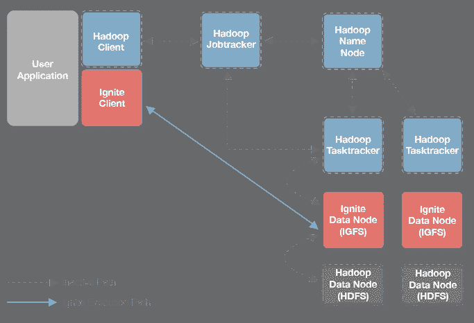
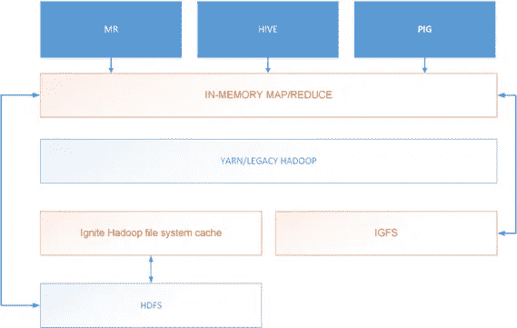
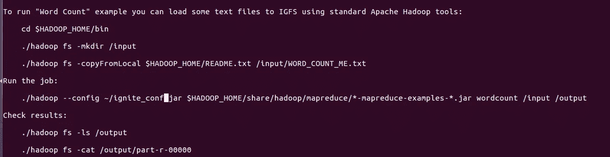
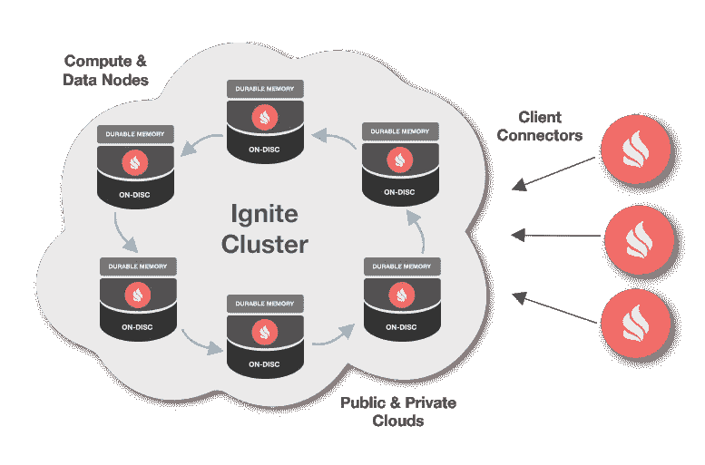
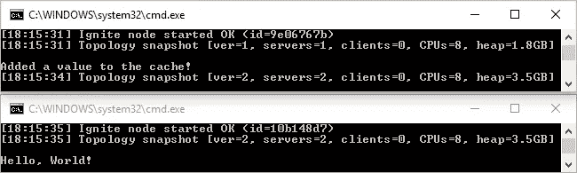

# Hadoop 与 Apache Ignite 的集成|使用 Hive 和 IgniteMR。

> 原文：<https://medium.datadriveninvestor.com/hadoop-integration-with-apache-ignite-and-using-hive-with-ignitemr-db8b8c09110e?source=collection_archive---------0----------------------->

# 简介:

在大数据世界中，人们最关心的问题之一是他/她的机器或服务器能否处理将要处理的大量数据，以及处理这些数据需要多长时间。通常，数据工程师使用 Apache Hadoop 和 Apache Hive 来存储数据并在其上运行查询，但在对查询执行复杂操作(如聚合、连接等)的情况下..这要花很多时间，查询性能更差，而且你的机器或服务器开始严重滞后。因此，为了克服这个问题，我们使用不同的查询引擎和大数据工具来优化 Hadoop 及其组件。

作为一个大数据爱好者，当我在 Hadoop 和 Hive 上工作时，我也遇到了同样的问题，所以当我为我的问题寻找可能的解决方案时，我发现了一个名为 [Apache Ignite](https://ignite.apache.org/) 的令人难以置信的工具，它将优化 Hadoop 和 Hive 以获得更好的性能。

[](https://www.datadriveninvestor.com/2019/01/25/why-data-will-transform-investment-management/) [## 为什么数据将改变投资管理|数据驱动的投资者

### 有人称之为“新石油”虽然它与黑金没有什么相似之处，但它的不断商品化…

www.datadriveninvestor.com](https://www.datadriveninvestor.com/2019/01/25/why-data-will-transform-investment-management/) 

因此，在这篇文章中，我将演示 Apache Ignite 以及如何将其与 Hadoop 和 Hive 集成以获得更好的性能。

# 什么是 Apache Ignite？

Apache Ignite 是一个通用的内存数据结构。Ignite 是一个独立于数据源的平台，可以在 RAM 中跨多个服务器分发和缓存数据，以提供前所未有的处理速度和巨大的应用可扩展性。Ignite 支持任何基于 SQL 的 RDBMS、NoSQL、亚马逊 S3 和 Hadoop HDFS 作为可选数据源。它在价格合理的行业标准硬件上，以分布式、大规模并行架构为现有和新的应用提供支持。

基本上，Ignite 有两个主要组件广泛用于大数据工具

1.  以内存为中心的平台
2.  内存中的 Hadoop 加速器

由于我从事 Hadoop 工作，所以我将讨论 Ignite Hadoop 加速器与 Hadoop 和 hive 的集成。

## 内存中的 Hadoop 加速器:

内存中的 Hadoop 加速器增强了现有的 Hadoop 技术，使用您的组织目前已经在使用的工具和技术来实现快速数据处理。面向 Hadoop 的 GridGain 加速器基于双模式、高性能内存 Ignite 文件系统(IGFS ),该系统与 Hadoop HDFS 完全兼容，并支持内存优化 MapReduce 实施。Ignite Hadoop Accelerator 提供了一组组件，允许在内存中执行 Hadoop 作业和文件系统操作。

## 点燃 MapReduce:

Ignite 有一个单独的 map-reduce 框架，称为 [**Ignite MR**](https://apacheignite.readme.io/v1.0/docs/map-reduce) ，它增强了 mapreduce 作业的性能。Hadoop Accelerator 附带了替代标准 Hadoop MapReduce 的高性能作业跟踪器实现。使用它来提高您的 Hadoop MapReduce 作业执行性能。



## IGFS 内存文件系统:

Ignite 有自己的内存文件系统，称为 **IGFS。** Hadoop Accelerator 附带了 Hadoop 文件系统的实施，该系统使用分布式 Ignite 文件系统(IGFS)将文件系统数据存储在内存中。使用它可以最大限度地减少磁盘 IO 并提高任何文件系统操作的性能。IGFS 的最大优势之一是它在 Hadoop 部署中消除了 Hadoop NameNode，它无缝地利用 Ignite 的内存数据库来提供完全自动的扩展和故障转移，而无需额外的存储。



IGFS Architectural Diagram

## 辅助文件系统:

辅助文件系统是 Ignite Hadoop 加速器不可或缺的一部分。辅助文件系统可以注入到现有的 IGFS 中，允许在任何其他 Hadoop 文件系统实施(如 HDFS)上进行通读和直写行为。如果我们希望我们的 IGFS 成为基于磁盘的 HDFS 或任何其他 Hadoop 兼容文件系统上的内存缓存层，我们可以使用它。

# 使用辅助文件系统作为 HDFS 点燃 Hadoop 加速器配置:

现在，作为本博客最重要的部分，我将演示如何在 Hadoop 上配置 Apache Ignite，同时使用 HDFS 作为二级文件系统。在 Hadoop 上配置 Ignite 并不复杂，因此只需按照以下简单的步骤在您的计算机上进行配置:

1.  从 Apache Ignite 官方[网站](https://ignite.apache.org/download.cgi#binaries)下载 Ignite Hadoop Accelrator 版二进制。下载 zip 文件后，将其解压缩到您想要的位置。
2.  将 IGNITE_HOME 变量设置为 Apache Ignite Hadoop Accelerator 的解压缩目录。请注意，您必须在~/中设置 IGNITE_HOME。bashrc 文件。
3.  确保 HADOOP_HOME 环境变量已设置且有效。这是 Ignite 找到必要的 Hadoop 类所必需的。
4.  因为我们要缓存来自 HDFS 的数据，所以我们需要将 HDFS 设置为辅助文件系统。打开＄IGNITE _ HOME/config/default-config . XML，取消对 secondaryFileSystem 属性的注释，并设置正确的 HDFS URI:

```
<bean class="org.apache.ignite.configuration.FileSystemConfiguration">
  ...
  <property name="secondaryFileSystem">
    <bean class="org.apache.ignite.hadoop.fs.IgniteHadoopIgfsSecondaryFileSystem">
      <property name="fileSystemFactory">
        <bean class="org.apache.ignite.hadoop.fs.CachingHadoopFileSystemFactory">
          <property name="uri" value="hdfs://your_hdfs_host:9000/"/>
        </bean>
      </property>
    </bean>
  </property>
</bean>
```

5.将 Ignite JARs 复制或符号链接到 Hadoop 类路径。这是让 Hadoop 在运行时加载 Ignite 类所必需的。

> CD $ HADOOP _ HOME/share/HADOOP/common/lib
> ln-s $ IGNITE _ HOME/libs/IGNITE-core-[版本]。jar
> ln-s $ IGNITE _ HOME/libs/IGNITE-shmem-1 . 0 . 0 . jar
> ln-s $ IGNITE _ HOME/libs/IGNITE-Hadoop/IGNITE-Hadoop-[版本]。冲突

6.Hadoop 分别根据配置文件`core-site.xml`和`mapred-site.xml`决定使用什么文件系统和作业跟踪器。

设置该配置的推荐方法是创建单独的目录，将现有的`core-site.xml`和`mapred-site.xml`文件复制到那里，然后应用必要的配置更改。例如:

> mkdir ~/ignite _ conf
> CD ~/ignite _ conf
> CP $ HADOOP _ HOME/etc/HADOOP/core-site . XML。
> CP $ HADOOP _ HOME/etc/HADOOP/map red-site . XML。

7.请将映射到`core-site.xml`的类名添加到您刚刚创建的目录中。

> <configuration>…
> <属性>
> <名称>fs . IGFs . impl</名称>
> <值>org . Apache . ignite . Hadoop . fs . v1 . igniteheadoopfilesystem</值>
> </属性>
> <属性>
> <名称> fs。abstract file system . IGFs . impl</name>
> <value>org . Apache . ignite . Hadoop . fs . v2 . ignite headoopfilesystem</value>
> </property>
> …
> </configuration></configuration>

8.将 Ignite Hadoop 加速器用于 map-reduce 作业，将`mapred-site.xml`指向适当的作业跟踪器。

> <configuration>…
> <属性>
> <名称>MapReduce . framework . name</名称>
> <值>点燃</值>
> </属性>
> <属性>
> <名称>MapReduce . jobtracker . address【地址】</configuration>

至此，安装完成，您可以开始运行作业或使用 IGFS。转到 IGNITE_HOME/bin 并运行”。/ignite.sh "

现在在 Ignite 上测试一个 map-reduce 字数统计作业。



# 点燃集群:

Ignite 节点可以自动发现彼此。这有助于在需要时扩展集群，而不必重启整个集群。开发人员还可以利用 Ignite 的混合云支持，在私有云和公共云(如 Amazon Web Services)之间建立连接，为他们提供两个世界的最佳选择。



Ignite Cluster Architecture

Apache Ignite notes 发现机制附带了两个针对不同使用场景的实现:

*   [TCP/IP 发现](https://apacheignite.readme.io/v2.6/docs/tcpip-discovery)专为 10 秒和 100–300 个节点的部署而设计和优化。
*   [ZooKeeper Discovery](https://apacheignite.readme.io/v2.6/docs/zookeeper-discovery) 允许将 Ignite 集群扩展到 100 或 1000 个节点，同时保持线性可扩展性和性能。

由于我通过 TCP/IP 发现配置了 Ignite 集群，因此我将指导您完成 TCP/IP 发现配置。

Ignite 将`TcpDiscoverySpi`作为`DiscoverySpi`的默认实现，使用 TCP/IP 进行节点发现。发现 SPI 可以配置用于多播和基于静态 IP 的节点发现。

## 多播 IP 查找器:

我使用多播 IP finder 来发现网格中的其他节点。下面是一个如何在 default-config.xml 文件中配置这个 finder 的例子。

```
<bean class="org.apache.ignite.configuration.IgniteConfiguration">
  ...
  <property name="discoverySpi">
    <bean class="org.apache.ignite.spi.discovery.tcp.TcpDiscoverySpi">
      <property name="ipFinder">
        <bean class="org.apache.ignite.spi.discovery.tcp.ipfinder.multicast.TcpDiscoveryMulticastIpFinder">
          <property name="multicastGroup" value="Enter your desired node ip here"/>
        </bean>
      </property>
    </bean>
  </property>
</bean> 
```

我在两个节点上创建了集群，所以我在两个节点上都配置了多播 ip finder。在主节点配置文件中，将输入从节点的 ip，在从节点配置文件中，将输入主节点的 ip，以便两个节点可以发现彼此。

## 具有节点属性的集群组:

Ignite 的独特之处在于所有网格节点都是平等的。没有主节点或服务器节点，也没有工作节点或客户端节点。从 Ignite 的角度来看，所有节点都是平等的，但是，用户可以将节点配置为主节点和工作节点，或者客户端和数据节点。

所有集群节点在启动时都会自动将所有环境和系统属性注册为节点属性。但是，用户可以选择通过 Ignite 配置来分配自己的节点属性:

> <bean class="”org.apache.ignite.IgniteConfiguration”">…
> <property name = " user attributes ">
> <map>
> <entry key = " ROLE "/>
> </map>
> </property>
> …
> </bean></bean>

# 客户端和服务器:

注意，Ignite 有一个可选的概念，即**客户端**和**服务器**节点。服务器节点参与缓存、计算执行、流处理等。，而本地客户端节点提供远程连接到服务器的能力。Ignite native clients 允许使用整套`Ignite APIs`，包括近缓存、事务、计算、流、服务等。从客户端来看。

默认情况下，所有 Ignite 节点都作为`server`节点启动，需要显式启用`client`模式。

您可以在 default-config.xml 文件中将节点配置为客户机或服务器:

> <bean class="”org.apache.ignite.configuration.IgniteConfiguration”">…
> <！—启用客户端模式。→
> <property name = " client mode " value = " true "/>
> ……
> </bean></bean>

最后，您现在应该已经配置了 Ignite 集群。运行 ignite 并检查 ignite 是否指示有两个服务器节点或一个服务器和一个客户端节点，具体取决于您如何将这两个节点设置为客户端或服务器节点



# 带 Ignite MR 的蜂箱:

如果您正确地遵循了我的指南，那么现在 Ignite Hadoop Accelerator 已经正确配置了。由于我们还想优化 hive 上的查询性能，我们还将使用 Apache Ignite 配置 Hive，以便 Hive 上的 map-reduce 作业可以在 Ignite 的框架上工作。请注意，根据我的个人经验 **Ignite Hadoop 加速器版本 2.6 与 Apache Hive 版本 2.1 兼容**自从我尝试将 Hadoop 加速器与 Hive 版本 3.1 集成后，我在 hive ignited 上运行时遇到了许多错误。

1.  首先，打开你默认的 Hadoop 的 mapred-site.xml 文件，默认的 map-reduce 框架应该是“yarn ”,在这个文件中，用“ignite”替换“yarn ”,这样 Ignite MapReduce 引擎就可以用于 MR jobs 了。
2.  创建一个名为“hive-ig”的 bash 脚本，这样当脚本运行时，hive 使用 ignite 的框架作为 MapReduce 作业。要创建 scipt:

nano hive-ig.sh(针对 Linux 用户)

> #指定 Hive 主目录:
> 导出 HIVE_HOME= < Hive 安装目录>
> 
> #指定配置文件位置:
> 导出配置单元 _ CONF _ 目录= <路径到我们的配置文件夹>
> 
> #如果没有在 PATH 中设置 hadoop 可执行文件，请明确指定 Hadoop HOME:
> export Hadoop _ HOME =<Hadoop 安装文件夹>
> 
> #避免 Hadoop 中不同“jline”库的问题:
> export Hadoop _ USER _ class path _ FIRST = true
> 
> ${HIVE_HOME}/bin/hive "${@} "

3.将 bash 脚本保存在您想要的任何位置，并运行 hive metastore 服务。运行 metastore 服务后，不要在配置单元的 bin 目录上运行配置单元。请改为运行“hive-ig”脚本，以便 hive 在 IgniteMR 上运行。

***此时，您的 Hadoop 和 Hive 都设置在 Ignite 上。然而，Ignite 中仍然有很多可以添加的特性，例如 Ignite 持久性，此外 Ignite 可以与 Apache Spark 集成，但这是另一个博客的主题。我希望我的博客能帮助你轻松地用 Hadoop 和 Hive 配置 Ignite，所以现在就这样吧。谢谢:)***