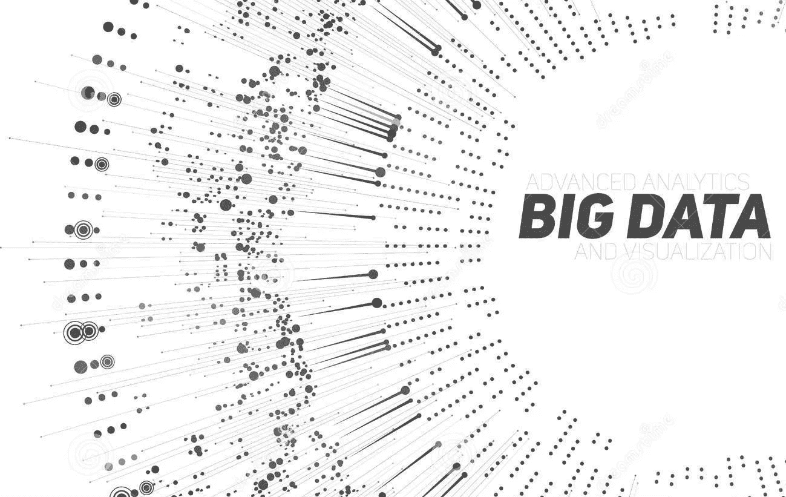
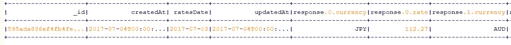
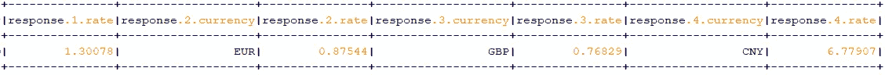
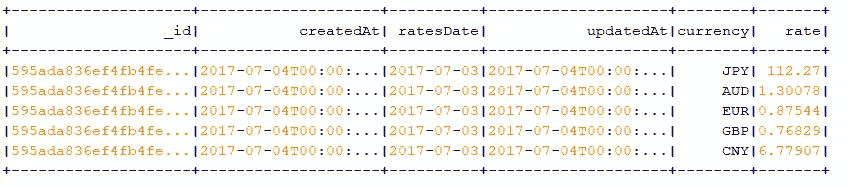

# 大数据中的复杂性—使用不断变化的模式标签处理嵌套的 json

> 原文：<https://medium.datadriveninvestor.com/handling-complexity-in-big-data-process-nested-json-with-changing-schema-tags-699972dc17e4?source=collection_archive---------2----------------------->



您可能见过各种读取 json 数据的情况，从嵌套结构到 json 结构损坏。但是，让我们看看如何处理一个模式标签递增的嵌套 json。我们将在其原生语言 Scala 中使用 Spark Dataframe API 来解决这个问题。

让我们看看如何处理样本 json 结构，如下所示

```
{ “id” : “595ada836ef4fb4fe47d8c01”),
 “response” : { “0” : { “currency” : “JPY”, “rate” : 112.27 }, 
 “1” : { “currency” : “AUD”, “rate” : 1.30078 },
 “2” : { “currency” : “EUR”, “rate” : 0.87544 }, 
 “3” : { “currency” : “GBP”, “rate” : 0.76829 },
 “4” : { “currency” : “CNY”, “rate” : 6.77907 } }, 
 “ratesDate” : “2017–07–03”,
 “createdAt” : “2017–07–04T00:00:03.421Z”,
 “updatedAt” : “2017–07–04T00:00:03.421Z” }
```

我们可以在上面的 json 中看到，来自 API 的响应是一个嵌套的 struct 类型，具有范围从 0 到 n 的增量标记。这个问题之所以复杂，但仍然很容易解决，是因为我们知道标记的增量是 1。

[https://www . datadriveninvestor . com/2019/01/25/why-data-will-transform-investment-management/](https://www.datadriveninvestor.com/2019/01/25/why-data-will-transform-investment-management/)

让我们从读取数据和打印 json 模式开始，使用下面的代码来理解它的复杂性

```
val dataframe = spark.read.option(“multiLine”,true).json( “hdfs://path/of/json”)dataframe.printSchemaroot
 | — _id: string (nullable = true)
 | — createdAt: string (nullable = true)
 | — ratesDate: string (nullable = true)
 | — response: struct (nullable = true)
 | | — 0: struct (nullable = true)
 | | | — currency: string (nullable = true)
 | | | — rate: double (nullable = true)
 | | — 1: struct (nullable = true)
 | | | — currency: string (nullable = true)
 | | | — rate: double (nullable = true)
 | | — 2: struct (nullable = true)
 | | | — currency: string (nullable = true)
 | | | — rate: double (nullable = true)
 | | — 3: struct (nullable = true)
 | | | — currency: string (nullable = true)
 | | | — rate: double (nullable = true)
 | | — 4: struct (nullable = true)
 | | | — currency: string (nullable = true)
 | | | — rate: double (nullable = true)
 | — updatedAt: string (nullable = true)
```

我们可以很好地看到上面的模式非常复杂，但是让我们接受挑战，将这个模式转换成一个更加结构化的格式-
首先，我们必须找出在那个特定的 json 记录中有多少响应，所以我们必须循环遍历嵌套的字段名称，并创建一个计数器来获取响应的数量。
下面是实现这一点的代码片段-

```
import scala.util.Try
import org.apache.spark.sql.DataFrame
var counts=0
for(name <- dataframe.select(“response.*”).schema.fieldNames) {
if (Try(name.toInt).isSuccess == true)
{
counts+=1
}
}
```

现在我们已经知道有多少响应，我们可以创建一个 dataframe 并添加 response tags 内容作为列名，其中的值基于固定的嵌套结构连接在一起。请参见下面的代码片段，了解实际的实现

```
var dataframeflattened = dataframe
for(c <- 0 to counts-1) {
var concatstringcurrency = “response.”+c.toString()+”.currency”
var concatstringcurrencyrate = “response.”+c.toString()+”.rate”
dataframeflattened = dataframeflattened.withColumn(concatstringcurrency,col(concatstringcurrency)).withColumn(concatstringcurrencyrate,col(concatstringcurrencyrate))
}
```

最后，我们得到了所需的扁平数据框架-

data frame flattened . drop(" response ")。显示



另外，展平数据的另一种方法是使用 explode()，如下所示

```
var dataframeflattenedalttmp = dataframe.withColumn(“temp”,explode(array(col(“response.*”))))var dataframeflattenedalt = dataframeflattenedalttmp.withColumn(“currency”,explode(array(col(“temp.currency”)))).withColumn(“rate”,explode(array(col(“temp.rate”)))).drop(“temp”,”response”)dataframeflattenedalt.show
```



很好，我们解决了大部分问题，但是在大数据的**复杂性**系列的下一部分中，我们将看到如何解析具有不同模式的多个 json，以及如何将所有不同的 json 数据帧统一到单个数据帧中，并将其写入目标路径或配置单元表。

特别感谢 Priyanshu 和 Subhasish 给出了不同的解决思路。

敬请期待！继续闪耀吧！