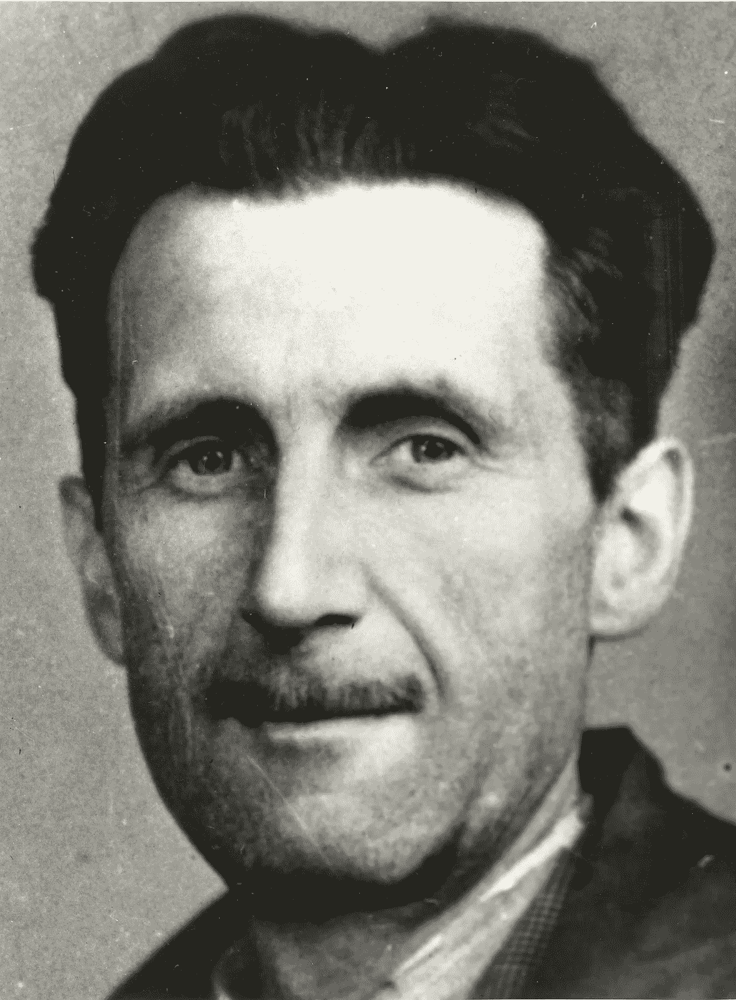

# 1984 年 70 岁生日快乐。这正在中国发生。

> 原文：<https://medium.datadriveninvestor.com/happy-70th-birthday-1984-its-happening-right-now-in-china-a8cd55333a88?source=collection_archive---------2----------------------->

乔治·奥威尔的《1984 年的 T1》出版于整整 70 年前的今天，但它对这个世界的可怕愿景是，在这个世界中，每个公民都受到一个无所不知、无所不知的独裁“*老大哥*”政府似乎比以往任何时候都更接近、更具威胁性。在监控和数据处理技术的结合——人工智能、深度学习、面部识别软件、物联网——的推动下，世界正在迅速采用使这种系统成为可能的技术。

奥威尔会如何看待中国呢？中国已经在建立一个庞大的监控网络，旨在通过面部识别技术、群聊监控和国家开发的智能手机应用程序的结合，最终跟踪所有 14 亿公民——根据人们的“社会信用”给他们打分。成绩好的人会得到奖励，成绩不好的人会受到惩罚。中国 16 个地区已经在使用面部识别技术。[人民日报](http://en.people.cn/n3/2018/0326/c90000-9441798.html)写道:

 [## 人们对隐私的不理解是什么？-数据驱动型投资者

### 你知道那种感觉。无论是访问应用程序、订阅还是你最喜欢的运动鞋。你按下…

www.datadriveninvestor.com](https://www.datadriveninvestor.com/2019/04/11/privacy-and-convenience/) 

> 该系统能够识别 40 种面部特征，无论角度和光照如何，准确率高达 99.8%。它还可以扫描人脸，并以每秒 30 亿次的速度与它的犯罪嫌疑人数据库进行比较，这表明所有中国人都可以在一秒钟内在系统中进行比较。
> 
> 该系统证明了在打击各种案件(如贩毒、盗窃、抢劫和绑架)中基于技术的援助的杰出表现。两年来，公安机关借助该系统抓获了 2000 多名在逃罪犯。

该系统是天网的一部分，天网是一个全国性的监控项目，于 2005 年启动，以增加监控摄像头的使用和功能。该系统基本上将人工智能与闭路电视监控结合起来，并使用面部识别和 GPS 跟踪来监视每个人。目前，中国有 1.7 亿个监控摄像头，到 2020 年，该国希望达到 5.7 亿个。大概是每两个公民就有一台相机。

天网最可怕的方面是它的“社会信用体系”，也称为公民评分，它与 13 亿中国公民的国民身份证相连，并根据每个公民的行为进行评分。美国公民自由联盟称，该系统利用“信息时代的所有工具——电子购买数据、社交网络、算法分类——来构建社会控制的终极工具。”

例如，如果社交媒体上的“朋友”做了或说了政府认为错误的事情，如购买政府认为不合适的视频游戏，未经允许发表政治评论或发表任何可能惹恼或令政府尴尬的事情，你的公民分数(与信用分数挂钩)可能会下降。

简而言之，如果你打算建立一个世界上最专制的国家，在这个国家里，每个公民的行为都受到政府的监控和直接控制，这就是你会使用的那种制度。涵盖的违法行为从追踪在国外花费赃款的在逃官员到更为平常的事情。在北京天坛公园的洗手间里，顾客们在一台机器吐出一条 24 英寸长的卫生纸之前接受面部扫描。在九分钟过去之前，它不会给同一个人分配更多。它给“拉屎”带来了全新的含义

想象一下，一个西方政府使用人工智能系统以中国公开接受的方式监控其公民的行为。想象一下它被用来监视政敌？如果该系统仅用于识别特定种族、少数民族或宗教团体的成员，会怎么样？它应该被用来发射催泪瓦斯或烟雾弹吗？有如此多的问题没有得到解答，而技术正在超越道德、伦理和法律的选择。

《1984》出版于 1949 年——在 46 岁的奥威尔去世前 13 个月。

《1984》的读者如此之多，影响力如此之大，以至于如今我们会用形容词“奥威尔式”来形容它。这肯定归功于作者对人性中最糟糕的冲动、政治权力结构的愤世嫉俗和周期性的理解，以及他对掌权者放弃权力和不掌权者改变其困境的能力的悲观态度。