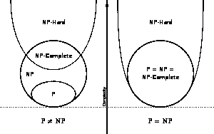
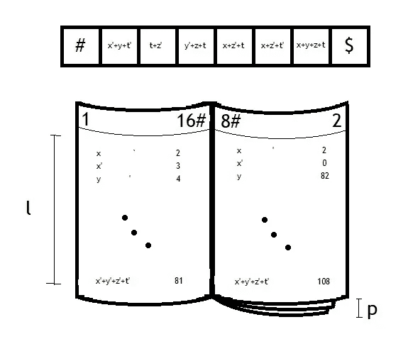

# 叛逆思想的艰难生活

> 原文：<https://medium.datadriveninvestor.com/hard-life-for-a-rebellious-mind-2ea7693ebfe0?source=collection_archive---------5----------------------->

## 最高效的机器被鄙视。

这不会是一个关于卓越技术的故事，而是一个关于他们如何忽略有用的东西并继续使用他们知道没有用的东西的故事。这是一个在被证实之前就被告知的范式转变的故事。

## 一个起点

举例来说，我们将把自己置于 10 年前(T1)，西班牙正处于危机之中，没有人有工作可做。我刚刚完成了成为一名电工的学业。我甚至在斯特拉斯堡谴责西班牙拒绝修改我的考试。投诉被驳回，我不得不在 50 公里外的另一个中心完成训练。所以我在大学里遇到的同样的问题，在较小的范围内，我经历了，直到我完成学业的最后一天。

> 在我的第一本书中，我演示了 SAT 在 P 中没有得到认可，但不是以一种实用的方式。

那时我已经写了一本书[1]，在那里你可以看到我当时一半的技术:它展示了一种在多项式时间内将 **SAT** (一个布尔代数公式，写为文字和的乘积)求解到输入大小的方法，但是当合并许多变量时，它需要额外的成本。因此，这是我的第一个挑战:我意识到**的复杂性理论**不足以解释算法的构造，于是我接受了尝试给出另一种理论的挑战。

 [## 成为数据科学家所需的 8 项技能——数据驱动型投资者

### 数字吓不倒你？没有什么比一张漂亮的 excel 表更令人满意的了？你会说几种语言…

www.datadriveninvestor.com](https://www.datadriveninvestor.com/2019/02/07/8-skills-you-need-to-become-a-data-scientist/) 

因此，我写了一篇文章，利用我作为计算机顾问的新工作的空闲时间，来说明为什么类 **NP** (在 **TM** —图灵机中容易验证的可解决问题)不能等价于类 **P** (在 **TM** 中容易解决的问题)。然而，主编让我很为难…，他没说完拒绝我，顺便说一句，他回答我，信件会持续几个月，几个月，答案循环往复…

当我受够了这种有害的关系时，我决定公开我的第一个令人印象深刻的机器，在那个时候，它已经很好地建立起来了。这种结构在多项式时间内解决了问题 **SAT** ，而且，在合理的时间内不考虑变量的数量。比我的书 2007 年版本好太多了[1]。

在这一点上，有人可能会认为我的两个演示相互矛盾:一方面，我展示了 **NP** 和 **P** 类是不同的，另一方面，我保证逻辑满足可以在多项式时间内解决。然而，与这两个结果相矛盾的是 **NP-complete** 类的存在，其中**库克定理**声明存在问题 **SAT** 。

## NP-Co 类

在 20 世纪 70 年代末，正如本书[8]所示，在数学确定性下已经证明了**NP-Co**(**NP-Complete**)类的存在。这个类的成员具有这样的属性，即确保如果任何问题在 **P** 处，那么在 **NP** 处的所有问题也是如此。

From [Wikipedia](https://en.wikipedia.org/wiki/NP-completeness)

演示包括能够从用一种 *L* 语言描述的问题中构造一个 **TM** ，这样输出将是一个 **SAT** 的语句。

> 我还证明了在多项式时间内构建这样的配置是不可能的。这是对大多数书面文章的宣战。

然而，Cook 的演示为 TM 的配置加入了一个必要的变量:L 语言需要解决的步骤数。在问题得到解决之前，这些数据是无法得知的，所以实际上，这个演示只不过是一种数学形式。也就是说:如果我们有办法解决 **SAT** 那解决任何 **NP** 都没用。这一点很重要:它只是向我们保证有一个 **TM** 的配置可以在多项式时间内解决问题，而不是我们能够知道它。进一步的解释[3]。

## 新范式包含了什么

从我们可以在未知值的假设下工作以确保机器的存在这一事实出发，我解决了 P 和 n P 之间相等的问题，现在说它们相等，或者至少在形式上相等:可以在形式上找到一个 **TM** ，我在文章[2]中发表了它。

但是，除此之外，我还小心翼翼地证明了在多项式时间内构造这样的配置是不可能的。我把它放在同一篇文章里。显然，这是对大多数书面论文的宣战。

也就是说，一旦我们认识到数学的准确性及其断言形式陈述的能力，我们就会发现工程学必须更加严谨。所以我们对数学的精确性有两种哲学，因此，对同一个问题有两种可能的答案。

所以，我们能收到两个相反的答案，并且都是确切的吗？是的:当问题是关于效率的时候。稍后我们解释答案的相对性。

换一种方式来理解，我们可以把一个 **TM** 想象成一个手册，其中页码是机器的寄存器，每一行都是一个转换规则，它建立了当你读取磁带上的一个符号并将指针向右移动时要跳转到哪个状态(页面)。

如果字母表是每一个可能的 **SAT** 子句，那么它将取决于一个 **V** 值作为变量的最大数量。因此，字母表的大小，也就是手册中的行数，将是 3 的(**比**。

从这个角度来看，手册可以由已知的 **V** 构造，这样不仅可以在线性时间内解决 **SAT** 的问题，还可以知道有多少情况满足条件。

*示例*

假设我们有一本试图求解多达 4 个变量{x，y，z，t}的公式的手册，我们输入 6 个元素，如下图所示。

因为最多有 4 个变量，所以 V=4。这使得条款的数量 3⁴=81，这将是每一页的书。页数会对应寄存器的个数，其中**寄存器 0** 表示条目不一致 **SAT** 公式没有事例)。并且，正如我们在图中看到的，**寄存器 1** 意味着我们识别出 2⁴=16 可能的情况，当条目为空时(“#$”意味着身份 1=1)。

如果我们阅读一个“x”子句，那么它将跳转到第 2 页，在这种情况下，我们将看到它如何识别假设条目命中“$”符号的 8 种情况。

如你所见，正如**斯蒂芬·库克**需要假设解决问题的步骤数量的存在于 *L* 语言中一样，我所做的是假设变量的数量将永远小于另一个有限数量。这是同样的逻辑推理:总会有一本手册确保多项式定界的图灵机存在。

那么，**坐**呢？我们能知道有多少情况多项式满足 SAT 条件吗？

## 回到我的研究

总的想法是:如果我们将 **TM** 解释为齿轮系统，那么将会有无法解决的问题(银行安全系统保持安全)，另一方面，如果我们将 **TM** 视为指导手册，那么将会有理论上的方法来解决它们(**深度学习，**你可以在【7】中进一步猜测)。所发生的是，在多项式时间内解决它们的同时，它需要克服在配置(*学习*)机器的过程中关于变量数量的组合爆炸。

随着时间的推移，我解决逻辑公式的技术得到了改进，以至于我可以用矩阵符号来解决。这引起了我的疑问，一个逻辑公式的解的个数真的可以算在[4]里吗？

因此，随着两篇发表在两份同行评审期刊上的文章解决了一个千年问题，我想到要告诉 Claymath 研究所，因为我纳入了更多其机制更加自命不凡的倡议[5]。

> 一项技术的重要性不在于它有多有趣，而在于一篇文章让其他文章过时的能力。

在那种情况下，我希望同行们能接受我的旧文件和我通过机器得出的结论，为了证实它们的功能和我推测的一样好，我需要比我现有的更大的计算机。然而，他们不仅不接受我的文件，而且我的参考质量。

这促使我最终写了另一本书[6]，在那里我更详细地解释了这两种哲学的内容。事实上，随着时间的推移，那些否认我的技术存在的人停滞不前，无法前进，而我，在此期间，继续做更多更好的代码。这就是为什么我最后写了关于这个主题的最后一篇文章，在那里我在多项式时间内解决了一个陈述是否是一个逻辑定理[7](我保证我可以在 P 中证明 TQBF 问题)。

一所西班牙大学目前正在研究如何证实这项技术。
然而，这篇文章的情节是说，令人好奇的是，一项技术的重要性并不是使它有趣的原因，而是一篇文章使其他文章过时的能力是导致没有人对哪怕一瞥感兴趣的原因。

# 参考

[1] Dato Ruiz，J. M. (2007 年)。[可满足性语言](https://www.amazon.es/Satisfacibilidad-Logica-Resuelta-Juan-Manuel/dp/1425141811)(西班牙语)

[2][https://archive . org/details/TheUltimateDefinitionOfNp/page/n3](https://archive.org/details/TheUltimateDefinitionOfNp/page/n3)

[3][https://archive . org/details/correctiontotheoremoockwiki-version](https://archive.org/details/CorrectionToTheTheoremOfCookwiki-version)

[4]达图·鲁伊斯，法学博士(2015 年)。对 Hosoya 指数的探讨。 *EPH —国际生物杂志&药物科学(ISSN:2208–2166)*， *1* (1)，25–31。从 https://ephjournal.com/index.php/bps/article/view/16[取回](https://ephjournal.com/index.php/bps/article/view/16)

[https://archive.org/stream/mainIdeas/main13MAR#mode/2up](https://archive.org/stream/mainIdeas/main13MAR#mode/2up)

[https://archive.org/details/TheTwoExactPhilosophiesFiles](https://archive.org/details/TheTwoExactPhilosophiesFiles)

[7][https://archive . org/stream/TQBFInP _ 201802/tqbfinpmentationandothermethods # mode/2up](https://archive.org/stream/TQBFInP_201802/TqbfInPDemonstrationAndOtherMethods#mode/2up)

[8]迈克尔·r·加雷，大卫·s·约翰逊(1979)，计算机和难处理性:NP 完全性理论指南*w . h .弗里曼公司，纽约，纽约州，美国*(ISBN:0716710447)