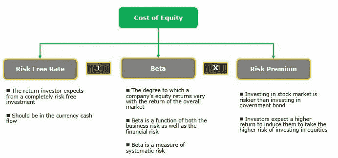

# CAPM 让我们失望了吗？中国银行业案例研究

> 原文：<https://medium.datadriveninvestor.com/has-capm-failed-us-case-study-on-chinese-banks-1686fb118200?source=collection_archive---------28----------------------->

当我还是一名银行分析师时，我总是对一件事感兴趣。事实上，因为我实际上必须在我们的报告中证明目标价(TP)的合理性，我不仅仅是好奇，这是一个我必须解决的问题。这是预定中国银行的倍数(PB)的价格。

**过去几年，中国各银行的市盈率在 0.6 至 1.2 倍之间**。在我们的研究报告中，我们不得不使用基本工具来证明我们的目标价格。对于银行，这是基于目标 PB 乘以账面价值。

> 目标 PB 由下式得出
> 
> 股本回报率(ROE)减去长期增长(g)
> 
> 全部除以
> 
> 权益成本(COE)减去长期增长(g)

现在，增长在这个讨论中是微不足道的，所以我们实际上可以把它从公式中完全去掉。所以公式基本上是，ROE 乘以 COE。

在过去的几年里，中国银行的净资产收益率实际上在 15-20%之间，你可以从它们的年度报告中得到。

COE 基本上是无风险利率，也就是说如果我们使用中国 10 年期债券收益率是 3-4%。

 [## 中国 10 年期债券收益率-Investing.com

### 关注与中国 10 年期债券收益率相关的当前和历史数据。短期国库券的收益…

www.investing.com](https://www.investing.com/rates-bonds/china-10-year-bond-yield) 

你可以使用 Excel 或彭博/路透社提供的斜率公式逆向计算(过去，我喜欢自己计算，因为我总是厌倦第三方提供商的准确性)，但中国银行的贝塔系数约为 1.0-1.2 倍。常用的风险溢价约为 6%。因此，COE 计算出约为 9–11%。

> 基于上述 COE 公式的 ROE，这意味着中国银行的 PB 应该在 1.3-2.2 倍左右，正如之前所讨论的，实际上，它们在 0.6-1.2 倍之间

因此，如果纯粹基于这一点，TPs 可能是当前价格的两倍，这似乎令人愤慨(一些行业的某些股票可能有 100%的上涨空间，但对于银行来说，这应该是罕见的，尤其是作为一个整体行业，这实际上直观地暗示着你预计 GDP 增长将翻一番或利率翻一番，但没有坏账发生)，我需要找到一个解决方案。

人们可以通过回顾变量来推断差异。我想说，在无风险利率和贝塔系数方面没有太多争论。人们可以对中国的风险溢价进行分析，虽然我自己没有做过，但这可能是中国高 COE 的关键驱动因素，从而导致银行的 PB 较低吗？

为此，让我们看看我以前报道过的另一个领域——中国券商。过去几年，中国券商的交易价格在 0.8-1.5 倍之间，但除非出现大牛市，否则它们的平均净资产收益率只有 10%左右，预计这不会持续很长时间。

因此，中国券商的市盈率应该在 1.0 倍左右，这与现实相符(1.5 倍是牛市估值)。这意味着 COE 通常也是有意义的。

> 因此，我们只剩下净资产收益率，基本上，市场的意思是，他们预计银行目前的净资产收益率在未来是不可持续的。这有很多原因，比如银行业改革、利率市场化、竞争以及与发达市场银行的比较。

到目前为止，我们忽略的另一个变量是银行的账面价值，这是计算 TP 的另一个变量。由于对贷款质量的担忧，市场很可能已经对这一变量进行了大幅贴现。

这样做的理由是，中国各银行的资产与权益之比约为 12 倍。这意味着他们持有 12 美元的资产对应 1 美元的权益，因此，如果他们总资产的 1 美元(或 8%)是坏账，那么理论上他们就破产了。

免责声明:这篇文章不是为了提供任何投资建议，而仅仅是对估值框架的讨论。