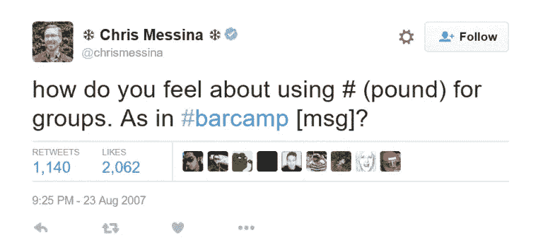
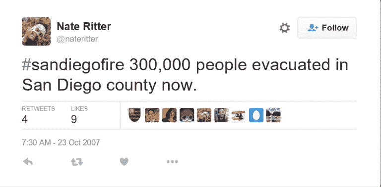

# #作为流行文化现象的标签

> 原文：<https://medium.datadriveninvestor.com/hashtag-as-a-popular-culture-phenomenon-aa9f04b604c5?source=collection_archive---------8----------------------->

Image by [Tanja-Denise Schantz](https://pixabay.com/users/yourschantz-282976/?utm_source=link-attribution&utm_medium=referral&utm_campaign=image&utm_content=970723) from [Pixabay](https://pixabay.com/?utm_source=link-attribution&utm_medium=referral&utm_campaign=image&utm_content=970723)

这是社交网络的时代，比如 Instagram，YouTube，Twitter，脸书，...
在过去的十年里，社交网络越来越受欢迎，各行各业的人都在使用它，包括好莱坞名人、著名音乐家、政治家、公司和作家，他们选择社交网络作为基本的沟通方式。很难不注意到或感觉到社交网络的影响，以及社交网络如何开始决定全球使用数字技术的方式。

*无论社交网络的类型如何，社交网络也可以被视为现代生活中对某个话题的情绪反应的放大。如果没有情感，交流就不会成功。标签是情感的一个重要组成部分，因为没有它，情感就不会到达更广泛的受众，也不会成为网上流行内容的一部分。*

直到十年前，符号“#”在音乐符号系统中仅用于表示与手机相关的术语或“尖锐”的符号。与此同时，人们的认知发生了变化，这个简单的符号成为了主要的交流工具之一。这个简单的“#”符号不仅是社交媒体语言的一部分，也是我们消费的所有东西的一部分。它甚至改变了社会写作和行为的方式，因为语法正确的形式在今天已经不再必要了。

根据目前的研究，短信的互动性提高了 25%。因此，为了发送和接收信息，我们不需要使用整个句子，而只需要图像和 hashtag 符号，这证实了视觉效果的统治地位。如今，甚至电视频道也使用标签来吸引更多的观众，扩大观众群，更快地传播信息。速度和简单性是新“标签文化”的一部分。

 [## 以最好的面貌面对未来|数据驱动型投资者

### 社交媒体营销从客户开始。广告、反馈和管理投诉交织在一起…

www.datadriveninvestor.com](https://www.datadriveninvestor.com/2020/03/01/take-charge-with-your-best-face-forward/) 

在很短的时间内，标签已经从一种简单的社会交流发展成为一种流行的文化现象。这种趋势只是使用互联网的一种不同方式，也只是发布有针对性的个人内容的另一种可能性。有一天，对标签的痴迷可能会消失，但在那之前，它将继续以令人难以置信的速度增长。

通信的未来是不确定的，因为可能性是无限的，发展的速度是未知的。在现代社会中，使标签成为与观众沟通的重要部分的因素包括标签的数量、社交网络用户的数量、创建全世界都可以访问的内容的简单可能性、移动通信、电视节目和广告活动。这证明了一个以娱乐开始的东西，成为了现代社会流行文化的一部分。

21 世纪初，随着手机和社交网络的普及，短文本输入的时代到来了。简短的文本需要缩写和更短的时间来写信息，所以在今天的社会中非常流行的缩写得到了发展，并开始在社交网络之外使用。

根据历史事实，“hashtag”这个术语直到 2007 年才出现，当时克里斯·梅西纳( [@FactoryJoe](https://twitter.com/factoryjoe) )提出了用“hash”作为元数据策略的象征的想法。

Chris Messina`s tweet with the first officially recognized hashtag

而且，根据对推文的研究，标签第一次被广泛用于推文分类。这是 2007 年 10 月 23 日圣地亚哥火灾事故期间公众采用的，当时 Nate Ritter 使用 Twitter 传播关于火灾的消息，并加入了#sandiegofire 标签。

Nate Ritter`s tweet with the first hashtag to categorize tweets

直到 2009 年推特推广后，他这个标签才开始流行。从一条推文到另一条推文，标签被用在每个词的前面。

当 Twitter 增加了 ***趋势话题*** 选项，用户可以看到世界范围内使用的流行标签时，标签变得更加流行。Instagram 是最常用的照片交换应用之一，当它在 2010 年出现时，这个标签使世界各地的人们能够分享照片，并与其他兴趣相同的用户联系。

几乎没有任何限制，标签使得用户的交互更加容易。你只需要在单词前面加上“#”符号，当你寻找那个精确的单词时，所有相关的信息和活动都会显示出来。通过这种方式，标签成为世界各地无数主题的某个“中心”(表示活动、主题或兴趣的中心)，从而使用户不仅能够关注感兴趣的主题，还能够通过共享熟悉的信息来建立该主题，并为信息交流做出贡献。这样，用户同时参与设置与电影、音乐、政治或其他领域相关的趋势，不一定是来自现代生活的事件，也可以是来自过去的事件。

即使标签与传播想法有关，它也适用于趋势传播。潮流以其他方式出现在大众媒体上，但是当一个名人或人们崇拜的人开始追随他们时，他们就会受到大众的欢迎。就像我们社会中的任何其他趋势一样，它是由名人推广的，其他人只是开始跟随它。

这种趋势已经被设定为 ***回溯星期四*** 的标签。这个术语的起源是未知的，几乎不可能找到，人们可能以前用过它。这就是 hashtag 如何简单而迅速地发展成为一种流行文化现象。

例如，2010 年，真人秀明星[金·卡戴珊](https://www.instagram.com/kimkardashian/)在推特和 Instagram 上发布了一系列 [# *倒退星期四*](https://www.instagram.com/explore/tags/throwbackthursday/) 的照片。她是第一批使用每周标签的名人之一，人们开始关注她，就像她做的其他事情一样。直到最近，它还是 Instagram 上最受欢迎的标签之一。一个真人秀明星对这一趋势的流行有所贡献，她在 Twitter 上的帖子被数百万人关注，这一事实无疑表明了社会的运作方式。

我们做的事情，穿的衣服，看的东西，听的音乐，这些都在很大程度上受到社交网络上的名人和其他知名人士的影响。

比如 hash tag[***# 80 年代***](https://www.instagram.com/explore/tags/80s/) 让我们能够回到过去，而不是浏览互联网，使用不同的主题页面，在一个地方获得对八十年代流行文化的全面回顾。在随机选择的 30 天内，Twitter 上有 45278 条与该主题相关的状态，其中大多数与音乐相关(*杜兰·杜兰，Bananarama* )，然后是与俚语相关的状态，关于艺术、时尚的问题，对十年来不同流行游戏的记忆，等等。

**也称为* *保罗·拉扎斯菲尔德和伊莱休·卡茨*的多层次过程模型的传播过程理论是一种基于 1940 年一项关于社会影响的研究的理论，该研究认为媒体效果是由一个领导者个人影响舆论而间接建立的。大多数人在媒体和制造舆论的领导者的影响下获得了各种二手信息，这也可以解释一个简单的“#”符号成为流行文化现象的过程。*

*Hashtag、[、selfie(我们给自己拍的照片)](https://medium.com/@tanjatatomirovic/selfie-it-is-not-a-novelty-in-human-desire-for-self-expression-4c25a8a13b91)和类似的术语是 2014 年加入《韦氏词典》的 150 个新词和定义中的词，该词典现在在 Merriam-Webster.com 有印刷版和在线版。
这些最近被接受的术语显示了技术对人们行为越来越大的影响，特别是那些在社交网络上联系的人，他们以前经常在直接(直播)交流中这样做。*

*在时代，标签演变成一种幽默、黑色幽默、双关语甚至诗歌的形式。与此同时，社交媒体认识到了标签的力量，它现在已经成为设计、俚语和广告口号的一部分。*

*美国著名说唱歌手 [Kanye West](https://www.youtube.com/user/kanyewest) 不久前推广了短语“hashtag rap ”,当时他描述了比 Twitter 更古老的嘻哈韵脚模式，这让人想起了 hashtag 压缩比较的方式。*

*如今，标签字符无处不在。他们出现在广告、t 恤、网站、电视节目甚至新闻中。*

*标签对现代流行文化很重要，因为它们被广泛使用，以至于跨越了代沟，许多公司开始尝试并定期使用它们。在短短几年时间里，他们成功地从一个全新的概念转变为一种被数百万人使用的世界社会趋势。
这种使用不仅限于脸书、Instagram 或 Twitter 等社交网络，因为标签现在出现在所有媒体类型中。*

*有一个视频，美国明星贾斯汀·汀布莱克和吉米·法伦在视频中嘲讽标签，视频显示了这些标签在我们的文化中已经使用了好几年了。*

*标签被广泛应用于日常生活和言语的许多不同语境中，其作为现象的价值不能被社会所忽视。*

*我今天提供的陈述[或证词]代表我个人的观点。我是代表我自己，而不是代表我的雇主微软公司。*