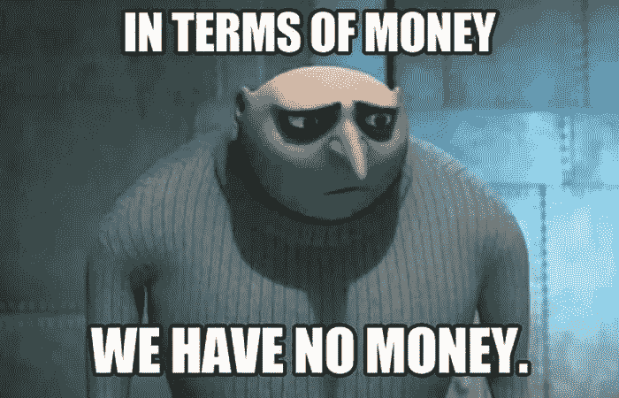
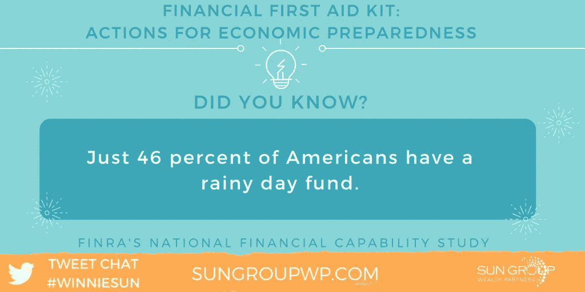
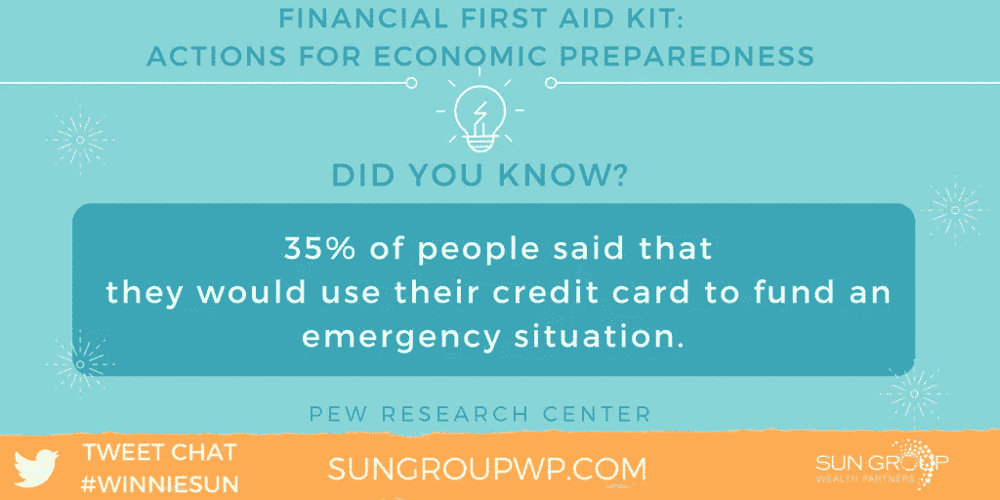
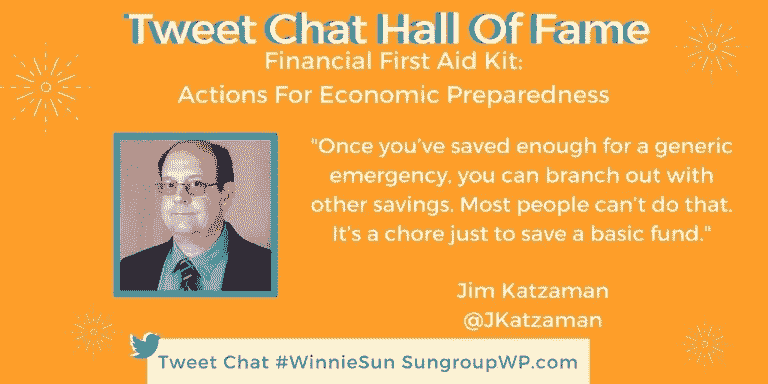
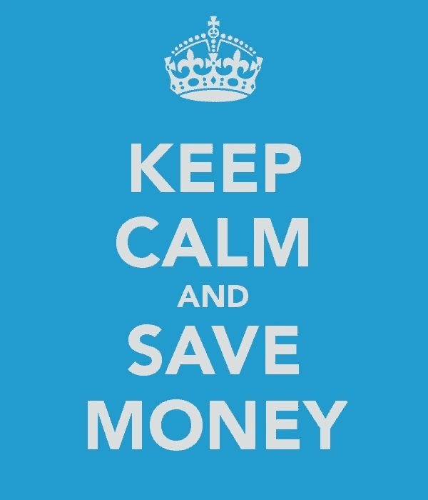

# 准备一个财务急救箱——并使用它

> 原文：<https://medium.datadriveninvestor.com/have-a-financial-first-aid-kit-and-use-it-ec4738418ce7?source=collection_archive---------1----------------------->

## 从你存的钱中提取，而不是赊欠

Times are stressful enough for you and your minions when emergency situations strike, but are less stressful if you’re financially prepared.

尽管过去遇到了意想不到的财务困难，但多亏了三位理财专家，你可以免去未来的头痛。

[财经编辑吉姆·帕维亚](https://twitter.com/jimpavia)和个人理财记者[杰西卡·迪克勒](https://twitter.com/jdickler)都在美国消费者新闻与商业频道，他们加入了金融行业最受欢迎的专业人士之一温妮·孙的行列，给出准备金融急救包的建议。这包括有一个应急基金。

 [## 手边准备一笔应急基金…以防万一

### 一笔现成的现金会帮你度过意外

medium.datadriveninvestor.com](/have-an-emergency-fund-handy-just-in-case-f4ef32664dce) 

动用应急基金的正当理由包括失业、事故、残疾和现金流的严重财务损失。

“不一定总是‘紧急，紧急’，”迪克勒说。“关键在于，你是在用自己攒下的钱，而不是用信用卡借款。

“话虽如此，动用你的资金来支付你喜欢的东西——你好，海滩度假——会很快耗尽它，”她说。

# 严肃的事情

对帕维亚来说，这些资金不是儿戏。

“应急基金不是你个人的钱，”他说。“你不能因为任何看似紧急的需要而打开它。因此，动用那笔资金肯定是件大事。

帕维亚说:“有一些问题值得拿出这笔钱:严重的医疗保健问题、失业、无法支付房租或抵押贷款、紧急手术。”

应急基金引发了几个问题:该拨多少专款？你会随着时间的推移改变这个数量吗？你怎么知道你应该存多少钱以备不时之需呢？

标准的应急基金建议是三至六个月的净工资——越多越好。

“我不喜欢在个人或账户上保留大量现金——最多三到六个月，”孙说。“我喜欢努力工作和投资的钱。

“这完全是关于流动性和知道在紧急情况下你可以从哪里撤出，”她说。

# 考虑需求

帕维亚同意三至六个月的生活费用“是争取的目标。这意味着房租、食物、债务、公用事业账单、医疗保健，而不是外出就餐、度假或其他形式的娱乐。”

他还指出，应急基金取决于个人。

“老实说，当每个人对应急基金的需求不一样时，为什么每个人的应急基金都应该一样？”帕维亚问道。

“应急基金本质上是为应对生活中的任何意外事件而留出的钱，”他说。“这是一种避免刷爆你的信用卡或向家人或朋友借钱的方法。”

从这方面来说，宁可失之于好。

帕维亚说:“留出三到六个月的开销是一个很好的经验法则，但有时这是不够的。如果可以的话，你可能会想扩大你的应急储蓄。"

迪克勒赞同三至六个月的建议，以支付租金或抵押贷款等生活费用，以及财产税和保险，公用事业账单，交通费用和食物，“如果你是家庭或自己做生意的唯一养家糊口的人”，他提倡更多的资金

一旦你为一般的紧急情况攒够了钱，你就可以用其他的储蓄来扩展。大多数人做不到这一点。光是存个基本款都是苦差事。

“这是一个伟大的观点，”孙说。“这是关于逐步节约。从目标开始。然后开始像乐高一样一步一步实现每一个目标。

“一个人应该有多少应急资金是非常个人化的，”她说。“每个人的经济实力和知识、收入和纪律都需要考虑到应该为紧急情况存多少钱。理财顾问肯定能帮上忙。”

年龄也是一个因素。

迪克勒说:“你的紧急程度随着年龄的增长而变化。”“随着年龄的增长，你面临着医疗费用增加的现实可能性。计划外的账单可能会带来巨大的代价。”

# **立即计划**

在紧急情况发生前有一个财务计划。那么当困难来临时，冲击就不会那么糟糕，更容易生存。

“无论何时，对自己的财务状况有一个很好的了解是很重要的，”孙说。

“这并不是说不会有资金挑战——这很正常，”她说。"意识到什么能花，什么不能花或存是非常重要的."

 [## 理财时，没有什么能打败你内心的平静

### 金融知识是应用生活经验的明智方式

medium.com](https://medium.com/financial-strategy/when-managing-money-nothing-beats-your-peace-of-mind-426aee793eac) 

到了一定年龄的人喜欢把资金存放在保险箱里。

“我的父母和许多客户仍然这样做，”孙说。“现在，我们鼓励客户将重要文件的电子副本留给我们和他们。永远给你的家人一个 B 计划去接触。”

帕维亚承认，为不可避免的事情做计划是一个敏感的话题。

“我们没有人想制定一个应急计划，以防心爱的人去世——比如说，”他说。“我们宁愿活在当下，以后再处理这个问题。

“然而，没有人能预测未来，”帕维亚说。"期待最好的结果，做最坏的打算，这样更安全。"

# **保持控制**

缺乏应急基金描绘了一幅可怕的画面。

迪克勒说:“另一种选择是诉诸高息债务来支付计划外支出，这可能会失控。”

把你的遗嘱和遗产规划文件放在一个安全的地方，比如保险箱，这样你就知道它们在哪里，而且不止一个人可以拿到。

“遗产规划——包括遗嘱和信托——需要在这个讨论中，”孙说。“很多人都忘记了这一点。

“我是这样解释的:如果你出了什么事，你的亲人知道去哪里找吗？”她说。“你怎样才能让它有条理、清晰，这样他们才不会感到压力过大，完全不知所措？”

Sun 补充说，存储备份文档非常重要。

“把它们安全地保存在一个物理位置，并保留一份数字拷贝，”她说。“为了安全起见，你也可以和你的财务顾问一起保存一份重要文件的副本。

“最好总是保留这些重要文件的扫描件，以防丢失时需要这些数据，”孙说。

# **彻底**

迪克勒强调彻底性。

“最基本的是一份投资总结和遗嘱，外加一份联系人名单，包括律师、银行家和会计师，”她说。"如果你没有这些东西，找一个财务顾问来帮你解决."

 [## 找到唾手可得的财富

### 金融专家、应用程序、播客和网站都有答案

medium.com](https://medium.com/financial-strategy/find-money-treasures-right-at-your-fingertips-f367fe61658a) 

帕维亚添加了一个重要文件的清单，以确保其安全:

*   代理人联系人的当前保险单
*   保障
*   出生证明和社会保障卡原件
*   任何法律文件的副本
*   生前遗嘱医疗代理
*   委托书
*   投资文件以及银行账户和退休计划数据

对于应急资金来说，如果是储蓄账户或存款单，储存现金是可以的。藏在床垫、抽屉或者衣服里丢钱的故事太多了。

“为此，我没有把现金放在身边，”孙说。“如果你没有它，你就不能失去它。

“这是个人问题，因为我们中的一些人手头有现金更舒服，”她说。“我很少有现金。我喜欢记录进出账户的钱。我使用信用卡主要是为了这个。”

孙指出，Intuit 公司的 quickbooks(T3)可以大大节省时间。

“在紧急情况下，最好的办法是保持冷静，”她说。"在紧急情况发生之前，T4 最应该做的事情就是省钱."

帕维亚认为双方都是现金——尽管他更喜欢现金。

“这有利有弊，”他说。“许多人对现金储备感到放心。我会避免它。

“然而，有了现金就安心了，”帕维亚说。“现金不能像薪水支票或银行账户那样被伪装，也不容易被追踪。对一些人来说，可以说，能够接触到不为人知的金钱可能会让他们感到更安全。”

迪克勒说，现金本身不会增长。

“床垫下的钱听起来确实令人欣慰，”她说。“然而，如果你的储蓄账户收益不低，至少跟不上通胀，那么从长远来看，你是在赔钱。”

# **保持联系**

一旦出现意想不到的财务挫折，联系你的债权人，尤其是你的银行。他们可能有艰苦项目，但除非你问他们，否则他们不会告诉你。

孙说:“如果你有财务顾问的话，就和他们谈谈，当然还有你的会计师。”。“盘点一下你所有的资产，详细说明你在经济上生存下来需要什么。

“你想知道你的立场，这样你就可以做出下一步的决定——去哪里寻求帮助，接受哪份工作，你需要支付多少费用等等，”她说。

帕维亚警告说，“如果你不知何故失去了钱，如果它在火灾中被烧毁或被抢劫，它很少或根本没有追索权。”

 [## 这是创造无债务生活的一天

### 好的计划会让你获得稳定的回报

medium.com](https://medium.com/financial-strategy/this-is-the-day-to-create-a-debt-free-life-3820298daf1) 

他提供了以下步骤以防你遭遇财务挫折:

*   深呼吸。
*   申请失业。
*   检查健康保险选项。
*   想好你的退休计划。
*   制定个人预算。

迪克勒说:“如果你突然发现自己手头的钱变少了，那就在你的自由支配资金中找出一些开销。”“这包括假期、会员资格和草坪护理等服务，这些服务可以立即停止，以恢复你的现金流。”

# **组织方式**

网上银行是组织财务的主要方式。支票和支票簿几乎要过时了。

“我喜欢简单，”孙说。"对我来说，它是 quickbooks，信用卡和详细的财务计划."

迪克勒偏爱在线服务。

“就像你使用健身追踪器一样，像 [Mint](https://www.mint.com/) 这样的应用程序可以记录你的支出，并找到可以削减支出的地方，”她说。“我还经常登录我的信用卡账户，并设置了欺诈检测警报，这正好派上了用场。”

 [## 组织良好可以节省你的时间和金钱

### 将所有东西放回原处可以提高生产力

medium.com](https://medium.com/financial-strategy/organizing-well-saves-you-time-and-money-2df44090c283) 

即使市场波动，继续每月自动存款到投资账户和退休基金。收益和损失会平衡，尤其是如果你多元化经营的话。不要试图把握市场时机。市场有它自己的想法，它不告诉。

"这些年来，我经历了大量的市场波动，并接受它作为我工作的一部分，"孙说。“最重要的是要有一个游戏计划。如果市场下跌，这就是我要做的…计划好了。”

# **别钻牛角尖**

帕维亚保持市场周期的观点。

“市场波动不可避免，”他表示。“从长期来看，日复一日的市场波动相对来说微不足道。

帕维亚说:“最小化风险的最基本也是最有效的策略是多样化。”"一个充分分散的投资组合由来自不同行业、风险程度不同的不同类型的证券组成。"

迪克勒不喜欢太密切地观察涨跌。

“剧烈的波动令人紧张，但主要股市平均水平的大幅下跌不会给你的长期投资带来可怕的后果，”她说。“甚至可能有[购买机会](https://www.cnbc.com/2018/02/06/dont-sweat-the-stock-market-sell-off.html?__source=sharebar|twitter&par=sharebar)。”

# **安心**

保险——租房、洪水、地震、人寿——很明智。你可能永远都不需要它，但这才是最重要的。保险是你的思想，知道当意外发生时你有它。

“当你有东西要保护时，保险是个好主意，”孙说。“例如，如果你有孩子、生意、依赖你的其他亲人，确保你有足够的保险。”

 [## 通过几个简单的步骤来管理你的钱

### 最难的部分是进入正确的心态

medium.com](https://medium.com/financial-strategy/take-charge-of-your-money-through-a-few-easy-steps-2ab642841684) 

作为金融稳定的基础，保险不容小觑。

帕维亚说:“保险单在我们的生活中起着至关重要的作用。“每个人都需要保险来应对不确定的损失。

“保险是管理风险的一种方式，”他说，并补充说它每天都在帮助人们:

*   拥有一个家，因为抵押贷款需要知道你的家是受保护的。
*   开车，因为很少有人能付得起修理费。
*   帮助支付医疗费用。

“赞成保险，但这也取决于你住在哪里，”迪克勒说。为了削减成本，[货比三家](https://www.cnbc.com/2017/10/05/bundling-auto-homeowners-insurance-can-cut-your-premiums.html?__source=sharebar|twitter&par=sharebar)，比较捆绑和非捆绑价格。有了人寿保险，早点开始。随着年龄的增长，价格只会越来越高。”

# **活出它才知道它**

对于那些想了解更多投资知识的人来说，没有什么比亲身经历更好的了。

“有一种方法可以学到这些金融教训，那就是去实践它们，”孙说。“要学习如何投资，就从投资开始。要学会负责任地理财，先从预算开始。”

她的公司有[免费预算工作表](https://sungroupwp.com/budgets/)可供下载。

大衰退告诉我们，经济有大起大落。降低风险的一个好方法是指数化共同基金或人寿保险。在好的时候，你可能不会得到那么多，但是你的本金不会受到挫折。

 [## 让孩子的理财成为人生的一课

### 尽早教育他们，以避免成年人在他们之前犯的错误

medium.datadriveninvestor.com](/make-kids-finances-a-life-lesson-71ea5b89a760) 

“在很小的时候，我就知道金融稳定是多么脆弱，”孙说。“就在我上大学之前，我的家庭宣布破产。这比任何一本书教给我的个人理财知识都要多。

“我明白了相信历史，不要等待投资，不要期望最好的结果，而是要经常计划和规划，这总是很重要的，”她说。

帕维亚已经领先一步。

“我实际上非常积极主动，让钱为我工作，”他说。"我从来没有欠过债，总是存钱，提前做计划."

# **泛化世代**

由于经历不同，不同的几代人可能会有自己的金融急救方法。

“很难一概而论，”孙说。“以我和客户的经验来看，一代人大多非常勤奋地为自己和家人——也就是孩子和父母——储蓄和投资。

“千禧一代擅长储蓄，但不太擅长投资——还没有考虑一些大的储蓄目标，如为孩子和退休做计划，”她说。“我希望这种情况会随着时间的推移而改变。”

不管你属于哪一代，专家们一致认为，最好是尽早安排好你的财务状况和急救包。

**关于作者**

吉姆·卡扎曼是拉戈金融服务公司的经理，曾在空军和联邦政府的公共事务部门工作。你可以在[推特](https://twitter.com/JKatzaman)、[脸书](https://www.facebook.com/jim.katzaman)和 [LinkedIn](https://www.linkedin.com/in/jim-katzaman-33641b21/) 上和他联系。