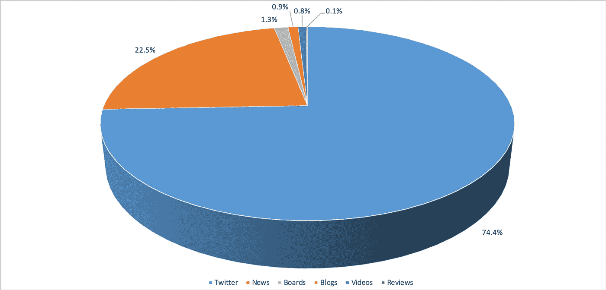
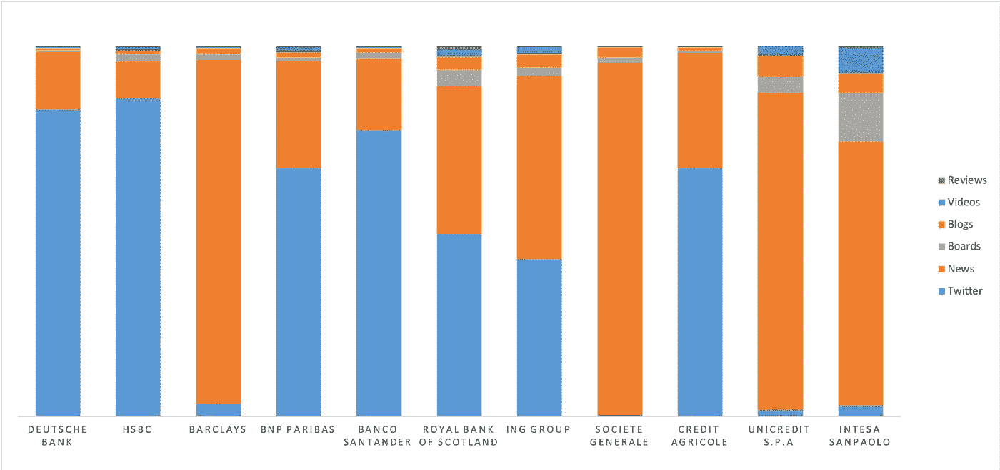
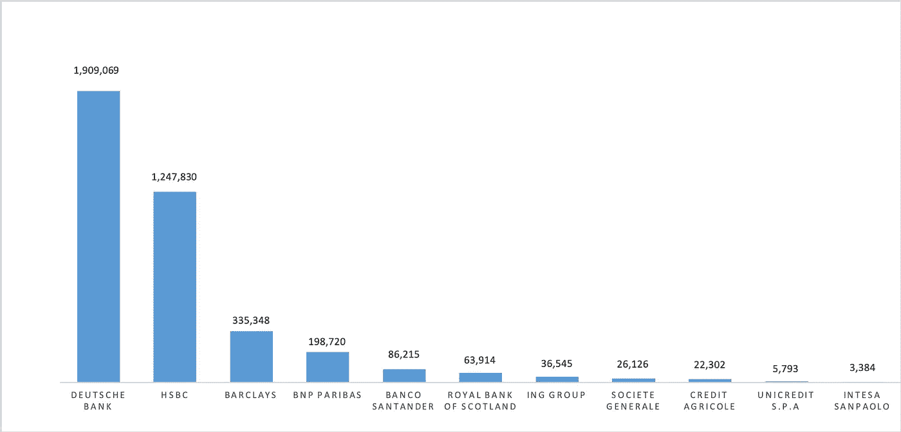
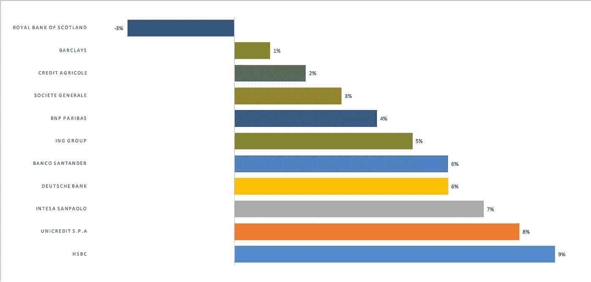
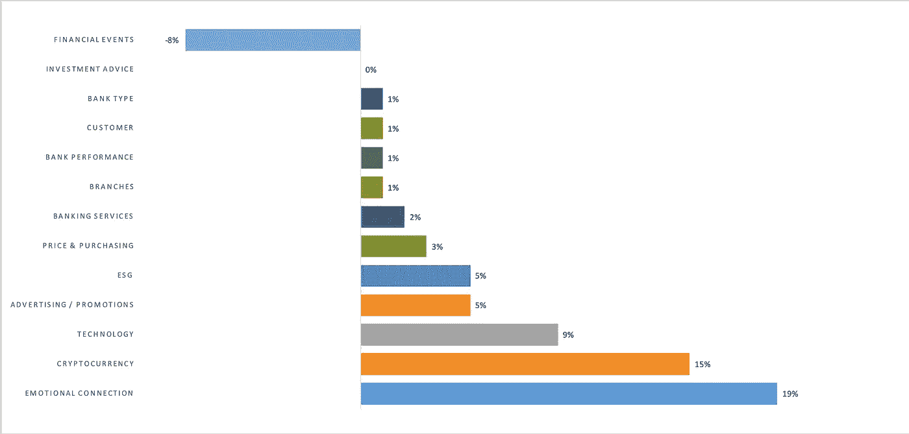
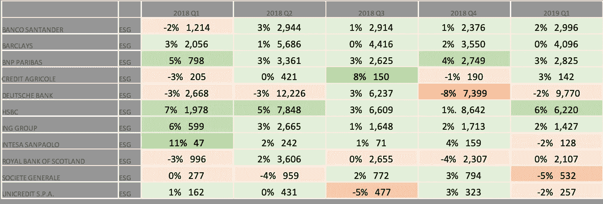

# 银行发现社交智能的价值了吗？

> 原文：<https://medium.datadriveninvestor.com/have-banks-discovered-the-value-of-social-intelligence-yet-f31edc841e77?source=collection_archive---------7----------------------->

## 一份基于数百万份关于 11 家银行的网上帖子的报告。

这是一个关于社会智能(SI)和银行的小故事…

社交智能解决方案 listening247 有一个独特的销售主张:它对品牌、情感和话题注释的多语言准确性很高。不幸的是，这种独特的销售主张也是 listening247 扩大规模的最大障碍之一。准确性和可伸缩性之间的权衡当然并不令人惊讶，这是一个团队有意识地做出的决定，他们(作为市场研究人员)非常尊重数据的准确性；有时对他们不利。令人欣慰的是，不久前的一天，他们意识到可伸缩性不一定是高准确性的折衷。

 [## 分散金融的出现|数据驱动的投资者

### 当前的全球金融体系为拥有资源、知识和财富的人创造了巨大的财富

www.datadriveninvestor.com](https://www.datadriveninvestor.com/2019/03/14/the-emergence-of-decentralized-finance/) 

随着 [listening247](https://listening247.com/) ，每次分析新产品类别和语言时，通常需要标准的 3 周时间来创建新的定制机器学习模型；**新的**是关键词。这正是这些研究人员能够比市场上的竞争对手获得更高的品牌、情感和主题准确性的原因。他们意识到，一旦定制的机器学习设置(特定于产品类别和语言)存在，他们就可以在可扩展性上与所有社交媒体监控工具处于相同的地位，但精确度要高得多！

为了测试理论，选择了一个垂直行业，并创建了必要的设置。这个垂直行业就是银行业。

**为什么选择银行业？**

这个决定绝非易事，有许多变量需要考虑——也许太多了；一个稻草人的建议被创造出来，并与整个公司及其顾问分享，经过几个星期的来回，银行部门被选中。

选择一个简单的快速消费品产品类别可能会更容易，或者可能是零售、医疗保健、汽车或电信，但有很多很好的理由说明为什么这个垂直行业值得关注。相关人士认为，现在是时候让银行认识到，在了解客户和竞争对手方面，它们有哪些可能性。

以下是影响银行决策过程的一些因素:

*   银行业是一个特别有趣的行业，因为它提供 B2C 和 B2B 服务
*   他们曾在 2011 年和 2012 年分别为英国和美国制作过 SI 银行报告，因此已经很好地理解了英语语义分析(主题)设置中涉及的类别和内容。
*   最近，他们还制作了一份关于香港银行的报告，用繁体中文分析社会数据。
*   在这个垂直领域中，有多个子类别，它们作为独立的业务单位存在，拥有 P&L 报告和自己的预算来投资商业智能，如零售、公司、财富管理、信用卡、保险等。
*   一个学术机构的相关机会就在眼前，这正是时候。这是一个 R&D 项目，旨在了解**ESG**——特别是用于**治理**的 G——如何对银行的业务表现产生影响。如果你不熟悉首字母缩写 ESG(金融服务领域的热门话题)，E 代表**环保**，S 代表**社交**。
*   这一领域的传统银行缺乏创新，越来越多地受到挑战者银行、区块链和 AI 的干扰。如果银行还没有感觉到在经营方式上做出一些重大改变的紧迫性，它们真的应该这样做，而且需要有人帮助它们走上正确的道路。

**2019 年第一份银行社会智能报告的范围**

在一位知名行业顾问的帮助下，该流程首先选择了 11 家主要的跨国银行作为数据采集的关键词。

**语言:**英语
**地理:**全球
**时间段:**过去 12 个月
**数据来源:** Twitter、博客、版块/论坛、新闻、评论、视频
**机器学习标注:**情感、话题、品牌、噪音(因同名而拾取的无关帖子)
**可交付成果:**带标注数据的 CSV、Excel 表格、钻

作为前面提到的学术机构的 R&D 项目的一部分，11 家银行中每一家的每日估值也从雅虎金融和谷歌金融中检索并被考虑在内。

**网上发帖量证明在线跟踪银行业绩是合理的**

全球 11 家银行共获得 450 万个英文帖子。如下图所示，Twitter 是迄今为止最大的帖子来源，其次是新闻——唯一的非消费者来源，主要是记者(甚至是银行自己)发表的社论。

单独看每家银行(见下图)，Twitter 仍然是德意志银行、汇丰银行、法国巴黎银行、桑坦德银行和法国农业信贷银行的最大帖子来源，这表明消费者确实会在网上谈论他们的银行，尤其是在他们有抱怨的时候。另一方面，巴克莱、法国兴业银行、联合信贷银行和联合圣保罗银行等银行的最大帖子来源是新闻，这意味着这些银行的客户要么没有抱怨可分享，要么他们根本不注重在社交媒体上与他们接触。

**第一个演示文稿&报告亮点**

这些发现最初是提交给来自不同国家的银行董事会的，他们正在 INSEAD 参加[国际董事银行项目](https://www.insead.edu/executive-education/corporate-governance/international-directors-banking-programme) (IDBP)。以下是部分精彩内容:

1.  **德意志银行排名第一**

德意志银行在 buzz(即帖子总量)方面排名第一，超过 190 万个帖子来自所有来源。这代表了德意志银行 42 %**的份额，汇丰银行和巴克莱银行分别位居第二和第三。这对 DB 来说是好事吗？**

**2。苏格兰皇家银行的 NSS 最低**

网络情绪得分(NSS)是一个注册商标的 [DigitalMR](https://www.digital-mr.com/) 指标，它结合了所有积极、消极和中立的帖子，提供了一个综合指标，可以被视为 NPS 对调查的社会等价物。在所有 11 家银行中，苏格兰皇家银行的 NSS 得分最低，为-3%，而汇丰银行得分最高，为+9%。有趣的是，与其他垂直行业或产品类别相比，9%的顶级 NSS 得分相当低。

**3。情感联系和 ESG 是热门话题**

当谈到在线对话的话题和消费者对此的情绪时，金融事件的 NSS 得分为-8%。ESG 得分为+5%，而表现最好的情感联系话题得分为+19%。ESG 似乎再次成为银行和其他企业的热门话题。

**4。德意志银行和苏格兰皇家银行对 ESG 的负 NSS**

该报告在主题和时间段方面可以非常精细。下表深入到 **ESG** 的主题，按季度显示了每家银行的 NSS(相对于 ESG)。彩色编码可以很容易地找出问题所在。在这种情况下，德意志银行和苏格兰皇家银行是五个季度中有四个季度 NSS 为负的两家银行；不太好。

在 INSEAD 的演示期间，与会的董事会级别高管似乎从未见过类似的事情，带着怀疑的态度接受了结果，当然还问了几个问题。一些人希望深入了解这些数据的发现；来自银行的资金比其他资金更多地被纳入项目。他们心中的问题是:*我们能相信社交媒体上发布的观点吗？帖子合法吗？他们代表市场吗？* *对我们银行有什么价值？*研究人员心中的问题是:*他们能说服银行管理层将社交智能整合到他们目前使用的所有其他数据流中吗？*

使这份报告可信的是它的情感和主题准确率超过 75%。人类可以通过抽取 100 篇帖子的随机样本，通读它们，并检查她与机器学习算法注释(品牌、情感和主题)的一致性，来轻松验证准确性。100 个职位中至少有 75 个职位应符合上述任何一项说明。此外，关于这 11 家银行的帖子代表性如何的问题也不是一个合适的问题。正确的问题是:是否有足够多的人阅读这些帖子并受其影响，以至于他们的行为能够影响银行的业绩？

**接下来的故事**

这只是关于这份银行报告的一系列短篇故事的第一篇。到下一篇文章发表时，247 个机器学习模型将会自我改进，达到 80%以上的准确率。从所有来源收集帖子的工作正在进行。这些银行将继续以彼此为基准，主要是针对特定主题的情绪。更多的银行将被添加，帖子将被收集并以西班牙语和中文注释，以使全球覆盖范围再增加 20 亿人。

如果你想知道还有什么其他方法可以从这样的社会智能报告中为银行创造价值，请继续关注！在下一篇文章中，你会发现关于治理的新闻是如何影响本报告中 11 家银行之一的估值的。对于那些迫不及待想再等几周的人，请随时通过 Twitter [@DigitalMR_CEO](https://twitter.com/DigitalMR_CEO) 联系我，或者发邮件到 mmichael@digital-mr.com[找我。](mailto:mmichael@digital-mr.com?subject=Social%20Intelligence%20for%20Banks)

如果您喜欢阅读这篇文章，您可能也会喜欢:

[好消息频道](https://medium.com/@DigitalMR_CEO/the-good-news-channel-2d5e66080b84)

*最初发表于*[*【https://www.digital-mr.com】*](https://www.digital-mr.com/blog/view/have-banks-discovered-value-social-intelligence-yet)*。*