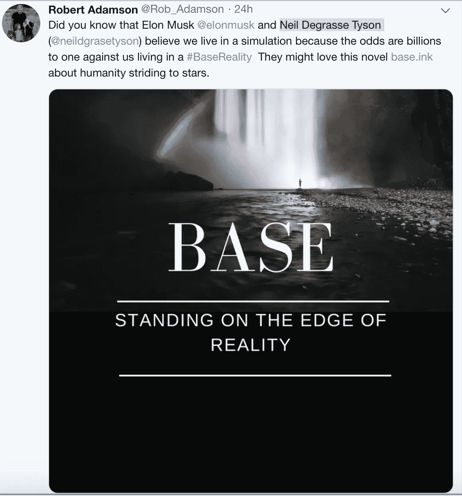
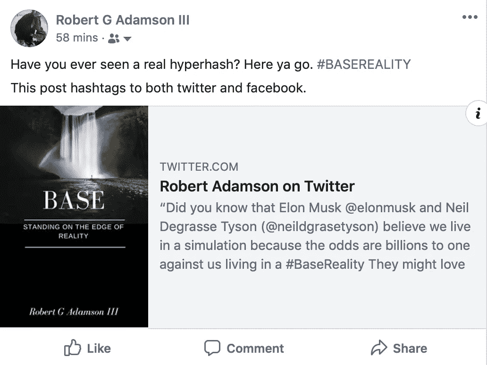

# 你见过#HyperHash 吗？

> 原文：<https://medium.datadriveninvestor.com/have-you-ever-seen-a-hyperhash-5e46b8122101?source=collection_archive---------36----------------------->

这篇文章解释了如何创建 HyperHash 标签，一种 Hash 标签和超链接的组合。

我将深入 Twubs(标签注册)寻找标签超链接组合、Twitter 标签、脸书标签和 LinkedIn 标签，所有标签一起工作。

请只做最基本的！什么是标签？

Hashtag 是一个分组链接；这是一种创建大量推文和帖子的方式。如果你在一条推文或一篇脸书帖子中包含了#标签(任何以#开头的单词)，那么这条消息就会被归入任何一个写有相同标签的推文或帖子的人。

因此，可以把标签想象成一桶常见的推文和帖子。在庞大的 Twitter 世界中，推文不计其数，标签只是一种将你的推文与其他使用相同标签的推文放在一起的方式。就是这样！

尽管如此简单，它仍然非常巧妙。像红牛这样的公司为他们的营销活动发明了很棒的标签。比如红牛的#PutACanOnIt。每个伟大的标签背后都有一个故事，红牛的这个标签迅速走红。你只要在任何一条推文中点击他们的标签，你就在#PutACanOnIt 桶中阅读所有关于红牛的炒作——我不喝这种东西。

这开始有意义了吗？**下面是我如何创建一个链接标签。**

我写了一部科幻小说，在经历了到处出版这本书的痛苦之后，我想了解一下标签营销活动。如你所见，标签并没有你想象的那么复杂和神秘。**事实证明，标签终究是有点神秘的。继续阅读**

我的小说是关于我们生活在原始地球的模拟现实或祖先虚拟现实版本中。但这个故事探索了最初的#BaseReality 探险者的发现。我知道像埃隆·马斯克和尼尔·德格拉斯·泰森这样的人认为我们生活在一个模拟世界里。他们称之为模拟理论。他们认为我们生活在原始基础文明的几率是十亿分之一。换句话说，我们必须赢得超级大奖才能生活在现实世界中。

所以我有了这个**轻率的想法**在 Twitter 上写一篇文章，并添加一个#BaseReality 标签，其中包括马斯克和泰森的链接以及我的作者网站的链接。它看起来是这样的:

接下来，我需要对马斯克和泰森的 Twitter 账户进行评论，并加入我的#BaseReality 标签。你能看到这些东西是如何开始生长的吗？

但是我是一个程序员，我开始像一个程序员一样思考这个标签。如果我能把我的推特和脸书信息放在同一个标签桶里会怎么样？如果有一种方法可以将标签和超链接结合起来**会怎么样？**嗯，在这个模拟现实中，我需要访问每个人的代码库。抱歉，用了双关语。反正他们也不太可能把那个交给我。

但是，如果你在脸书的一篇文章中放一个#BaseReality 的标签，并包含一条包含#BaseReality 标签的推文的链接，会发生什么呢？你猜怎么着？成功了！我创建了一个简单的#HyperHash。

如果你点击脸书的标签，它会把你带到#BaseReality 脸书桶。但是这个桶中的帖子包含了 Twitter 标签帖子的链接。所以，我基本上把我的脸书和 Twitter #BaseReality 桶联系在了一起。这是我简单的脸书实验贴。

程序员总是想了解事物是如何工作的。这个练习有助于阐明标签是如何工作的，并为更有趣的标签营销活动打开了大门。

哦，还有一个窍门。如果你在亚马逊上找到了你的书的 HTML 链接，你可以把它嵌入到一篇中型文章中。然后人们可以直接从 Medium 预览、分享甚至购买你的书。试试看。

 [## 基础

### 通过 Kindle 分享。描述:在数十亿个令人眼花缭乱的世界中，只有一个#基础现实…

read.amazon.com](https://read.amazon.com/kp/embed?asin=B07JPJ5W22&preview=newtab&linkCode=kpe&ref_=cm_sw_r_kb_dp_sgd2Bb6TP2EWV) 

我想知道为什么 Medium 不支持标签。等等，这会让写这篇关于 Medium 的标签文章变得困难。忘了它吧。

现在回到真正的超级哈希。这怎么可能呢？**答案是** [**Twubs**](http://www.twubs.com) 。Twubs 是你注册标签的地方。我没开玩笑。你不能拥有一个标签，但是如果你够快的话，你可以给自己注册一个。下面是我在 Twubs 上注册的标签的网址。我将 URL 插入到 Medium 中，它生成了那个漂亮的图片链接。

 [## #BaseReality - Base

### 关于模拟现实的科幻。在数十亿个令人眼花缭乱的世界中，只有一个基本事实。

twubs.com](http://twubs.com/BaseReality) 

但是有了这个 URL，我还可以在任何接受 URL 链接的网站上显示我的 [#BaseReality](http://twubs.com/BaseReality) 标签作为超链接，包括 Medium。如果你点击它，你会进入同一个 BaseReality 页面，上面有所有关于 BaseReality 的推文。**超级杂凑！**

没错，这是一个字面意义上的超级散列，同时具有超链接和散列标签的优点。

**但是等等，还有更多**。你知道 LinkedIn 也支持标签吗？它们像 Twitter 和脸书一样工作，你的标签文章都被放入一个桶中，用户点击标签就能看到。

所以，标签毕竟有点神秘。尝试结合使用 Twitter、Twubs、脸书和 LinkedIn 来处理标签。

感谢阅读。