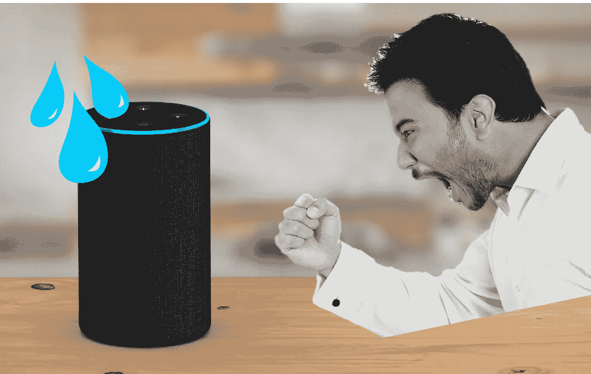

# 你对 Alexa 说过脏话吗？:人们为什么会滥用人工智能

> 原文：<https://medium.datadriveninvestor.com/have-you-ever-used-an-f-word-to-alexa-why-people-abuse-ai-f15dcc35aa1a?source=collection_archive---------2----------------------->

A lexa 推出了一个名为“礼貌功能”的新功能，为用户提供反馈，特别是孩子，他们向 Alexa 询问单词*请*。当用户在他们的命令后添加它时，Alexa 会回应说“谢谢你友好地问我”。再者，当你说“谢谢你，Alexa”时，她给出的回答是“没关系”或者“不客气”。

这次更新的背景故事引起了我的兴趣。不久前，家长们声称 Alexa 正在破坏他们孩子的语言行为，因为她总是给予善意的反馈，即使当孩子粗鲁和咄咄逼人地对他们说话时。这太有意义了，既然家里有了 Alexa，就好比拥有了一个永远听命于你、从不说“不”的私人助理。

问题是这种现象不仅限于孩子。成年人也使用它们，他们和 Alexa 说话的方式不太礼貌。有些用户甚至对助手说脏话。你知道，当机器不理解我们的命令时，我们有时会失去紧张感。

公平地说，使用不良语言是一种相对良性的欺负虚拟助理的方式。有些人甚至正在遭受性骚扰。一项研究表明，GPS 语音和卡车司机之间的所有聊天记录中有 5%是性虐待，当涉及到所有虚拟助理时，这个数字可能会更高。

# 那么，为什么人们对 AI 说话咄咄逼人呢？

人们滥用非人类代理的原因主要有两个。第一个原因是宣泄假说。人们用代理人作为出气筒来释放他们从其他来源诱发的愤怒。老实说，人工智能代理可以成为我们发泄愤怒的完美对象。他们没有灵魂的事实让用户在欺负非人类代理时不会有负罪感。

其次，有一个挫折假说。它说用户行为粗鲁是因为机器不能满足他们的期望。你可以想象一下有人对着一台损坏的电脑破口大骂的情景。如果 Alexa 没有得到用户所说的，他们可以为此责怪她。

以上两种解释都很有说服力。然而，我想补充一个新的假设，被称为授权假设。由于大多数人工智能代理具有顺从和善良的个性，用户和人工智能之间的权力动态形成了主从关系。它给用户一个完全的权力和权利去做他们想做的任何事情。所以，他们对助手越严厉，在互动中就越能感受到力量。

与虚拟助手互动的想法是一个全新的概念，到目前为止，对于如何正确地与他们交谈还没有达成共识。然而，一些研究人员指出，人们对待非人类的方式会影响他们在现实世界中的互动。你知道，每个人的本来面目最终都会显露出来！也许现在是时候考虑一下拥有一个像人类一样、善良、总是面带微笑的私人助理的副作用了。