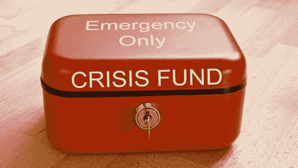

# 你留出应急基金了吗？

> 原文：<https://medium.datadriveninvestor.com/have-you-set-aside-your-emergency-fund-ab5658aea65a?source=collection_archive---------7----------------------->

First Step when you plan your finances

应急基金是任何个人在开始投资前都应该做的第一件事。但是大多数时候我们忘记了计划和实施..人们应该重视**应急基金，因为它是财务规划的第一步。这笔应急基金应该是非常具有流动性的**形式，以便可以立即动用。****

**请记住这一点:**

****在开始投资之前，搞定这三件事****

*   **留出 **3 至 6 个月的费用，包括 EMIs** 作为流动资金、银行 FD 或银行 RD 中的应急资金。随着费用的增加，请随时更新。把**应急基金当做你的开销，而不是你的投资。****

** [## 更好地预算以建立更大的数据驱动型投资者

### 即使是专家也承认它们并不完美。从 1 到 10 的范围内，安东尼·科普曼和德尔…

www.datadriveninvestor.com](https://www.datadriveninvestor.com/2018/11/08/budget-better-to-build-bigger/) 

*   购买**在线定期保险计划**，尽可能获得最大保障，直到你退休或你有家眷。随定期计划或单独购买等额的**残疾附加保险和**意外福利保障保险。
*   选择**独立(为你和配偶)或家庭流动医疗保险计划作为你的基本计划，并在雇主提供的计划之外购买一份补充医疗计划**。这一安排将节省你额外支出。

下面详细说说应急基金。

什么是紧急基金？

应急基金是一只放在一边以应对未来任何不可预见事件的小猫。。这些事件可能是失业、收入突然减少、突然的财务负债或因暂时残疾而暂时停止收入。

应急基金的目的是什么？

它主要为个人提供**安心**。它保证个人在短期内做好充分准备面对任何金融危机。它还为这类支出建立了一个资金安全网，从而提供了财务保障。如果个人有应急基金，他就不必动用他的长期储蓄。

应急基金的规模应该是多少？

*   一个人应该有 **12 个月**的月支出，加上参加 EMIs 作为他/她的应急基金。
*   但是，如果投资者有一份稳定的工作，良好的储蓄和可控的支出，他可以留出 6 个月的月支出，再加上继续进行 EMIs。
*   如果你的配偶在工作，而你认为这份工作可以弥补你收入的不足，那么他三个月的月支出加上参加 EMIs 就足够作为应急基金了。

比如说；

*   假设 Ajay 在 IT 公司工作，收入颇丰，他可以将工资的 40 %存起来，这样他就可以将 6 个月的月支出存起来作为应急基金。在这种情况下，让我们假设 Ajay 的月支出为 **40000，家庭 EMI 为 40000** ，那么他应该有 **6 个月**的支出+家庭 EMI 作为他的**应急基金，即 480000 Rs** 。
*   假设 Radha 和 Jay 都在零售行业工作，提取的金额与工资大致相同，他们可以有 **3 个月**的开支作为应急基金。如果他们的月支出是 50000 卢比，那么 150000 卢比作为应急基金就足够了..

无论如何，应急基金和投资**不应混在一起**。永远不要把留在应急基金里的钱当作你的投资。你不应该把它和你的任何目标联系起来。你应该随时更新你的应急猫时间，以配合你的费用增加。应急基金是一种你应该承担并忘记的费用。

你的应急基金应该放在哪里？

应急基金最重要的一点是，在紧急情况下，它应该容易获得。**流动性**是最高标准。第二个可能是**资本保护。**无论我们存的是什么钱，都应该是安全的。第三个是这笔钱可以赚取合理的回报。

以下是最受欢迎的用于应急基金的金融产品。

*   现金——许多人在家里囤积现金以备不时之需。这是一种古老的家庭风格。但是它有被盗、磨损的风险，最重要的是，随着时间的推移，由于通货膨胀，它的价值会降低。只为你的日常开支保留现金，不要超过这个数目。
*   **银行储蓄账户:**这是很多投资者的另一个选择。在这种情况下，盗窃和磨损的可能性被考虑在内，但节省下来的金额回报如何呢？如果**通货膨胀**被认为是 6%,你的银行储蓄金额就会被侵蚀，因为你只能赚取 3/4 %。
*   **银行定期存款:**这是**推荐的应急资金选项**之一。您可以将您的存款存放在这里，这为**提供了流动性、安全性以及比银行储蓄账户**更高的回报。有一个**在线金融衍生工具**，这样它就可以在家里一键终止，你不需要去银行做同样的事情。但是 FDs 仍然不适合最高等级的纳税人。其税后回报大幅下降至 30%税级投资者。
*   **定期存款:**银行或邮局的定期存款可以作为应急资金的推荐选择。如果你没有足够的资金去做 FD，你可以先进行一年的 RD ,到期后再进行 FD。再次启动研发一年，转化为 FD。可以一直做，直到积累到目标量。
*   **流动资金**:这是最适合任何投资者的选择，最好是最高税级投资者。**流动基金**就是简单的债务互助基金**将你的钱投资于非常短期的市场工具，如国库券、政府证券和风险最小的看涨期权。流动资金的收益率总是优于 FD 和 RD。人们也可以立即提取金额。**
*   信用卡额度:现代投资者将信用卡额度视为应急资金。如果你有良好的信用记录并广泛使用信用卡，银行会提供巨额信用额度。遇到紧急情况，只要换张卡就解决了。但这不是我推荐的选择，就好像你无法支付信用卡的金额，你必须支付高额利息，而且你会陷入新的债务中。这将导致你的信用评分急剧下降，而且将来很难从银行获得贷款。

就我个人而言，我会保留 6 个月的开销作为应急基金。我喜欢流动资金、定期存款和定期存款的组合。**