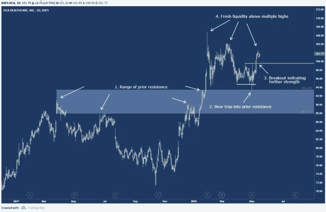
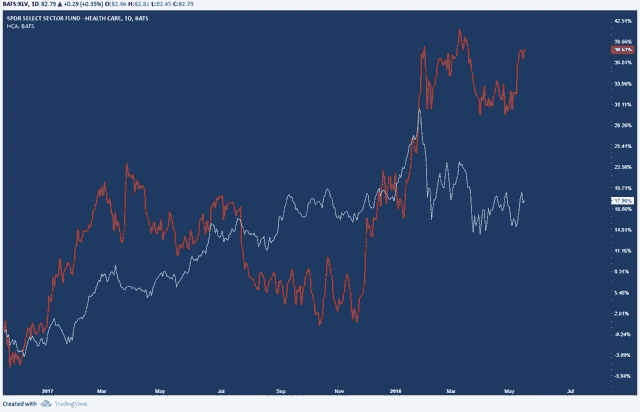
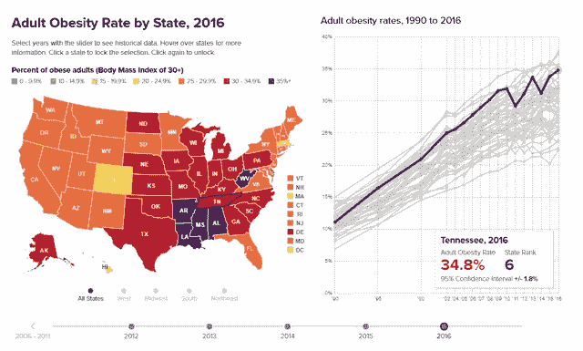
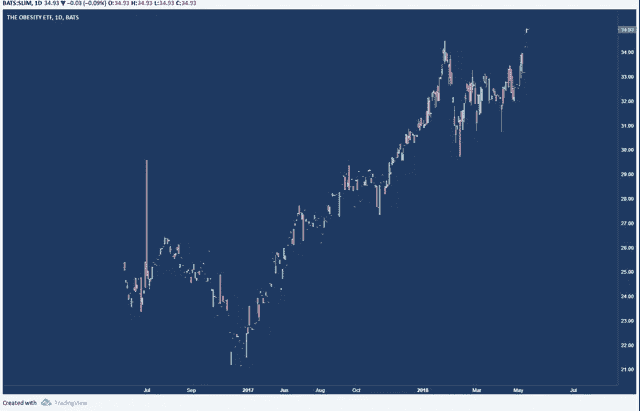
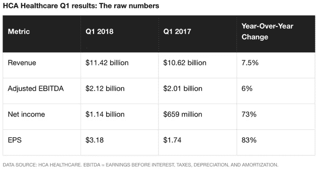

# HCA 医疗保健在沉重的担忧中显得轻松

> 原文：<https://medium.datadriveninvestor.com/hca-healthcare-looking-light-amid-weighty-concerns-a93b0e10bdaa?source=collection_archive---------6----------------------->

# 摘要

*   HCA 受到最近收益报告的鼓舞。
*   技术面为中期新高做准备。
*   基本面看起来也很强劲。
*   美国的健康状况。

在 [HCA](https://seekingalpha.com/symbol/HCA) 本月盈利之后，有基本的理由看好这家全球最大的上市医疗保健公司。

HCA 是一家营利性医疗机构运营商，在美国和英国运营着 250 多家医疗机构。

有一个非常强大的技术原因是看多 HCA，以及基本面的原因，我们将探讨。

下图展示了 HCA 大约一年半的价格数据。

在该股广泛上涨趋势的背后，有完美的技术结构来表明更多的上涨空间。

**进一步分解图表及其注释:**

*   我们可以看到价格已经突破了之前的长期阻力区域(浅蓝色方框)。这个区域，从 90 美元到 93.50 美元，以相当大的力量被打破——这正是我喜欢看到的。
*   像这样一个区域的强力推进表明供需严重失衡。
*   除了这种不平衡，我们还发现在这一领域又出现了购买，这次是最近。任何在(2)附近做空的人都会被浅蓝色区域的下跌所套牢。
*   锦上添花的是，我们现在再次突破了短期高点。这表明 99.50 美元区域是一个很好的做多区域。
*   从绿线(99.50 美元)开始，可以抢先突破 107 美元附近的历史高点。

将 HCA 与基准医疗 ETF[XLV](https://seekingalpha.com/symbol/XLV)进行比较，我们可以看到 HCA 的表现远胜一筹。

这张图表显示了相对价格之间的差距。XLV 包含广泛的医疗保健行业股票——43%的制药、23%的医疗保健设备、16.6%的医疗保健提供商。对于 HCA 来说，要跑赢所有这些行业，就要超出预期。

由于 XLV 的权重，也许这不是最好的衡量标准。虽然我们可以看到 HCA 的表现相对较好，但我们必须看看其他衡量成功的标准。

从根本上说，HCA 的每股收益大幅下降。他们的每股收益从 1.30 澳元升至 3.18 澳元，超出预期 55%。

虽然一些分析师认为这是美国严重流感季节的结果，但还有其他基本面因素在起作用。

就在两天前，2018 年 5 月 14 日，HCA 位于田纳西州的医疗系统 TriStar Health 宣布了一项投资超过 5 亿美元的决定，用于他们在田纳西州中部的医院网络。

这包括将纳什维尔第二大医院 TriStar Centennial 医疗中心扩建四层。

看看田纳西州的卫生统计数据可以揭示这项投资的一些潜在原因。

根据 StateOfObesity.org 的数据，田纳西州目前是成人肥胖率第六高的州。

这种连锁反应可能是 HCA 迫切要求投资该州资本的原因。从田纳西州的肥胖率图表中可以看出，肥胖率似乎没有下降。

肥胖率的上升也可以通过 [SLIM](https://seekingalpha.com/symbol/SLIM) ETF 得到证明。

斯利姆显示出相当大的上升势头。就在昨天(2018 年 5 月 15 日)，斯利姆的价格达到了历史最高水平。尽管健康和生活方式产品的增加，肥胖症的流行似乎还没有完全结束。

肥胖，加上美国人口老龄化，标志着疾病的两个主要风险因素，因此医院就诊人数增加。

这种现象在全国以及 HCA 的第二大地区——英国都可以看到。

HCA 预计将在 2018 年产生超过 450 亿美元的净收入。HCA 占全国医院支出的 5%,它仍在巩固自己作为美国最大医院系统的地位。

与最接近的竞争对手相比，HCA 在某些领域拥有 25%的市场份额。HCA 每年在医院用品上花费近 75 亿美元，实现了远超竞争对手的规模经济。特许权和购买力使他们能够充分控制自己的供应商。

在管理层于 2017 年 12 月通过宣布[新的季度股息](https://www.fool.com/investing/2018/01/31/hca-healthcare-turns-on-its-dividend-spigot.aspx)表明他们的积极态度后，他们的收入在本季度也大幅飙升。

这给了投资者多种乐观的理由。HCA 的同比涨幅巨大。每股收益同比增长近一倍，净利润紧随其后。

诚然，近一半的涨幅(1.11 美元)可归因于房地产销售和 9200 万美元的税收优惠。尽管这些异常事件提振了每股收益，但 HCA 管理层仍然坚定不移，目标是到年中每股收益增长 47%。

展望未来，HCA 最近宣布了一项举措，以进一步扩大其在英国的立足点。HCA 已经是伦敦排名第一的私人医院集团，现在他们正在伯明翰投资一家全新的医院，目前他们每年在英国治疗 80 万名患者。

这使得 HCA 在利用英国日益增长的私人医疗行业方面处于有利地位。分析师认为，到 2025 年底，这个市场可能从 2016 年的 116 亿美元扩大到 140 亿美元。

HCA 继续表现出强劲的迹象，无论是在技术上还是基本面上，使其成为大多数投资组合的理想选择。

**披露:**我/我们在提及的任何股票中没有头寸，并且在接下来的 72 小时内没有建立任何头寸的计划。