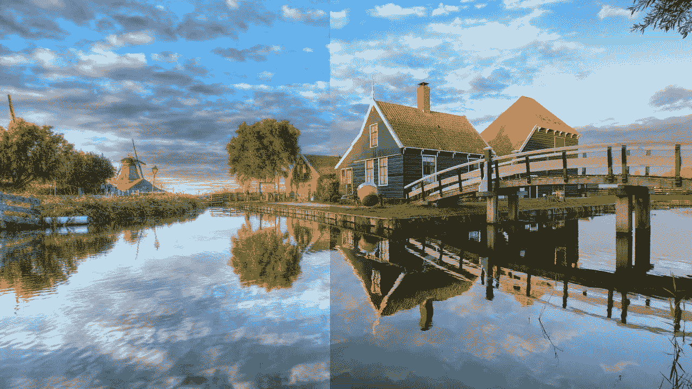
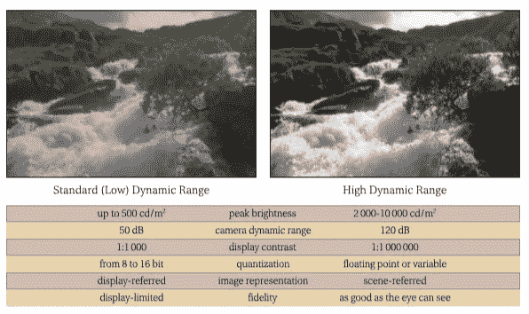
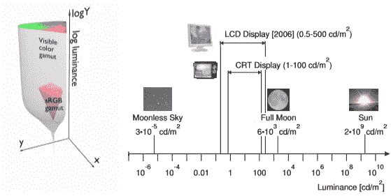
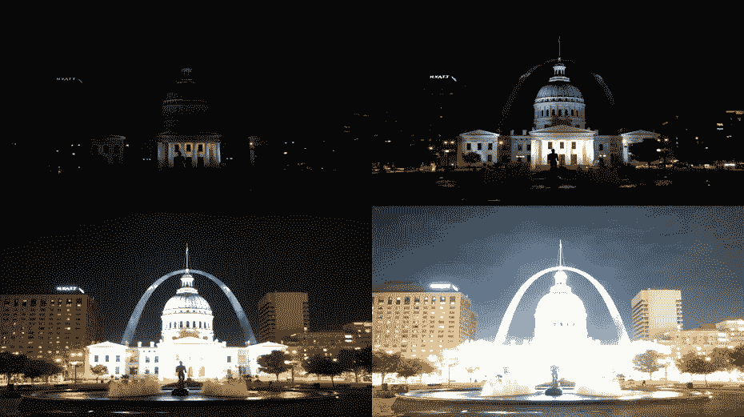
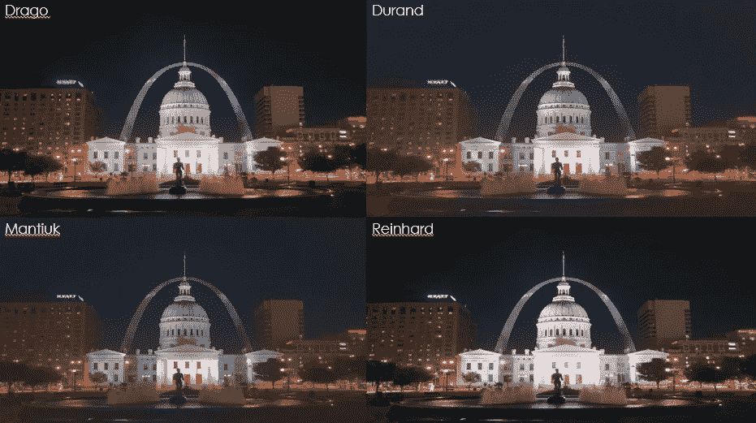
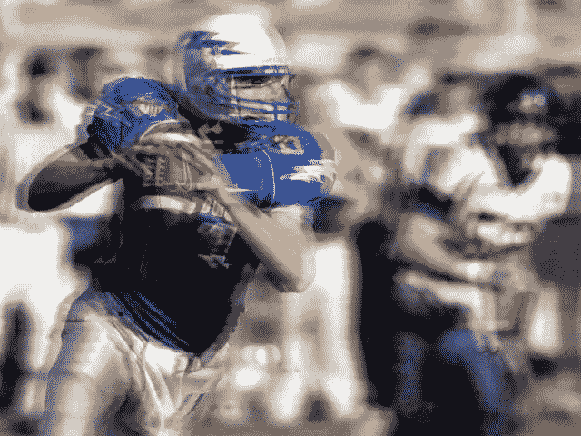
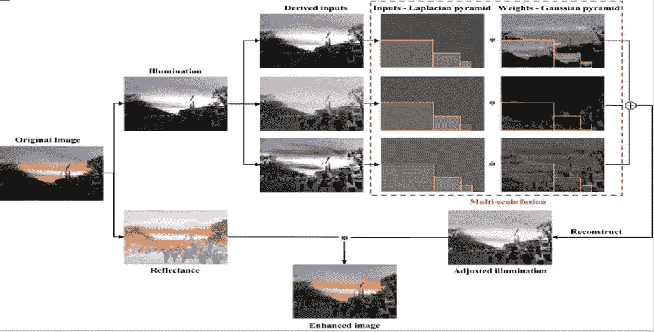
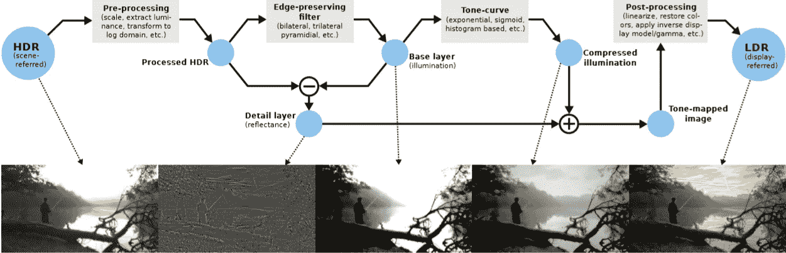
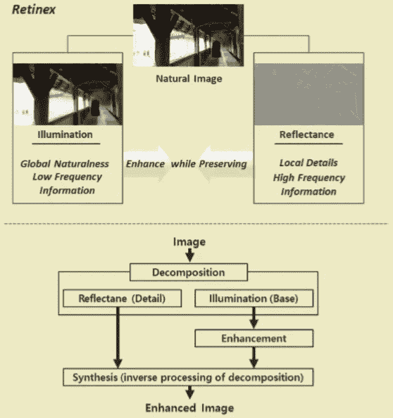
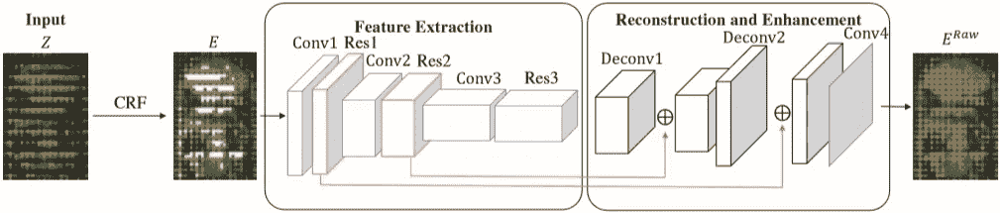

# HDR-什么是 HDR 成像&如何产生它？

> 原文：<https://medium.datadriveninvestor.com/hdr-imaging-what-how-to-generate-2d0a25ad262e?source=collection_archive---------0----------------------->

HDR vs SDR Image

# 什么是 HDR 形象？？

> [**高动态范围成像** ( **HDRI** )](https://en.wikipedia.org/wiki/High-dynamic-range_imaging) 是一种[高动态范围](https://en.wikipedia.org/wiki/High_dynamic_range) (HDR)技术，用于成像和[摄影](https://en.wikipedia.org/wiki/Photography)中，以再现比标准[数字成像](https://en.wikipedia.org/wiki/Digital_imaging)或摄影技术更大的[动态范围](https://en.wikipedia.org/wiki/Dynamic_range#Photography)的[光度](https://en.wikipedia.org/wiki/Luminosity)。

## HDR vs LDR 图片

Statistical Analysis of LDR vs HDR images

## HDR 成像技术的需求是什么？？

但是为什么我们需要增加光度的范围。答案就在我们的眼前——毫不夸张地说。事实是，与设备相比，我们的眼睛对我们丰富多彩的世界要敏感许多倍。这也可以从图像中得到证明，该图像清楚地显示了可见颜色[色域](https://en.wikipedia.org/wiki/Gamut)和 sRGB 色域之间的差异。促使人们找到解决这个问题的方法。

Visible vs standard RGB gamut

处理这个问题基本上有两种方法。

1.  **改进硬件:**这个分支的解决方案基本上包括改进相机的硬件技术，比如增加镜头的感光度等。但这样做的基本问题是硬件只能提高到一定程度。此外，通常需要特殊情况，如静态图像背景(即图像在处理过程中不应改变)或拍摄多幅图像，以生成 HDR 图像，这是不可行的。
2.  **基于图像处理的技术:**这些技术更可行，因为它们涉及将 LDR 或 SDR 图像修改成 HDR 图像。这些技术不需要任何特殊要求，比如静态图像或拍摄多张快照，您只需要一张图像，其余的由您的代码完成。

 [## 修复摄影|数据驱动的投资者

### 汤姆·津伯洛夫在转向摄影之前曾在南加州大学学习音乐。作为一个…

www.datadriveninvestor.com](https://www.datadriveninvestor.com/2019/03/22/fixing-photography/) 

# HDR 图像生成方法:

目前，随着深度学习技术的出现，如 CNN、GANs 等，生成的 HDR 图像几乎与我们看到的相似，有时甚至更好(LOL！！).但是通过这篇文章，我想带你了解 HDR 成像技术是如何发展的。

基本上，在阅读了研究人员提出的各种技术后，我将所有的 HDRI 技术分为以下几类:

1.  方法使用多幅图像
2.  使用单一图像的手动方法
3.  使用单一图像的深度学习方法

## 使用多幅图像的 HDRI 图像生成；

**基本原理:**

这类技术背后的基本思想是组合不同照明的图像，然后根据一个特定的方案组合这些图像，称为[色调映射](https://en.wikipedia.org/wiki/Tone_mapping)。产生这些不同照明的图像的一般方法是用不同的曝光持续时间捕获图像。曝光时间越长，图像越亮。

Images with varied illuminations

然后，我们根据特定的方案或数学方程式，用不同的照明组合这些图像。一种这样的方法是使用色调映射。维基百科中色调映射的定义如下:

> **色调映射**是在[图像处理](https://en.wikipedia.org/wiki/Image_processing)和[计算机图形](https://en.wikipedia.org/wiki/Computer_graphics)到[中使用的一种技术，将一组颜色](https://en.wikipedia.org/wiki/Map_(mathematics))映射到另一组颜色，以在具有更有限的[动态范围](https://en.wikipedia.org/wiki/Dynamic_range)的介质中近似[高动态范围图像](https://en.wikipedia.org/wiki/High-dynamic-range_imaging)的外观。

一些流行的色调映射技术有:

*   墨西哥紫檀
*   迪朗
*   赖因哈德
*   曼蒂乌克

HDR images using different tone mapping techniques

但是这些方法有许多困难。其中一些包括:

*   在不同的曝光下，图像不应该改变。如果发生这种情况，就会出现各种缺陷，如重影。
*   该方法高度依赖于用于生成图像的不同图像。如果图像有偏差曝光，那么 HDR 图像也将是不正确的。
*   这种方法肯定是麻烦和费时的，并且不是通用的。使用这种方法不能使用实时或人工设置来生成 HDR 图像

Example of Ghosting

## 利用单幅图像生成 HDR 图像；

这类 HDR 图像生成包括两组:

1.  人造方法，如过滤器，色调映射等。
2.  深度学习方法，如 GANs 等

**人为方法:**

这些方法基于与使用多幅图像的方法相同的原理，即这些方法也旨在用不同的照明来显影多幅图像，然后将它们组合以生成 HDR 图像，只是不同之处在于这些多幅图像是由该方法在内部制作的。

Fusion based HDR Image Generation

从上面的图像可以看出，该方法首先创建两幅图像，描述原始图像的光照和反射率。照明图像可以理解为原始图像的灰度版本，其中像素值描述了该像素的照明。而反射率可以理解为原始图像中描述颜色特征的部分。

然后，该方法生成各种照明的图像，并将它们组合以形成与真实世界图像(更高照明范围)成比例地描绘照明的图像。之后，照明和反射图像被组合以形成最终的 HDR 图像。

Pipeline of Fusion based HDRI Generation

另一个类似的方法在上面的图像中描述，在过滤器的帮助下，原始图像被分为基础和细节层(与照明和反射图像形成对比)。然后，从基础图像创建不同的图像，然后将其组合以形成具有宽照明范围的基础图像。细节图像保留了精细的边缘和其他应该被保留的这种定义特征。

这类 HDR 图像生成技术的另一个例子可以由下面的图像来证明:

Retinex — Another fusion based HDRI generation method

这些方法也各有利弊。这些方法的一些优点包括:

*   快速，可用于实时生态系统
*   需要更少的计算能力
*   可根据用户需求轻松操作

但是这些方法也有缺点:

*   生成的图像不平滑，它们的边缘和其他细节可能会改变。
*   这些方法有时会降低图像的分辨率。

**基于深度学习的 HDR 图像生成方法:**

如今，随着更高计算能力的出现，涉及数百万参数计算的深度学习方法已经变得现实。同样，这些深度学习方法也可以用于生成 HDR 图像，并且生成的图像确实非常好，有时甚至在美丽或吸引力方面超过了原始场景。

Deep Learning Based HDR Image Generation Method

从上图中可以看出一种生成 HDR 图像的深度学习方法。

这些深冲方法的优点是显而易见的，它通常能产生最好的效果。但是如前所述，这些方法也有缺点:

*   它们需要大量的训练图像，这可能是一项困难的任务。
*   训练阶段花费的时间是巨大的(有一次我花了一个月来训练一个模型)。

## 参考资料:

*   **高动态范围成像，由**rafak . manti uk、凯罗尔·米斯基和汉斯-彼得·塞德尔拍摄，2016 年 4 月 18 日
*   G. Eilertsen、R. K. Mantiuk、J. Unger 对高动态范围视频色调映射算法的比较综述
*   **基于视觉显著性和堆栈扩展的高动态范围成像重影消除**作者:王子杰、柳琴、池永武
*   **图尔盖·切利克，塔尔迪 Tjahjadi，IEEE 图像处理汇刊，2011**
*   **LIME** : **Low** - **光照图像增强**经光照图估计作者 X 郭，Y 李，H 凌 IEEE 图像处理汇刊第 26 卷第 2 期 2017 年 2 月
*   **非均匀光照图像的自然保持增强算法**王，郑，胡，李，IEEE 图像处理学报，2013 年 9 月第 22 卷第 9 期
*   **一种用于彩色图像增强的快速多尺度 retinex 算法**王，李，郑，冼，2008 年小波分析与模式识别国际会议论文集，香港，2008 年 8 月 30-31 日
*   **一种基于融合的弱光照图像增强方法**傅，曾德禄，，，廖，丁兴浩，，欧洲信号处理协会，2016

在这篇博客中，我希望介绍 HDR 图像的概念和它的生成技术。在本系列的下一篇教程中，我将介绍我开发的 HDRI 方法，即:**使用 ILP(反转局部模式)的 HDR 图像生成方法及其饱和度补偿**，这是对夏世昌、郭廷增的论文*“通过反转局部模式生成高性能高动态图像”*中讨论的方法的改进。