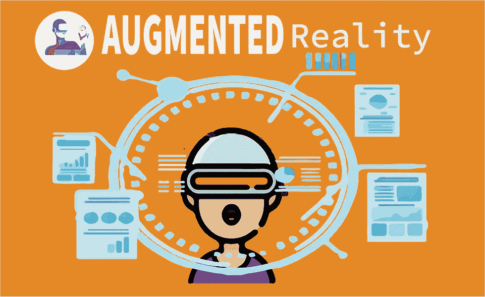
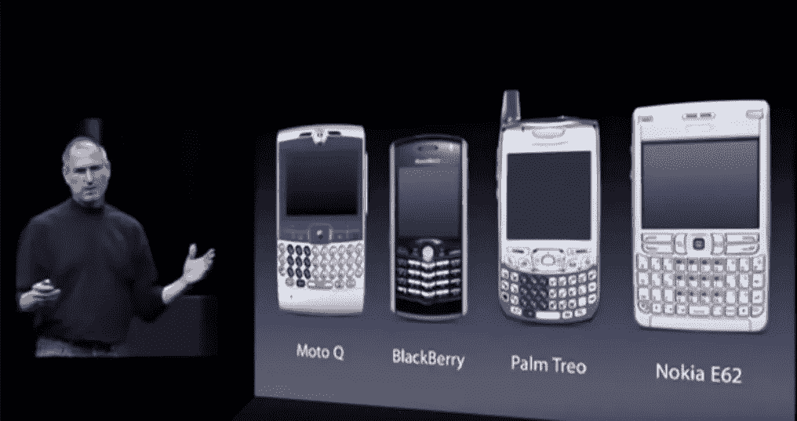
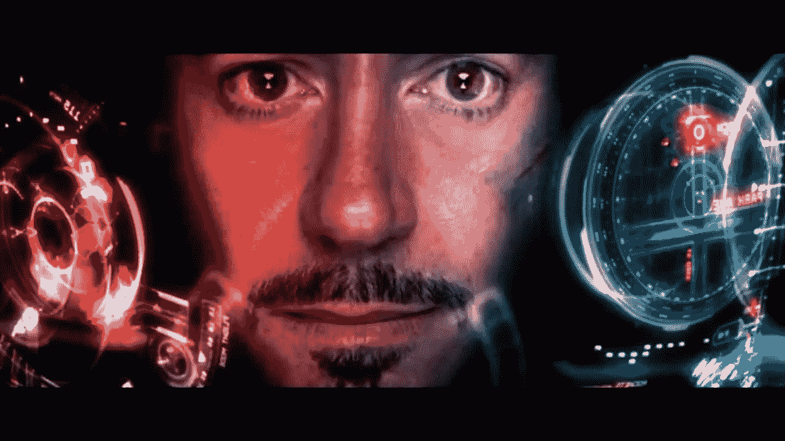

# 头戴式设备和增强现实

> 原文：<https://medium.datadriveninvestor.com/head-mounted-devices-and-augmented-reality-9cbacbb23290?source=collection_archive---------14----------------------->

Made by Mayank Jethwa

想分享一些关于 Oculus Rift、HoloLens 和 Magic Leap 等虚拟现实设备的想法。在学术论文和期刊中，这些类型的设备被称为头戴式设备。还有，HoloLens 渲染增强现实。

> 为什么要看这篇文章？我是谁？

 [## 人工智能和虚拟现实的融合-你能期待什么|数据驱动的投资者

### 在技术领域，融合是合乎逻辑的一步。就在几十年前，你可能需要一个专门的…

www.datadriveninvestor.com](https://www.datadriveninvestor.com/2018/08/30/the-convergence-of-ai-rv-what-you-can-expect/) 

我是一名大学四年级毕业生。我一直致力于使用增强现实制作应用程序，使用 JavaScript 框架制作网站。要检查我是否正确:

 [## 马希尔·巴夫萨尔

### 编辑描述

www.youtube.com](https://www.youtube.com/channel/UCxCAx-WV3V0iypgtJDRS40A)  [## Maher Bhavsar -培养基

### 阅读 Maher Bhavsar 在媒体上的文章。嗨，我是增强现实，网站开发，内容的爱好者…

medium.com](https://medium.com/@maherbhavsar) 

你可以慢慢来，什么时候进入这个领域**因为当你进入这个领域时，作为一个开发者、初创公司、顾问、商人、投资者、政府等都很重要。**我确实对许多事情知之甚少，但我确实有一些开发网站和增强现实应用程序的经验，并且我在团队工作时使用了当前的更新来构建增强现实应用程序，所以我认为我有一个对您和您的时间有价值的观点。

> 所以我想我有一个对你和你的时间有价值的观点。

现在，特别针对这些类型的设备的原因是将它们与移动电话进行比较。想想第一款智能手机发布前使用的手机。也许，有可能很多读者可能以前没有见过这些手机，让我给你看看。

Image from Steve Jobs presentation in 2007

我在说什么？？嗯，因为手机和头戴式设备之间存在关联。头戴式设备迟早会发生变化，这将使它们类似于眼镜或墨镜。

> 想想吧。然后呢？

嗯，眼镜会永远留在我们的眼睛上。他们有能力渲染虚拟现实。但我想通过增强现实的光。增强现实将虚拟物体放在我们的周围环境中，而在虚拟现实中，它创建了一个完全虚拟的环境。因此，当人们行走、与他人交谈或处理一些物理对象时，他们可能想要退出虚拟环境。

这就是增强现实的用武之地。除非摘掉眼镜，否则增强现实将永远存在。这项技术将补充现实世界中的物体，然后它将在这个现实世界中添加更多的信息和物体。虚拟对象将与互联网连接，然后从渲染服务器的云中带来定制的对象。

你可能会认为你在 AR 中查看社交媒体，在 AR 中阅读媒体，观看视频，在 AR 中与朋友交谈。从现在起 10 年后，可能不再需要移动设备，这可以证明与 10-20 年前移动设备的兴起有关。头戴式设备也会引发同样的循环。他们需要变得更小、更便宜、更强大，以获得全球的期望。

> 它改变了什么？

Image Credits: [https://movies.stackexchange.com/questions/76624/first-in-helmet-shots-like-iron-man](https://movies.stackexchange.com/questions/76624/first-in-helmet-shots-like-iron-man)

> 你会成为钢铁侠，或者更多。

我认为它有能力以新的方式解决老问题。就像你可以解释现实世界中的三维科学过程，就像一部动画电影，或者视频呼叫某人，只有头像或人脸被看到。它可能有助于同时显示许多不同的统计数据，或者从多个图表中可视化一个结果，等等，等等。

当我们在其中加入人工智能或通过机器学习和数据挖掘时，这变得非常有趣，我们真正了解了对最终消费者来说什么是重要的，并给他们这些东西(营销和广告)。我个人认为这就是五大互联网公司的目的。

我不想给人不切实际的希望。这是要发生的。也许不是 3 年后，但肯定是 10 年后。未来十年将有许多新公司成立。将会有巨大的潜力、竞争和投资(世界上的钱比 10-15 年前多)。

> 但对你来说最重要的是…

如果你对制作应用程序和网站感兴趣，关注虚拟现实和增强现实。你不会想在聚会上迟到的。

有一种可能性的创造性，可以保持或与这种技术或产品或服务的经验可以提供。这种开车或看风景的经历包括新家、新书、新网站、新鞋等。

当你不能向你的客户展示实物产品时，或者如果你想让你的产品全天候出现在你的客户面前时，这是很有用的。

谢谢你的时间。感谢你阅读我的文章。评论下面，想听听大家的想法。祝你愉快。马赫。