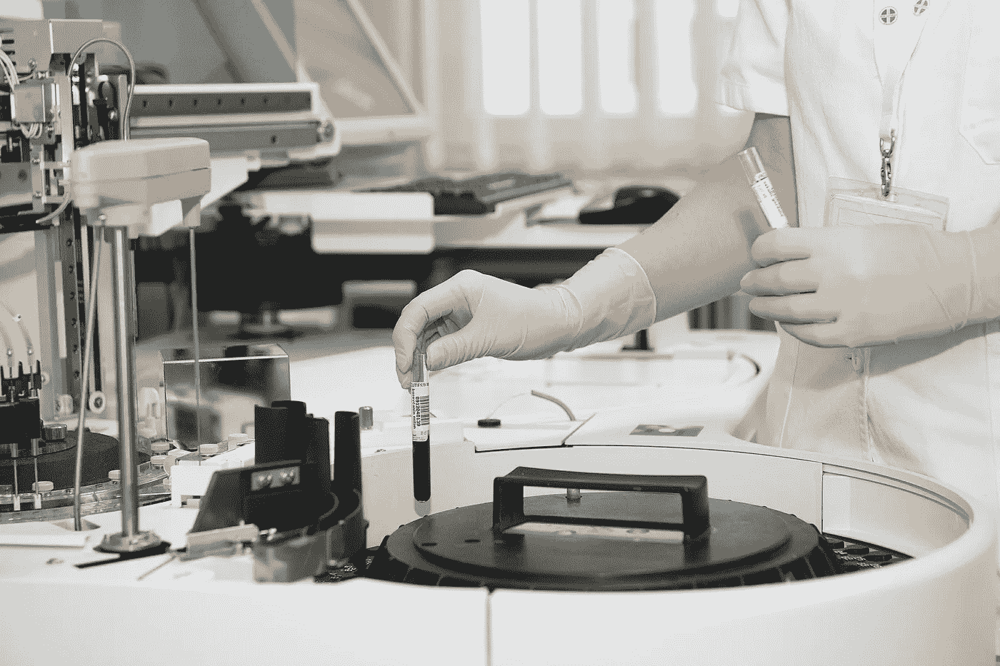

# 健康、财富和科技:健康科技创业场景介绍

> 原文：<https://medium.datadriveninvestor.com/health-and-wealth-the-health-tech-startup-scene-a823bf9ef971?source=collection_archive---------4----------------------->

有很多关于金融科技和在该领域工作的初创公司环境的文章。许多虚拟的专栏英寸和小时的阅读时间都给了游戏。在世界各地的科技会议上，人们都在讨论旅行的未来。这是理所当然的——这些都是科技界乃至整个世界的重要问题。

但是一个相对较少被关注的领域是健康技术。这当然不是一个未知数，制药行业中一些最大的公司已经在研发上投入了数十亿美元，我们如何数字化医疗保健是一个巨大的话题。但是，考虑到创业公司受到的普遍关注，字面意义上的救生技术几乎排在最后，这有点奇怪。

这并不意味着没有工作在进行。北欧初创公司新闻网站 Silicon Canals 最近分别整理了北爱尔兰和荷兰 T2 的健康科技初创公司名单。

 [## 大笔资金和尖端技术:人工智能/人工智能投资将如何革新医疗保健…

### 在过去几年中，人工智能()和机器学习(ML)的显著发展之一是…

www.datadriveninvestor.com](https://www.datadriveninvestor.com/2018/03/22/big-money-and-cutting-edge-technology-how-investment-in-ai-ml-will-revolutionize-the-healthcare-industry/) 

# **健康的增长水平**

以 Sensum 为例。这家总部位于贝尔法斯特的初创公司为一个行业制作软件，该行业希望做一些非常独特的事情:理解人类的情感。该公司表示，Sensum 的产品 Synsis 是“人类状态的通用分类器——从市场上最广泛的传感器和数据中实时建模用户的情绪、行为和生理”。

它分三个阶段工作——测量人类数据，使用“已建立的心理模型”解释数据，以及“增强”客户的产品。它表示，通过帮助产品“最终理解使用它们的人，并做出适当的反应”，它完成了最后一个阶段。

据 Silicon Canals 称，该公司拥有一系列知名客户，包括福特、BBC、联合利华和思科。它在两轮融资中为€筹集了 140 万英镑。

另一个更加以消费者为中心的产品已经设计出来，帮助用户了解他们的认知健康。Silicon Canals 表示，BrainWaveBank“通过监测娱乐时的脑电波活动来测量认知表现，参与测试你认知健康特定方面的手机游戏。”

它说，每周玩几次这些游戏可以创造用户认知健康的记录。对该记录的分析让用户了解他们的表现如何随着时间的推移而变化，以及睡眠、饮食和锻炼等因素如何影响他们的表现。这听起来很像你大脑的 Fitbit，该产品显然给投资者留下了深刻的印象，因为该公司已经在五轮融资中获得了 300 万英镑的资金。

还有一个例子值得一看。Techworld 在其最佳英国医疗保健初创公司名单中列出了 Elder，它将脆弱的老年人与家中的医疗保健专业人员联系起来。目的是让老年人住在自己的家里，而不是搬到养老院。

与其他一些创业公司相比，这没有那么超前，但价值不减，因为它创造了一种帮助弱势群体的简单方式，并在这一过程中创造了效率节约。

# **射程**

这一点也值得考虑。医疗科技初创企业的情况非常多样化；技术专家创造了应用程序和公司，在医疗保健过程的每个阶段提供帮助:身体、精神、安全、预防、诊断和管理，就像 Elder 一样。

对于科技创业公司来说，管理问题——比如更有效地将患者与正确类型的医疗保健提供商联系起来，或者腾出医院的床位——不是最“性感”的领域，但它们肯定是有价值的。

NHS 详细谈论了它的数字化雄心，认为数字化可以在一定程度上解决它面临的巨大预算问题。虽然英国的医疗保健问题是一个严重的政治化问题，许多人认为唯一正确的答案是增加预算，但大多数人也同意，将技术解决方案智能应用于整个医疗保健基础设施真的会有所不同。

这或许就是为什么在英国和欧洲有如此繁荣的健康科技创业生态系统——正如我们所见，来自爱尔兰、荷兰和英国的公司都获得了数百万的风险投资资金。据推测，这些投资者知道，这些解决方案最终将被证明对 NHS 等医疗服务机构具有不可估量的价值。

对于一名技术工人来说，健康创业场景可能是梦想成真——拥有大量预算的大公司正在做令人兴奋的——但可能更重要的是——拯救生命的有价值的工作。

[*本文原载于 RedCat Digital*](https://www.redcat-digital.com/health-tech-startup-scene/)