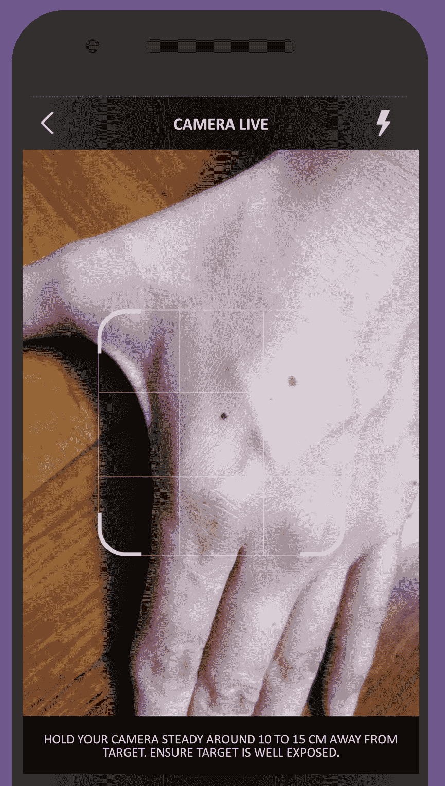
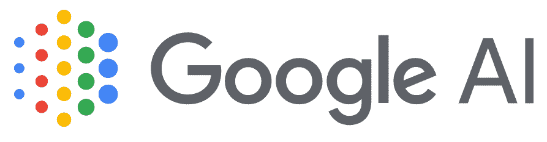
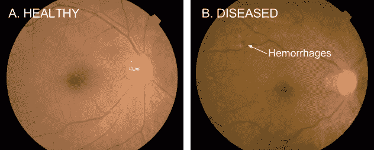

# 医疗保健 5.0 —从代码到临床

> 原文：<https://medium.datadriveninvestor.com/healthcare-5-0-from-codes-to-clinic-35023cbe1f1e?source=collection_archive---------32----------------------->

人工智能(AI)确实是我们这一代人的**转型技术，尽管它在医疗保健领域的实用性仍有待充分感受——现实生活中对有前途的人工智能初创公司的部署和资助正在不断增长。我们预测，在十年内，人工智能将被视为医疗保健的补充力量——尽管它可能不会完全取代专业人员的传统角色，但人工智能肯定可以扰乱医疗保健，使其变得更好、更快、更便宜和更容易获得。**

医疗人工智能在非特权社区的好处不能被夸大。人工智能可以在全球范围内拯救生命(和你的口袋)。

那么，在这个从代码到临床的新兴演变中，谁是这个充满希望的行业的推动者和震动者呢？我们研究了几个，因为事实上，它们将塑造我们的未来。

1.  **斯坦福医学人工智能中心&成像(AIMI)**

https://aimi.stanford.edu/
斯坦福大学

*加州斯坦福*

*美利坚合众国*

**【状态】**R&D-进行中，私立大学

**他们正在从事的工作:**放射学深度学习、数据增强、X 射线/平片分析、体积胶片分析

**为什么看好:**斯坦福是世界知名的高等学府，拥有自己的医疗设施。斯坦福大学拥有包括柯蒂斯·朗洛茨教授在内的著名教师队伍，也有大量的资金和人力来资助他们的前沿研究。特别令人印象深刻的是，斯坦福组织了她自己的医学图像网，尽管数据集尚未向公众开放。

**潜在挑战:**放射学的深度学习可能不是最容易解决的领域。许多放射学模型需要体积评估(例如:CT/MRI ),如果用框架解释，可能没有临床意义，这一事实意味着斯坦福 AIMI 有一场相当大的战斗。放射学中的标签也是另一个潘多拉盒子。实变还是弗兰克肺炎？为了解决这个问题，斯坦福 AIMI 大学可能需要标准化和协议化这些标签。

**2。医好情报公司**

https://www.medgic.coT21
梅德吉克

*东海岸路*

*新加坡*

**【地位】**活跃、非营利、私人创业(独立)

**他们正在研究的内容:**皮肤病学深度学习、贝叶斯网络、皮肤分析、皮肤诊断、皮肤扫描、皮肤状况检测

**前景看好的原因:**med gic 可能是地球上第一个也是唯一一个解决所有皮肤病问题的公司(一开始就有相当惊人的准确性)，它是一家非营利性的初创公司，一直拒绝融资，迄今仍保持严格的独立性。它是由一组医生和计算机科学家在新加坡制造的。创始人 R Lim 博士表示，来自私人基金的资金“将使 Medgic 追逐金钱”，但“真正的投资回报是我们可以改变的生活数量。”

虽然 Medgic 没有被列为医疗设备，也没有声称具有诊断性或任何医疗准确性(等待需要更多资金的临床试验)，但[将其作为通用皮肤扫描仪、检测器和分析器](https://www.medgic.co)发布，以“仅提供通用的一般信息”。

**潜在挑战:**由于独立且规模小，该团队将很难推销自己，也很难让世界上偏远的角落了解这项技术。语言障碍可能是下一个大挑战——med gic AI 实际上会询问用户的皮肤状况——医学术语通常很难翻译。这一点尤其如此，因为 Medgic 正试图针对难以获得医疗保健的弱势群体。

**3。谷歌人工智能**

[https://ai.google/healthcare](https://ai.google/healthcare)谷歌

*加州山景城*

*美利坚合众国*

**【状态】**R&D-进行中，私人公司

**正在研究:**视网膜成像深度学习，病理学深度学习

**为什么他们很有前途:**谷歌人工智能毫无疑问是人工智能创新的祖父。在 2017 年的中国古代围棋比赛中， [AlphaGo 击败了凯杰，世界为之惊叹。从那时起，该团队一直致力于有意义的应用，如医学成像(如上)。天空确实是谷歌的极限。](https://www.theverge.com/2017/5/25/15689462/alphago-ke-jie-game-2-result-google-deepmind-china)

**潜在挑战:**病理学是一个重要的干扰领域，但该领域相对依赖于操作员。例如，病理载玻片可能会因操作员对染色的选择、数量和组合而有显著差异。视网膜造影术同样需要使用复杂的机器，许多专业人员可能仍然不熟练。话虽如此，但这些挑战是可以克服的，随着时间的推移是可以解决的。