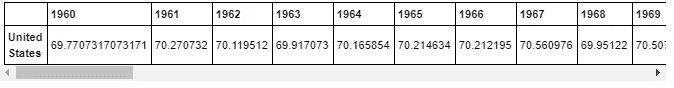
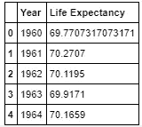
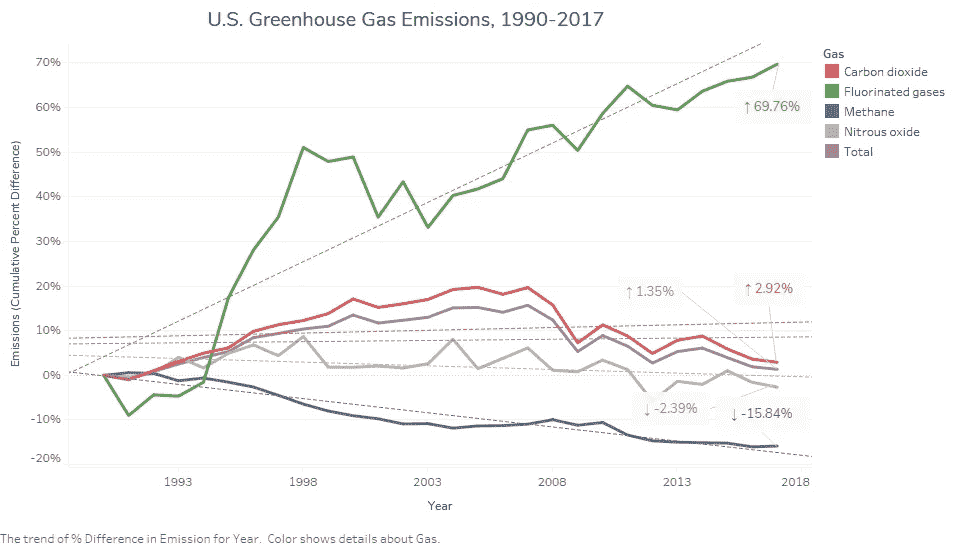
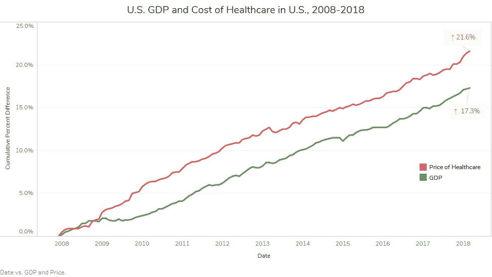
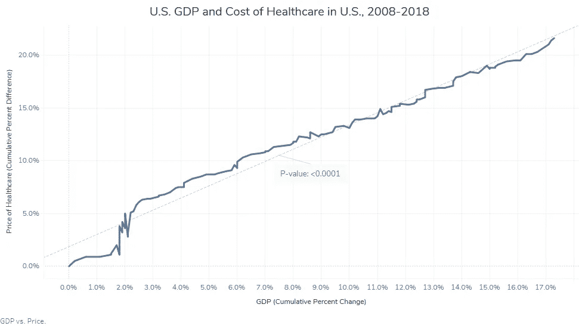
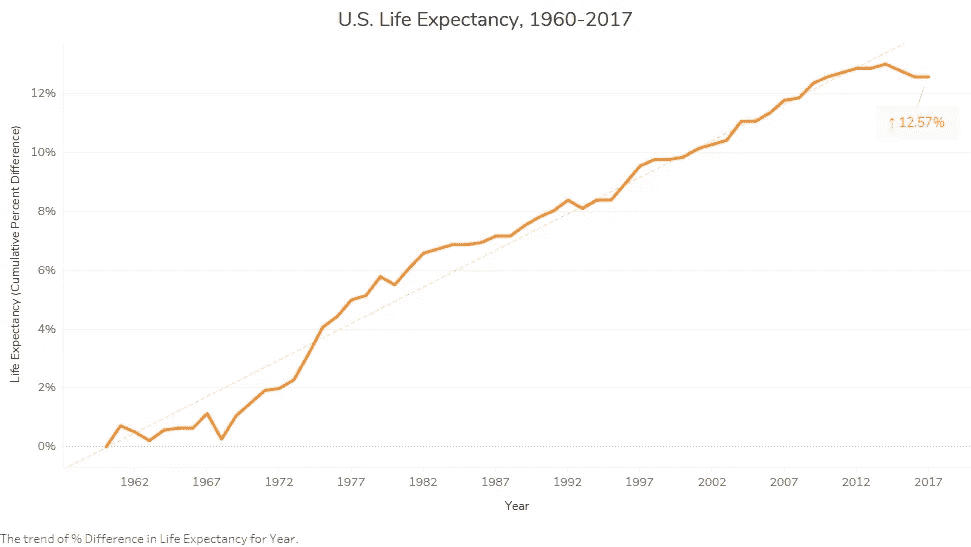
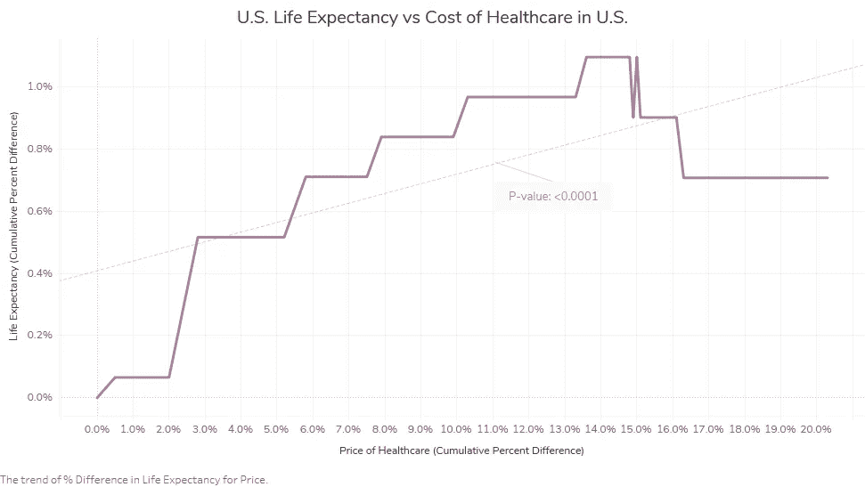
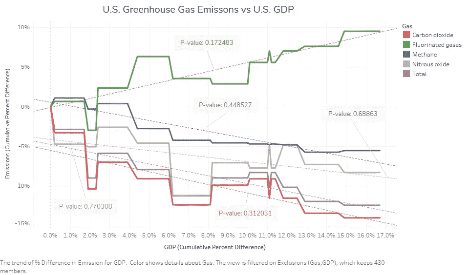
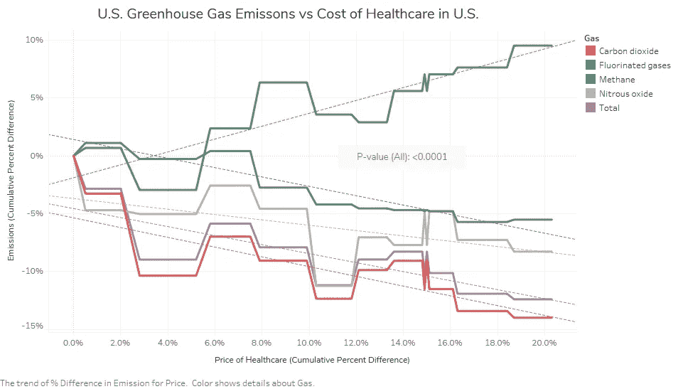
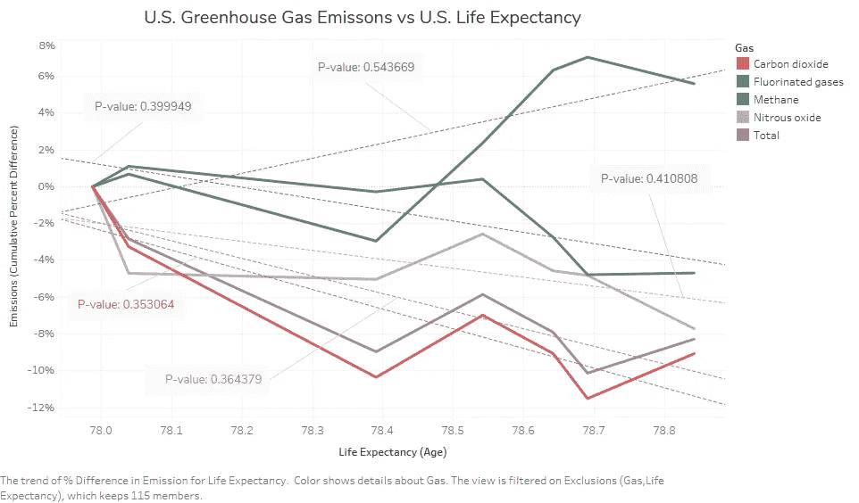

# 温室保健

> 原文：<https://medium.datadriveninvestor.com/healthcare-and-climate-change-f0e53f9d0852?source=collection_archive---------17----------------------->

温室气体和医疗保健之间有关系吗？


*Credit:* [*SD-Pictures*](https://pixabay.com/users/SD-Pictures-3553481/)

自从几年前气候变化成为一个主要话题以来，我一直很想知道不同的行业和部门将如何解决——或者忽视——这个问题。我去年年底读过一篇文章，题目是 [*，要想高效运转，美国的医疗体系将需要适应气候变化*](https://www.commonwealthfund.org/blog/2018/be-high-performing-us-health-system-will-need-adapt-climate-change)*。我发现这很有趣，因为健康产业是温室气体排放的主要来源。在这项分析中，我想看看我是否能找到温室气体排放和医疗保健——尤其是医疗保健成本——之间的关联。*

到目前为止，我还没有找到一项真正探索温室气体排放对美国卫生系统影响的研究。因此，很难找到足够的数据来对这一问题进行比较分析。所以，我自己汇总了一下。我发现不同的数据关注温室气体排放、医疗价格等方面的变化。这些年来；我把不同的数据集组合在一起。在这个分析中，我大量使用了 MySQL 和 Tableau，并通过 Jupytr Notebook 使用了一点 Python。

你可以在这里查看我的 Jupytr 笔记本。

TL；博士？没问题，直接跳到**结论**部分。

# 数据收集

在这次分析中，我使用了三个不同的数据集:

*   [1990-2017 年美国温室气体排放量(美国环保局)](https://cfpub.epa.gov/ghgdata/inventoryexplorer/)
*   [2007-2018 年美国医疗保健价格和国内生产总值的累计百分比变化(彼得森-KFF 卫生系统追踪)](https://www.healthsystemtracker.org/chart-collection/how-have-healthcare-prices-grown-in-the-u-s-over-time/#item-prices-for-health-care-have-grown-faster-than-prices-in-the-general-economy)
*   [1960-2017 年美国出生时预期寿命(世界银行)](https://data.worldbank.org/indicator/SP.DYN.LE00.IN?locations=US)

首先，我导入了我所有的数据集——它们都是。csv(逗号分隔值)文件——使用功能*作为数据帧。来自 python 库*熊猫*的 read_csv()* 。

```
*# read in my data from csv files*
usgreenhousegasDF = pd.read_csv('usgreenhousegas1990_2017.csv')
ushealthcarepricesDF = pd.read_csv('ushealthcareprices2008_2018.csv')
worldlifeexpectancyDF = pd.read_csv('worldlifeexpectancy1960_2017.csv')
```

接下来，我用熊猫函数*清理了我的数据帧。melt()* 它允许我重塑我的数据，由于某种原因，这些数据以列而不是行的形式存在。这里有一个例子:



I turned this ( ↑)…



…into this ( ↑).

```
Using this (↓):
uslifeexpectancyDF = uslifeexpectancyDF.melt(var_name="Year",value_name="Life Expectancy")
uslifeexpectancyDF.head()
```

清理完我的数据集后，我用熊猫的*导出了它们。to_csv()* 函数，准备填充我的 SQL 数据库。

```
usgreenhousegasDF.to_csv("datasets/usgreenhousegasemission_alt.csv",index=**False**)
usgreenhousegasRDF.to_csv("datasets/usgreenhousegasemission.csv",index=**False**)
ushealthcarepricesDF.to_csv("datasets/ushealthcareprices.csv",index=**False**)
uslifeexpectancyDF.to_csv("datasets/uslifeexpectancy.csv",index=**False**)
```

# 创建和填充我的 MySQL 数据库

SQL，代表*结构化查询语言*，是一种用于与数据库通信的语言。它被许多数据库管理系统使用，如 Oracle、Microsoft SQL Server、Amazon RDS 和 Access。对于这个分析项目，我使用了 MySQL——特别是一个名为 MySQL Workbench 和 MySQL Server 的软件，它允许我在我的系统(localhost)上托管我的数据库。创建 SQL 数据库是一个相当复杂的过程。不幸的是，这超出了本文的范围，所以我将为您解释这个过程。

[](https://www.datadriveninvestor.com/2019/01/23/which-is-more-promising-data-science-or-software-engineering/) [## 数据科学和软件工程哪个更有前途？数据驱动的投资者

### 大约一个月前，当我坐在咖啡馆里为一个客户开发网站时，我发现了这个女人…

www.datadriveninvestor.com](https://www.datadriveninvestor.com/2019/01/23/which-is-more-promising-data-science-or-software-engineering/) 

我在我的系统上设置了一个 MySQL 服务器；之后，我创建了一个名为“*infodata”*的数据库。从那里，我在' *infodata'* 中创建了一个名为' *infoproj6'* 的模式。这是我将数据集作为表导入的地方。

为了在我的' *infoproj6'* 模式中填充表，我必须首先连接到它。我使用 python 库 *sqlalchemy* 来实现这一点:

```
*# following code is based upon code provided by Prof. Brian C. Keegan, Ph.D.*

**from** **sqlalchemy** **import** create_engine

host = 'localhost'
port = 3306
user = 'root'

**with** open('pass.txt','r') **as** file:
    password = file.readline()

database = 'infoproj6'

engine = create_engine('mysql+mysqlconnector://**{0}**:**{1}**@**{2}**:**{3}**/**{4}**'.format(
    user,password,host,port,database),connect_args={'connect_timeout':1000})

conn = engine.connect()
```

从那里我用熊猫的*。to_sql()* 函数在我的模式中创建和填充表。

```
*# following code is based upon code provided by Prof. Brian C. Keegan, Ph.D.*

files = os.listdir('./datasets/')
csv_files = [f **for** f **in** files **if** '.csv' **in** f]
db_tables = pd.read_sql_query('show tables',conn)['Tables_in_infoproj6'].tolist()

**for** f **in** csv_files:
    table_name = f.split('.csv')[0]

    **if** table_name **not** **in** db_tables:
        _df = pd.read_csv('./datasets/' + f)

        **try**:
            _df.to_sql(name = table_name,
                       con = conn,
                       if_exists = 'replace',
                       index = **False**,
                       chunksize = 1000000)

        **except**:
            print(table_name)
            **pass**
```

在那里，我使用 Tableau 访问和查询我的 MySQL 数据库，并进行分析和可视化。

# 数据分析

## 美国温室气体排放



自 1990 年以来，美国向大气中排放的温室气体越来越多。总的来说，美国每年排放的温室气体量增加了 1.35%。这看起来是个小数字，但相当于每年排放 8600 万公吨二氧化碳。这么多的二氧化碳可以填满 86 个边长 100 米(109 码)的立方体，相当于白宫面积的 1 . 25 倍。因此，这意味着在不到 30 年的时间里，美国释放的温室气体足以填满大约 12 个白宫。

我们已经看到含氟气体(人造气体)的排放量增加最多，增加了 69.76%；其次是二氧化碳，增幅为 2.925%。实际上，我们已经看到一氧化二氮(笑气)和甲烷的排放量总体下降，分别下降了 2.39%和 15.84%。

## 美国国内生产总值和医疗保健成本



自 2008 年以来，医疗费用已经上涨了 21.6%。相反，国内生产总值也上升了 17.3%。为了看看这两个变量是否有任何联系，我将它们进行了对比。



对比美国医疗价格的变化和美国 GDP 的变化，我们得到了一个有争议的 P 值。

## 美国温室气体排放与预期寿命



与医疗成本不同，预期寿命和温室气体排放之间似乎存在关联。这对我来说似乎很奇怪，我的直觉告诉我，我在某个地方走错了路。所以，我又运行了一次，得到了同样的结果。我不知道如何解释这个。这些数据表明，随着温室气体排放量的下降，人们的预期寿命会延长。但是，我们不要想得太多。



结论

## 那么，我们学到了什么？



温室气体排放和医疗费用之间似乎没有太大的关系。考虑到医疗行业对气候变化问题的积极贡献，以及在总体联邦层面上缺乏任何真正的措施来解决这一问题，医疗成本中没有考虑气候变化是有道理的。

我不知道这是麻烦还是解脱。我想这意味着我们还没有到气候变化的损害如此严重，以至于我们不得不将它纳入我们的健康计划的地步。

## 然而奇怪的是，预期寿命和温室气体排放之间似乎存在某种关联。这让我很担心。这似乎表明，我们对大气的持续污染正威胁着我们延长寿命的能力。



总之，我的数据似乎表明，温室气体排放还没有对医疗行业产生巨大影响。但是他们应该担心。我知道医生是[2]。我们也应该如此。也就是说，让我们对未来充满希望。我希望这一分析有助于激发你的好奇心，鼓励你探索气候变化，更深入地了解它是如何影响我们的。再见。

## 编后记



在结束这篇文章之前，我想指出我的分析中的一些局限性。首先也是最重要的，我的分析只和我从中提取的数据一样准确，所以不要完全相信这里写的任何东西。此外，鉴于缺乏围绕这一主题的可用数据集，我被选中研究医疗保健的成本和预期寿命，这可能不是对医疗保健影响的最佳指标。按照这种思路，我们必须记住相关性不是因果关系，因此尽管我的数据表明两个或更多因素之间存在或不存在相关性，但我们不能确定它们是否以某种方式相互影响，或者是否受到数据未考虑的外部因素的影响。无论如何，感谢阅读！

# Conclusion

So, what have we learned?

It would appear that there isn’t much of a relationship between greenhouse gas emissions and the cost of healthcare. Given that the health industry actively contributes to the problem of climate change, and the lack of any real steps at the overarching federal level to do much about this issue, it would make sense that climate change isn’t being accounted for in the cost of healthcare.

I’m not sure if this is troubling or a relief. I guess it means we are not at a point yet at the point when the damage of climate change is so bad that we have to factor it into our health plans.

Strangely though, there would appear to be some correlation between life expectancy and greenhouse gas emission. This worries me. It would seem to suggest that our continual pollution of the atmosphere is threatening our capacity to live longer.

So in conclusion, my data seems to suggest that greenhouse gas emission aren’t having a massive impact on the health industry, yet. But they should be worried. I know that doctors are [2]. And we should be too. That being said, let’s be hopeful for the future. And I hope this analysis helped spark your curiosity and encourage you to explore climate change and dig deeper into the ways in which it’s affecting us. Ciao!

# Afterword

Before closing out this piece, I would like to point out some limitations in my analysis. First and foremost, my analysis is only as accurate as the data from which I pulled, so do take everything written here with a grain of salt. Also, given the lack of available datasets surrounding this topic, I was chose to look at the cost of healthcare and life expectancy, which are perhaps not the best indicators of impact on healthcare. Along this vein, we must remember that correlation is not causation, so despite my data indicating that there is, or is not, a correlation between two or more factors we can’t be certain that they do, or don’t, in some way influence each other or are affected by outside factors that the data doesn’t consider. Anyway, thanks for reading!