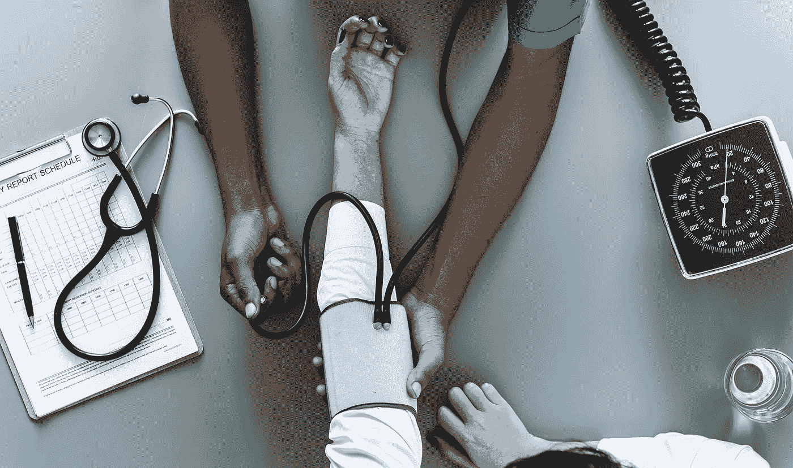

# 重新定义医疗保健

> 原文：<https://medium.datadriveninvestor.com/healthcare-of-the-future-7e2e45a7c0c7?source=collection_archive---------18----------------------->

快进到 2035 年。现在是早上 7:30，闹钟早已被你的数字健康指南温柔的低语取代，提醒你“你的睡眠周期已经结束，该吃药了”。当你迅速下床时，你看了一眼你的手臂，你注意到你的手机界面投射在上面——几乎像一个纹身，但功能更多。主屏幕显示您的药物将在 2 天内用完，但看医生或在药房前等待购买药物的长队不再存在。就像《星际迷航》(Star Trek)中的一集一样，Bones 拿出一台三录仪，诊断疾病，然后用低剂量喷雾治愈疾病，2035 年的技术已经使家庭患者监测和治疗成为常态。

*现在，你可以在预约后几分钟内与医生进行视频咨询，之后你可以在几秒钟内打印出正确类型的正确数量的药物——只需使用政府推出的按需制药业机器，以减少药品生产的巨大时空需求(通常需要长达 12 个月的时间，在几个阶段需要大量的中间库存)。*

*一个小时后，你已经坐上了无人驾驶汽车，踏上了上班的道路。当你听着完美的“唤醒”播放列表时，你开始感到虚弱，潮红迅速蔓延到你的全身和面部——就像躺在阳光下一样——然后你失去了知觉。你发现自己在医院里，被手术灯和一个没有知觉的钢铁手臂在你周围操纵而惊醒。由于方向盘后的医疗问题极其危险，一场新的安全革命已经发生——允许汽车对医疗紧急情况做出反应。健康传感器与自动驾驶技术相结合，能够捕捉皮肤表面温度的细微变化，检测你不断增加的心脏脉搏，使车辆停下来，并拨打 999 寻求医疗援助——换句话说，你的汽车能够挽救你的生命。*

这只是人工智能可能给整个护理连续体带来的范式转变的一个示例场景，这一切都是由医疗保健数据可用性的增加和分析技术的快速进步推动的。从重新定义药物发现和患者体验到解决 NHS 面临的日常问题，如等待时间和其他关键服务，几乎有无限的机会来利用这项技术。

## 保持健康

借鉴上面的例子，人工智能驱动的健康指南可以帮助人们坚持使用他们的处方药物，改善患者安全，消除处方错误和混淆——导致每年多达 22，300 人死亡，每年造成 16 亿美元的经济损失。此外，这将使医疗从业者对他们所护理的人的日常模式和需求有一个 e [增强的理解](https://www.pwc.com/gx/en/industries/healthcare/publications/ai-robotics-new-health/transforming-healthcare.html)，从而导致更好的反馈、指导和支持

## 早期发现

早期检测被视为人工智能最有前途的应用之一，计算机已经能够比人类更准确地识别一些疾病。DeepMind 的人工智能技术(与伦敦 Moorfields 眼科医院合作)旨在分析 3D 视网膜扫描，以发现主要眼病的迹象，就是一个例子。

初步研究结果显示，在对 997 名患者进行扫描测试时，该算法(T4)在对近 7500 名患者的 14.884 次匿名 OCT 扫描中进行了训练，在转诊方面优于穆尔菲尔德大学的 8 名视网膜专家。斯坦福大学的研究项目“CheXNet ”也取得了类似的成功，展示了人工智能在该领域的巨大潜力。在该项目中，人工智能被用于根据患者的胸部 x 光片诊断肺炎。

特里萨·梅最近做出的[承诺也反映了提高诊断准确性的动力，即通过在 NHS 中部署人工智能来改革医疗服务，以更好地针对风险人群，并提高早期诊断率，这远远落后于英国在欧洲的同行。](https://www.telegraph.co.uk/news/2018/10/03/theresa-may-tells-tragic-tale-god-daughters-cancer-death-announces/)

与其他技术结合使用，人工智能还将允许制定个性化的治疗计划。可穿戴技术跟踪的数据，如心率、活动、睡眠模式，甚至一系列生物标记，如我们汗液中的生物标记，将允许开发高度个性化和更加主动的护理，使医疗保健更加高效和准确。

## 人工智能辅助手术

随着技术的发展，我们也有可能看到机器人接管目前由医生完成的广泛任务，包括进行外科手术——允许在手术过程中提高精确度，减少疼痛，加快患者康复。普华永道最近的一项研究发现，英国近三分之一(30%)的患者愿意接受人工智能驱动系统进行的大型侵入性手术——特别是近一半的年轻人(18-24 岁)愿意接受(43%)。

## 人工智能、医疗保健和汽车行业

除了机器人，医疗保健、汽车和技术部门之间的融合也将对医疗保健的提供方式产生重大影响。未来的汽车将超越骑手“创伤预防”的安全功能，将是自主的，配备生物传感器，监测你的健康状况，并在你的健康指标发生异常变化时做出反应。其他理论家走得更远，认为车辆中的健康服务将扩展到精神健康和慢性病管理支持。

## 数字双胞胎

大量数据的可用性、更低的计算成本和更复杂的算法也吸引了健康专家对“数字双胞胎模拟技术”的关注——这只是一个过程、产品或服务的虚拟模型。然而，应用于医疗保健，这将意味着拥有人体的数字副本，但不是在“宏观”层面，而是在细胞或基因组层面。如果我们有以下六个器官的数字双胞胎——大脑、肺、心脏、肝脏、胰腺和肠道(通常与心肺疾病、糖尿病、阿尔茨海默氏症和腹泻有关)——我们就能够预测未来 20 年随着年龄的增长，哪些器官可能首先衰竭。通过物联网的连接和数据处理，我们将能够保持数字双胞胎相对于我们的身体保持最新，就像在物理世界一样，不仅预测而且影响我们如何改善我们的生活方式。

## 伦理问题

在围绕人工智能的希望和兴奋中，它在医疗保健领域的发展和部署并非没有挑战和限制。

从精简和标准化数据过程中发现的医学局限性(这是许多医生仍在患者档案上手写笔记的结果)到围绕所有权和责任的伦理挑战(以防智能算法产生错误预测)，我们距离上述场景仍有一段距离

[纳菲尔德生物伦理委员会最近的一项研究概述了一些关键的伦理问题，如果要实现人工智能技术的好处并保持公众信任，就需要考虑这些问题:](http://nuffieldbioethics.org/wp-content/uploads/Biological_and_health_data_web.pdf)

*   人工智能做出错误决定的可能性；
*   当 AI 被用于支持决策时，谁负责；
*   用于训练人工智能系统的数据存在固有偏差的风险；
*   确保潜在敏感数据的安全性和隐私性；
*   确保公众信任人工智能技术的开发和使用；
*   在护理情况下对人的尊严感和社会孤立感的影响；
*   对保健专业人员的角色和技能要求的影响；和
*   人工智能被用于恶意目的的可能性。

此外，机器学习的许多方面，如深度学习，都是在黑盒中运行的，缺乏可解释性和透明度会损害医患信任，而医患信任是有效医疗互动的基石。

到为了确保连贯和有效的护理，医疗界和人工智能开发者需要共同努力，建立期望和标准，不仅要保持患者和医生之间的信任，还要确保医疗保健技术得到正确部署和实施。