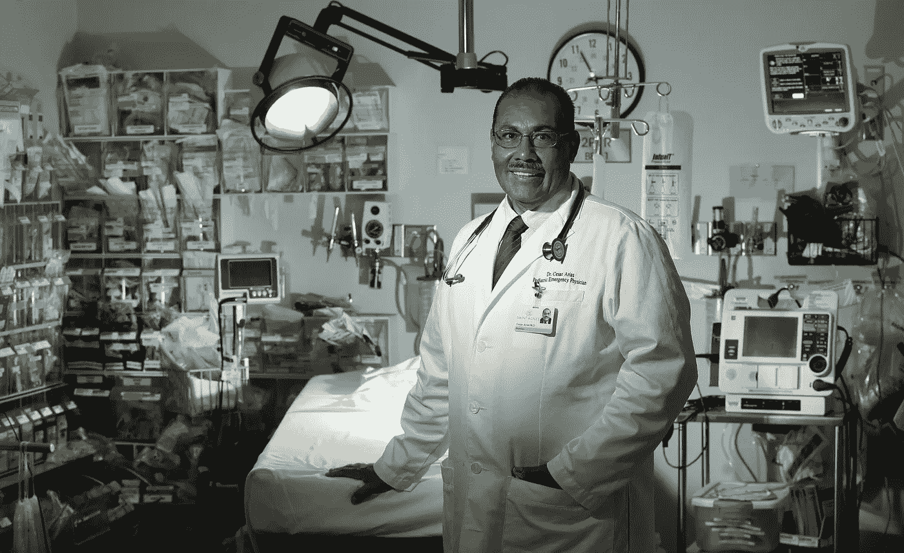

# 成为一名专业人士可以改善病人的感受和他们的护理

> 原文：<https://medium.datadriveninvestor.com/healthcare-pros-shape-up-stat-87197f69b0c1?source=collection_archive---------8----------------------->

## 更好的行为有助于关系朝着正确的方向发展

八月的行为问题。无论是他们如何对待病人还是与同事互动，提供者的行为都会给人留下持久的印象。

[纳西索·塔皮亚博士和其他医疗专家知道，职业精神可以成就事业，也可以毁掉事业。](https://twitter.com/cebumd)

Tapia 于 2003 年在宿务医学院微生物学和寄生虫学系开始了他的医学教育职业生涯，至今仍在那里积极授课。

 [## 完全公开:当医生们有矛盾时

### 医疗上的轻率或失误会影响病人的生活

medium.datadriveninvestor.com](/full-disclosure-when-doctors-are-conflicted-7b2b6d347fae) 

“医疗专业精神在病人护理中很重要，”塔皮亚在他的博客上写道[。"](http://healthxph.net/master-class/medical-professionalism-patient-care-workplace.html)[正如 Barone 和 Gilhooly 提到的](https://www.abp.org/professionalism-guide/chapter-2/professionalism-patient-care)，‘以对专业责任和风度的理解为患者提供护理，是社会对一名好医生的核心评价。’

“研究生医学教育认证委员会甚至将‘专业精神’列为住院医师和研究员在从培训项目毕业前必须具备的六项核心能力之一，”Tapia 写道。

医疗保健中的不专业行为可能包括不敏感的患者互动——护理人员知道所有答案，却没有考虑患者的感受和情况。

马里兰州的医疗保健战略家 Shereese Maynard 说:“没有真正看到病人。”。“一次车祸后，我的一个医生在大厅里对我的护士大喊大叫，而不是走进我的房间。”

# **先听**

菲律宾医科学生 Ourlad Tantengco 回忆了其他不良行为的例子:

*   对病人大喊大叫，指责他们的病情，甚至没有听病人的整个故事。
*   值班的时候出医院。
*   逃避监督职责。
*   在没有向患者解释可用选项的情况下给予治疗干预。
*   缺乏患者教育，没有向患者解释疾病或药物

 [## 激情爆发时，沟通会受到影响

### 论坛帮助人们聚集和解决冲突

medium.datadriveninvestor.com](/communication-suffers-when-passions-erupt-affa2e520268) 

“我想我们也可以考虑在社交媒体上发布患者的照片和详细信息，作为不专业的行为，”坦滕科说。"此外，纠正和责备可以在无人在场的情况下私下进行."

海伦·马丹巴博士已经见识了她不专业的一面。她是菲律宾宿务市 Vicente Sotto 纪念医疗中心的妇产科医生和传染病专家，也是 Share A Child 运动的执行董事。

“一些病人走了很长的路只是为了去急诊室，”马丹巴说。“然后，疲惫的实习医生或住院医生会大喊，‘你怎么只在夜里这个时候把病人带到*这里呢？’*

“当医生和护士为了病人的利益以‘据称’更便宜的价格分发药物和药物时，这将是不专业的，”她说。“还有一些主要的例子是，医生在电梯里或大厅里谈论病人的情况，而其他人可以听到。”

# **患者安全**

马丹巴回忆起医生之间不专业的案例。

她说:“当年长者在病人面前斥责年轻医生时，这也是不专业的，年轻医生在病人眼中失去了信誉。”。“欺负实习生会危及病人的安全。

“我记得我的一个同学在值勤时参加了一个兄弟会聚会，”马丹巴说。“回来后，他补了一个发烧一整夜的婴儿的监护单。”

 [## 糟糕的沟通和欺凌会增加压力

### 有毒的环境会把人推向危险的边缘

medium.datadriveninvestor.com](/bad-communication-and-bullying-throttle-up-stress-6666097e51d1) 

上网也有职业危险。

“我们应该记住，社交媒体是一把双刃剑，”马丹巴说。“我们必须确保我们善用它，无论在线还是离线都要专业。不要在社交媒体上发布患者的照片或详细信息。保护隐私和机密。"

她说医生需要让病人知情。

“进行床边查房的医生需要记住，病人是会议的一部分，”马丹巴说。“这是一个用患者理解的语言向他们解释诊断和计划的机会。不要在同行犯错误时贬低他们。”

# **特殊挑战**

焦虑的病人对保持专业精神提出了特殊的挑战。

“向患者充分解释他们的疾病以及我们打算如何治疗确实需要很大的耐心，”Madamba 说。“我通常手里拿着一个便笺簿，准备画画或写算法。然后所有可能的计划都被知道和理解。但是很难。

她说:“有时候，我会提高嗓门向其他卫生工作者强调病人情况的紧迫性。”“发生这种情况后，我冷静地向他们解释，我根本没有生气，这只是当时的需要。我们都相处融洽。”

 [## 健康三位一体:精神、社交媒体和医疗保健

### 医生与人们的信仰和网上的错误信息作斗争

medium.datadriveninvestor.com](/wellness-trinity-spirituality-social-media-and-healthcare-785ce1147f52) 

从医学院开始，精通互联网的学生需要学习专业精神。

“我们应该确保社交媒体政策是医科学生和新住院医师第一天入职培训的一部分，”马丹巴说。

她说:“我们还必须确保医学生和实习生从床边查房中学到知识，确保患者更好地了解自己的状况。”。

# **别炫耀了**

职业健康专家[Gia Baquiran Sison](https://twitter.com/giasison)博士对那些标榜自我重要性的医疗提供者表示担忧。"

“我特别不喜欢权力旅行者，”她说。“有时，我看到一些顾问同事在病人面前与医学生一起查房时提高了嗓门。我们都是来学习的，不是来被吼的。

“对于那次权力之旅，他们总是推理‘那是他们那个时代的方式’，”Sison 说。“所以，他们只是结转了一下，这是不应该的。”

 [## 恐惧会给你带来最好的药

### 非常规策略引起顽固患者的注意

medium.datadriveninvestor.com](/when-fear-is-the-best-medicine-59dd1c5265cb) 

可怕也是一大职业失败。

“我觉得非常令人沮丧的是，有些人必须‘吓唬’病人去做检查，”来自菲律宾杜马盖地市的精神病学家斯蒂芬妮·米亚科医生说。“吓唬病人可能会适得其反，并引起很大的焦虑，这种情况出现在我的办公室。或许一种更具心理学头脑的评估方式会有所帮助？”

她指出了其他一些不专业的例子。

“我们不得不怀疑‘教学查房’是否也能成为‘热点查房’“如果他们不能回答，会让其他医生看起来很糟糕，”她说易受影响的人也随处可见。"

# **表示尊重**

医护专业人员在工作场所表现出专业精神，并受到尊重。那是对患者及其隐私的尊重，对同事的尊重，对自己职业地位的尊重。

“在医院内外都要表现得专业和体面，”Miaco 说。“对工作要有热情。

“专业也意味着成为通常难以理解的主题的教育者，”她说。“我们实际上是患者最好的第一资源。”

 [## 以社交方式处理投诉……并且考虑周到

### 在网上的抱怨被放大之前介入

medium.datadriveninvestor.com](/handle-complaints-socially-and-considerately-cae5b3d1cc70) 

患者关系超越并忽略经济背景。

“尊重人们，不管他们是付钱的还是慈善机构的病人，”坦滕科说。“不论社会经济地位如何，都提供相同的待遇。去诊所或医院不要迟到。避免让病人等待。对患者的文化和宗教习俗保持警觉和敏感。”

# **准时**

Sison 说，一般来说，专业人士会准时参加会议和接待病人，他们尊重他人的意见。

“医疗服务提供者表现出了专业精神，他们把病人当作人来对待——带着尊重，真诚的关心，旨在给病人以安慰，”Madamba 说。“我在医院里学会了称呼每个人先生或女士。不管你在生活中处于什么地位——病人、医生、护士、护理员——你都要以同样的尊重对待每一个人。”

塔皮亚呼吁关注个人方面。

“亲自为病人提供护理，而不仅仅是通过委托给别人的命令，”他说。"把病人当作人而不是病例数来对待."

 [## 导师正是医生所要求的

### 有效的指导是知识和信心的建立者

medium.datadriveninvestor.com](/mentors-are-just-what-the-doctor-ordered-1204b1efdd8d) 

可以在学生和受训者中教授职业精神，强调道德和同理心。

塔皮亚说:“专业精神的典范或实践属性是受训者应该遵循的。”。“给予 360 度的评价和反馈。给学员时间或一个反思的途径。”

正如 Sison 所说，“展现专业精神的最好方式之一就是言行一致。你成为了一个活生生的例子。”

**关于作者**

吉姆·卡扎曼是[拉戈金融服务公司](http://largofinancialservices.com)的经理，曾在空军和联邦政府的公共事务部门工作。你可以在[推特](https://twitter.com/JKatzaman)、[脸书](https://www.facebook.com/jim.katzaman)和 [LinkedIn](https://www.linkedin.com/in/jim-katzaman-33641b21/) 上和他联系。