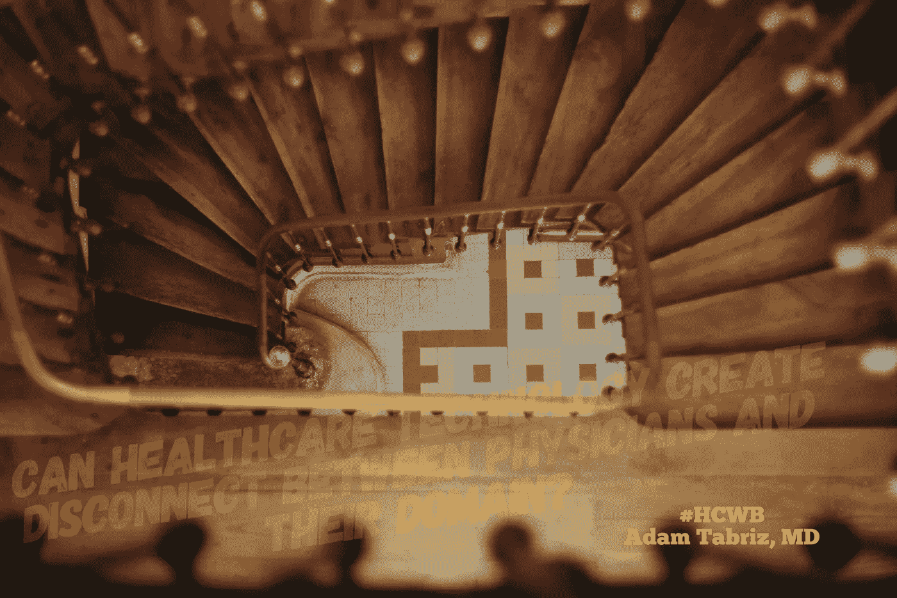

# 医疗保健技术热潮:医生与其领域脱节背后的主要因素

> 原文：<https://medium.datadriveninvestor.com/healthcare-technology-rush-the-major-factor-behind-the-disconnect-between-physicians-and-their-d599683b55f0?source=collection_archive---------5----------------------->

**Healthcare Technology rush: The major factor behind the Disconnect between Physicians and Their Domain**

我一直对技术及其在医疗保健中的应用着迷。作为一名训练有素的医生、企业家和基于科学的医疗服务的倡导者，我觉得我必须跟上我的领域的中断和发展趋势。

> 为此，我一如既往地参加健康技术会议，就像前几天一样！
> 
> 然后——在会议上，我注意到了一些深深触动我的事情，尽管这对我来说并不少见！

事实上，我是唯一受过训练的医疗企业家，而其他人来自科技行业和投资者。会议展示了许多发明，包括执行鉴别诊断的解决方案，但氛围似乎表明不需要医生！

 [## 医疗保健的未来正在被一场巨大的技术入侵所塑造——数据驱动的投资者

### 过去十年，全球经济的所有部门都经历了大规模的数字颠覆，而卫生部门现在…

www.datadriveninvestor.com](https://www.datadriveninvestor.com/2018/11/02/the-future-of-healthcare-is-being-shaped-by-a-big-tech-invasion/) 

医疗保健，以其市场规模和问题，是技术渗透的完美候选。

> 但是我们能把医生排除在等式之外吗？

我们正沉浸在大数据、机器学习、深度学习、人工智能、区块链、远程医疗、可穿戴技术等流行词汇中。

# 卫生技术对病人和医生的影响

医生被沉重的命令和道德陈词滥调压得喘不过气来，而病人却没有医疗保健，即使纳税人支付了医疗保险。每个人似乎都全神贯注于“**生存**的概念。在这种情况下，政客们总是走捷径，通过零敲碎打的解决方案，却一次又一次地失败！

另一方面，公司有一个与数据挖掘非常不同的目标，拥有走不同道路的病人和医生的个人信息。作为企业使命的一部分，大数据是确保机器人医疗和人工智能所需的大量数据的基础，这些数据在未来可以取代人的因素。

人工智能，机器学习，或者更广义的深度学习，都是基于学习数据表示，而不是特定任务的算法。教育可以是监督的、半监督的或无监督的，但需要大量的数据才能发挥作用。我们拥有的数据越多，我们就能给机器人医疗带来越多的完美。

> 在我以前的文章中，我已经提到数据是医疗保健的宝贵资产，在美国价值 880 亿美元。

如果公司不得不向病人和医生支付使用费，情况会怎样？

但是目前，他们不需要这么做，而且他们想保持这种状态！

***如何？****——通过宣传，转移注意力，重新定义。*

医疗费用昂贵，大多数美国人认为我们只能通过第三方支付者来实现。为了提供最先进的医疗服务，企业需要数据，并相信保护他们的身份就足以确保隐私。因此，所有的数据安全漏洞都是黑客的错！

千禧一代已经准备好完全信任技术，尽管他们对系统有所抱怨。他们认为技术是一种解决方案，但不知道他们的信息的效用和共享的细微差别和更深层次的意义。

> 为什么？

因为他们的注意力从真正的问题(在这种情况下，我们称之为疾病)转移到了症状上。医疗保险问题也是一个“ ***症状*** ”

相比之下，这种疾病与转向机器人医疗和千篇一律的医疗保健的替代利益集团脱节。

技术正在使医疗保健走上深度学习的道路，这将带来一个人能够诊断、建议治疗甚至执行程序而无需经过有执照的医生的正式培训的时代。

医生正在处理不同的转移，并认为所有的问题都围绕着报销和保险公司。但他们没有意识到，他们可以从“医生”的头衔被挤到所谓的“ ***”艺术家医士*** 。”

这种态度对作为一种职业的医学实践的真正艺术和医学实践所基于的价值观是有害的。

# 医生之间的脱节

我在医疗保健会议上意识到，主流医生越来越脱离他们所在行业的现状。我还可以看出主导整个医疗行业的暴利真空。

病人必须改变他们的态度，走出被动的姿态。他们需要意识到，他们拥有掌控自己健康信息的所有权力和控制权，并走出技术陷阱。

> 毫无疑问，医生和病人的注意力都偏离了问题的根源。

保险公司不顾一切地寻找病人和医生的数据来支持他们提高保费的借口，并根据护理的价值和质量使较低的报销合法化，这是保险公司首先创造的东西！

企业还需要医生和患者数据，供非医疗实体在开发算法时使用，以创建千篇一律的药物，通过垄断来补充保险公司等机构的需求。

英国等国家的政府正试图通过集成人工智能来解决医疗保健问题，人工智能可以履行大多数医生的职责。英国国家卫生系统有其危机，并正在推动当前的政府将机器学习纳入医疗服务提供中。

企业医疗已经成为 21 世纪的 HMO(健康维护组织)，最显著的区别是缺乏人情味和同理心。我们正走在一条危险的道路上，这条道路可能会导致价值观、人性、同情心和个性化护理的丧失。

> 医生正在走向消亡吗？

确实；如果不是现在，在未来几年，如果他们不改变态度，那将是不可避免的。

医生需要参与并要求他们的行业领域。技术只是一种工具，而病人是人，医生是治疗者。

公司的贪婪、政府的官僚主义和人类的伪善给了另类利益集团和奸商利用人类最神圣的资产作为牟利工具的机会。说奸商正在扼杀医疗体系是虚伪的，因为每个利益相关者都应该因为对人类健康的贡献而得到回报。

 [## “让发明为您的医疗实践服务是一项挑战，需要持续的设计…

medium.com](https://medium.com/@Adamtabriz/making-invention-work-for-your-medical-practice-is-a-challenge-that-requires-continuous-design-f3b4e309fc57)