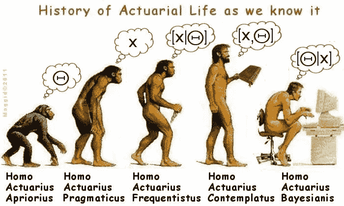
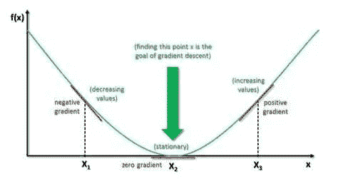
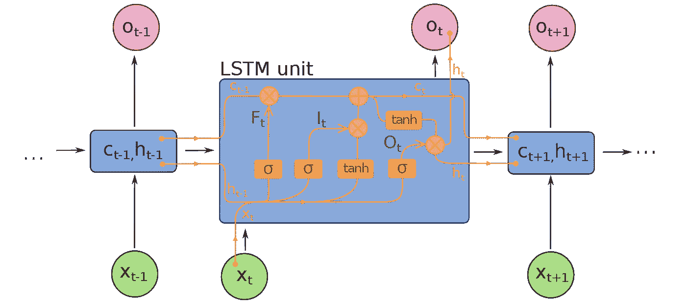

# 听和说你的自然语言

> 原文：<https://medium.datadriveninvestor.com/hear-and-speak-your-natural-nlp-keras-b4bf888dc8b6?source=collection_archive---------2----------------------->

> “我喜欢独处。当你真正听到和说出你自然的、纯粹的思想，以及你最愚蠢的自我和最聪明的自我的结果时。这是当你意识到你是谁，你能做的善与恶的程度。”――克里斯·伊斯兰大教堂，哲学大师

人类是在大约 230 万到 240 万年前的进化而来的*。自 18 世纪以来，科学家认为类人猿与人类关系密切。在 19 世纪，他们推测人类现存的最近的亲属要么是 T4 黑猩猩，要么是 T6 大猩猩。*

你知道是什么让我们不同于我们最亲近的亲人吗？我们的**思维方式！**



图片来源:[lazarzivadinovic.blogspot.com](https://lazarzivadinovic.blogspot.com/2016/05/parametri-spektroskopski-dvojnog-sistema.html)

人类有一个持续的思考过程。当我们阅读时，我们在理解前面的单词的基础上理解每一个单词。情绪通过产生哭、笑和悲伤等行为对人类的思维产生影响。

现在问题来了，是什么让机器像人类一样思考。如今，诸如*人工辅助*之类的应用已经可以理解人类话语的每一个角度。

今天的文章都是关于理解，人工智能如何理解我们所说的一切的意义。路线图分为以下几个主要部分。

1.  *前馈神经网络*
2.  *递归神经网络(RNN)*
3.  *递归神经网络的下降*
4.  *长短期记忆(LSTM)*
5.  *LSTM 的简单实现*

如果你还没有发现神经网络是如何运作的，我强烈建议你先阅读以下文章:

要不，我们开始探索吧。

# 前馈神经网络

前馈神经网络从输入层沿信号优化方向流动，然后通过隐藏层到达输出层，如图*所示。图 1:前馈网络*。

如清楚所示，由于简单直接的结构，前馈神经网络不能将任何记忆保存到网络中。这种体系结构不适用于自然语言处理，而这一点可以通过递归神经网络(RNN)来克服。


*图 1:前馈网络(来源:*[*en.wikipedia.org*](https://en.wikipedia.org/wiki/Feedforward_neural_network#/media/File:Feed_forward_neural_net.gif)*)*

# 递归神经网络(RNN)

递归神经网络是在 20 世纪 80 年代开发的。Hopfield 网络是由 John Hopfield 在 1982 年发现的。传统上，前向神经网络用于理解单词的意思，但这些不具有持久性。

假设，你知道我们是*黑猩猩*或*大猩猩*的亲戚，因为我们的大脑有持久的记忆。传统的网络不能使用先前记忆的持久性来通知后来的记忆。

前馈神经网络被限制为接受固定大小的向量作为输入，并以固定数量的计算步骤产生固定大小的向量作为输出。

另一方面，rnn 是由类似神经元的节点组成的网络，这些节点被组织成连续的*层*，给定层中的每个节点都与下一个连续层中的每个其他节点有定向(单向)连接。每个节点都有随时间变化的实值激活(tanh 激活)。每个连接修改实值权重。节点可以是输入节点、输出节点或隐藏节点。

简单来说， *RNN 网络*拥有通过环路循环信息的能力。网络的决策取决于当前的输入以及在使用短期记忆之前所学的内容。


*图 2:递归神经网络(来源:*[*en.wikipedia.org*](https://en.wikipedia.org/wiki/File:Recurrent_neural_network_unfold.svg)*)*

典型的 on 节点如图*所示:图 2:递归神经网络(左)*，其中*“X”*为输入，*“O”*为输出。循环使得学习能够从网络的一个步骤传递到下一个步骤。递归神经网络可以被认为是同一网络的多个副本的链，每个副本向后继者传递一些信息。

如图 2(右部)所示，这表示在等号之后展开，这准确地描述了不同时间步长的序列的经过。当展开所有时间步长时，误差反向传播通过第一个到最后一个时间步长。这允许在每个时间步的合成误差的每个时间步更新权重。

# 递归神经网络的下降

尽管 RNNs 被广泛用于序列数据分析，但它们似乎有一定的局限性，例如考虑预测下面句子中的最后一个词。

"一个氦核有两个质子，而氢只有一个质子."

远期信息表明下一项将是数字，但由于 RNN 的循环结构，信息循环频繁，导致权重的大量更新。

这个问题具体分为*爆炸梯度*和*消失梯度*两大理论。这两个谜都与梯度有关，梯度负责传播最优解以获得预期输出。



*图 3:爆炸梯度(渐增值)和消失梯度(渐减值)。(来源:*[](http://srdas.github.io/DLBook/DL_images/TNN1.png)**)**

## *爆炸渐变*

*爆炸梯度是一个谜，其中大的误差梯度扩展并导致在训练期间对神经网络模型权重进行非常大的更新。*

*这导致你的模型不稳定，无法从你的训练数据中学习。*

## *消失渐变*

*由于反向传播，向后移动并确定相对于权重的损失梯度。随着在网络中不断向后移动，梯度趋于变得越来越小。*

*由于较低的梯度，网络举行学习或需要太多的时间来学习。Hochreiter (1991)和 Bengio 等人(1994)对这个问题进行了深入研究。*

# *长短期记忆(LSTM)*

*长短期记忆(LSTM)是由 Sepp Hochreiter 和 Jürgen Schmidhuber 在 1997 年提出的，并在 2000 年由 Felix Gers 的团队进行了改进。LSTM 是 RNN 的进化，它能够学习长期依赖性。LSTM 通常由循环门扩充。*

**

**图 4:长时短时记忆(来源:*[*en.wikipedia.org*](https://en.wikipedia.org/wiki/File:Long_Short-Term_Memory.svg#/media/File:Long_Short-Term_Memory.svg)*)**

*LSTM 防止反向传播误差消失和爆炸。相反，错误可以通过空间中展开的无限数量的虚拟层反向流动。LSTM 可以学习需要记忆几千甚至几百万个离散时间点之前发生的事件的任务。*

*常见的 LSTM 网络由*一个单元*、*一个输入门*、*一个输出门*和*一个遗忘门*组成。细胞在任意的时间间隔内记忆数值，三控制信息进出细胞。*

*一个 LSTM 细胞接受一个输入并储存一段时间。这相当于将恒等函数(f(x)= x){ \ display style f(x)= x)} f(x)= x)应用于输入。因为恒等函数的导数是常数，所以当 LSTM 网络通过时间反向传播来训练时，梯度不会消失。*

*LSTM 门的激活功能通常是逻辑功能。直观上，输入门控制新值流入单元的程度，遗忘门控制值保留在单元中的程度，输出门控制单元中的值用于计算 LSTM 单元的输出激活的程度。*

*有连接进出 LSTM 门，其中一些是经常性的。这些连接的权重，需要在训练中学习，决定了门如何操作。检查*图 5:窥视孔长短期记忆*中每个闸门的图示。*

**

*【图 5:窥视孔长短期记忆(来源:[*【en.wikipedia.org*](https://en.wikipedia.org/wiki/File:Long_Short-Term_Memory.svg#/media/File:Long_Short-Term_Memory.svg)*)**

# *LSTM 的简单实现*

*下面是一个简单的例子，使用 IMDB 极性数据集对句子的极性进行分类。Keras 包括 IMDB 极性的内置数据集。*

# *输出*

```
*Using TensorFlow backend. Loading data... Downloading data from https://s3.amazonaws.com/text-datasets/imdb.npz 17465344/17464789 [==============================] - 62s 4us/step 
25000 train sequences 25000 test sequences 
Pad sequences (samples x time) 
x_train shape: (25000, 80) x_test shape: (25000, 80) 
Build model... 
Train... 
Train on 25000 samples, validate on 25000 samples 
Epoch 1/3 25000/25000 [==============================] - 615s 25ms/step - loss: 0.3808 - acc: 0.8203 
Epoch 2/3 25000/25000 [==============================] - 623s 25ms/step - loss: 0.1679 - acc: 0.9366 
Epoch 3/3 25000/25000 [==============================] - 562s 22ms/step - loss: 0.0600 - 
acc: 0.9794 Accuracy: 82.56% 
Downloading data from [https://s3.amazonaws.com/text](https://s3.amazonaws.com/text) datasets/imdb_word_index.json 1646592/1641221 [==============================] - 6s 3us/step
Predicting..Great movie I had ever watched.. Sentiment: [[0.9146]] 
you know even better than them that you have potential! Stop portraying in parody movies!. Sentiment: [[0.03823381]]*
```

*如上所示，最接近零的输出是负面评价，最接近一的输出是正面评价。今天到此为止。*

# *脚注*

*今天我解释了最近自然语言处理中使用的主要概念，希望你喜欢。如有任何疑问，请在下面的框中留言。我将在接下来的文章中写更多的例子，直到那时，祝你探索愉快。*

**最初发布于*[*Arjun-kava . github . io*](https://arjun-kava.github.io/posts/hear-and-speak-your-natural/)*。**