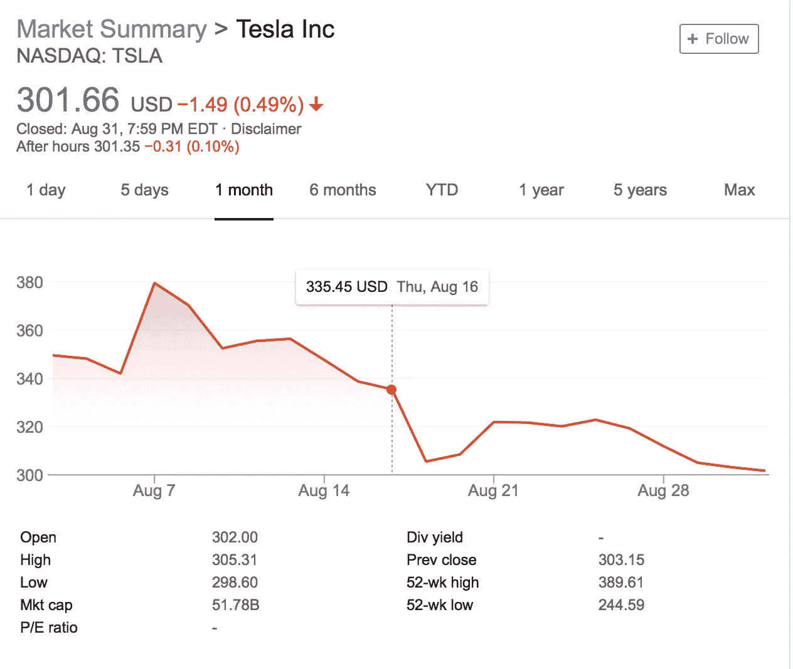
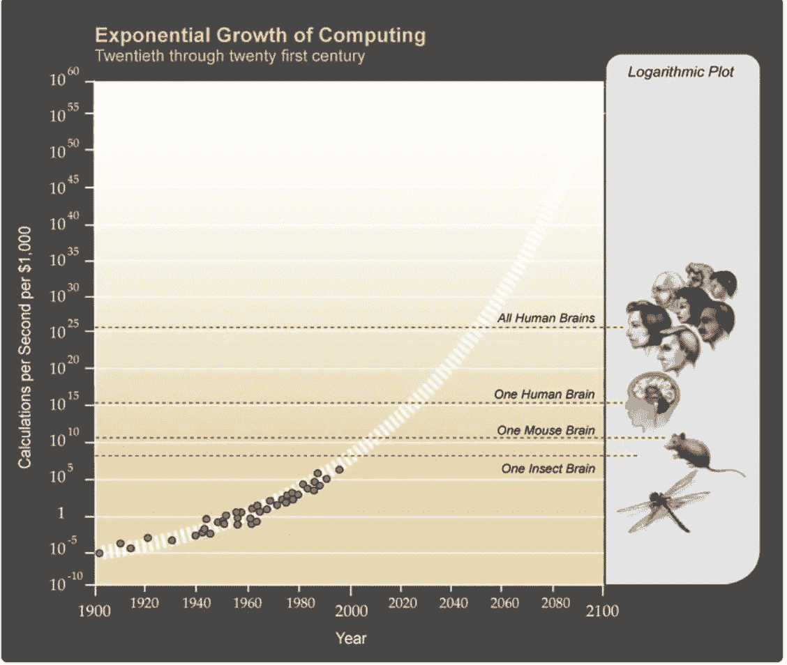

# 热量不可避免地改变未来

> 原文：<https://medium.datadriveninvestor.com/heat-inevitably-changes-the-future-741aa2662ff0?source=collection_archive---------12----------------------->

基本上，我试图实现一个结果，让特斯拉能够以最佳状态运营，尽可能摆脱分心和短期思维，让我们所有的投资者，包括我们所有的员工，尽可能少地改变。

*这项私有化提议最终将由我们的股东投票决定。如果这一过程以我预期的方式结束，私人特斯拉最终将是我们所有人的一个巨大机会。无论如何，* ***未来是非常光明的，我们将继续奋斗，以实现我们的使命。***

*~埃隆·马斯克(摘自 2018 年 8 月 7 日致员工信)*

最近，我的一个朋友在我们就物理学进行了一次简短的交谈后借给了我一本小书(我知道，这听起来非常酷，但很无聊，不幸的是，这两个人之间分享的随机评论也不是合适的描述符！);书名是《物理七讲》**，作者是卡尔罗·罗威利。虽然它的外表很谦虚，但它远非如此。我记得他分享的关于热力学的一个概念，简单地说，*当热量转移到比它自身更冷的物体时，未来最终被改变*。我们许多人都在思考未来，就像埃隆·马斯克一样，他已经决定“……未来是光明的”，但很少有人在思考因果关系。罗维利敏锐地观察到“未来”被能量的转移所改变。有趣的概念。我开始思考它在我们周围看到的大量事物中的应用。此外，我想问这种转移(隐喻版本)有多少是我们可以控制的——有无数的热源出于各种动机寻找最佳导体。**

**我想起了最近的一个例子。几周前，埃隆·马斯克(Elon Musk)在社交媒体(他的指挥)即 Twitter(他的方式)上发表了一篇关于将特斯拉私有化的评论。这无疑引起了该公司投资者和行业观察人士的激烈反应。根据最初估值，许多人认为这是迄今为止有记录以来最大的潜在杠杆收购交易。这种影响如此迅速，以至于该公司的证券交易在一天之内就被叫停。我不认为(许多观察家或投资者)股票停牌是因为市场有一个知情的观点，能够预示这些评论对股东的结果和影响，即没有“看不见的手”，但是，我想假设这是缺乏信息的反映，导致反应，即投资者情绪，而不是各种投资者对公司基本面(在某种程度上受到压力)的反映。简而言之，这是一个“热门话题”点燃市场和人们头脑的时刻，这些人不是根据事实评估结果，而是完全根据情绪做出反应。然而，又一次，一个热门话题占据了新闻头条，闲聊被那些对公司的基本原则或理想一无所知的人所充斥。**

**我认为，这不是我们第一次目睹市场出现这样的波动，毕竟，历史上投资者情绪一直在调节市场；我们也不是第一次目睹未经证实的反应，但我确实观察到，暂停和深思熟虑地评论的能力已经被对 Twitter(我们的指挥，每月大约有 3 . 35 亿活跃用户)等社交媒体和其他简短文本指挥的不可持续的依赖所掺杂。在投资领域，情绪是投资专家的信号或食物，他们希望系统地了解影响市场的行为，更具体地说，是正在交易的证券，如特斯拉；在社会科学领域，情绪是通过基于文本的分析来检测社会和政治情绪等事物的能力。这对于产生 alpha 和理解社会变化是非常强大和重要的。**

****

**Note Tesla’s share price from August 7th (when Elon Musk sent his employees a letter and Tweeted about taking Tesla private) where it was halted intra-day at $371/share and closed the day up 11%, to the end of August, where it has fallen ~19% since. Source: Yahoo.**

# **纵火犯**

**虽然我强调了消费者的反应，但我不能忽视我们的热源——换句话说，我们的“引火物”。就前一个例子而言，这就是埃隆马斯克(Elon Musk ),从他给员工的信来看，他似乎不知道他的话会带来什么影响，而且也不知道他选择的指挥者(Twitter)会对他的公司前景产生什么样的连锁效应。**

**其他“首发者”包括决策者/政策制定者、受保护者、学术权威、我们的导师或激励者。我们生活在一个交流方式已经从信件、电子邮件发展到推特和其他社交媒体帖子的世界里；并且传导速率从几天或几周到几分钟和几秒钟呈指数变化(由于微处理的发展)。举个例子，总统政府对社会发展的影响。曾几何时，大国之间的外交是达成相互理解(不管我们是否同意)和某种程度上的社会秩序的方式。今天，我们已经漫不经心地接受了来自权力机构的推特是我们理解一个监督整个国家的权威的意图(280 个字符)的手段。事实上，虽然由于 Twitter 政策的变化，人数有所减少，但 POTUS 大约有 5340 万人(全球)关注他的个人资料。换句话说，公司、组织和个人的命运(因为我们是一个全球社会，我故意不把这种影响局限于美国)是由简写文本和字符决定的。值得注意的是，根据美国人口普查局(US Census Bereau)的数据，截至 2018 年 7 月 4 日，美国约有 3.28 亿人，平均而言，美国 61.4 %的投票人口在 2016 年选举中投票。换句话说，[有 1.375 亿人](http://www.pewresearch.org/fact-tank/2017/05/12/black-voter-turnout-fell-in-2016-even-as-a-record-number-of-americans-cast-ballots/)投票支持当前的总统，这就引出了一个问题，如果不是通过 Twitter，这些人是从哪里得知他们的决定的。也许还有希望。虽然我喜欢好的迷因或漫画(大多来自 [*《经济学家》*](https://www.economist.com/christmas-specials/2016/12/27/the-year-in-editorial-cartoons-from-the-economist) *或* [*【宾果先生】*](https://www.designweek.co.uk/inspiration/trump-cushion-mr-bingo-freddy-taylor/) *)* 但如果我们(作为社会)能够避免奥威尔式的结果，朝着更高的境界发展，并减缓雷·库兹韦尔的[预测](http://www.kurzweilai.net/futurism-ray-kurzweil-claims-singularity-will-happen-by-2045)(描述他的预测的计算速度的描述见下文)，我会很高兴。**

****

**Source: R. Kurzweil [http://www.singularity.com/charts/page70.html](http://www.singularity.com/charts/page70.html)**

**然而，你想想看，支持短文本扫描和支持长格式写作是疯狂的，反过来只需要很少的 kindle 就可以点燃一把火。我也相信未来是光明的，但这在很大程度上需要批判性的思考者和那些愿意忽略和消除基于简短文本做出(重要)决定的愚蠢行为的人。成为一个“引火烧身者”并不一定要关注负面或奥威尔式的结果，而是意味着我们创造了更好的思想家，他们能够改变以获得更好的结果。**

**“每一代人都想象自己比上一代人更聪明，比下一代人更聪明。”**

***~乔治·奥威尔***