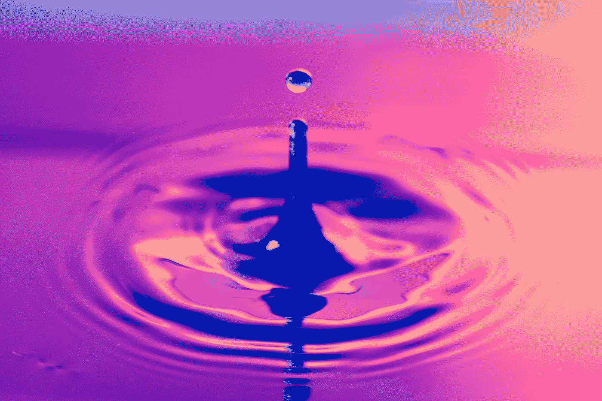
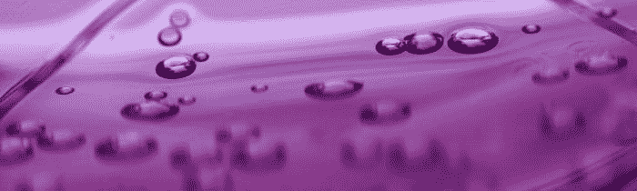

# 激烈的思想

> 原文：<https://medium.datadriveninvestor.com/heated-thoughts-f733f3099e52?source=collection_archive---------7----------------------->

## 热量如何有助于拓展大脑的潜能

Photo by [Johnny Brown](https://unsplash.com/@johnnyb803?utm_source=medium&utm_medium=referral) on [Unsplash](https://unsplash.com?utm_source=medium&utm_medium=referral)

> “找到了！—我找到了！”—阿基米德

从公元前 287 年到 212 年，锡拉丘兹的阿基米德已经成为著名的希腊数学家、物理学家、发明家、天文学家和工程师。阿基米德是微积分和几何定理的现代建筑的贡献者，他最常被认为是因为他的*灵光一现*时刻，这一时刻导致了他梦寐以求的*阿基米德原理*的创立——一种确定任何特定形状体积的方法。他发现了这一点，顺便说一句，当他把自己放入浴缸时，注意到浴缸的水位随着他的进入而上升。

虽然阿基米德把自己浸泡在热水浴中并不一定会得出这个结论，但无论如何，这似乎都是一个合适的语境化故事，一个引入了这样一种想法的故事:将自己沉浸在炎热的环境中有助于暂时改善认知功能。

 [## 倦怠耗尽了简单的答案——数据驱动的投资者

### “大多数卫生专业人员知道如何照顾病人，但不知道如何照顾自己。”医疗保健…

www.datadriveninvestor.com](https://www.datadriveninvestor.com/2019/01/15/burnout-exhausts-easy-answers/) 

这根本不是一个新概念，尽管在更大范围内它可能已经被遗忘了。我们现在有技术应用和生活方式项目来帮助我们扩展我们的意识；在某些地方，微量给药是趋势，而在其他地方，冥想是关键。对我来说，增加大脑功能的一个有效方法是沉浸在热量中——无论是通过锻炼、热水浴、桑拿、汗蒸房、热瑜伽等。

这个问题实际上变成了:我们能否将受热或产热视为扩展认知能力的一种手段？

似乎有某种热量让大脑的汁液流动。从字面上看，这可能是因为它让大脑的汁液流动——热量诱导血液循环到大脑，因此，研究人员有信心说，增加大脑血流量(以及氧气)的效果导致认知功能增加。有道理。

这不是什么新奇的发现。希波克拉底是第一位至今仍被医生奉为神圣的医生，他曾经常向他的病人推荐水疗和浴疗——在药浴和温泉中进行治疗性沐浴。

其他文化通过各自的途径升温——芬兰人坐在他们的桑拿浴室里，印度和中国人在热煤上行走，土著人使用汗蒸房。从温泉到沙漠漫步，无数的文化似乎将热融入了一种仪式性的传统，以这样或那样的方式，融入了大脑的工作。

汗蒸房和温泉可能是这种哲学的最好例子。米克马克文化利用汗蒸房进行精神净化和交流、占卜、本体或预言洞察，而在从塔吉克斯坦到南极洲的世界各地，温泉被视为最传统的治疗方法，据说对身心都有神奇的效果。

芬兰是赫尔辛基臭名昭著的汉堡王桑拿浴的发源地，芬兰人一直在热情地给自己加热，并利用这种热情来研究其效果。[一项与痴呆症有关的研究](https://articles.mercola.com/sites/articles/archive/2017/01/12/sauna-health-benefits.aspx)发现，与每周洗一次桑拿浴的男性相比，每周洗四到七次桑拿浴的男性患痴呆症的风险降低了 66%，患老年痴呆症的风险降低了 65%。

对我自己来说，我开始发现热量和思想之间有某种联系。我经常，如果不是总是，在跑步或骑自行车的时候，当我标记我的努力时，会遇到某种欣快。我最清晰的时刻是当我处于极限的时候，血液在我的脑海中汹涌澎湃。缩小视野，从宏观上观察四季，我发现在温暖的夏季，我对自己更加留意和了解。我还发现，我最好的想法和主意是在洗热水澡时产生的，这让我一沉浸其中就进入了冥想状态。

因此，热量可能对大脑有益，如果不利于更有效的思考的话——这到底有什么关系呢？

因为，在一个我们沉迷于改善我们的认知功能，推动大脑达到更高转速的世界里，这只是不断扩大的武器库中的另一个工具，用来帮助我们超越我们大脑能力的神秘标准。

深入一些细节可能会描绘出一幅更有说服力的画面。

> "意识只是精神海洋的表面."斯瓦米·维威卡难达

我经常在未经证实的假设下运作，即沉浸在热水中可以平静身心；我经常在剧烈运动或远足后洗热水澡，因为我听说这有助于肌肉恢复。不管有没有安慰剂效应——在此期间和之后，我在生理上和心理上都感觉好多了。

我还经常相信，锻炼时冲击大脑的内啡肽波对进入某种更深层次的思维非常有益，无论这是否会改变血清素水平或其他提供有益氛围的神经化学物质，从而实现我们所说的清晰。

我对这一现象的研究似乎证实了某种神经化学性质的东西在起作用——事实上，我们确实通过将颅腔暴露于热量来改变它。

> “有时飞近火焰，看到并体验热量是好的，但随后又飞走了，为了生存，在热量艺术方面更明智。”― **罗伯特·布莱克**

我们知道热量有助于减少疼痛和炎症——但研究不仅仅是证实当身体浸泡在热水中或暴露在热应力下时，血压和炎症会明显下降。温水本身会增加血清素的水平，血清素是大脑中产生的一种化学物质，负责放松和放松。

一项研究发现，尤其是桑拿浴的使用增加了去甲肾上腺素的水平，这是一种提高注意力的激素。因此，热量能够改变交感神经系统中神经递质的功能。

还有一种观点，上面提到过，内啡肽是在热应力下释放的，通常来自运动时产生的热量。此外，热水浴和淋浴、温泉和桑拿浴似乎也能刺激内啡肽的产生。

> 内啡肽是身体产生的缓解压力和疼痛的化学物质，可以产生欣快感。— [今日医学新闻](https://www.medicalnewstoday.com/articles/320839.php)

因此，可以肯定地说，没有压力和焦虑的欣快心态是练习更深入思考的良好环境，有助于灵光乍现和深思。

总的来说，我们似乎有了一幅慢慢浮现的画面——热量创造流动，流动帮助思考。很方便地，这符合我之前关于[思想流动状态](https://medium.com/datadriveninvestor/flow-state-the-super-mind-5265932ba900)的帖子，但是我会把它作为好奇的眼睛的旁门左道。

当我们放大来看生理层面上真正发生的事情时，事情并没有那么复杂。用[一项特殊研究](https://www.researchgate.net/publication/230685558_Passive_heat_exposure_induced_by_hot_water_leg_immersion_increased_oxyhemoglobin_in_pre-frontal_cortex_to_preserve_oxygenation_and_did_not_contribute_to_impaired_cognitive_functioning)的话说:“被动热暴露增加了前额叶皮层的氧气输送”。而且，我们知道，一些 O2 对大脑来说从来都不是坏事:

> **氧气**水平和**大脑**功能密切相关。当你的**大脑**有足够的**氧气**时，你的身体机能会更好，你也会感觉更好。随着你血液中氧气水平的提高，你可能会注意到认知功能的提高，更好的平衡能力以及对你健康的全面改善
> 
> [肺部研究所](https://lunginstitute.com/blog/oxygen-levels-brain-function/)

因此，尽管以神经化学洞察力为特征的研究一直在起作用，但它可以归结为一个简单的事实:热刺激运动，运动进一步唤醒大脑。

虽然声称内啡肽的释放、氧气的注入、血清素和去甲肾上腺素水平的增加可以帮助我们进入正常情况下不会进入的大脑部分，或者我们开始大幅扩展我们的意识，这似乎过于牵强，但可以说，这些可感知的小好处，当复合时，似乎可以为提高认知能力创造一个有利的精神环境。

从这里开始，无论我们利用这个环境做什么，是沉思还是突破文思枯竭，是像柏拉图那样沉思还是像阿基米德那样计算，这完全取决于我们自己。

[**读下去:心流状态:超能力**](https://medium.com/datadriveninvestor/flow-state-the-super-mind-5265932ba900)

A Thought Experiment Into the River of Our Intent

**来源/参考文献**

[https://articles . mercola . com/sites/articles/archive/2017/01/12/sauna-health-benefits . aspx](https://articles.mercola.com/sites/articles/archive/2017/01/12/sauna-health-benefits.aspx)

[https://www.ncbi.nlm.nih.gov/pubmed/18173915](https://www.ncbi.nlm.nih.gov/pubmed/18173915)
[https://academic.oup.com/ageing/article/46/2/245/2654230](https://academic.oup.com/ageing/article/46/2/245/2654230)

[https://www . nytimes . com/2016/12/21/well/mind/are-saunas-good-for-brain . html？_r=0](https://www.nytimes.com/2016/12/21/well/mind/are-saunas-good-for-the-brain.html?_r=0)

[https://www.ncbi.nlm.nih.gov/pubmed/2759081](https://www.ncbi.nlm.nih.gov/pubmed/2759081)

[https://www.cut-the-knot.org/pythagoras/bath.shtml](https://www.cut-the-knot.org/pythagoras/bath.shtml)

[http://www.muiniskw.org/pgCulture2d.htm](http://www.muiniskw.org/pgCulture2d.htm)

[https://www . share care . com/health/functions-of-the-neuron-system/what-triggers-release-of-endorphins](https://www.sharecare.com/health/functions-of-the-nervous-system/what-triggers-release-of-endorphins)

 [## 内啡肽:作用和如何增强它们

### 内啡肽是神经系统自然产生的化学物质，用于应对疼痛或压力。他们通常被称为…

www.medicalnewstoday.com](https://www.medicalnewstoday.com/articles/320839.php)