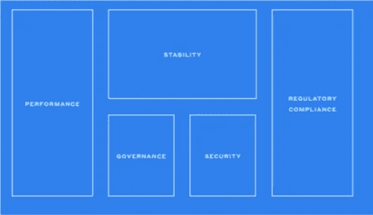
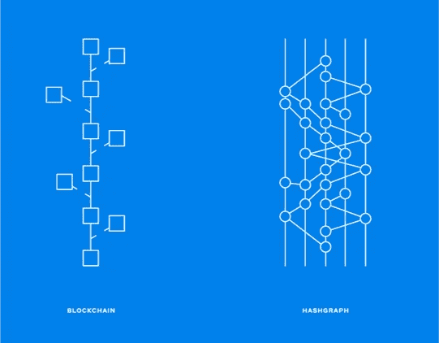
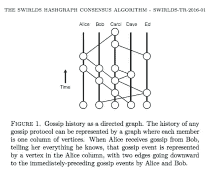
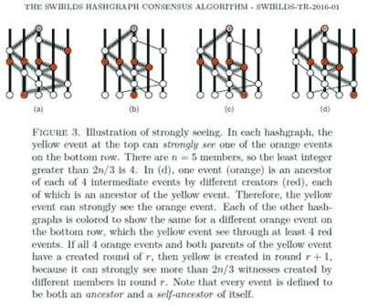
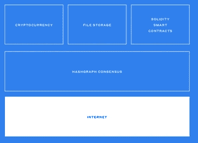
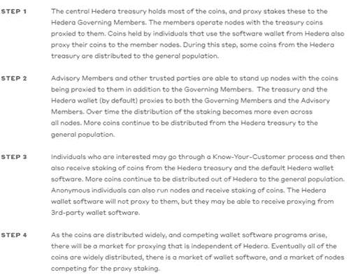
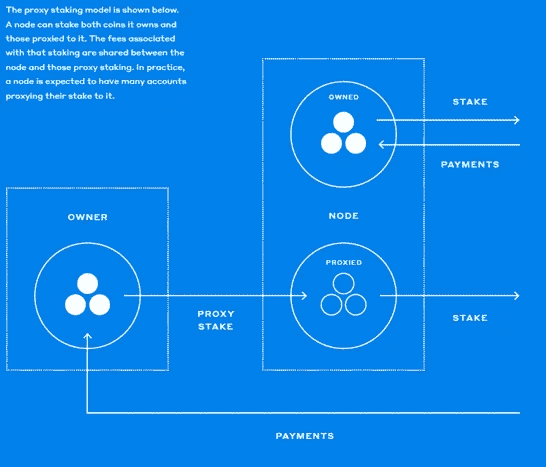
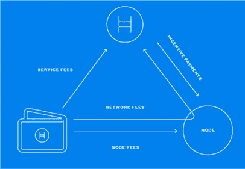

# Hedera Hashgraph |解释

> 原文：<https://medium.datadriveninvestor.com/hedera-hashgraph-explained-c5d8ce4730a6?source=collection_archive---------0----------------------->

# Hedera 哈希图概述

Hedera Hashgraph 是 DLT 的一个项目，是基于有向无环图(DAG)技术的标准区块链的创新变体。基本上，操作不是通过链(像在区块链中)记录的，而是通过有向无环图记录的。

Hashgraph 支持分散的应用程序，它基于异步拜占庭容错(aBFT)共识。在该协议中，网络保持诚实的一致性(只要少于 1/3 的节点是恶意的)，这使得系统具有抗攻击性和安全性。

A simple explanation of Hashgraph

它是联合创始人、首席技术官和首席科学官 Leemon Baird 博士的创意。Baird 博士拥有计算机科学博士学位，拥有多项专利，是多种学术期刊出版物的作者。

 [## 正在改变行业的 5 个真实世界区块链应用——数据驱动的投资者

### 除非你一直生活在岩石下，否则我相信你现在已经听说过区块链了。而区块链…

www.datadriveninvestor.com](https://www.datadriveninvestor.com/2019/02/13/5-real-world-blockchain-applications/) 

另一位联合创始人是曼斯·哈曼(Mance Harman)，他目前担任首席执行官，负责运营和管理。

贝尔德和哈曼曾在 Trio Security 共事，后来又在 BlueWave Security 共事。一般来说，领导团队(目前约有 10 名员工)和顾问都有丰富的经验和教育背景。

Hedera Hashgraph | Video

# 解决方案

该小组认为，为了发展、进步和在现实生活中使用，密码市场需要进行根本性的调整。

为了实现这一目标，团队需要解决 5 个问题。

*“分布式账本技术(DLT)正在颠覆和改变多个行业的现有市场。然而，在我们看来，在分布式分类账能够被广泛接受并在各个行业和地区采用之前，有五个基本障碍需要克服。在本文中，我们将研究这些障碍，并讨论为什么 Hedera hashgraph 非常适合成为世界上第一个大规模采用的公共分布式分类帐，支持大量的应用程序。”摘自* [*白皮书*](https://www.hedera.com/hh-whitepaper-v1.4-181017.pdf) *。*

Executive Summary

根据 Baird 等人(2018)，以下是以下 5 个问题:

**1。性能**。目前，大多数项目的 tps 不足以大规模实施区块链，因为在大规模采用的情况下，我们会看到交易呈指数级增长；

**2。** **安全**。如果大规模采用区块链，我们将在区块链上拥有数万亿美元的价值和数十亿笔交易，如果我们可以预计交易的价值也将呈指数级增长，因此需要实施更多的安全措施。Hedera 提出了 aBFT(异步拜占庭容错)共识，他们认为这是高度安全的；

**3。治理**。分类帐应该由来自 IT、商业、法律和其他行业的代表和专业人员管理，而不仅仅是技术人员；

**4。稳定。使用技术和法律机制的组合来执行决策，系统应该是稳定的；**

**5。法规遵从性。**新区块链需要勾选所有选项，并符合所有法律要求(包括 KYC 和反洗钱)。

Hashgraph 技术是基于分散协议的数据传输系统。在区块链，信息存储在块中，每个块 n 依赖于前一个块 n-1，因此这些块形成了一个单链，正如其名称所描述的——区块链。在 hashgraph 中，参与者也可以创建一个事务，但是在制定特定事件时，信息的存储方式会有所不同。此外，hashgraph 不需要工作证明，这使得它作为一个系统对参与者来说更便宜。这使得它更快更有效。

Blockchain vs Hashgraph

Hedera 的联合创始人 Leemon Baird 博士在过去写的 SWIRLDS HASHGRAPH 上详细描述了 HASHGRAPH 共识算法。

THE [SWIRLDS HASHGRAPH](https://www.swirlds.com/downloads/SWIRLDS-TR-2016-01.pdf) CONSENSUS ALGORITHM: FAIR, FAST, BYZANTINE FAULT TOLERANCE

SWIRLDS HASHGRAPH CONSENSUS ALGORITHM

有几个因素应该强调:

**1。平台**应快速、安全、不贵，且作业所需采矿设备最少；

**2。系统**应该由多个(39)组织管理(其中任何一个组织都不应该影响其他组织)；

**3。令牌** —平台内部有一个本地令牌，允许用作一个实用程序，允许创建 dapps 和附加功能。

仔细研究架构、业务模型以及项目将如何尝试解决上述所有 5 个问题。

平台的结构如下所示:

Architecture

在底部，有**互联网层**。每台计算机都通过互联网连接到平台。

架构中间有一个 **Hashgraph Consensus 层**，基本上保证了一切工作的快速、安全、公平、安全。节点从参与者或客户那里获取交易，并通过 gossip 协议将它们共享给(或实际上通过)网络。所有节点都运行 hashgraph 一致性算法。

上面有一个**服务层**，由一个**加密货币**，一个用于 DAG 的**文件存储**和**智能合约**组成，用 Solidity(以太坊合约使用的同一种语言)编写。

一般来说，这里的要点是速度(=低费用和使用它进行小额交易的可能性)和八卦协议(共识)。

根据 Hedera 的说法，在 gossip 协议中，在交易之后，节点与其他元素共享信息。

*“使用 gossip 协议，节点可以高效快速地与社区中的其他节点交换数据。这使用新颖的“关于流言蜚语的流言蜚语”协议自动构建了一个 hashgraph 数据结构。这种数据结构是加密安全的，并且包含社区中的通信历史。将此作为输入，节点运行与其他节点相同的虚拟投票一致算法。社区就订单和时间戳达成共识，而无需通过互联网进行任何进一步的交流。每个事件都有其创建者的数字签名。来自* [*网站*](https://www.hedera.com/platform) *。*

因此，“共识”(如果我们使用区块链的同一种语言)可以更快、更便宜地达成。

在 Hashgraph 中，确认基于以下思想:

*“公平 Hedera Hashgraph 是公平的，确保交易的共识顺序反映了社区收到的交易顺序。该平台确保没有单个用户可以阻止交易流入社区，也没有一小组用户可以不适当地影响这些交易的共识秩序。这些功能是许多分布式账本技术所不具备的，但却是当今市场和游戏等现有应用所必需的。”来自* [*网站*](https://www.hedera.com/platform) *。*

谈到安全性，aBFT 级让系统更加安全。

*Hedera Hashgraph 在这一类别中具有最强的安全级别，这就是异步拜占庭容错(aBFT)。该平台是唯一一个已经正式证明了这种品质的分布式账本技术。大规模实现这种级别的安全性是分布式系统领域的一大进步。Hedera 实时保证一致性，并抵抗分布式拒绝服务(DDoS)攻击，这是一些公共分类帐平台的一个漏洞。”摘自* [*白皮书*](https://www.hedera.com/hh-whitepaper-v1.4-181017.pdf) *。*

此外，还需要 2/3 的节点来确认交易。

有趣的是，没有“正常”或典型的路线图。我们可以通过 4 个步骤在白皮书中看到“扩展路线图”(但不幸的是，没有任何时间表):

Cryptoeconomics | The Roadmap to Scale

谈论**支付和费用**，用户支付费用使用分类账。由于网络速度快，不需要昂贵的工作证明，费用应该比现在使用区块链的平台低得多。

Cryptoeconomics | Payments

**节点费**是唯一不是海德拉定的佣金。费用基本上是由客户支付给提交交易的节点，并且必须直接支付给被请求处理交易的节点。

Cryptoeconomics | Fees

# 优势

作为一个用户、交易者或霍德勒，如果你花时间研究文档，你会对这种新技术感兴趣，也会有点困惑。这项技术似乎是革命性的，一个强大的团队有一个原创的想法。

此外，如果 aBFT 共识算法能够是安全的，并且是抗攻击的，不需要昂贵的工作证明是有利的。最近的测试证明了这一点，测试显示输出非常高(高达 50 万 tps)，延迟低，这意味着它是高度可扩展的。

最后，如上所述，新的治理结构保证了一切都可以正确执行(但是这会增加复杂性吗？).

# 不足之处

白皮书不清楚，想法也很混乱。潜在用户需要花费大量时间来理解概念、细节和应用规范。此外，要正确理解这个项目需要更高的技术教育。

Hedera Hashgraph 材料的复杂性应该得到解决，需要一个好的演示平台，以及白皮书和解释 Hashgraph 共识算法。

我个人相当怀疑的另一点是治理模式，特别是 39 个治理机构独立性的适当执行。下一点是，由 39 个组织组成的管理委员会意味着相对高度的集中，尤其是如果我们在其他区块链和其他相关项目的背景下讨论这个问题。

最后，该项目可以被描述为一个高风险的项目，因为所有 5 个解决方案都没有得到适当的描述。

# 筹集的资金

迄今为止，Hedera 已经筹集了超过 1 亿美元；从风险管理(和会计)的角度来看，基金主要以菲亚特形式持有，以对冲加密波动，并确保未来几年运营业务的资本。

# 竞争

还有其他几个项目，但它们都不被认为是直接竞争对手。下面使用或计划使用 Hedera Hashgraph 正在使用的有向无环图技术。

被认为最有竞争力的项目是:

[IOTA](https://www.iota.org/) :协议是由 IOTA 基金会开发的分布式账本技术，

[Nano:](https://nano.org/en/faq) 现实世界的数字货币——支付生活中一切的快捷免费方式；[和](https://nano.org/en/faq)

[字节球](https://obyte.org/):一个开放的加密货币平台，准备在现实世界中采用。