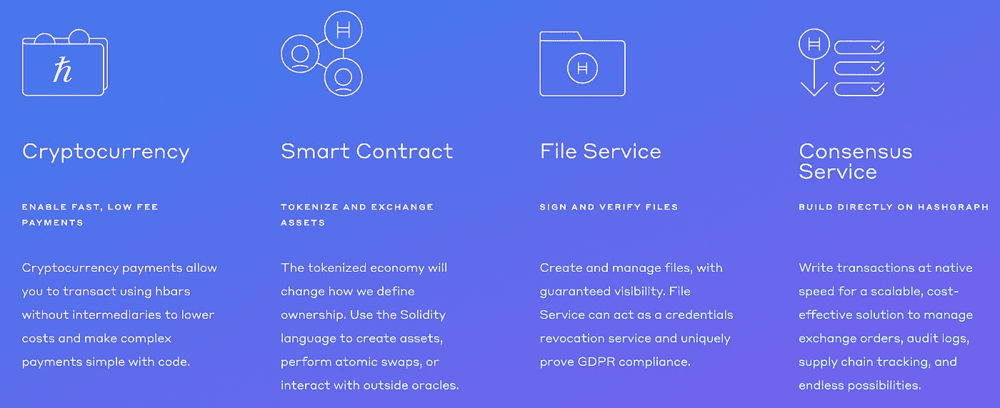
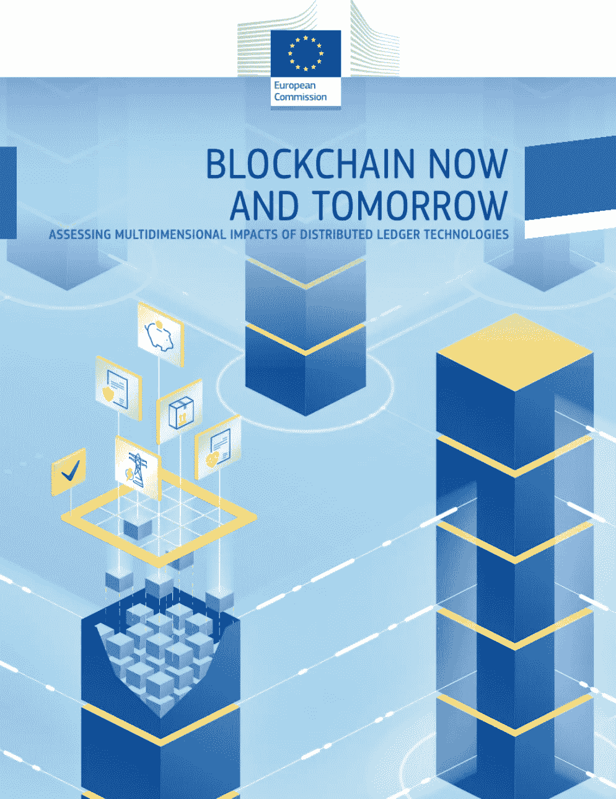
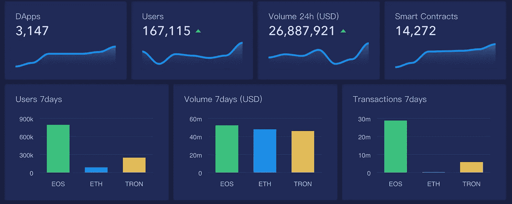

# Hedera Hashgraph 现已上线/德意志银行加入摩根大通的法定人数/ Dapper Labs 推出 Flow

> 原文：<https://medium.datadriveninvestor.com/hedera-hashgraph-now-live-deutsche-bank-joins-jpmorgans-quorum-dapper-labs-launches-flow-6c7f06e5cad4?source=collection_archive---------9----------------------->

Photo by [Kristopher Roller](https://unsplash.com/@krisroller?utm_source=unsplash&utm_medium=referral&utm_content=creditCopyText) on [Unsplash](https://unsplash.com/search/photos/inspiration?utm_source=unsplash&utm_medium=referral&utm_content=creditCopyText)

2019 年 9 月 18 日

本周的版本充满了区块链、DLT 和 DApps 的最新动态、教育和运动。备受期待的 ***海德拉哈希图*** *s 公共版区块链现在推出，上面运行着超过 25 个 DApps。随着西班牙银行业巨头* ***桑坦德银行*** *成为第一家使用公开区块链进行债券发行的银行* ***德意志银行*** *加入* ***摩根大通*** *的法定人数区块链，银行和金融领域的动作越来越多。此外，****Dapper Labs****推出了 Flow，****TRON****在 dapp 数量上正在赶上****EOS****，以及大量关于基础设施、dapp、比特币、经济学和 Stablecoins 的研究和见解。为了了解更多信息，让你跟上时代的步伐，这里有一张本周业内热门新闻的快照。*

## 📖 [Hedera Hashgraph，被吹捧为高速区块链替代品，现已上线](https://www.coindesk.com/hedera-hashgraph-touted-as-high-speed-blockchain-alternative-goes-live)

Hedera Hashgraph 宣布推出其公共网络。随着该网络的上线，Hedera treasury 将很快开始向投资者分发该系统的 HBAR 令牌。据该公司称， [Hashgraph](https://www.hedera.com) 在几个方面与其他分布式分类帐技术(DLT)不同。它的创造者声称它比区块链更有效，使它更适合企业和商业……[阅读更多](https://www.coindesk.com/hedera-hashgraph-touted-as-high-speed-blockchain-alternative-goes-live)

Source: [Hedera Hashgraph](https://www.hedera.com/)

## 📖 [Gartner:区块链将只不过是 ERP、CRM 软件的附加产品](https://www.computerworld.com/article/3438838/gartner-blockchain-will-be-nothing-more-than-an-add-on-for-erp-crm-software.html)

根据 Gartner 的一份新报告，所有主要的 ERP 和 CRM 供应商都将提供区块链功能，作为其软件和 SaaS 产品的附加功能。与此同时，支离破碎的区块链标准可能会阻碍金融服务公司在现实系统中采用分布式账本技术，这些公司最近推出了相当多的支票账户和试点任务……[阅读更多信息](https://www.computerworld.com/article/3438838/gartner-blockchain-will-be-nothing-more-than-an-add-on-for-erp-crm-software.html)

 [## 2019 年成为主流的 7 大区块链挑战及更多...数据驱动的投资者

### 教训是永远不要停止学习和成长。关于技术、金融、工作场所、生产力和…

www.datadriveninvestor.com](https://www.datadriveninvestor.com/2019/03/25/top-7-blockchain-challenges-to-go-mainstream-in-2019-more/) 

## 📖[亚洲值得关注的 10 家区块链公司](https://www.forbes.com/sites/joresablount/2019/09/10/10-blockchain-companies-to-watch-in-asia/#16c60c537306)

这篇文章强调了亚洲区块链生态系统的增长趋势，因为亚洲是区块链就业增长、加密货币使用和创新的领先地区之一。文章进一步提到了十家总部位于亚洲的区块链创新型创业公司，期待未来……[阅读更多](https://www.thedailystar.net/bytes/world-first-blockchain-smartphone-be-launched-in-bangladesh-1797703)

## 📖[桑坦德银行在以太坊结算了一笔 2000 万美元的债券交易](https://www.coindesk.com/santander-settles-both-sides-of-a-20-million-bond-trade-on-ethereum)

据西班牙银行业巨头桑坦德银行称，它已成为第一家使用公开区块链进行债券发行各方面工作的银行。据该银行称，该银行不仅使用以太坊上的代币代表 2000 万美元的债务发行，还使用另一套 ERC-20 代币代表托管账户中的现金进行结算……[阅读更多信息](https://www.coindesk.com/santander-settles-both-sides-of-a-20-million-bond-trade-on-ethereum)

## 📖[从 CryptoKitties 到 Cardi B:华纳音乐投资 1100 万美元更换以太坊](https://www.forbes.com/sites/michaeldelcastillo/2019/09/12/exclusive-from-cryptokitties-to-cardi-b-warner-music-joins-11-million-investment-in-ethereum-replacement/#d961fb12b21f)

[Source](https://www.withflow.org/)

华纳音乐正在将目光投向区块链，他们最近参与了 Dapper Labs 1120 万美元的投资。Dapper Labs 是区块链游戏 [CryptoKitties](https://medium.com/u/c8b1419b5d28?source=post_page-----6c7f06e5cad4--------------------------------) 的制造商。有了这笔投资，华纳音乐的区块链团队将与 Dapper Labs 合作，使用区块链今天披露的一种新的公共资产，称为[流](https://medium.com/dapperlabs/introducing-flow-a-new-blockchain-from-the-creators-of-cryptokitties-d291282732f5)，它能够处理比以太坊多很多倍的交易量，甚至可以扩展该公司在区块链的其他项目……[阅读更多信息](https://www.forbes.com/sites/michaeldelcastillo/2019/09/12/exclusive-from-cryptokitties-to-cardi-b-warner-music-joins-11-million-investment-in-ethereum-replacement/#d961fb12b21f)

## 📖[炒作已经消退，但对企业区块链的需求依然存在](https://news.bitcoin.com/the-hype-has-faded-but-demand-remains-for-enterprise-blockchains/)

当 IBM 和航运巨头马士基联手为供应链创建区块链解决方案并在此过程中节省高达 20%的成本时，区块链被描绘成企业的万灵药。现在，炒作已经消退，企业区块链项目已悄然开始出货。大多数著名的企业区块链项目都是基于 IBM 的 Hyperledger 或 R3 的 Corda… [阅读更多信息](https://news.bitcoin.com/the-hype-has-faded-but-demand-remains-for-enterprise-blockchains/)

> *👉查看* [*区块链基础设施景观*](http://click1.m.readwritelabs.com/qhsryffgnhmtrybjtvpqhtdjyctwvwvshjshrqwfgsss_yfqbfcmslnskglmckvqv.html?source=post_page---------------------------)

## 📖德意志银行加入摩根大通领导的区块链网络

德意志银行已与摩根大通签署了金融服务业最著名的区块链项目。德意志银行加入了由大通牵头的银行间信息网络(IIN)，这是一个由 320 家银行组成的网络，它们同意通过区块链交换全球支付信息，这是加密货币背后的相互分布式总账技术。其目的是将支付从影响约 1.5%的跨境支付的漫长而昂贵的延迟中解放出来… [阅读更多](https://www.ft.com/content/6363036a-d597-11e9-a0bd-ab8ec6435630)

## 📖[报道:欧盟(EU)——区块链的现在和未来](https://www.linkedin.com/posts/biserdimitrov_eu-report-blockchain-now-and-tomorrow-ugcPost-6579730672603156480-WmOc/)

报告 [*区块链现在和明天*](https://www.linkedin.com/posts/biserdimitrov_eu-report-blockchain-now-and-tomorrow-ugcPost-6579730672603156480-WmOc/) 汇集了来自联合研究中心(JRC)不同单位和学科领域的研究，联合研究中心是欧盟委员会的科学和知识服务机构。它通过确定一系列部门中正在进行和即将进行的变革，并为进一步探索设定预期方法，提供了对区块链技术状态的多维见解。除了炒作和揭穿它的一些争议，我们的目标是提供对区块链及其可能应用的深入和实际的理解… [阅读更多由](https://www.linkedin.com/posts/biserdimitrov_eu-report-blockchain-now-and-tomorrow-ugcPost-6579730672603156480-WmOc/) [Biser Dimitrov](https://medium.com/u/f91a4cb3fbb7?source=post_page-----6c7f06e5cad4--------------------------------) 提供的

## 📖[报告:斯坦福大学 2019 年区块链对社会影响](https://www.gsb.stanford.edu/faculty-research/publications/2019-blockchain-social-impact)

在过去的五年里，区块链技术的承诺已经席卷了社会影响世界，许多创新者尝试寻找这种独特安全技术的使用案例。这导致了数百个新的组织、企业和计划(在本报告中统称为“组织”)聚焦于区块链……[阅读更多](https://www.gsb.stanford.edu/faculty-research/publications/2019-blockchain-social-impact)

## 📖[分散的身份和声誉](https://lindajxie.com/2019/09/11/decentralized-identity-and-reputation/)

身份证也很容易被盗，在黑市上很容易买到，所以你并不总是知道提供身份证的人是不是真实的那个人。因此，一些服务会问一系列问题，比如你长大的街道在哪里，你实际居住的地方是哪个列出的地址。这也导致了一些问题，如该人没有足够的历史记录来回答问题，该人忘记了答案，或者这些信息很容易被试图冒充他们的人找到……[阅读更多](https://lindajxie.com/2019/09/11/decentralized-identity-and-reputation/)

# 分散式应用程序手表

## 📖[介绍来自 CryptoKitties](https://medium.com/dapperlabs/introducing-flow-a-new-blockchain-from-the-creators-of-cryptokitties-d291282732f5) 创造者的新区块链 Flow

[CryptoKitties 的创造者 Dapper Labs](https://medium.com/u/6544777e30d2?source=post_page-----6c7f06e5cad4--------------------------------) 发布了 Flow——一款快速、安全且对开发者友好的区块链，旨在支持下一代游戏、应用和支持它们的数字资产……[阅读更多信息](https://medium.com/dapperlabs/introducing-flow-a-new-blockchain-from-the-creators-of-cryptokitties-d291282732f5)

## 📖[创离打败 EOS 只差 40 DApps】](https://eng.ambcrypto.com/tron-is-just-40-dapps-away-from-beating-eos/)

[TRON Foundation](https://medium.com/u/7c2f78c9d321?source=post_page-----6c7f06e5cad4--------------------------------) ，分散基础设施领域的领导者，发布了一份新的[报告](https://medium.com/tron-foundation/tron-dapp-weekly-report-09-07-09-13-e0a0d2de8c8b)，披露了其在 DApps 领域取得的进展。该公司表示，其网络中屏蔽了 578 个 dapp，而 EOS 的网络中约有 618 个 dapp。到目前为止，就日常用户、交易量和交易量而言，EOS 被视为主导 DApps 领域。尽管是市场的后来者，Tron 距离超越 EOS 仅 40 dapp…[阅读更多](https://eng.ambcrypto.com/tron-is-just-40-dapps-away-from-beating-eos/)

Source: [DApp Review](https://analytics.dapp.review/)

## 📖[经济破坏:从管道到平台，再到 dapp](https://medium.com/@liquidapps/economic-disruption-from-pipelines-to-platforms-to-blockchain-4bdfc7ee82f0)

随着第四次工业革命的加速，分散平台正迅速成为协调经济活动的有力手段。DApp 网络正在通过为一套强大的开发人员服务创建市场来推动平台革命:分散存储、RAM 兼容内存、跨区块链的可操作性……[阅读更多信息](https://beincrypto.com/the-dapps-universe-is-expanding-first-stop-samsung-galaxy/)

👉[下载](http://click1.m.readwritelabs.com/qhsryffgnhmtrybjtvpqhtdjyctwvwvshjshrqwfgsss_yfqbfcmslnskglmckvqv.html?source=post_page---------------------------)基础设施领域的完整区块链

The Blockchain Landscape — Q2 2019 Edition

不想等到下周，[现在就订阅](http://click1.m.readwritelabs.com/xsdqkbbrgsdtqkmntpjlstcnkytvpvphsnhsqlvbrhhd_yfqbfcmslnskglmckvqv.html?source=post_page---------------------------)📥有关区块链、DApps 等的实时行业见解！