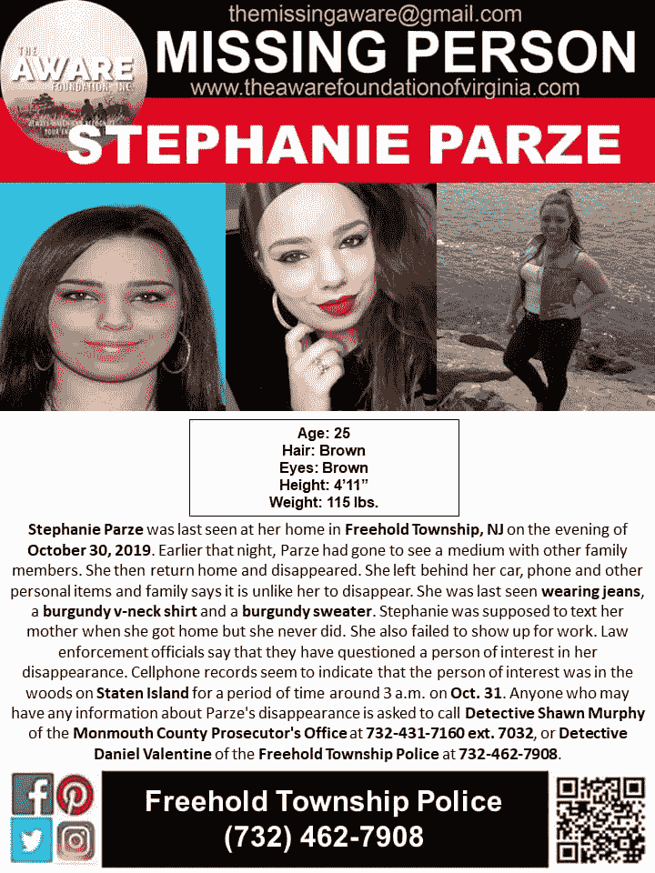

# 帮忙带她回家…

> 原文：<https://medium.datadriveninvestor.com/help-bring-her-home-7e07e593c4e4?source=collection_archive---------4----------------------->

一个 25 岁的球衣女郎，
一个**女儿**
一个**姐姐**
一个**邻居**
一个**侄女**
一个**堂弟**
一个**同事**
一个**学生**
一个**朋友……**

**斯蒂芬妮·帕泽**现在已经失踪**15 天了……**
她的“前男友”

*同样的故事，不同的面孔，不同的名字*
这样的故事曾经吸引着媒体的注意力
这已经变得太普通了
她已经变成了另一个“顺便说一句”，太快了
这些天我们很快就厌倦了。她的父母、朋友、家人、同事都满怀希望。警察和县检察官一直呼吁公众挺身而出，他们在严寒的天气里全力搜寻。

斯蒂芬妮怎么了？

她在哪里？

*对她做了什么？*
*对她做了什么？*
我不认识她……
但我太了解她了
像其他人一样，她绝不会就这么*“走开。”“只是失踪了，留下了她的车和手机。”*

这什么时候会结束？我们什么时候才能停止因为别人的一时冲动而失去年轻女性？
有多少要消失？有多少是在浅墓穴中发现的？
弃尸沼泽？更糟的是，再也没有消息了。

明年我们会有多少年轻女性死于暴力？有多少人再也见不到了？
**这什么时候会停止？**

不幸的是…
**它不会停止，直到我们都要求它停止。请不要告诉我没有办法阻止它。该死的视力最好是…**

下一个女孩，下一个年轻女人，下一个失踪的人，她可能是你的女儿，她可能是你的侄女，她可能是你的同事

***哦，等一下————
她是…***

**适可而止！！！**

[#受够了](https://www.facebook.com/hashtag/enoughisenough?source=feed_text&epa=HASHTAG)
[#没时间了](https://www.facebook.com/hashtag/notonemore?source=feed_text&epa=HASHTAG)
[#偷窃必须停止](https://www.facebook.com/hashtag/thieviolencemuststop?source=feed_text&epa=HASHTAG)

If you think you may have seen something, or think you may know something please call.