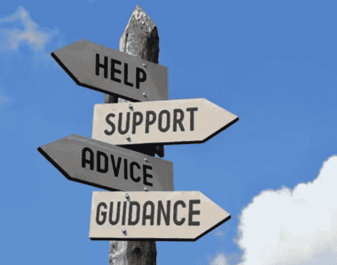

# 帮助他人，创造最好的自己

> 原文：<https://medium.datadriveninvestor.com/help-others-and-create-your-best-self-e1d994549308?source=collection_archive---------3----------------------->

## 导师在那里指导和灌输责任感

优秀的导师可以在他们的学员的热情合作下，让职业生涯保持在正确的轨道上。教师和其他人一样需要这样的导师。教师也是同龄人和学生的导师。

教育家[雷切尔·莱尔](https://twitter.com/rachaellehr)、[雷切尔·德内·珀斯](https://twitter.com/Rdene915)和[乔尔·布朗](https://twitter.com/Teach_Learn88)来自不同的背景。然而，每个人在职业生涯中都有过导师。

Lehr 是澳大利亚珀斯的一名科学、数字技术和首席教师。

Poth 在宾夕法尼亚州匹兹堡教授法语、西班牙语和新兴技术。她还是一名作家、律师和公证人。

布朗是北卡罗来纳州佩尔奎曼斯县学校的教师和学生主任。

一般来说，指导就是让有技能的人能够就职业道路向其他人提供建议，并承担责任。

“指导就是支持和指导某人，鼓励——也提供帮助某人成长所需的反馈和支持，”Poth 说。

“我们都需要导师，”她说。“有时候他们是被指派的，有时候就这么发生了。”

无论这种安排以何种方式发展，导师们都时刻准备着。

“指导是提供建议和机会，同时也是一个安全网，”布朗说。"当需要的时候，做一个倾听的耳朵."

# 教师角度

莱尔特别关注教师。

“指导是一个更有经验的教育工作者与他人合作支持他们成长的机会，”她说。“体验可能只是在某个特定的领域。我相信这有助于教育者通过在指导关系中一起工作而成长。

“我发现，当我以导师的身份帮助别人时，我自己也学到了很多东西，”Lehr 说。“它帮助我们成为最好的自己。”

好的导师会在不施加不当影响的情况下提供帮助。

“想要别人成为我们的克隆体，或者持有相同的观点是很容易的，”莱尔说。“这不会帮助他们成长为教育工作者。

“指导‘刚刚发生’的关系可能是最强大的，”她说。“它们将是最真实的，并且符合当时的需求。”

指导的好处是双向的。

“作为导师和学员，我学到了很多东西，”莱尔说。“有时候，我觉得自己更多地是在反思自己作为导师的教学实践。我想确保我给出明智的建议，并树立最佳实践的榜样。

“给别人最好的是如此重要，”她说。"帮助他人做到最好，并为他们的成功感到高兴，并不会贬低我们自己."

当导师帮助他们的对象发光时，他们就表现出色。

“我们学校有很多职前教师，”莱尔说。“虽然他们被告知很多‘这样做’，但当他们被鼓励做自己，让自己独特的个性发光时，这是很棒的。”

# 尽快开始

尽快与新教师联系，了解他们的需求和愿望。共同制定一个计划，让他们开始自己的职业生涯。

“让我们自己有时间，分享我们的经验，倾听并提供支持，”Poth 说。“一定要帮助他们更多地融入学校。愿意倾听。”

布朗建议导师不要让压力增加。

“让他们向你发泄吧，”他说。“许多新教师认为他们需要完善这个大门，并试图掩盖他们的挫折。

“展示你的脆弱，”布朗说。“那就希望他们会开始对你感到舒服。”

很多时候，答案不在手边，也可能不需要。

“有时他们只需要把心里的话说出来，不需要解决方案，”莱尔说。“将进展顺利的事情和进展不顺利的事情一起讨论。只有当他们要求时，才建议改变的方法。

“签到是如此重要，”她说。“我是隔壁新来的研究生老师的导师。尽管她总是那么能干和快乐，但重要的是不要认为一切都好。花点时间真正入住。”

# 同行伙伴关系

同龄人互相寻找也是好事。

“有些人天生就是很好的倾听者，会让你真正感到‘被倾听’，”莱尔说。“我知道我需要成为一个更好的倾听者。

“实际的帮助和如何让生活变得更简单的小建议是无价的，”她说。“我们经常假设其他人知道这一点。事实上，他们可能会在不知不觉中让自己的生活变得更加艰难。”

学生们可能最好把有同理心、有技能的高年级学生作为导师。他们更接近他们的年龄组，有更多的经验。大三大四学生最好有员工导师。

“对我们的学生有用，”Poth 说。“在场。我们学校有项目。”

她发表了一篇文章，“ [*为什么我们都需要导师以及如何让它发生*](http://www.gettingsmart.com/2018/02/why-we-all-need-mentors-and-how-to-make-it-happen/) ”

“通过积极的行为干预和支持，我的学校给学生分配了成人导师，”布朗说。“这是基于高危学生的行为数据。”

# 学生专家

辅导与和其他老师一起工作是完全不同的。

“在课堂上，学生导师可以采取不同的形式，”莱尔说。“如果与工作有关，我发现让学生成为‘专家’来帮助他人是很强大的——例如，在与数字技术打交道时。他们喜欢这个角色。其他学生会找到他们。

“作为老师，要去倾听学生的故事——不管是什么话题，”她说建立课外关系。谈论他们的兴趣来建立信任，这样当他们需要帮助时，他们会更乐意来找你。"

开放式教室为指导增加了另一个维度。

“拥有一个开放的教室，让学生在上学前或课间感到受欢迎，可以进来‘聊天’是非常有效的，”Lehr 说。

她说:“我喜欢让学生们早上过来‘帮助’我做准备，谈论对他们来说重要但与学习无关的事情。”。

不能强行师徒，尤其是对新领导。学员必须乐于接受。双方在目标和策略上保持一致是很重要的。

“提供一个安全的空间，”布朗说。“明白他们是谁。有些人比其他人更需要培养。提供期望和机会的例子。”

# 偶然的开始

Poth 说团体是有帮助的。

“和其他领导人聚集在一起，”她说。“非正式的谈话和咖啡聚会总是交谈的好方法。

“给他们领导的空间和反馈的时间，”Poth 说。"安排几天时间“跟踪”其他领导."

莱尔采取了不同的观点。

“我更多的是从教师领导的角度来谈，”她说。“为他人提供带头的机会。向他们展示你相信他们的领导能力。

“愿意退一步，让其他人作为领导者发光发亮，即使他们做事情的方式与我们不同，”Lehr 说。“要意识到‘我们的方式’可能不是最好的方式。”

在整个指导过程中，不应该急于做出决定。

“一个谈论事情和反思的机会是如此强大，”莱尔说。“那些‘你觉得怎么样？’“你觉得怎么样，”你会有什么不同的做法？对话真的可以帮助你更自信地前进。

“如果我们在指导关系中带着消极的心态，我们将关闭任何开放和成长的机会，”她说。"关注积极的一面。"

指导他人取得成功也会带来你自己的成就。

“这些年来，我在我的学校里看到一些学生有了巨大的成长，”Poth 说。“这是我的同事们的指导和对关系的关注的结果。

“对我来说，在法学院有一个伟大的导师让我做出改变，成为一个更好的导师，”她说。

**关于作者**

吉姆·卡扎曼是拉戈金融服务公司的经理，曾在空军和联邦政府的公共事务部门工作。你可以在[推特](https://twitter.com/JKatzaman)、[脸书](https://www.facebook.com/jim.katzaman)和[领英](https://www.linkedin.com/in/jim-katzaman-33641b21/)上和他联系。