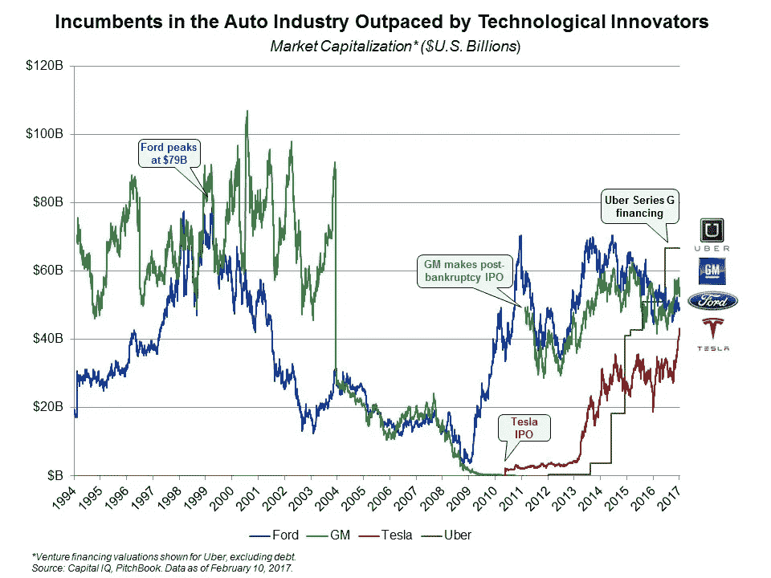
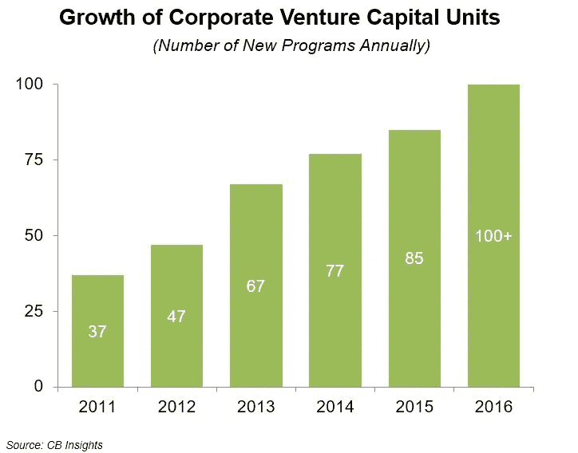

# 以下是企业巨头如何抵挡颠覆者的

> 原文：<https://medium.datadriveninvestor.com/heres-how-corporate-giants-are-holding-off-disrupters-c9c1b552ab88?source=collection_archive---------4----------------------->

## 企业风险资本的兴起及其对创新未来的意义

由[本杰明·戈登](http://bengordonpalmbeach.com/)，[剑桥首都](https://cambridgecapital.com/)

在过去十年中，新技术和新业务出现了爆炸式增长。数字经济极大地加快了创新、用户采用和信息共享的速度，因为技术比以往发展得更快、渗透得更广。

新技术的快速采用导致了行业领导者的现状在短时间内遭到来自竞争对手的大规模破坏，而这些竞争对手并不在现有公司的关注范围内。因此，公司发现竞争更加激烈，保持相关性更加困难。

 [## 风险投资家在给创业公司播种时会考虑什么标准？数据驱动的投资者

### 2017 年，风险投资资金攀升至十年来的最高水平。你的创业公司目前吸引风险投资的机会是…

www.datadriveninvestor.com](https://www.datadriveninvestor.com/2018/04/20/what-criteria-do-venture-capitalists-consider-when-seeding-a-startup/) 

鉴于现有公司面临挑战的速度，他们被迫寻找新的方式投资新兴技术和公司，以帮助他们跟上并击败竞争对手。近年来，他们开始寻求直接投资和基金投资，以便留在游戏中。

如果没有意识到自己可能会被新贵竞争者超越，现有企业的战略就不会发生这样的转变。汽车行业清楚地说明了这种技术变革和颠覆的大规模影响。[通用汽车](https://content.fortune.com/fortune500/general-motors-8/) (GM)和[福特](http://www.ford.com)自 20 世纪初成立以来，长期以来一直是美国市场的领导者。尽管他们的领导地位根深蒂固，领先了 100 年，但今天，这两家公司的总市值还不到优步和特斯拉的总市值，而这两家公司在 14 年前还不存在。

通用和福特无法预测优步(一家既不拥有也不销售汽车的公司)和特斯拉(一家甚至从未设计过油箱的公司)的破坏程度。顶级公司的颠覆不仅限于汽车行业。颠覆者正在当今数字经济的所有领域利用数十亿美元的机会。

随着这一新的创新阶层不断壮大，现有企业正在努力应对日益严峻的竞争环境。消费者很快就会采用新技术和商业模式，这让现有企业几乎没有时间去适应。

最大公司的人员流动的增加说明了变化的速度是如何比大多数公司所能应付的更快。在 1955 年的财富 500 强名单中，60 年后的 2015 年，只有 12%的公司留在了名单上——这个下降的数字预计将继续下降。

随着企业面临的所有挑战和创新者的冲击迅速侵蚀市场份额，企业如何保持竞争力？

顶级公司意识到向外看是一种战略需要。即使是最具创新精神的企业领袖，如[谷歌](https://content.fortune.com/fortune500/alphabet-36/)、[亚马逊](https://content.fortune.com/fortune500/amazoncom-18/)和脸书，也采取了积极的投资策略来获取外部资源。

**光有 M & A 是不够的**

传统上，并购一直是企业战略投资的主要武器。虽然 M&A 在一些情况下取得了极大的成功，但在另一些情况下，交易的预期好处从未实现。有时候，没有发生的 M&A 和发生了的 M 一样糟糕。错过合适的并购机会可能是生存还是破产的关键。看看百视达吧，它在 2000 年有机会以 5000 万美元收购网飞。如今，百视达已经破产，网飞身价 620 亿美元。

当谈到管理公司无法完全预测的快速发生的变化时，单靠 M&A 是不够的。与以往任何时候相比，企业领导人更多地转向传统 M&A 领域之外的投资方法，通过直接投资计划和投资于专注于行业的基金来追求他们的战略目标。

**转向直接投资和战略基金**

在过去的几年里，越来越多的公司开发团队启动了直接投资项目，作为开发新兴业务和技术的新机制。2015 年，85 家新的公司风险投资部门进行了第一笔投资，预计 2016 年这一数字将超过 100 家。因此，在过去五年中，来自企业风险投资项目的交易量和投资资本大幅增长。

为数不多的已经开发出可观的直接投资项目的公司领导者包括通用电气公司、T2、思科、T4、康卡斯特和微软。一个特别成功的直接投资项目是 UPS 战略企业基金(SEF)。联合包裹利用 SEF 与该领域有前途的新兴企业建立了一条关系管道。除了产生财务回报之外，UPS 表示，它从其投资和发展的伙伴关系中获得战略利益和知识回报。

自该计划于 1997 年成立以来，已在 40 多项投资中投入了超过 4 亿美元的资金。最近，SEF 通过投资无人机制造商 CyPhy Works 获得了引人注目的成功，该公司为 UPS 提供了新的技术和能力，以促进商业无人机服务。CyPhy Works 在最近连续三轮融资中也实现了融资后估值的增长，这并没有什么坏处。

尽管许多公司都在追求直接投资，但不可否认的是，这是一条资源密集型路线，需要大量的内部人才和资本。因此，许多公司选择通过专注于行业的基金进行投资。这些公司将直接投资外包给外部基金管理公司，以寻求一种更具资本效率的方法来获得这些战略利益和财务回报。

金宝汤公司通过向 Acre Venture Partners 投资 1 . 25 亿美元来推行基金投资战略，Acre Venture Partners 是一家风险投资公司，主要投资于食品技术、食品创业公司和农业。例如，思科通过投资红杉资本(Sequoia Capital)和 OMERS 等品牌基金，以及 McRock Capital 和 Georgian Partners 等新兴行业基金管理公司，补充了其直接投资战略。今年早些时候，[苹果](https://content.fortune.com/fortune500/apple-3/)确认向软银的愿景基金投资 10 亿美元，同时投资的还有技术领袖[高通](https://content.fortune.com/fortune500/qualcomm-110/)，富士康，以及甲骨文的拉里·埃里森。大公司和中型公司越来越多地采用这种类型的基金投资策略。

快速的变化和新技术的快速采用导致了颠覆者的力量不断增长和激烈的竞争。为了保持相关性，企业将越来越多地通过直接投资和基金投资来寻求创新的竞争方式。

[*本杰明·戈登*](http://bengordonpalmbeach.com/) *是* [*剑桥资本*](https://cambridgecapital.com/) *的管理合伙人。*

*原载于 https://fortune.com***。**