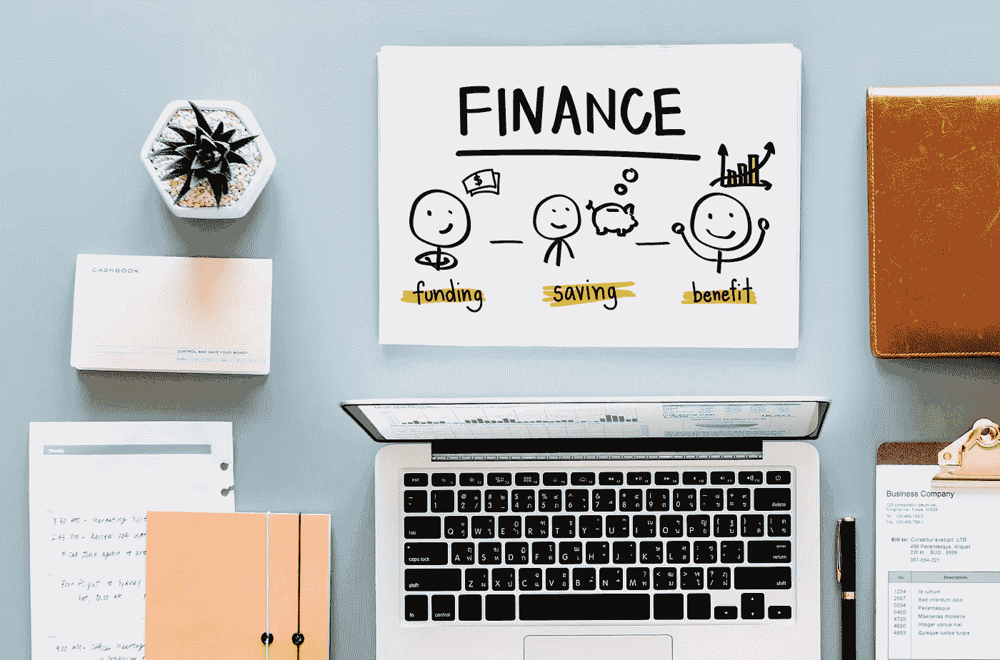

# 这里是你每个年龄应该存多少钱

> 原文：<https://medium.datadriveninvestor.com/heres-how-much-money-you-should-have-saved-by-every-age-8b12afcaa98b?source=collection_archive---------0----------------------->

虽然我不认为你能存下足够的钱，但是有大量的文章和建议围绕着每个年龄你应该存多少钱。这完全是主观的，这些等式中的变量是如此之大，以至于你永远无法准确估计你需要多少钱。然而，这些估计是一个很好的起点。虽然所需金额完全取决于你的生活方式、负债比率和消费习惯，但下面是你开始财务自由之旅的一个很好的指南。所以既然你已经知道存钱对你人生各个阶段的重要性，但是多少钱才够呢？

以下是一些理财专家为每个年龄段推荐的目标。

# 25 岁:1 万到 2 万美元

在 25 年的时间里，你很可能刚刚开始你的职业生涯，或者即将完成学业。这是最重要的时期之一，因为这是你独自冒险的时候，开始创造最有可能成为你消费习惯的东西。这是一个很好的时机来确保你的消费习惯将有助于引导你在变老和赚更多钱时实现财务自由。

那么，25 岁的时候，一个人能存多少钱呢？

有些建议各不相同，但一个建议是尽量拥有大约 2 万美元。现在这对大多数人来说可能很难，特别是因为普通人在大学毕业时都背负着大量的大学贷款，他们已经开始偿还这些贷款了。但是，即使你每月只能拿出 10 到 20 美元的存款，你也需要开始养成习惯，约束自己。这可能会减少你一周喝星巴克的数量，或者减少外出就餐的费用，但是一点一滴都会有帮助。特别是现在开始储蓄是你公司的 401(k)是你能做的最好的事情，因为复利将成为你最好的朋友。

# 30 岁:一年的薪水加上三个月的开销

根据富达的公式，在 30 岁左右，你应该存下大约一年的起薪，外加几个月的开支作为应急基金。现在这个时代，你可能是单身，或者你可能开始组建家庭，但无论你在人生道路上的哪个位置，储蓄的结果应该是一样的。有一个应急基金在这个年龄是至关重要的，因为你正在开始你的职业生涯，你很可能不会有可支配的钱，以防你有一个大型的汽车修理。请记住，复利将是你最好的朋友，尤其是因为你很可能会有 30 年左右的工作和储蓄。记住，如果你的雇主提供了一个 401(k)匹配，你至少应该投资他们匹配的金额。如果你不这样做，你就是选择不利用免费的钱。此外，现在投资并直接从你的支票中支取将为你的退休铺平道路。还要确保每年至少增加 1%的供款，最好是在你每年增加或提高供款的时候，这样你就不会把增加的钱取出来。

# 35 岁:45，000 美元的存款或你年收入的两倍。

在你 30 多岁的时候，你的工作可能已经改变，你可能正处于组建家庭的阶段。这可能会给你现有的财政资源带来压力。儿童开支继续增长，你可能会觉得手头没有可自由支配的资金，但你会依赖于你在 20 多岁时养成的强烈的储蓄习惯。另外，看看你的收入潜力开始增长的事实。坚持那些储蓄习惯，保持自律。说你没有多余的钱很容易，特别是因为这意味着你可能不得不放弃一些你喜欢的东西，但如果你从长远考虑，你会理解现在强烈的储蓄和消费习惯的好处。

确保你已经增加了你的 401(k)缴款，并且尽你所能地缴款。

# 40 岁:根据富达公式，三年的退休储蓄工资

所以你现在已经走过了职业生涯的一半。孩子们正在长大，你已经结婚一段时间了，你对支付账单感到很舒服，生活的游戏正在顺利进行。这个年龄，你应该有一个舒适的应急基金，你也应该有大约 3 倍于你的年薪。如果你在 30 岁的时候实现了收入翻倍的目标，那么在过去的 10 年里，大约 5%的储蓄就相当于实现这个目标的数字。如果你落后了一点，那么你和其他人是一致的，但你可以通过在这些年里多做一点贡献来赶上。

# 45 岁:大约 175，000 美元的存款，或者是你工资的 4 倍

45 岁左右是你实现职业收入潜力的时候。这当然很好，但你的账单很可能会增加，因为你可能正在为大学和其他费用存钱。因此，虽然这种储蓄是一个很好的开始，但如果你想持续旅行或打高尔夫球，这肯定不足以退休。好消息是，你还有很多年才退休，通过复利的好处，你仍然有足够的时间来积累养老金。在这一点上，你应该尝试最大限度地利用你的退休投资。

# 50 岁时:退休储蓄是你工资的 6 倍，大约 25 万到 35 万美元

现在你已经 50 多岁了，随着时间的临近，你可能已经开始考虑退休了。你还有大约 10 年的工作时间，这应该是迄今为止你储蓄最多的一年。你极有可能成为“空巢老人”。这是。该开始了。考虑缩小规模。你的开销应该会减少，因为孩子们都不在家，大学费用来了又去。确保你继续多样化你的投资组合。当你接近退休时，这是至关重要的，以确保你有适当的平衡，能够承受市场下跌或熊市。现在你超过 50 岁了，你可以为你的退休做更多的贡献，因为政府允许你贡献，并每年增加 6000 美元作为补偿。如果可能的话，继续最大限度地节省尽可能多的钱。开始考虑如何减少你的固定开支。这可能是通过裁员或制定一个计划，让你在退休时还清抵押贷款。

# 65 岁以上:确保你有储蓄计划

恭喜你！你已经退休了。这是你一直在等待的时刻。你已经努力工作和储蓄了很多年，现在是收获这些好处的时候了。但是退休可能会很可怕。你有足够的钱吗？你能做你一直梦想的事情吗？现在是实施你的计划的时候了。确保你有一个好的投资组合。你需要稳定的中长期投资来度过你的黄金岁月。仅仅停留在稳定投资上的心态已经改变，因为在今天的环境下，你不能这样做并跟上通货膨胀。你必须分散投资，并在退休后继续投资。

不管你存了多少钱，有一个计划是最重要的部分。确保你为医疗费用、市场下跌和通货膨胀做好准备。保持预算可以帮助你实现这些目标，享受未来的岁月。