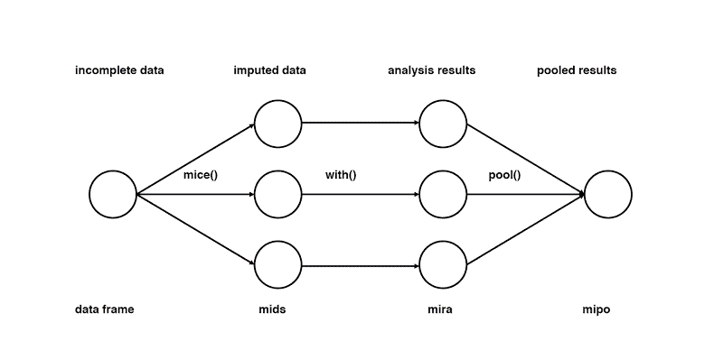
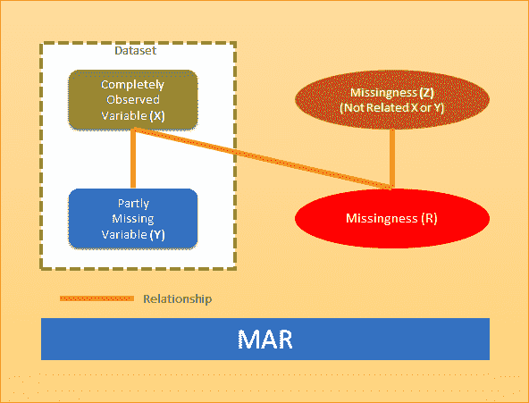
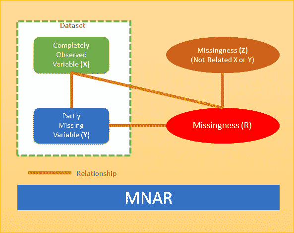

# 以下是如何配置缺失数据的自动插补

> 原文：<https://medium.datadriveninvestor.com/heres-how-you-can-configure-automatic-imputation-of-missing-data-f90245b0ce6f?source=collection_archive---------1----------------------->

作为数据分析师或数据专业人员，您如何处理丢失的数据？当涉及到统计分析或机器学习等以数据为中心的领域时，处理缺失数据是一个常见的问题。最终，丢失的数据会影响您的数据质量和数据分析的价值。

在网络世界中，丢失的数据可能有多个来源。这包括客户调查表中的不完整字段、数据库系统中的丢失文件或数据输入中的错误。事实是，大多数这样的数据集只有很少的缺失值(不到 5%)，并且可以通过正确的机器学习算法和其他工具自动管理。

然而，不要将丢失的数据(或值)视为一种限制，它可以被视为使用正确的建模工具来解释它以实现业务价值的机会。一种有效的方法是对缺失数据进行自动插补，这种方法可以在具有大量缺失值(超过 5%)的数据集上进行。

 [## 信息图:云之旅|数据驱动的投资者

### 聪明的企业领导者了解利用云的价值。随着数据存储需求的增长，他们已经…

www.datadriveninvestor.com](https://www.datadriveninvestor.com/2018/09/22/infographic-journey-to-the-clouds/) 

在接下来的几节中，我们将介绍缺失数据的自动插补是如何工作的，它的各种技术，以及它对更好的数据分析的重要性。

# 什么是缺失数据插补？

实质上，缺失数据插补由各种技术组成，所有这些技术都旨在生成(或替换)缺失数据变量的值。例如，在缺失数据的自动插补中，分析工具致力于为每个数据集创建多组“完整”数据。

为什么这是有益的？以便在统计分析期间，每个估算数据集(及其估算值)可以汇集在一起。与单个数据集值相比，这使得对统计分析的估计更加准确。

# 缺失数据插补常用的技术有哪些？

以下是一些例子:

## 均值、中值和众数技术

在这种技术中，平均值、中值或众数用作插补值，用于缺失数据的统计估计。例如，在平均值方法中，特定变量(包含数字数据)的平均值替换同一变量的缺失值。

同样，在中位数技术中，变量的中值(具有偏斜分布模式)被用作缺失值。对于模式技术，缺失值被替换为数据集中最频繁出现的变量(非数值)。

## 上次意见结转(LOCF)

这是基于时间的数据集中常用的插补技术。缺少的值将被数据集中最新或最后观察到的值替换。

## 下一次观察向后进行(NOCB)

这种插补技术的工作顺序与 LOCF 方法相反。这意味着丢失的值将被数据集中的下一个观察值替换。

## 多重插补

对于这种插补技术，一组分布式观察数据用于估算缺失数据的一组插补值。在这种方法中，创建多个数据集，然后对其进行单独分析，以估算插补值。

多重插补的一个例子是链式方程或 MICE 方法的多重插补。该方法通过多重回归模式执行，然后根据数据集的观察值有条件地对每个缺失值进行建模。

# 使用 Python 实现缺失数据插补—案例研究

这里是一个使用 Python 语言实现缺失数据插补的真实案例研究。

客户有一个在线调查响应数据存储在一个 [Google BigQuery](https://cloud.google.com/bigquery/) 仓库表中。由于跳过了一些调查问题，许多调查回答缺少数据。客户端的目标是能够从 BigQuery 中检索选定的变量，对具有缺失值的 BigQuery 变量执行自动插补，然后将输出保存在 BigQuery 表中。

为什么需要自动插补？以便每天或每周自动安排估算服务。除了使用 [Python](https://www.python.org/) 语言，插补过程还需要使用 [Google Cloud](https://cloud.google.com/) 服务和 [Google AppEngine](https://cloud.google.com/appengine/) 来执行。

# 为什么使用 Python 插补方法？

*   Python 中的“[自动计算](https://pypi.org/project/autoimpute/)”方法，支持插补执行和分析。
*   Python 中用于缺失数据插补的“ [missingpy](https://pypi.org/project/missingpy/) ”库。

解决方案:使用 Python 实现了一种先进的插补算法，该算法不仅使用数据集中的“平均值”,还使用所有可用的数据变量。在运行时，在指定以下内容后，会创建此插补服务的多个实例:

*   源数据库表
*   要提取的变量
*   需要插补的缺失数据变量
*   目标数据库表将储存所有选定的变量，包括有插补值的变量。

在下一节中，我们将看看如何估算数据集中的缺失值。

# 如何估算缺失值

输入缺失值的机制通常分为以下三大类:

## 完全随机失踪(或 MCAR)

这种方法假设缺失数据(或缺失)与正在观察的(或 X)或缺失的(或 Y)其他变量无关。例如，一项关于小学生肥胖原因的研究中，有一些儿童的数据缺失，他们一开始就不能参加临床研究。

## 随机丢失(或损坏)

这种方法的前提是，缺失数据(或缺失)与数据集中的观察变量(或 X 变量)部分相关，但与缺失变量(或 Y 变量)无关。这方面的一个例子是一项研究，该研究监测离开学校的学生，并包括因父母搬到不同城市而丢失的数据。

## 非随机缺失(或 MNAR)

当数据集不满足前两种方法的条件时，使用此方法。MNAR 方法基于与数据集中的观察变量(X)和缺失变量(Y)相关的缺失。

例如，在学校肥胖研究中，当父母发现孩子的行为非常令人反感而自愿让他们退出研究时，就会产生缺失数据。

缺失数据的自动插补如何有助于更好的数据分析？让我们在下一节中理解这一点。

# 缺失数据插补的主要优势

就有效的数据分析而言，缺失数据的插补具有关键的使用案例和优势。作为数据分析师，您可以设计能够处理缺失数据插补的统计或预测数据模型。

以下是缺失数据插补的一些使用案例:

## 线性回归

基于线性回归，这种插补方法可用于根据现有变量对缺失数据进行预测。随后，预测值被替换为缺失值。这种方法在数据分析中非常有价值，因为它消耗大量数据来进行准确预测。此外，它避免了平均偏差值的显著变化。

## 随机森林

这是另一种适用于 MAR 或 MNAR 模型的插补方法。基于随机森林的数据模型部署多个决策树来计算缺失值。随着减少错误估计，随机森林在大型数据集的分析中有效地工作。

## 机器学习

无论使用何种插补技术，这些技术总会有一定程度的偏差。虽然多重插补(使用几个数据集)是一个安全的赌注，但机器学习模型最适合消除缺失数据插补中的任何潜在偏差。

机器学习和多重插补的结合是减少缺失数据和更好地分析输出数据的最佳方法。

# 结论

在任何数据集中，一些缺失数据被认为是正常的，可以由分析引擎自动处理。一些能够自动填补缺失数据的技术的出现正在改变数据分析师和科学家应对这一挑战的方式。

凭借其在[人工智能、机器学习、](https://www.countants.com/blogs/why-is-artificial-intelligence-in-business-analytics-so-critical-for-business-growth/?utm_medium=social&utm_source=Medium&utm_campaign=Traffic)和 [BigQuery 自动化](https://www.countants.com/blogs/implementing-google-bigquery-automation-using-google-analytics-data/?utm_medium=social&utm_source=Medium&utm_campaign=Traffic)方面的广泛专业知识，Countants 已准备好为数据分析领域的客户项目提供合适的技术支持。在您的企业中寻找缺失数据插补的正确方法？[现在通过我们的网站](https://www.countants.com/contact-us/?utm_medium=social&utm_source=Medium&utm_campaign=Traffic)联系我们，我们会尽快回复您。