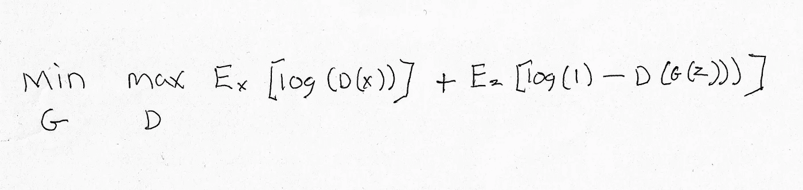
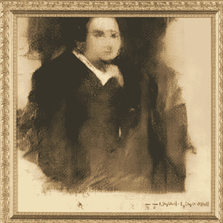

# 这是下一位伟大艺术家的名字:

> 原文：<https://medium.datadriveninvestor.com/heres-the-name-of-the-next-great-artist-6db63a890af4?source=collection_archive---------11----------------------->

This is the algorithm that produced the AI artwork, “Portrait of Edmond Belamy”

“当一个人带着向他人传达他曾经体验过的感觉的目的，在自己内心重新唤起这种感觉，并通过某些外在的符号表达出来时，艺术就开始了”。

列夫·托尔斯泰

1913 年，发生了历史上规模最大、影响最大的艺术展；1913 年军械库展览。位于第 25 街和第 26 街之间的列克星敦大道上的纽约第 69 军团军械库里，收藏了 1200 多件艺术品，包括来自美国和欧洲的 300 多名艺术家的雕塑、绘画和装饰作品。该展览向美国观众介绍了毕加索、马蒂斯、杜尚和现代主义。这一事件在当时是如此激进，以至于习惯于艺术中的现实主义的批评家们，质疑其作品出现在展览中的艺术家们的心智是否健全。但实验艺术最终被美国接受，并为伟大的美国艺术家如杰森·布拉克、马克·罗斯科和安迪·沃霍尔让路。1913 年的军械库展览永远改变了艺术，100 多年来没有任何其他有影响力的艺术活动能与之媲美。但现在这种情况已经改变。

2018 年 10 月，世界知名艺术拍卖行佳士得以 43.2 万美元的价格出售了其第一件人工智能生成的艺术品。这幅名为“Edmond Belamy 的肖像”的艺术品是由一个名为 *Obvious* 的法国艺术集体制作的，它使用算法对历史肖像的数据进行处理，从而得出一幅自己独特的肖像。

画像本身似乎并不惊天动地。这是故意模糊的，是一个男人的梦境般的肖像，或者仅仅是一个男人的想法，来自一个多世纪以前。画布右下方的部分由制作它的算法签名。正如你在这张*《肖像》*中所看到的，令人毛骨悚然的因素非常严重，我可以很容易地想象这是一部 B 级恐怖电影中的一个糟糕的道具，在那里我会小声嘀咕着*“他们可以做得更好。”*

这条新闻让人们对几个世纪以来一直在问的问题产生了疑问；什么是艺术？在《赫芬顿邮报》一篇题为[“艺术是什么？Andrew Isaac Burrill 问了 10 位来自不同创作领域的艺术家这个问题。他们用来描述艺术的一些词语是:人性、情感、想象、大脑、反思、意义、生命和灵魂。这些都是电脑生成的画像可能缺少的属性和原因。](https://www.huffingtonpost.com/andrew-isaac-burrill/10-powerful-responses-to-what-is-art_b_9651936.html)

许多过去由人类做出的决定现在正由计算机量化和决定。入学、贷款、医疗保险和执法资源的决策现在至少部分由算法驱动。IBM 正在基于算法制造香水。一个名为*喵生成器*的机器学习算法集合已经毫无理由地产生了数以千计的猫脸，只不过是为了完善深度学习软件，推动这场走向人工智能接管的运动。

在克里斯蒂的网站上，他们指出，“这提出了一个有趣的概念，即人工智能算法不仅仅是制作图片，它们还倾向于模拟艺术史的进程——好像艺术从具象到抽象的漫长过程是一个已经在集体无意识中运行了 500 年的程序的一部分，我们视觉文化的整个故事是一个数学必然性。”

在这篇文章中，我并不认同这种观点。然而，即使这是真的，我们真的想往那个方向走吗？我们想把人类最大的努力交给算法吗？艺术不仅仅是这些，它必须是，对吗？我可以把它比作运动。“这只是一个游戏”的想法是完全荒谬的。不仅仅是数字和身体上的壮举。它融入了我们的社会。它是领导能力、团队精神、社会结构、教育，它有能力使我们的社会发生深刻的变化。

艺术也有一个不能用一个只基于量化的输出来衡量的限定条件，减去记忆和围绕作品的历史。艺术的制作者也很重要。它给成品增加了意义，实物本身就是有形的艺术品。一件没有人类参与的艺术作品可能会变成一件在技术上和美学上都令人愉悦的作品。但如果一个完全相同的复制品可以是我的数百万倍，那么这个作品应该有多大价值呢？当有人购买一幅梵高的画时，他们购买的是画这幅画的人的整个历史，而不仅仅是画本身。电脑虽然很棒，但至今还没有多少个性。

我们现在拥有可以打败世界顶级象棋大师的电脑。人们观看电脑化的国际象棋游戏，游戏速度变慢，这样我们就能看到发生了什么，因为实际上这些游戏只会持续几分之一秒。我想让这些电脑相互竞争，看看哪台电脑会赢，这将是一种奇怪的尝试。这可能非常有趣，(两台相同的计算机通常会打成平局)。我不想坐在那里看两台电脑在任何游戏中对战。我在教室里看过两个学生玩的更有趣的象棋游戏，他们和大师水平相差甚远。观看电脑在锦标赛中玩游戏对于数百万人来说是一件大事。但我觉得，游戏本身让位于制作算法的群体之间的战斗，游戏本身只是他们表达自己在编程中的创造力和创新的一种视觉和有形的方法。

如果艺术将成为一种被动的努力，那么计算机生成的艺术将会非常受欢迎和成功。我们被动地看着人们一边吃着食物一边制作视频，或者用手指轻轻抚摸有纹理的物体。这种被动参与环境的方式并不新鲜，毕竟我们的体育爱好者比运动员多得多，而创建应用程序的人只占实际使用应用程序的一小部分。但新的是，我们现在在观看不是由人类表演的比赛中找到了乐趣，这些比赛大多是竞争性的。

我可以想象这样一个未来，我们是通过管道喂食的肉块，而我们臃肿畸形的身体躺在躺椅上休息，我们的思想被喂食模拟版的现实，机器人沿着椅子岛滑下来，重新装满点滴瓶，让我们既被麻醉又活着。如果我们继续外包我们的人类特征，我想知道这将把我们带到遥远的未来。

我们越深入人工智能，我们对生活的参与就越外包。当我们沿着这条路走下去的时候，这将把我们带向何方？我们甚至可以完全取消体育项目，让运动员成为观众。例如，足球可以是一种用计算机模拟与计算机科学家和程序员队伍进行的比赛。我们仍然可以赌博，有每周的选秀权，喜欢的球队和(虚拟的)英雄，等等。，但没有真正的足球提供的脑损伤。

大多数开发这个软件的人都不到 26 岁。来自法国艺术集体的三名研究人员都是 25 岁。他们用来制作人工智能绘画的算法是由一位名叫 Robbie Barrat 的 19 岁人工智能艺术家编写的。我可能给人的印象是一个老的、脱离现实的人，但我想知道这些人知道多少，或者更重要的是，他们对艺术有多欣赏？显然，他们都是才华横溢的年轻人，在未来很长一段时间内改变了我们对艺术的看法。但是作为程序员和商业人士，有可能这整个努力只不过是一个必须克服的技术挑战。他们不是唯一追求这一目标的人，如果他们的*Edmond Belamy*肖像不是佳士得拍卖的第一幅人工智能肖像，就会有另一幅来自其他人的人工智能肖像被拍卖。

我想坐时光机回到曼哈顿去看 1913 年的军械库展览，那场展览颠覆了艺术界。我会警告他们未来一百年将会发生什么，但当然我们已经在技术上取得了如此巨大的飞跃，他们中的大多数人不会理解，而那些理解的人会感到震惊。如果他们认为*裸体下楼梯，2 号*是激进的，等到他们看一看*贝拉米先生*。但是艺术纯粹主义者还是有希望的。只要人类存在，就会有他们试图表达的想法，无论是在音乐、艺术还是计算机算法中。将会有所不同的是，我们将不得不学会如何与我们的数字兄弟姐妹并肩生活。计算机制作的艺术很可能有自己的类别，与人类制作的艺术分开。也许计算机会有自己的超级明星，可以与伦勃朗、毕加索和弗米尔的受欢迎程度相媲美。我们别无选择，只能动态地重新定义我们对艺术的概念。