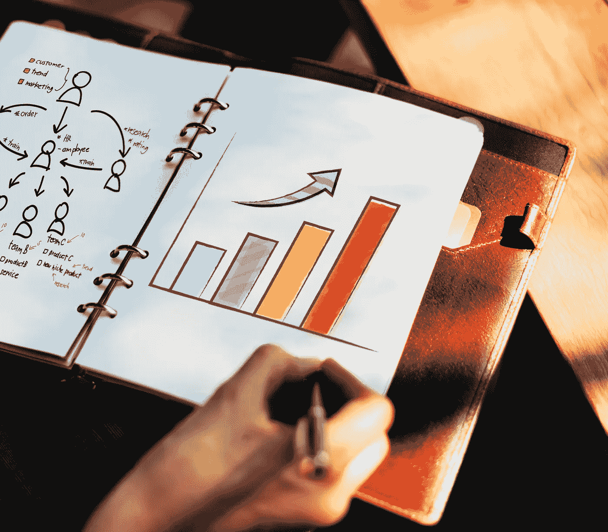

# 这里是加速你财富的秘密

> 原文：<https://medium.datadriveninvestor.com/heres-the-secret-to-accelerating-your-wealth-df9d8f6ae41f?source=collection_archive---------21----------------------->

RawPixel on Unsplash

完美是无法达到的，但是如果我们追求完美，我们就能赶上优秀

文斯·隆巴迪。

有时候，加速财富增长的想法会让人望而生畏。当谈到我们的财务时，我们经常试图达到完美，达不到这一点会感到毁灭性的。

毕竟，财富等于财务稳定，对吗？

不对。

关于财富，只有当你能让它为你工作时，它才是重要的。如果你挣了一份令人难以置信的薪水，但没有采取正确的步骤进行投资或储蓄，你的财富将会停滞不前，你可能最终会感觉自己在流沙中前行。

为了追求完美，需要有行动。

但是，如果你的目标是增加你已经拥有的财富，那么什么是正确的行动呢？

*尽可能多地保留你的钱。*

这不仅仅是关于预算和储蓄，尽管这都是防止你的钱从口袋里飞出的好方法。

这也是关于学习如何让你的钱为你工作。这是关于评估机会成本和理解是什么阻碍了你保持资金的能力。无论你是已经积累了财富，还是刚刚开始积累，你都可以抓住它，加速你已经拥有的财富！你持有的钱越多，你就越容易通过投资或储蓄来加速资金的流动。

我有一个客户，姑且叫她莎拉吧，她收入稳定，支付账单，并且有着健康的财务习惯。然而，她来找我时对她的钱为何停滞不前感到困惑。如果她量入为出，负责任地花钱，她的财富不应该在加速增长吗？如果你在图表上看你的财务状况，她的财务状况看起来更像一条稳定的上升线，而不是那条表示加速的倒抛物线。

莎拉没有做错任何事，但她没有足够专注于尽可能多地保留自己的钱。因为她会按时支付账单，并把多余的钱存起来，所以她的财富在增长，但是是稳步增长，而不是快速增长。她投资得不够(或不恰当)，也不清楚她实际上损失了多少钱，包括机会成本、债务和整体心态。

加速你的财富并不意味着更加努力。你只需要正确理解你的财务状况，以及如何保持它们。

有六个核心方法可以让你通过保存你的钱来加速你的财富。

## **1。了解机会成本，以及你因此失去了什么**

你知道与你的银行账户相关的每一笔费用吗？你想过你多长时间收一次自动取款机的费用吗？失去的机会成本是你由于费用而花费的任何钱，或者你不必要或不知不觉地放弃的任何钱。这是你不能再投资的钱，意味着你的财务不能随着市场加速增长，你的收益也不会随着时间的推移而增加。

平均每个美国人每年会损失 2334 美元的机会成本。如果你没有注意，或者你已经习惯于支付这些费用，你可能会发现自己在未来几十年里损失了数百万美元，只是因为你让自己的钱减少，而不是通过投资积累更多。这些成本的一些例子包括:

信用卡费用和利息

ATM 费用

日常咖啡习惯

银行费用

掌控你的财务。确保你清楚你所花的所有费用和开支，并尽可能地削减开支。不要让机构拿走你的血汗钱。

## **2。管理你的债务**

如果你发现自己因为债务而无法投资或存钱，你并不孤单。[十分之八的美国人负债累累。美国人欠学生贷款或抵押贷款比任何其他债务都多，但实际上医疗债务是美国申请破产的头号原因。](https://www.cnbc.com/2015/07/29/eight-in-10-americans-are-in-debt.html)

你可能想知道…我应该还清我的债务，还是用这笔钱投资？

你必须评估两个因素:你为债务支付的利率(税后)，以及你预期从投资中获得的利率。如果你能从投资中赚更多的钱，投资你的钱…如果不能，用它来偿还你所有的债务。投资是让你的钱为你工作的关键，但如果你仍然负债，投资可能不是你的出路，只有当投资让你赚钱时，投资才有意义。

还清债务是财务自由和整体幸福的必要条件。如果你还欠着钱，你就不能加速你的财富。

## **3。投资**

让我们回顾一下失去的机会成本。你平均每年的 2334 美元是你没有投资的钱。如果你以 20 年 6%的平均利率投资这笔钱，你会有 90，000 多美元。突然之间，3 美元的自动提款机费或 5 美元的每日咖啡似乎成了一件大事！投资是你积累财富的好方法，最好的投资是你不会错过的。你可能已经没有注意到你每月在信用卡费用、利息或你的咖啡店习惯上花费的大约 200 美元。想象一下，将这笔钱投入投资，很快你就会得到 9 万美元。现在听起来像一个计划！

## **4。预算**

“预算”这个词可能会让你迷惑。我明白了——这个词不一定与乐趣联系在一起……但它给你带来了如此多的自由。预算实际上帮助你掌控一切。另外，这不一定是一件令人头痛的事情；其实可以[赋权](https://www.mint.com/saving-money-2/4-reasons-why-creating-a-budget-can-increase-your-wealth)！预算帮助你理财的方式有很多，但这里是我最喜欢的两种:

*揭露恶习。*

如果你经常发现自己不知道你的钱都花到哪里去了，你可能没有做好预算。正确的预算会告诉你你是如何花钱的，以及在哪些方面你可能会有问题。例如，如果你像大多数美国人一样(准确地说是 68%)，你可能会在外出就餐上超支。预算会揭露你的坏习惯，让你知道你的钱真正去了哪里。

*帮助你设定目标。*

预算本质上是一种设定目标的工具。当你制定预算时，你是在告诉自己，你想在某些领域花一定数量的钱。一旦你完全了解你如何使用和花费你的钱，你就可以开始设定强有力的目标，并掌管你的财务。

一旦你有了预算，你就可以开始考虑更大的问题和障碍，比如合理投资、还清债务和为退休储蓄。

## **5。培养积极的金钱心态**

我认识的最成功的人在金钱方面都有积极的心态。

那么，什么是金钱心态呢？我肯定你听说过这个词，但是简单地说

换句话说，金钱心态是你对自己的财务所持的态度和信念。你认为钱容易管理吗？难？压力大？因此，这就是你的金钱心态。

无论是日常消费习惯还是大型财务决策，你的金钱心态都会影响你实现人生目标的能力。想象一下，你是坐在驾驶员的位置上，还是乘客的位置上。当你的钱在行驶时，它控制着你能停在哪里，带着你一起行驶。然而，当你开车时，你带着钱平稳地驶向你决定的目的地。

培养积极的金钱心态可能需要一些时间，但总的来说，这是你的梦想和想法如何真正过渡到你完全控制自己财务的状态。作为一名[财务教练和顾问](http://copiawm.com/)，我的目标是帮助你改变你的财务状况，这样你就能以一种积极的、充满机遇的眼光看待你的财务状况，避免你对财务状况的任何负面看法。

## **6。提高你的收入**

你的收入是你的头号资产。你不会永远赚钱，所以当你可以的时候，最大化这笔资产是很重要的。这可能意味着争取升职或加薪，延长工作时间，甚至考虑转行。你需要确保你的支出少于收入。这可能是一句古老的谚语，*省一分就是赚一分*，但这是真的——你花得越少，你存得越多，你的财富增长得越快。

# **让我们实现**

是时候让你的钱开始为你工作了，也是时候培养你加速财富增长所需的技能和心态了。现在是时候掌控你的财务命运了。作为一名财务教练，我的重点是帮助你找到你的钱，并加速它，这样你就能对你的财务状况感到满意。你需要，也想要，尽可能多的存钱，现在你有了工具，可以开始朝着加速的目标前进了！让我们把你的“愿望清单”变成你的“现实清单”

___________________________________________________________

## **准备好升级你与金钱的关系了吗？**

我已经创建了一个免费的备忘单来帮助你发现破坏你财务成功的 7 个隐藏成本——以及如何应对它们。

## [点击此处获取免费小抄！](https://coach.copiafinancialcoach.com/checklist)

***伊丽莎白·道森(Elisabeth Dawson)是一名财务顾问，著有《财富由设计而生*** ***》。她还是*** [***Copia 财富管理顾问公司***](https://www.cwmainc.com/) ***和*** [***Copia 财富管理&保险服务***](http://copiawm.com/) ***的创始人兼首席执行官，旨在帮助客户实现财务上的伟大。***