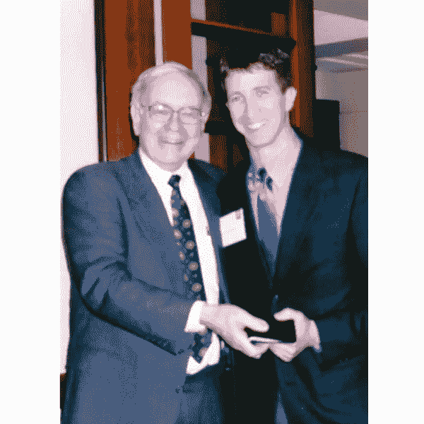
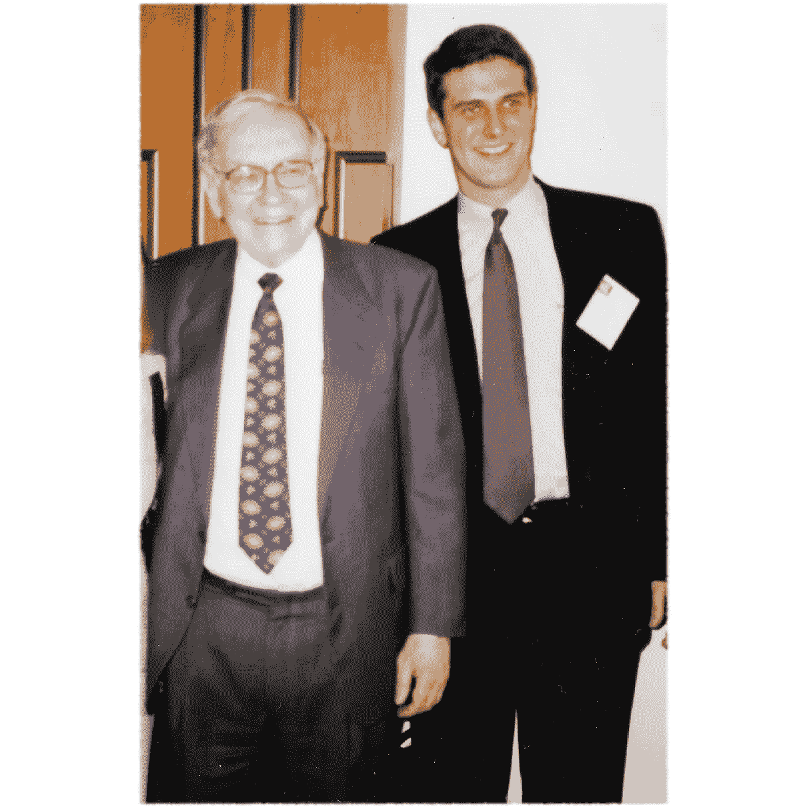
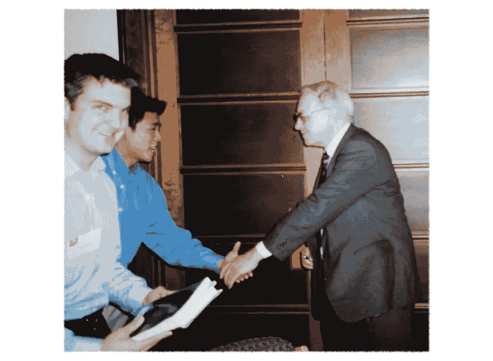

# “股票看起来贵吗？”以下是沃伦·巴菲特今天的回应，他的生日

> 原文：<https://medium.datadriveninvestor.com/heres-warren-buffett-s-response-today-to-do-stocks-look-expensive-on-his-birthday-12ead1fab022?source=collection_archive---------5----------------------->

## "今天早上我们在买股票。"—沃伦·巴菲特—“我不知道什么时候买股票，但我知道是否应该买股票，”美国消费者新闻与商业频道，2018 年 8 月 30 日。

# 奥马哈先知今天早上在美国消费者新闻与商业频道。

## 华伦，88 岁生日快乐！🎂

以下是他在 22 分钟的采访中对贝基·奎克问题的一些回答

## 快速提问:在这些价格下，你觉得股票看起来贵吗？

“如果你可以选择购买并持有 30 年期的 30 年期债券，或者持有一篮子美国股票，毫无疑问，你持有股票会更好。

“……比固定收益证券更有吸引力”

“随着时间的推移，一些获得高资本回报的企业将击败 30 年来固定利率约为 3%的债券。”

this image was not taken today

## **【vs 房地产】**

“这不是我的专业领域，但是……一般来说，股票——它们是生意；它们是美国企业:价值 30 万亿美元——它们看起来比……一般来说比房地产便宜”

## **奎克:现在唯一让股票看起来有吸引力的是与固定收益的比较吗？**

> “这就是你在投资中必须做的，我的意思是，你口袋里有一些现金。你已经有了存款，问题是你用它做什么？”
> 
> “……股票；如果你看看美国股票，相对于投入的资本，美国企业赚了很多钱。”
> 
> “…股票可能会给你 3%的股息，但他们会把钱投回去，或者回购股票，或者做些什么，随着时间的推移，这将产生巨大的影响。”

## **快:一些一直在观望的散户投资者认为‘哦，天哪，我又错过了机会’……**

## 上次我们和你谈话时，你说你在买股票。你现在还好吗？

"今天早上我们在买股票。"

“我宁愿便宜点买……”

“我在每一任总统的任期内都买了——七位是共和党人，七位是民主党人——我每个季度都买了。有些买卖非常好。他们中的一些人不是在这样的好时光。

> **“而且我不知道什么时候买股票但是我知道该不该买股票。”**

“假设你打算持有它们(随着时间的推移)，难道你不想拥有各种伟大企业的权益，而不是一张 30 年后能给你 3%回报的票据，或者一笔可能给你 2%回报的短期存款，或者诸如此类的东西吗？”

## 伯克希尔·哈撒韦公司的最大股东是苹果公司，占发行股票的 5%。关于 iPhone:

“如果你看看那一小块东西，不管它是什么，那都是世界上最有价值的房地产。

> “……有数亿人拥有强大的购买力，能够做生意或学习信息或其他任何东西，这是他们生活习惯的一部分。……房地产价值连城”
> 
> “……他们生活中不可或缺的一部分。这是一款非凡的产品”

查看今天对美国消费者新闻与商业频道的 22 分钟完整采访，并在下面分享你的评论。

 [## 巴菲特说，自从改变政策以来，伯克希尔·哈撒韦公司已经回购了“一点”股票

### Berskhire Hathaway 董事长沃伦巴菲特表示，公司已经回购了一些股票，因为它改变了衡量标准…

www.cnbc.com](https://www.cnbc.com/2018/08/30/buffett-says-berkshire-hathaway-has-bought-back-a-little-of-its-stock-since-changing-policy.html) 

## 对了，下面是去年的生日采访和类似问题的回复: [17 分钟彭博采访](https://www.bloomberg.com/news/videos/2017-08-30/warren-buffett-on-investments-and-income-inequality-video)，2017 年 8 月 30 日。

关于作者:

[Jason R. Escamilla，CFA](http://linkedin.com/in/jescamilla/) 是 [ImpactAdvisor LLC](http://impactadvisor.com/) 的首席执行官，这是一家总部位于三藩市的注册投资顾问公司，为有高级财富管理需求的个人和企业客户提供服务:高税率、定制投资组合、另类投资等。

ImpactAdvisor LLC 专门从事现代投资:[税务智能](https://TaxTips.app) + [社会选择性](https://CustomESG.com) ℠

我们的普通客户拥有超过 100 万美元的投资资产。我们有一个小客户的等候名单，但在现代定制软件、数据和设计的帮助下，我们正在处理积压的工作。

要与独立注册投资顾问讨论你的长期投资策略选择，你可以[在这里安排一次电话交谈](http://calendly.com/impactadvisor/)。

照片来源:2002 J.Escamilla

# 本材料仅供参考，不应作为税务、法律或财务建议的依据。

该材料基于一些合理的事实和法律假设，但并未考虑到每个具体情况的所有事实和情况。我们鼓励您在进行任何财务或税务规划之前咨询您自己的税务、法律和财务顾问，或者联系我们请求推荐任何上述专业顾问。

部分或全部另类投资计划可能不适合某些投资者。ImpactAdvisor LLC 的任何客户都不能自动获得接收另类投资产品信息的资格。

所提供的观点和信息仅在本文发布时有效。本文包含的材料仅用于教育目的，不构成投资、法律或税务建议，也不是出售或购买任何投资、投资过程、策略或建议的要约。本手册的编写没有考虑读者的个人情况和目标，因此可能不适合所有人。特定建议、投资或其他策略的适当性取决于个人或实体的个人或具体情况。过去的表现不能保证未来的结果。