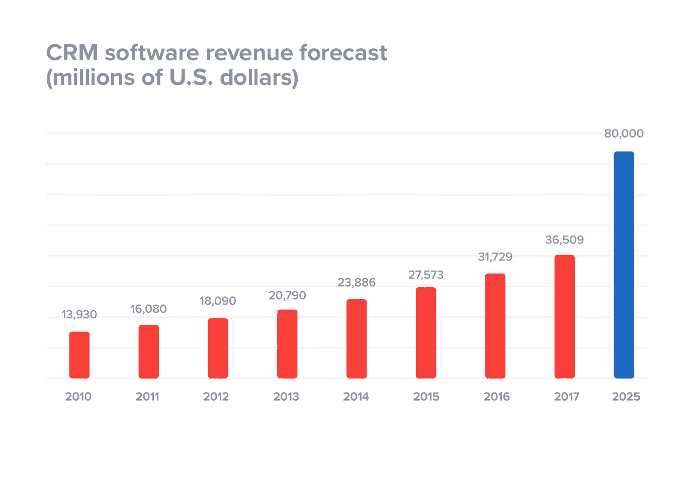
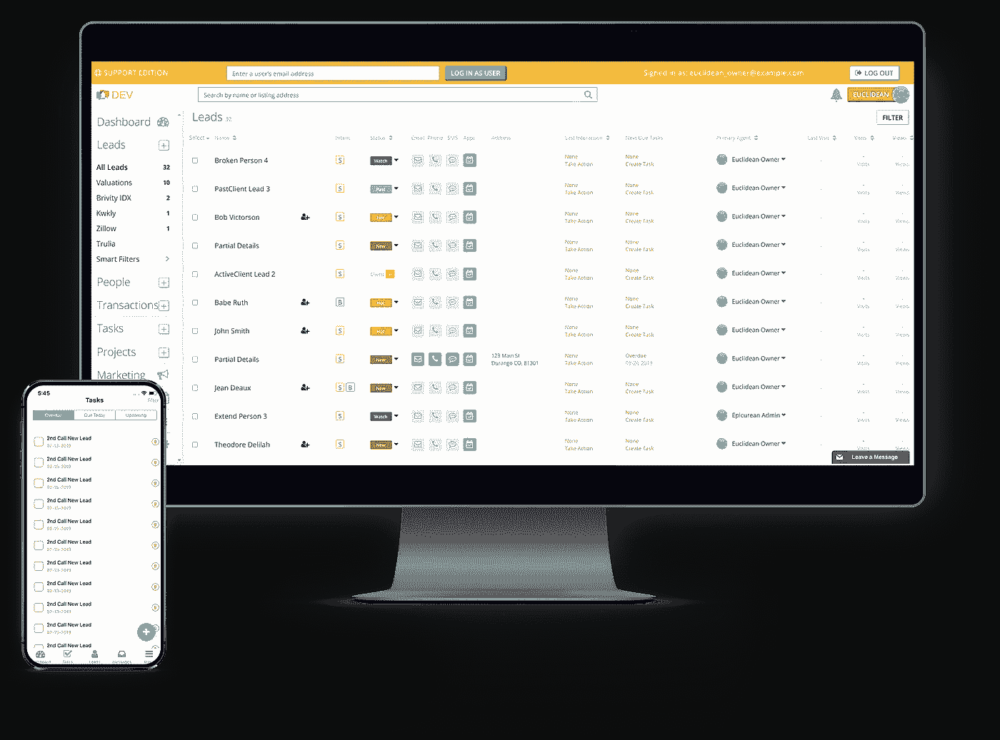
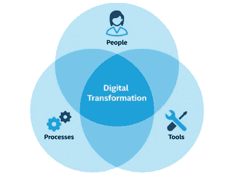
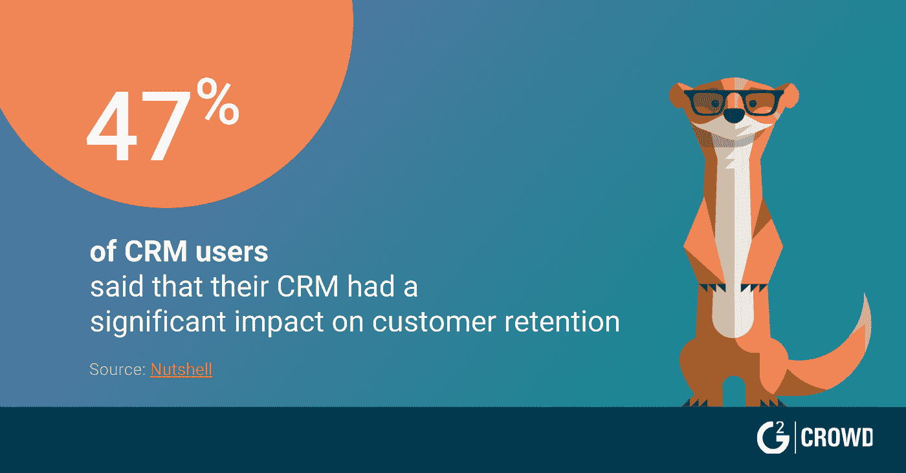
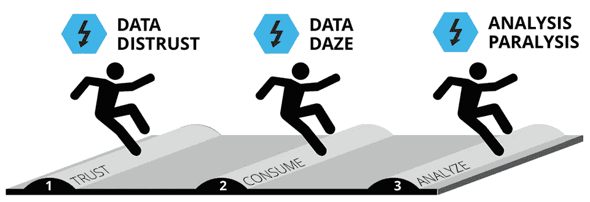

# 下面是开发一个现代客户 CRM 必须做的事情

> 原文：<https://medium.datadriveninvestor.com/heres-what-you-must-do-to-develop-a-modern-custom-crm-f29072d02998?source=collection_archive---------7----------------------->

## [同类最佳指南]

## 如何正确实施定制的 CRM 解决方案，提高客户满意度和投资回报率

*向日葵实验室首席执行官 Ronak Patel*

Photo by [John Schnobrich](https://unsplash.com/@johnschno?utm_source=medium&utm_medium=referral) on [Unsplash](https://unsplash.com?utm_source=medium&utm_medium=referral)

客户关系管理是商业技术发展最快的领域，据预测，到 2025 年，客户关系管理软件将成为 T2 800 亿美元的产业。然而，研究表明，采用率低，失败率高。

随着我与商业专业人士的交往，[我经常遇到恐怖故事](https://www.thesunflowerlab.com/blog/best-in-class-guide-to-developing-a-modern-custom-crm-with-examples/)，比如我最近从一位首席信息官那里听到的故事，他分享了他试图用公司现有的 ERP 实施现成的 CRM 却不成功的经历。

 [## 本地活动赞助如何帮助您找到新客户|数据驱动型投资者

### 根据 2017 年 BrandMuscle 有效性指数，举办和赞助活动是最有效的…

www.datadriveninvestor.com](https://www.datadriveninvestor.com/2018/10/10/how-local-event-sponsorship-can-help-you-find-new-customers/) 

该项目耗资 250 万美元，耗时 6 个月，但最终失败了。缺乏适当的计划和需求收集是最终的原因。

Source: [18 CRM Statistics You Need to Know for 2019](https://www.superoffice.com/blog/crm-software-statistics/)

也许你是一个有兴趣尝试 CRM 应用的组织，但是不确定是购买还是构建。

也许您是一名首席信息官或 IT 主管，正在寻找提高投资回报率和生产率的方法，同时使团队能够更无缝地联系和沟通，但不确定如何才能最好地前进。

下面，我列出了我认为最重要的步骤**来恰当地实施一个定制的 CRM 解决方案，提高客户满意度和投资回报率。**

# **在以下情况下，您知道自己已经超越了标准 CRM。。。**

*   您的团队没有使用您的 CRM，或者
*   它不会在办公室之外被采用，或者
*   客户抱怨缺乏与第三方功能的集成。

这些都是该认真评估你的 CRM 策略的时候了。换句话说，现在它变成了一个简单的经济问题:不转向定制解决方案的成本是多少？

此时，你应该问问自己，“*我的需求是否相当标准？*

如果是，那么开箱即用的解决方案可能是最合适的。但是，如果您有许多非标准的业务需求，您将需要大量的定制，这意味着您的成本将飙升。

更不用说，在一天结束时，您仍然被锁定在特定的 CRM 中。

根据我在商务旅行中所见，许多公司从标准 CRM 开始，但很快就不再适用了。然后他们最终试图让系统适应他们的需求，而不是反过来。

就像试图把一个圆钉装进一个方孔，就是不行！

# **不惜一切代价避免 CRM 集成**

当试图将第三方软件集成到 CRM 中时，不要让情况变得更糟:CRM 不容易与现有系统集成。

当 Brivity 向我们寻求帮助，为房地产代理商和买家设计一个[定制的 CRM 平台时，这一点变得更加明显。](https://www.thesunflowerlab.com/portfolio/brivity/)

Our redesigned CRM for Brivity

我们必须仔细查看该公司的整个基础架构，以了解其所有现有系统(如云、电话、电子邮件、日历、营销自动化、社交媒体和 ERP)是如何工作的。

想象一下，尝试将所有这些同步到现有的 ERP 中！

开箱即用的 CRM 通常不被设计为将销售人员和工程师聚集在一起，以共享和交流构建版本、库存计数或零件号。打破孤岛，让人员、流程和技术更容易协同工作，是任何敏捷组织的崇高目标。

但这根本无法通过开箱即用的 CRM 来实现。

这里的关键是为公司设计 CRM，而不是为 CRM 设计公司。与其在集成问题上花费无数的时间和金钱，为什么不通过构建定制的 CRM 解决方案来更好地利用这些资源呢？

# **确保您的 CRM 支持移动应用**

如今，每个人都在使用手机，这也适用于 CRM。

流行的 CRM 的移动网络版本现在是标准，客户希望你能有移动功能。创建推送通知和 web 提醒是让您的用户了解客户生命周期中所有重要事件的重要手段。

如今，数字化转型的一个关键部分是能够随时随地向在线的客户发送即时消息。

Source: [The Anatomy Of Intel Digital Transformation](https://itpeernetwork.intel.com/intels-digital-transformation/)

构建一个定制的 CRM 意味着它从第一天起就为移动做好了准备——并且您可以省去各种潜在的令人沮丧的集成问题。

# **始终将人放在流程之前！**

与 ROI 同样重要的是，今天的定制 CRM 解决方案应该在客户生命周期的所有层面创造透明度，从最初的销售接触到接洽电话，再到最终销售:

如果人们各自为政，你根本无法经营一家企业。

CRM 成功的关键是确保您的销售团队和工程师经常沟通，为客户提供最大价值。

Source: [30 Noteworthy CRM Statistics in 2019](https://learn.g2.com/crm-statistics)

我们的一个客户 [Briskheat](https://www.thesunflowerlab.com/portfolio/briskheat/) 就很好地说明了这一点，该公司为制造和生产客户提供热力加热解决方案。他们联系我们，因为他们需要升级 CRM，以便他们的工程师能够更有效地收集客户需求。

现在，有了新的和改进的移动 CRM，Briskheat 的工程师可以去工厂使用移动 CRM 来拍摄客户环境的照片。从那里，客户信息被捕获、标记并发送给销售人员。

这正好说明了定制的 CRM 如何通过构建客户工作流来提高整体效率、投资回报率和客户满意度，从而提供更高水平的透明度。

# **让 CRM 成为您的中央存储库**

尽管敏捷转型如今已经在许多企业中扎根，但令人惊讶的是，仍有许多人回归到旧的经营方式。

越来越多的员工仍在浪费时间浏览 ERP、CRM 和多个其他系统，努力寻找他们想要的东西，同时在此过程中牺牲了数据完整性。

数据孤岛的快速传播并没有赋予团队力量，而是创造了一种[巴别塔综合症](https://www.forbes.com/sites/brentdykes/2018/01/10/single-version-of-truth-why-your-company-must-speak-the-same-data-language/#48fab1df1ab3)，不同的团队因为不共享相同的数据语言而工作不一致。

Source: [Big Data Paralyzing Your Business? Avoid These 3 Common Traps](https://www.forbes.com/sites/brentdykes/2016/09/28/big-data-paralyzing-your-business-avoid-these-3-common-traps/#49d9ef0628bc)

这就是为什么让你的客户关系管理成为事实的核心来源很重要。换句话说，在构建数据管道时，信息的准确性应该由最终对业务最重要的人来决定:您的客户。

# **下一步是什么？**

CRM 的选择可以成就或毁灭一个组织。

如果处理得当，它可以提高效率、生产率和投资回报率。但如果做错了，它可能会成为沮丧和收入损失的永无止境的来源。

一开始就进行适当的规划和协调是 CRM 成功的关键因素。提前实践这些建议可以从根本上提高你成功实现 CRM 战略的机会，从而改变你的整个业务。

提高员工士气、打破孤岛、现代化的工作流程和满意的客户只是 CRM 解决方案可以为您的组织带来的众多好处中的一部分。

—

# 关于作者

# 罗纳克·帕特尔

“我本质上是一名企业家和技术专家。

*当我在 2009 年与 Yash Patel 共同创立* [*向日葵实验室*](https://thesunflowerlab.com) *时，我不知道这会导致什么，但我知道技术将是业务的核心。*

*快进到今天，我很自豪地影响了数百家公司，我们在全球拥有超过 75 名工程师和技术专家。”*