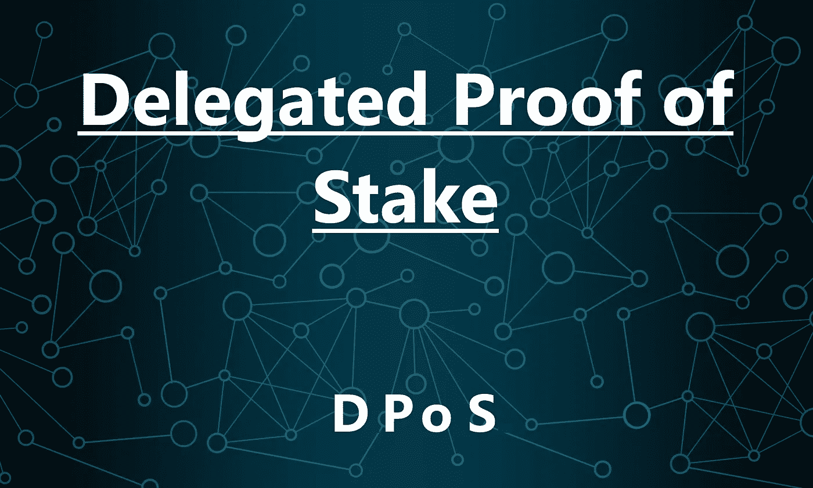
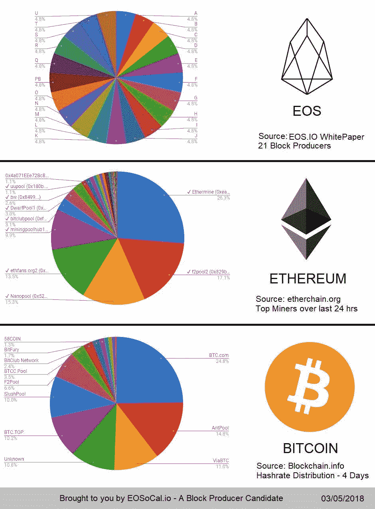

# 这就是为什么 DPoS 使 BTS、EOS 和 Steemit 更分散、更分散、更快地转向

> 原文：<https://medium.datadriveninvestor.com/heres-why-dpos-makes-bts-eos-and-steemit-more-decentralized-distributed-and-faster-to-pivot-4fdf64097434?source=collection_archive---------2----------------------->

如果加密货币社区关心一件事，那应该是去中心化。去中心化不仅是加密运动的基石，而且对系统也有很多好处。

为了保持分散，我们需要考虑所有可能的共识协议供我们使用。在[工作证明(PoW)](https://en.bitcoin.it/wiki/Proof_of_work) 、[利益证明(PoS)](https://github.com/ethereum/wiki/wiki/Proof-of-Stake-FAQ) 和现在的[委托利益证明(DPoS)](http://docs.bitshares.org/bitshares/dpos.html) 之间，有几个不同的选项可供选择。随着以太坊平台最终转移到 PoS 的所有讨论，让我们来看看 DPoS，以及到底是什么使它比其他一致的方法更强大和分散。

# 分散和分布式

当看谁控制着给定网络中的块生产时，我们会发现实际情况比最初看到的要多得多。从比特币网络开始，PoW 背后的想法是保持事情分散，不受中央当局的控制。虽然在比特币挖矿的早期，情况尤其如此，但今天情况发生了一些变化。

比特币网络目前有 5 家最大的采矿公司，如果他们合并的话，将控制网络的 70%。在其当前的实现中，以太坊也没有太大的不同。随着市场上越来越多的人感兴趣，越来越多的人开始采矿。尽管最大的实体是池——意味着不是一个人开采它们——它们在一起收集能量，网络仍然存在由选定的群体控制的风险。

把它想象成一个有独裁政府的国家，在一个暴虐的政权中有多个成员真的比一个独裁者更好吗？显然不是(他们都很糟糕)。显然，无论是以太坊网络还是比特币网络，我们都还没有达到那个阶段，但未来潜在的漏洞仍然存在。

然后，我们看看图形顶部的 dpo。*与其他共识模型不同，DPoS 确保没有任何一方能够控制网络中不成比例的权力。相反，证人的数量(本质上是“矿工”的 PoS 版本)保持分布，并且实际上以民主的方式承担责任。*

如果证人做了糟糕的决定或未能产生一个区块，那么他们不仅不会得到报酬，而且利益相关者实际上也可以投票淘汰他们。这种民主制衡在传统的 PoW 系统中是无法实现的，就像我们在以太坊和比特币网络中看到的那样。

如果一个矿池变得太大，失去控制，就没有投票淘汰或检查他们的权力。等到他们垄断了网络，已经太晚了。 [DPoS 解决了这个问题。](https://steemit.com/eos/@eosgo/eos-explanation-of-dpos-bft-w-daniel-larimer-part-1-of-2)

# 旋转速度更快

DPoS 系统不仅设计得更加分散，而且更容易根据网络需求进行调整，并在必要时进行调整。请记住，在传统的比特币和以太坊网络中，没有办法摆脱网络中的区块生产者。一旦一群精选的矿工控制了网络的大部分，就没有办法对抗这种情况(除了可能潜入并破坏大量机器——绝对不推荐)。

然而，随着民主制度在 DPoS 中的实施，网络作为一个整体可以更快地对现实世界的变化做出反应。不依赖于来自中央权威机构的处理能力，不良行为者会失去他们在网络中的地位和权力。利益相关者保持网络的分散性，并且比其他任何东西都更加敏捷、灵活和快速。

*作者不是律师或财务顾问。* *所展示的内容不应被理解为投资建议或法律建议。*