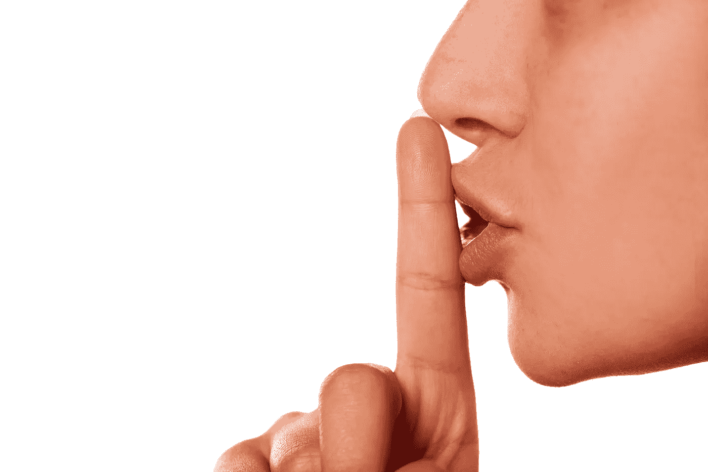

# 这就是为什么你可能会赚更多的钱，如果你 STFU

> 原文：<https://medium.datadriveninvestor.com/heres-why-you-might-make-more-money-if-you-stfu-f88dbe71f99d?source=collection_archive---------27----------------------->

The smartest thing you say might just be nothing at all…

# 你喜欢说话吗？如果你和大多数人一样，你喜欢自己的声音。

但事实是:交谈可能会让你变穷。像波士顿马拉松比赛那样满嘴跑可能会让你赚不到几百万。

事实上，我建议，如果你想成为一个真正的领导者，赚到你想要的收入，你最好闭上你的臭嘴。

你在嘲笑那个头衔吗？我希望你是…我写的时候笑了。

但你知道什么不好笑吗？意识到我在 20 多岁创建第一家公司时是一个令人讨厌的傻瓜。

> 我曾经认为我比其他人都聪明，他们应该听听我要说的话。事实证明，我是对的；但是，这不是重点。

关键是，如果我闭上嘴巴，让*倾听*，而不是像个万事通一样喋喋不休，我会赚更多的钱。

T4:嗯，创建一个可行的企业并不是火箭科学。你倾听人们想要什么。你创造他们所说的他们想要的东西。你卖给他们。简单。

> 但是你可能**认为**你知道人们想要什么(你可能不知道)，**知道**他们需要什么(你可能不知道)，并且**确定**你只需要与更多的潜在客户交谈就能增加销售。

B 但是如果你*不*需要多说呢？如果你需要做*相反的*呢？

> 我实际发现的是，如果你的产品或服务没有脱销，你可能需要更仔细地倾听人们在说什么。

我这是美国最优秀的首席执行官每天都要做的事情，以确保他们在正确的轨道上；事实上，几周前我刚刚和 Quicken Loans 的首席执行官谈过，他非常想确保 Quicken 不断倾听客户的声音，真正听到他们想要什么。

另外，考虑一下这个:如果你发现自己与周围的人发生冲突的次数比你希望的要多，那么你可能没有足够的倾听。

## 我无法告诉你我已经避免了多少冲突，我在谈话中停下来问自己，“我现在需要谈话吗？”或者我应该闭嘴？

每当我选择后者，我就神奇地避免了冲突，因为我会问更多的问题，更仔细地倾听，并且更好地理解对方的想法和感受。

另外，如果你让你的谈话对象不间断地与你分享他们的生活故事，他会觉得自己像个摇滚明星。

所以，下一次你要说话的时候，考虑反其道而行之。我能听到和学到的东西太神奇了。关门。向上。

—

喜欢你读的吗？我很感激你能看一看！

在 peterkozodoy.com[获得更多信息](http://www.peterkozodoy.com)，你可以免费获得一本*的《诚实成就伟大*，这是一本基于我即将出版的关于商业成功中诚实的力量的迷你电子书。

此外，当你注册后，你将获得我的每周*周一比赛*以及领导力、销售、营销等方面的关键课程。

此外，当你注册后，你将获得我的每周*周一比赛*中关于领导力、销售、营销等方面的关键课程。