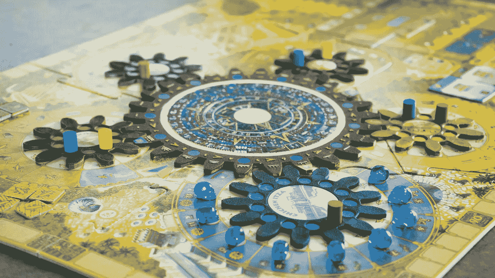

# 嘿，人工智能的粉丝们，技术已经在表演了

> 原文：<https://medium.datadriveninvestor.com/hey-ai-fans-technology-already-runs-the-show-914fdcdb3cc2?source=collection_archive---------17----------------------->

## 权力的转移正在进行中

[Unsplash](https://unsplash.com/photos/2g0QJlzDdac)

仅在几十年前，终结者还是人工智能的反乌托邦巅峰。但是今天，一个装扮成阿诺德·施瓦辛格的实心金属机器人几乎不是我们最大的生存威胁。许多思想家推测，人工智能将在未来几年变得非常强大。无人驾驶汽车就在眼前，如此调整和细致入微，它们可以预测动物穿越马路和路上的其他汽车。

然而，人工智能只是正在接管的更大机制的结果。真正的威胁已经存在了很长时间，而且比科幻电影中的杀人机器更加狡猾。自从工业革命将资本主义与文化捆绑在一起，美国人就慢慢被我们自己对技术贪得无厌的追求所控制。

[Unsplash](https://unsplash.com/photos/U3sOwViXhkY)

技术不仅仅是愤怒的阿诺德机器人或抽屉里的旧 Iphone:它是知识在科学和实践中的应用，尤其是在工业中。

这些“实际的”目的不仅适用于维持地球上的生命，也适用于维持现代生活，可能是商业的、建筑的和工业驱动的。从这个意义上来说，我们长期处于技术的金属手掌中。

# 教育陷阱:为工业而学习

我们目前的教育体系来自工业革命。它的创立是为了鼓励工业劳动:孩子们被精心策划成为遍布东海岸和整个国家的工厂和仓库里的齿轮。在这个新国家，过度生产是有价值的。

这个强有力的[视频](https://www.youtube.com/watch?v=dqTTojTija8)完美地展示了我们的教室是如何以及为什么被设计的。而且，他们几乎没有改变:

美国的这种工作文化是一种新的文化。欧洲人的思维模式只是在最近几百年才出现在世界意识的前沿。对每个西方人来说，工作都有一种新的价值，这种价值并非一直存在；它与地位、人的价值和社会接受度交织在一起。我们不一定学会学习，或者学会思考，而是学会如何参与工作。

很明显，现在孩子们不进洛厄尔工厂了。尽管如此，进入这个行业仍然是每个教室的最终目标。

像烹饪和管理支票簿这样的生活技能充其量只能作为选修课。我当然不知道如何报税或支付账单。你有吗？我已经成熟了，可以被任何银行、汽车经销商，甚至是能让我找到一份有报酬工作的东西——大学——利用了。

我们*当然*不会学习如何为*那*买单。大多数孩子醒来后，在教室里坐 6 个小时，从讲座、课本和同龄人那里学习如何思考。到了 15 岁，铺天盖地的信息已经一遍又一遍的播出:上大学。2016 年， [69.7%](https://www.bls.gov/opub/ted/2017/69-point-7-percent-of-2016-high-school-graduates-enrolled-in-college-in-october-2016.htm) 高中毕业生升入大学。所以，大多数人会倾听并找到方法。有些人获得奖学金，有些人得到父母的建议。我们很多人都不明白。不管怎样，这个系统迫使“幸运”的孩子合法地做出这个决定，这个价值几十万美元的决定，并承诺有一个更好的未来。

[Unsplash](https://unsplash.com/photos/ewGMqs2tmJI)

据 CNN 报道，当年美国最受欢迎的大学专业是商业管理/行政管理、护理和文科。商业和护理显然有过多的工作，文科研究允许大学毕业生探索职业选择。当然，这些都可以带来有价值的职业，并且可以提升学生的世界观。但是，无论是为了工作而学习还是为了学习而工作，大学毕业生都有着相似的境遇:

[**平均**](https://www.cnbc.com/2018/02/15/heres-how-much-the-average-student-loan-borrower-owes-when-they-graduate.html) **助学贷款，2018 年超过 3.7 万美元。**

让它深入人心。然后，看看这个:

> 来自 NerdWallet 的一项研究预测，2015 年大学毕业的学生将不得不延迟退休到 75 岁，部分原因是学生债务负担越来越重。

TLDR:一个 15 岁的孩子，迫于压力，决定接受教育，结果却背负了一生的债务。我们不在工厂里，但根据个人选择，我们大多数人肯定要到 75 岁才工作。

等等，我们又在为谁学习？

# 工业与福利

[Unsplash](https://unsplash.com/photos/VWI-7UAo9kE)

所以大学毕业生加入劳动力大军，非大学毕业生加入劳动力大军，每个人都被锁定了。ZipRecruiter 上发布的最受欢迎的职位如下:初级销售、初级营销、客户服务代表、客户经理、营销助理。这些都不是激情追求。但是，有了可预测的收入和“就业”状态，他们就能完成工作。

如果美国人不建设，我们就卖。我们中的许多人必然会延续这个让我们深陷其中的体系。但是文科生呢？或许，那些上大学去创造改变的人？

这些学校可能并不顺利。[在](https://medium.com/the-atlantic/the-liberal-arts-may-not-survive-the-21st-century-4203b0f60289) [大西洋](https://medium.com/u/969cde9116a3?source=post_page-----914fdcdb3cc2--------------------------------)的一篇文章中写了[在威斯康辛州的文科之死。在那里，像历史和德语这样的系正在被削减，以便为工程师和平面设计师腾出空间。学生似乎关心人文和社会问题，但这种兴趣正在被边缘化。我们太受束缚了，致力于久经考验的真正的工业强国。](https://medium.com/the-atlantic/the-liberal-arts-may-not-survive-the-21st-century-4203b0f60289)

如果没有对历史的深入研究来与现代进行比较，未来的学生甚至能够探索另一种生活方式吗？

[Unsplash](https://unsplash.com/photos/cpAKc-G6lPg)

你会认为世界上最强大的国家之一，美国，会处于更好的状态。随着技术的进步，我们应该有更好的生活质量，并帮助他人实现这一目标。

**产生*想法，*创新和创造力，** 正是我们所需要的。一个由历史、人文和心理学武装起来的独立思考者的文化，可以将他们的工作奉献给一些世界上最大的问题:饥饿、战争、气候变化。当然，很多人会。但没有我们需要的那么多。

相反，我们正在大量生产 IPhone 11 及其广告。

这个有面部识别功能，而不是密码！

随之而来的是，我们看到越来越多沮丧和焦虑的美国人。学生服用非处方的 Adderall 以跟上成绩；渴望摆脱当前工作的抑郁成年人。

我们渴望联系，尽管每一个新的屏幕一次又一次地出现。

[Unsplash](https://unsplash.com/photos/ySHZCAuaa4I)

科学家正在对抗气候变化；**勇士**在国外给挨饿的人送吃的，工作的；医生们正在治愈病人，一次治愈几个。那些强大的少数人已经夺回了控制权。然而，文化作为一个整体，可以使用一些相关的重建。我们被一种危险的咒语所控制，被一种过时但强大的力量所奴役。

原来终结者比我们原来想象的要狡猾一点。

*感谢阅读！请在下面的评论中留下你的想法。*

# DDI 特色数据科学课程:

*   [**用于数据科学的 Python**](http://go.datadriveninvestor.com/intro-python/mb)
*   [**深度学习**](http://go.datadriveninvestor.com/deeplearningpython/mb)
*   [**数据可视化**](http://go.datadriveninvestor.com/datavisualization/mb)

**DDI 可能会从这些链接中收取会员佣金。我们感谢你一直以来的支持。*