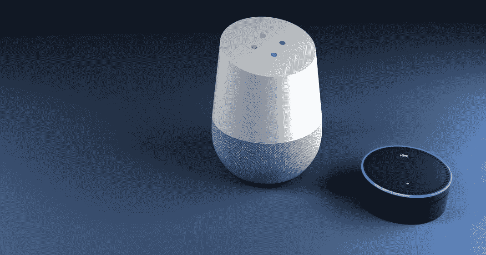

# 嘿 Siri，告诉我你下一步要做什么

> 原文：<https://medium.datadriveninvestor.com/hey-siri-tell-me-what-you-will-do-next-832b2d4b01ca?source=collection_archive---------26----------------------->

“Siri，你的未来会怎样？”

*“你想让我在网上搜索一下吗？”*

别担心，很快 Siri 应该就能直接回答这个了。这是因为数字世界正在以优先考虑效率和易用性的方式发展。很快，用手发短信和打字将被淘汰。人声正在成为键盘的替代品。事实上，专家预测，到 2020 年，50%的搜索引擎将使用[语音。](https://searchengineland.com/voice-search-explosion-will-change-local-search-251776)

向语音搜索的转变影响的不仅仅是科技消费者。以下是语音命令未来发展的三大趋势。

# 改进的响应

Siri、Alexa、Cortana 和其他数字助理将很快变得足够智能，能够为问题提供更个性化、更有关联、更具体的答案。一些公司已经在这方面取得了领先，即谷歌。尽管亚马逊的 Alexa 控制了超过 70%的市场，但谷歌更加成熟。康卡斯特已经实现了向未来的飞跃，让他们的客户通过对着遥控器说话来搜索节目和电影，就像 AppleTV 和许多其他目前制造的电视一样。

# 多个设备

物联网(IoT)不仅仅嵌入在智能手机中。由于移动设备的屏幕空间很小，语音正在成为智能手机体验的重要部分。语音功能现在正从智能手机扩展到其他日常设备。未来五年，专家预测语音指令将在[几乎所有设备](https://www.forbes.com/sites/groupthink/2017/09/29/your-mobile-strategy-needs-to-include-voice/#3b9db9cd5ce8)上运行。这包括家用电器、汽车、扬声器等等。

# 增强安全性

随着越来越多的支付通过语音进行，隐私成为一个问题。这些类型的交易必将成为执行金融交易的主流。这就要求安全性更加无缝。语音身份验证等功能将成为安全语音购买体验的一部分。

语音命令不可避免地出现在每一次数字体验中，这不仅意味着我们个人的彻底改变，也意味着企业的彻底改变。企业必须优化语音搜索，以保持相关性和无处不在。鉴于 voice 迄今为止已经取得的进步，未来是显而易见的，您不妨现在就“大声说出来”加入进来。

*本文原载于 2019 年 1 月 17 日* [*数据驱动投资人*](https://www.datadriveninvestor.com/2019/01/17/hey-siri-tell-me-what-you-will-do-next/) *。*