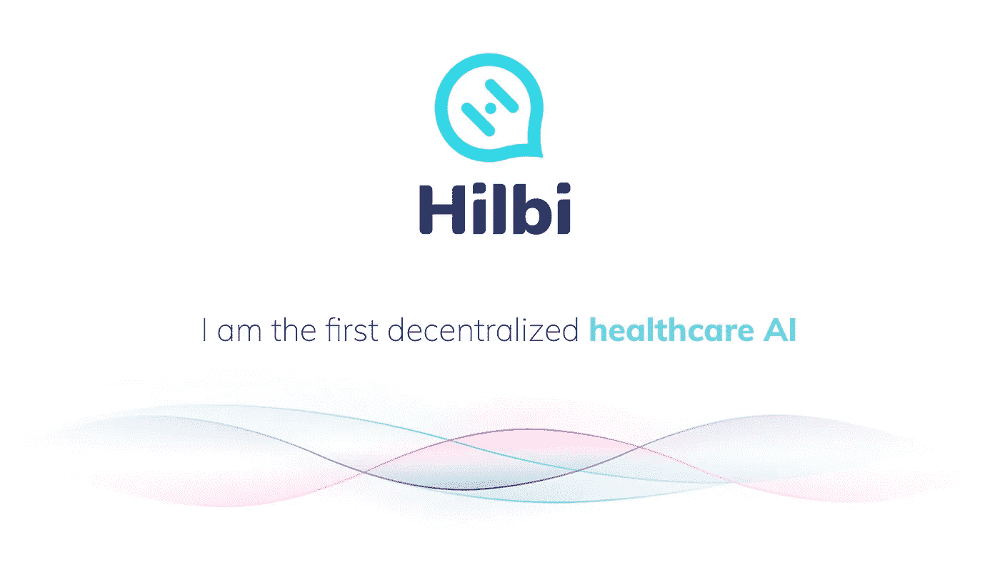
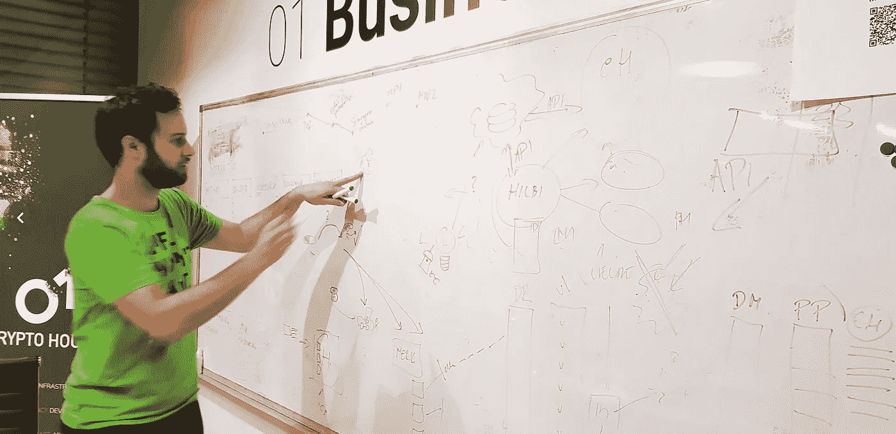
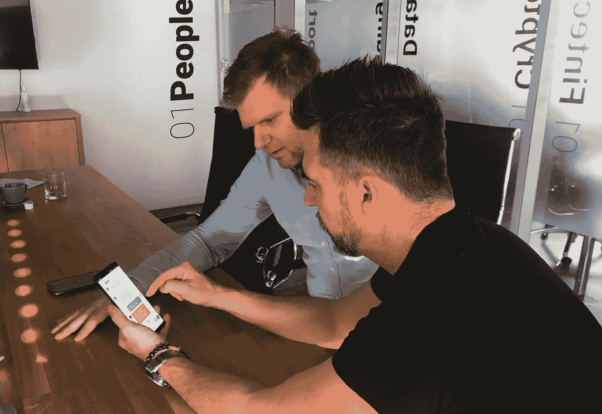

# 嗨，我是希尔比—您的医疗保健人工智能

> 原文：<https://medium.datadriveninvestor.com/hi-im-hilbi-your-healthcare-a-i-379ce9812f8d?source=collection_archive---------12----------------------->

Hilbi 作为第一个基于 01People 开发的区块链解决方案的分散式人工智能之一，将用于收集和分享与我们所有人拥有的最伟大的礼物相关的数据。我们的健康。尊重和关爱每一个为改善全球医疗体系的共同愿景做出贡献和提供支持的人。

事实上，Hilbi 的起源可以追溯到 4 年前，当时启动了在线医生项目。这是第一个将病人和医生联系起来的在线平台。不需要在候诊室等上几个小时，病人可以直接咨询他们的医生，寻求建议以及他们的医学发现。这个永恒的项目具有独特的使命和功能，被 fin-tech 公司 01People 采用，该公司指派了一个 56 人的团队来进一步利用它，通过将其实施到区块链生态系统中，使其达到一个更高的水平。总部位于斯洛伐克的公司 01People 在开发区块链解决方案、大数据生态系统、数据科学、密码安全和数字安全方面拥有丰富的经验，并将把所有获得的专业知识转移到这个特殊项目中。

> “当人工智能遇到区块链时，需要创造一个改变游戏规则的解决方案” **01People**

Blockchain team leader Jozef from 01CryptoHouse in hand with big data specialists from 01DataHouse in a deep discussion on the coexistence of different technologies

该项目的标题之一是“分享更多”。你分享的越多，你得到的回报就越多，无论是数据、建议还是对积极合作的奖励。所有的贡献者和参与者都将得到回报，不仅因为他们知道自己在帮助别人，还因为一个细致的奖励系统，它将奖励那些关心和分享的人。

Hilbi 的平台将逐步整合各种聊天平台，并为患者、医生、顾问、制药公司、实验室、医疗保健机构、监管机构、保险公司等多个部门提供空间。这一切都在区块链生态系统的可证明的安全环境中，为所有利益相关者提供匿名性和安全性。

Last UI check by Patrik And Marek before the first round of Hilbi app public testing

Hilbi 的开发者的愿景是什么？Hilbi 的使命将是创建这样一个数字知识数据库，它可以形成无障碍医疗保健的基础，并将提供给世界各地的人们，因为所有人，无论其出身和可能性如何，都应该能够获得适当的医疗建议，从而改善健康状况。

希尔比将为它提供艰苦的努力，使未来的世界对人类有益。

***Patrik Kme，*** *希尔比基金会由 01 人*