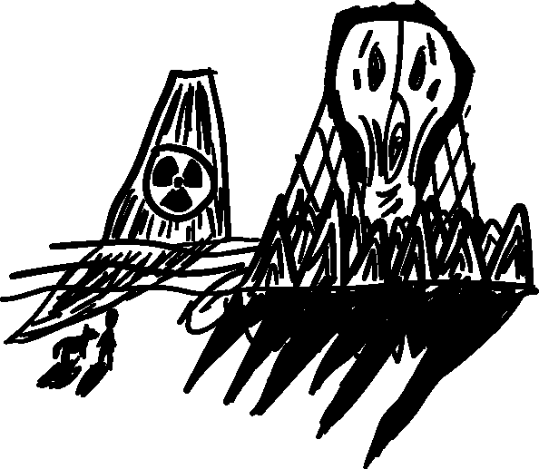
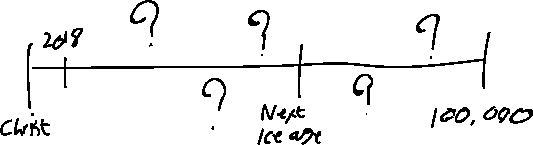
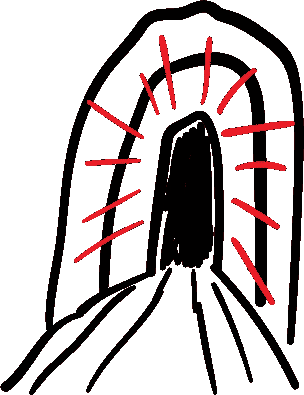

# 向 102018 年的人类隐藏我们的核废料

> 原文：<https://medium.datadriveninvestor.com/hiding-our-nuclear-waste-from-the-humans-of-year-102018-186c1698ce5c?source=collection_archive---------2----------------------->

## 你现在在一个地方，我们在这里埋藏了一些东西来保护你。你应该远离这个地方。这样你就安全了。

> ***人类熄灭了篝火，试图忘却，因为他知道，只有忘却，他才能获得自由。但后来他开始担心他的孩子们可能会找到墓室，唤醒沉睡中的火。所以他吩咐他的孩子告诉他们的孩子，和他们的孩子的孩子，永远记住，把墓室遗忘。永远记住，忘记。***

50，000 年前，奥莫智人达到了现代行为，当时我们开始画画，把自己组织成复杂的、以神话为基础的社会，从而与其他类型的人类有所不同。在 10000 年前定居下来之前，我们花了其中的 40000 年作为狩猎采集者，在这片土地上漫游。基督诞生的时间仅仅是 2000 年前，美洲被殖民化 500 年，互联网的发明大约只有 40 年。公元前 10 万年的人类已经面目全非。再过 10 万年我们会是什么样子？我们还会存在吗？

我们的核废料将会存在。核电站的乏燃料需要 100，000 年才能变得安全，这意味着它可能会比它帮助供电的社会更长寿。而且每年都在增加。为了让印度和中国赶上西方的生活水平，我们必须在未来 20 年里每天建造三座新的核反应堆。所有这些都会产生废物。

> 你现在在一个地方，我们在这里埋藏了一些东西来保护你。我们已经尽了最大努力来确保你受到保护。我们需要你知道这个地方不应该被打扰。这不是你住的地方。你应该远离这个地方。那你就安全了。

在废物变得安全的这段时间里，我们必须把它存放在安全的地方。我们认为最安全的地方是地下深处的特殊仓库。

其中之一是芬兰的翁卡洛。翁卡洛(意为“洞穴”)是 2010 年纪录片《永恒 T21》的主题。导演迈克尔·马德森重点讲述了项目背后的工程师和科学家打算如何阻止人类在遥远的未来重新打开这个储存库。

一旦 Onkalu 在 2120 年达到容量，它将被封装在混凝土中，永远密封。到那时，我们必须决定如何标记存储库。

如果我们不标记它，人类可能会忘记它的存在。但是我们无法预测未来。我们几乎无法预测 50 年后的世界会是什么样子。我们无法知道在未来几千年的某个时候，人类是否会像我们一样，决定在芬兰的乡下钻一个大洞。负责 Onkalo 的工程师曾经开玩笑说，当他们开始挖掘时，他们首先会发现一个旧的铜储存罐，就像他们自己计划使用的一样。

在接下来的 100，000 年里，我们这个物种将会经历难以想象的灾难和悲剧。气候变化、战争、人口过剩、地震和撞击事件都会对社会产生巨大影响。最重要的将是下一个冰河时代，预计在 60，000 年后开始。这些事件的结合可能会导致人类重新适应狩猎采集的生活方式，并逐渐忘记社会过去的知识。

在遥远的未来，那些不再认识我们这个时代的语言，失去了我们今天所拥有的知识的人类，会不会像霍华德·卡特打开图坦卡蒙的坟墓时一样惊奇地看着翁卡洛？他们会把它解释为一个宗教圣地，或者一个宝藏吗？他们会有同样的挖掘欲望，却没有意识到隐藏在内心深处的危险。

人类是好奇的生物。每当我们偶然发现早已消亡的文明的线索时，我们就会继续挖掘，渴望知识。当卡特发现图坦卡蒙的坟墓时，他没有停下来破译墙上的古老符号，而是继续深入挖掘。

如何警告 102018 年的人类？在影片中，工程师们考虑了不同的想法。该设施必须保持安全，即使在未来对其及其所含物质的了解已经消失。它必须维持自己；它不能依靠人类。

最初的方尖碑可以用联合国的六种语言以及象形文字来解释埋在那里的东西以及它的危险性。然后，如果人类决定继续前进，他们会找到一个中心信息点。那将包含周期表、天文历和放射性物质的信息，刻在花岗岩上。

如果人们不能阅读，这些“标记”也可以被设计成在更基本的水平上与他们交流；激起恐惧。巨大的混凝土块。头骨雕刻。参差不齐的混凝土荆棘景观。一个男人在跑。

***你不应该在这里。你必须离开。***

我们正在绘制我们时代的洞穴壁画。人类可能会像我们了解圣经传说一样了解翁卡洛。警告代代相传，教训从一个神话时代流传下来，当时人类试图扮演上帝，利用宇宙的力量并把它转向自己。

[*【怪异的西班牙】*](https://weirdspain.substack.com/) *是一份时事通讯，面向那些想要更深入了解他们的第二故乡及其人民的移民，以及世界各地想要更多了解这个神奇国家正在发生什么以及为什么会发生的西班牙爱好者。* [*在这里订阅，在你的收件箱里收到这些文章。*](https://weirdspain.substack.com/subscribe)