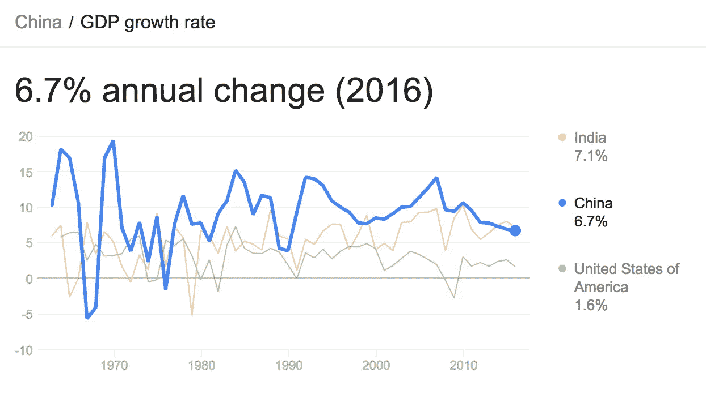

# 高 GDP 增长和大量受过教育但贫穷的人口将不再相关

> 原文：<https://medium.datadriveninvestor.com/high-gdp-growth-and-large-educated-but-poor-populations-will-no-longer-correlate-2f78eaa5b4d3?source=collection_archive---------11----------------------->

过去 50 年，大量受过教育但历来贫困的人口与 GDP 增长之间存在关联——这导致人们预测中国和印度将出现高增长，并催生了全球化的观点，即中国将成为全球成本效益最高的制造商。一个国家的低薪工人越多，这个国家的生产成本就越低。

我认为，由于自动化，这种趋势现在将会突然失败。一旦机器人比低薪工人便宜，那么低薪工人就会失业，成为国家的负担，而不是资产。此外，一旦机器人变得更便宜，就不再需要在商品消费地以外的国家进行制造，因此制造业将从中国和印度迁回美国和西欧。

显然这有点过于简化了。中国意识到了这些问题，也在积极向消费型经济而不是出口型经济转变，同时拥抱新技术和自动化。然而，我确实认为，向自动化的快速转变将对人口最多的国家产生更大的影响，因为失业人口是该国经济的负担，也是该国政治的不稳定因素。

因此，尽管经济学家继续预测中国和印度将继续保持 7%的 GDP 增长，但我认为这将在未来 10 年被证明是有根本性缺陷的。这些经济趋势将突然失败，我们听到的关于全球化的教条将被打破。